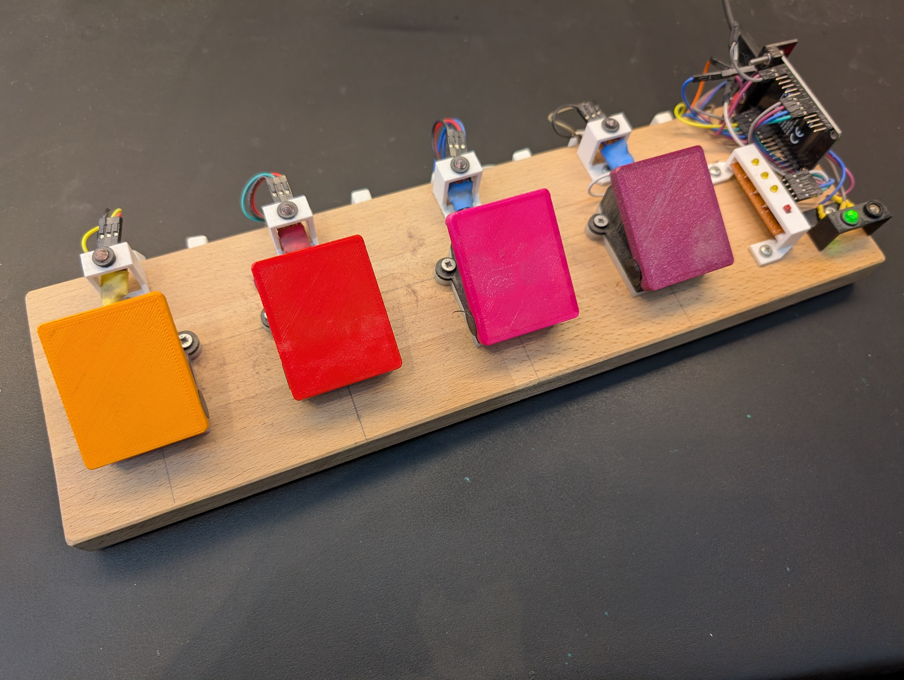
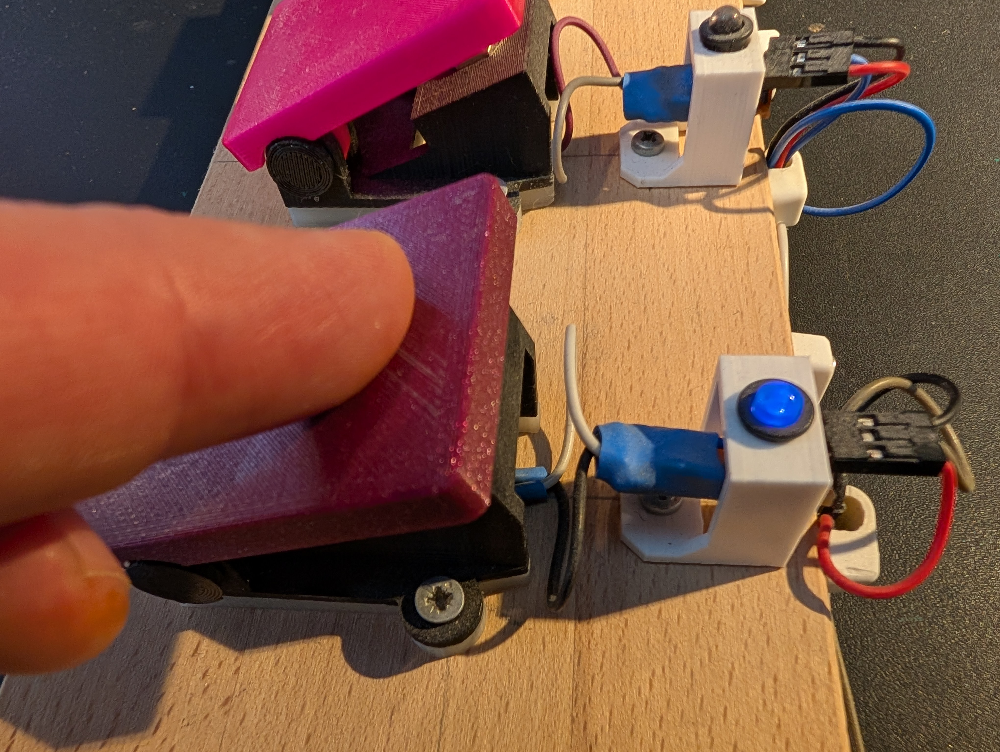

# AwesomeStudioPedal

A programmable, multi-profile foot controller for DAWs, score readers, and studio automation.

*The assembled AwesomeStudioPedal ready for use.*

AwesomeStudioPedal is an ESP32-based device that connects to any host over Bluetooth and appears as
a keyboard. Press a button and it sends a keypress, media command, or typed string — no driver, no
app, no cable required. Seven profiles are stored on the device; a SELECT button cycles through them
with an LED indicator array. A time-delayed action lets solo performers trigger a command (such as a
camera shutter) and step into position before it fires.

*Pressing a button during a live session.*

| I am a... | Start here |
|-----------|------------|
| Musician — I have the pedal in front of me | [User Guide](docs/musicians/USER_GUIDE.md) |
| Musician (no hardware) — I want to try it | [Simulator](https://tgd1975.github.io/AwesomeStudioPedal/simulator/) |
| Builder — I want to build one | [Build Guide](docs/builders/BUILD_GUIDE.md) · [Building from Source](docs/building.md) · [3D-printable enclosure](https://www.printables.com/model/1683455-awesomestudiopedal) · [Simulator](https://tgd1975.github.io/AwesomeStudioPedal/simulator/) · [Profile Builder](https://tgd1975.github.io/AwesomeStudioPedal/tools/config-builder/) · [Configuration Builder](https://tgd1975.github.io/AwesomeStudioPedal/tools/configuration-builder/) · [Mobile App](app/README.md) |
| Developer — I want to contribute | [Architecture](docs/developers/ARCHITECTURE.md) · [Development Setup & Required Tools](docs/developers/DEVELOPMENT_SETUP.md) · [Dev Container](.devcontainer/devcontainer.json) |

ESP32 (NodeMCU-32S) is the only deployed and tested hardware target. nRF52840 is implemented but
untested — use at your own risk.

## License

MIT License — see LICENSE file for details.

## Future Ideas

<!-- FUTURE IDEAS GENERATED -->

The following ideas are potential future enhancements for AwesomeStudioPedal.
These are not committed features but represent directions the project could explore.
Ideas are tracked in [`docs/developers/ideas/`](docs/developers/ideas/).

- **[IDEA-003](docs/developers/ideas/idea-003-additional-hardware-support.md): Additional Hardware Support** — Extend compatibility to platforms like Arduino Nano
- **[IDEA-004](docs/developers/ideas/idea-004-nrf-hardware-testing.md): nRF Hardware Testing** — Thoroughly test and validate the nRF52840 implementation
- **[IDEA-005](docs/developers/ideas/idea-005-large-button-pedal-prototype.md): Large Button Pedal Prototype** — Design and build a prototype with larger, more accessible buttons
- **[IDEA-007](docs/developers/ideas/idea-007-display-integration.md): Display Integration** — Add a display to show profile info — small (profile name) or larger (full config)
- **[IDEA-008](docs/developers/ideas/idea-008-hybrid-tool-with-dsp.md): Hybrid Tool with DSP** — More powerful hardware with DSP and dual audio jacks for guitar pedal effects
- **[IDEA-010](docs/developers/ideas/idea-010-double-press-event.md): Double Press Event** — Additional functionality triggered by quick successive button presses
- **[IDEA-011](docs/developers/ideas/idea-011-pcb-board-design.md): PCB Board Design** — Custom PCB to replace the breadboard/prototype setup for reliability and manufacturability
- **[IDEA-012](docs/developers/ideas/idea-012-two-button-soft-foot-switches.md): Two-Button Version with Soft Foot Switches** — Compact two-button variant using soft foot switches
- **[IDEA-013](docs/developers/ideas/idea-013-bus-system.md): Bus System** — Daisy-chain bus for connecting multiple pedals instead of direct controller wiring
- **[IDEA-014](docs/developers/ideas/idea-014-automated-hardware-testing-rig.md): Automated Hardware Testing Rig** — A relay-based test interface with optocoupler output detection that enables fully automated on-device testing without human intervention
- **[IDEA-015](docs/developers/ideas/idea-015-marketing-material.md): Marketing Material** — Create compelling marketing material to attract musicians and builders
- **[IDEA-016](docs/developers/ideas/idea-016-articles-written-by-journalists.md): Articles Written by Journalists** — Write one article for each persona

These ideas are open for community contributions and discussions.
If you're interested in working on any of these, please open an issue or start a discussion!
<!-- END FUTURE IDEAS GENERATED -->

## Firmware

Pre-built firmware binaries are published with each
[GitHub Release](../../releases). Download the file for your hardware:

| Platform | File |
|----------|------|
| ESP32 (NodeMCU-32S) | `awesome-pedal-esp32-vX.Y.Z.bin` |
| nRF52840 (Adafruit Feather) | `awesome-pedal-nrf52840-vX.Y.Z.bin` |

### Current stable release

<!-- RELEASE_SECTION_START -->
> **No public release yet.** The first tagged release will appear here once the
> release workflow runs. Until then, build from source using the
> [Build Guide](docs/builders/BUILD_GUIDE.md).
<!-- RELEASE_SECTION_END -->

For upload instructions see [Build Guide — Upload](docs/builders/BUILD_GUIDE.md).
