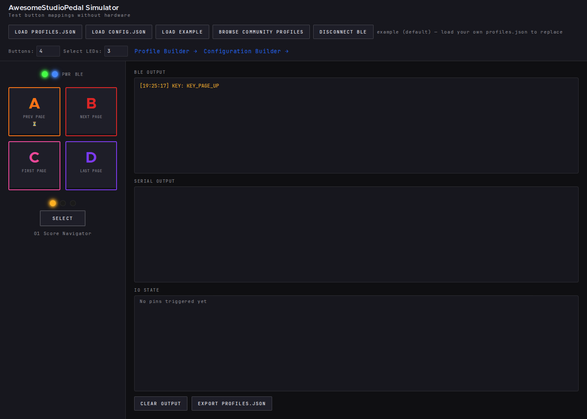
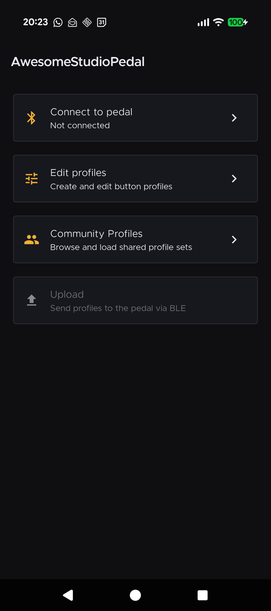
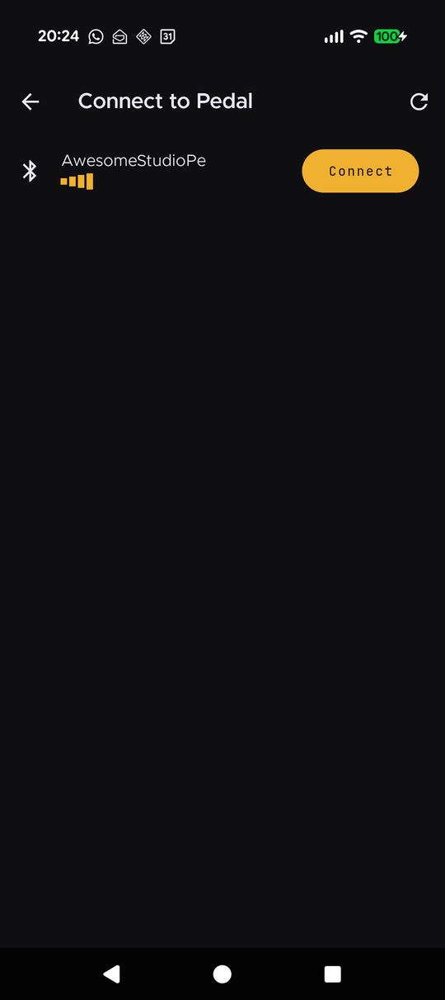
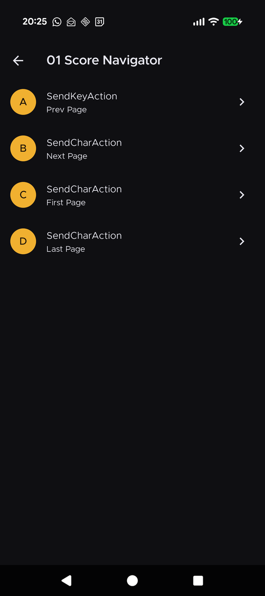
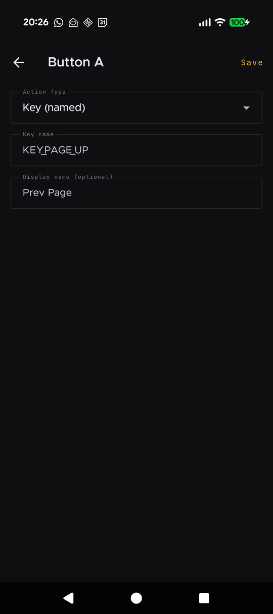

# AwesomeStudioPedal

A programmable, multi-profile foot controller for DAWs, score readers, and studio automation.

*The assembled AwesomeStudioPedal ready for use.*

AwesomeStudioPedal connects to any host over Bluetooth and appears as a standard keyboard — no
driver, no app, no cable required. Press a button and it sends a keypress, media command, or typed
string. Multiple profiles are stored on the device; a SELECT button cycles through them with an LED
indicator array. A time-delayed action lets performers trigger a command and step into position
before it fires.

*Pressing a button during a live session.*

## Try it without hardware — the browser simulator

Don't have the pedal yet? The [in-browser simulator](https://tgd1975.github.io/AwesomeStudioPedal/simulator/)
lets you test profiles, button mappings, and the SELECT-button page-cycling behavior without any
hardware. Load the example profile, click the on-screen buttons, and watch the BLE and serial output
exactly as they would appear from a real device. Load your own `profiles.json` and `config.json` to
preview a full mapping before flashing.

*The browser simulator with the example profile loaded — A/B/C/D buttons mapped to page navigation,
profile-select LEDs, and live BLE/serial output panes.*

## Companion mobile app

A Flutter app for Android and iOS pairs with the pedal over Bluetooth to scan for the device, upload
new profile sets, and inspect the current configuration without needing to re-flash the firmware. See
the [app README](app/README.md) for build and install instructions.

| Home | Scan & connect | Profile editor | Action editor |
|:---:|:---:|:---:|:---:|
|  |  |  |  |
| Entry point — connect, edit profiles, browse the community gallery, or upload to the pedal. | Discover nearby pedals over BLE with signal strength. | Per-profile button mapping — each lettered button maps to one action. | Configure a button's action — pick a type, set the key/keystroke, and label it for your own reference. |

| I am a... | Start here |
|-----------|------------|
| Musician — I have the pedal in front of me | [User Guide](docs/musicians/USER_GUIDE.md) |
| Musician (no hardware) — I want to try it | [Simulator](https://tgd1975.github.io/AwesomeStudioPedal/simulator/) |
| Builder — I want to build one | [Build Guide](docs/builders/BUILD_GUIDE.md) · [Building from Source](docs/building.md) · [3D-printable enclosure](https://www.printables.com/model/1683455-awesomestudiopedal) · [Simulator](https://tgd1975.github.io/AwesomeStudioPedal/simulator/) · [Profile Builder](https://tgd1975.github.io/AwesomeStudioPedal/tools/config-builder/) · [Configuration Builder](https://tgd1975.github.io/AwesomeStudioPedal/tools/configuration-builder/) · [Mobile App](app/README.md) |
| Developer — I want to contribute | [Architecture](docs/developers/ARCHITECTURE.md) · [Development Setup & Required Tools](docs/developers/DEVELOPMENT_SETUP.md) · [Dev Container](.devcontainer/devcontainer.json) · [Design System](docs/design/) · [Tasks](docs/developers/tasks/OVERVIEW.md) · [Epics](docs/developers/tasks/EPICS.md) · [Kanban](docs/developers/tasks/KANBAN.md) · [Ideas](docs/developers/ideas/OVERVIEW.md) |

ESP32 (NodeMCU-32S) is the only deployed and tested hardware target. nRF52840 is implemented but
untested — use at your own risk.

## License

MIT License — see LICENSE file for details.

## Future Ideas

Ideas under exploration — not committed features — are tracked in
[`docs/developers/ideas/open/`](docs/developers/ideas/open/). See the
[Ideas Overview](docs/developers/ideas/OVERVIEW.md) for the full list. Contributions
and discussion are welcome via issues and pull requests.

## Firmware

Pre-built firmware binaries are published with each
[GitHub Release](../../releases). Download the file for your hardware:

> **Versioning:** every deliverable in this project — firmware, the Flutter
> configurator app, the npm tooling, and the task-system package — ships under
> the **same version number**. If a release moves firmware from `v0.4.1` to
> `v0.5.0`, the Flutter app and the other deliverables move too, even when their
> code did not change. We do not skip-bump unchanged artifacts. See
> [docs/developers/CI_PIPELINE.md — Version policy](docs/developers/CI_PIPELINE.md#version-policy)
> for the rationale.

| Platform | File |
|----------|------|
| ESP32 (NodeMCU-32S) | `firmware-nodemcu-32s-vX.Y.Z.bin` |
| nRF52840 (Adafruit Feather) | `firmware-feather-nrf52840-vX.Y.Z.hex` (flash) · `firmware-feather-nrf52840-vX.Y.Z.zip` (OTA) |

### Current stable release

<!-- RELEASE_SECTION_START -->
**Current stable: v0.4.0**

- ESP32 (NodeMCU-32S): [firmware-nodemcu-32s-v0.4.0.bin](../../releases/download/v0.4.0/firmware-nodemcu-32s-v0.4.0.bin)
- nRF52840 (Adafruit Feather): [firmware-feather-nrf52840-v0.4.0.hex](../../releases/download/v0.4.0/firmware-feather-nrf52840-v0.4.0.hex) · [firmware-feather-nrf52840-v0.4.0.zip](../../releases/download/v0.4.0/firmware-feather-nrf52840-v0.4.0.zip) (OTA)
- Debug symbols (ESP32): [firmware-nodemcu-32s-v0.4.0-debug.zip](../../releases/download/v0.4.0/firmware-nodemcu-32s-v0.4.0-debug.zip)

**Previous releases:**

- v0.3.0 — [release notes & downloads](../../releases/tag/v0.3.0)
- v0.2.0 — [release notes & downloads](../../releases/tag/v0.2.0)
<!-- RELEASE_SECTION_END -->

For upload instructions see [Build Guide — Upload](docs/builders/BUILD_GUIDE.md).
