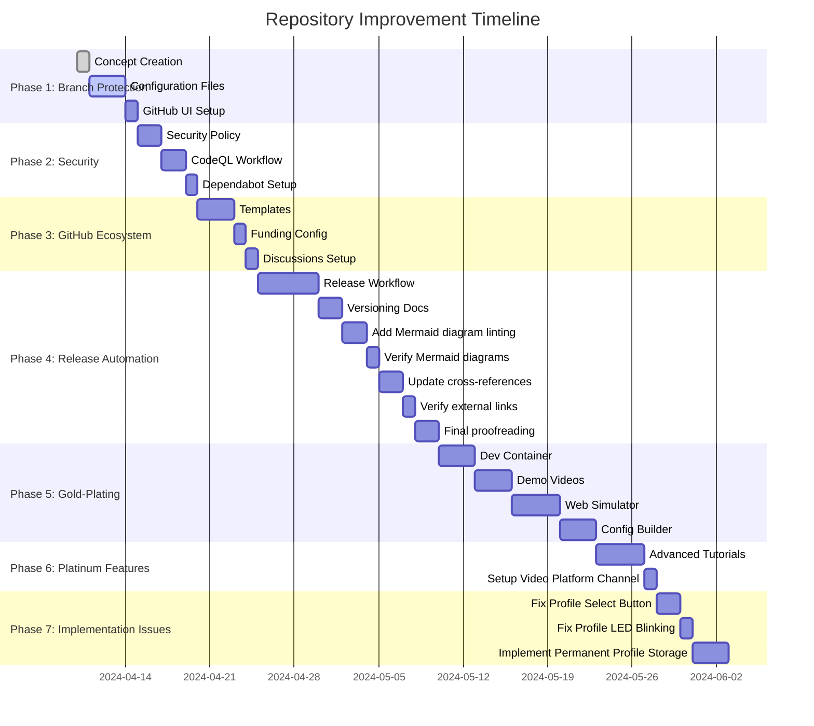

# AwesomeGuitarPedal Repository Improvement Concept

## Table of Contents

- [Executive Summary](#executive-summary)
- [Master Task List](#master-task-list)
- [Low-Hanging Fruits](#low-hanging-fruits)
- [Current State Assessment](#current-state-assessment)
- [Improvement Roadmap](#improvement-roadmap)
  - [Phase 1: Branch Protection & Workflow (Critical)](#phase-1-branch-protection--workflow-critical)
  - [Phase 2: Security & Compliance (High Priority)](#phase-2-security--compliance-high-priority)
  - [Phase 3: GitHub Ecosystem Integration (Medium Priority)](#phase-3-github-ecosystem-integration-medium-priority)
  - [Phase 4: Release Automation (Medium Priority)](#phase-4-release-automation-medium-priority)
  - [Phase 5: Gold-Plating Features (Low Priority - Nice to Have)](#phase-5-gold-plating-features-low-priority---nice-to-have)
  - [Phase 6: Platinum Features (Aspirational - Future)](#phase-6-platinum-features-aspirational---future)
  - [Phase 7: Implementation Issues (Bug Fixes)](#phase-7-implementation-issues-bug-fixes)
- [Detailed Component Specifications](#detailed-component-specifications)
  - [11. Mermaid Diagram Enhancement Strategy](#11-mermaid-diagram-enhancement-strategy)
  - [1. Branch Protection Configuration](#1-branch-protection-configuration)
  - [2. Issue Templates](#2-issue-templates)
  - [3. Pull Request Template](#3-pull-request-template)
  - [4. Security Policy](#4-security-policy)
  - [5. Dependabot Configuration](#5-dependabot-configuration)
  - [6. CodeQL Workflow](#6-codeql-workflow)
  - [7. Release Workflow](#7-release-workflow)
  - [8. Funding Configuration](#8-funding-configuration)
  - [9. Code Quality Enhancement](#9-code-quality-enhancement)
  - [10. Firmware Management Strategy](#10-firmware-management-strategy)
  - [9. Web-Based Simulator](#9-web-based-simulator)
  - [10. Demo Video Scripts (TASK-033 to TASK-038)](#10-demo-video-scripts-task-033-to-task-038)
  - [9. Configuration File Builder](#9-configuration-file-builder)
- [Implementation Timeline](#implementation-timeline)
- [Resource Requirements](#resource-requirements)
- [Risk Assessment](#risk-assessment)
- [Success Metrics](#success-metrics)
- [Cost-Benefit Analysis](#cost-benefit-analysis)
- [Alternative Approaches](#alternative-approaches)
- [Recommendation](#recommendation)
- [Next Steps](#next-steps)
- [Appendix: File Checklist](#appendix-file-checklist)
- [References](#references)

## Task Tracking System

**Status Legend**: ✅ Completed | 🟡 In Progress | ❌ Not Started | 🔄 Blocked

**Completion Instructions**:

1. Complete the task as described
2. Commit changes with message: `task(TASK-ID): description of changes`
3. Update task status in this document

## Executive Summary

This document outlines a comprehensive improvement plan for the AwesomeGuitarPedal repository to achieve "perfect" status through enhanced GitHub integration, improved development workflows, and gold-plating features that elevate the project to professional-grade open source standards.

## Master Task List

**Status Legend**: ✅ Completed | 🟡 In Progress | ❌ Not Started | 🔄 Blocked

**Sortable Task Table**:

| Status | ID | Short Description | Phase | Effort | Human-in-the-Loop | Complexity |
|--------|----|-------------------|-------|--------|-------------------|------------|
| ✅ | TASK-001 | Create branch protection concept | 1 | S | No | Junior |
| ✅ | TASK-002 | Add `.github/settings.yml` for branch protection | 1 | M | Clarification | Junior |
| ✅ | TASK-003 | Configure branch protection in GitHub UI | 1 | S | Clarification | Junior |
| ✅ | TASK-004 | Update CONTRIBUTING.md with branch strategy | 1 | S | Clarification | Junior |
| ✅ | TASK-005 | Add issue and PR templates | 1 | M | Clarification | Junior |
| ✅ | TASK-006 | Create SECURITY.md | 2 | M | Clarification | Medium |
| ✅ | TASK-007 | Add CodeQL analysis workflow | 2 | L | No | Senior |
| ✅ | TASK-008 | Add dependabot.yml | 2 | S | No | Junior |
| ✅ | TASK-009 | Add dependabot auto-merge workflow | 2 | M | Clarification | Medium |
| ✅ | TASK-010 | Add CODEOWNERS file | 2 | S | Clarification | Junior |
| ✅ | TASK-011 | Add FUNDING.yml | 3 | S | Clarification | Junior |
| ✅ | TASK-012 | Add "Future Ideas" section to README | 3 | S | Clarification | Junior |
| ✅ | TASK-013 | Enable GitHub Discussions | 3 | S | Clarification | Junior |
| ✅ | TASK-014 | Add test coverage badge | 3 | S | No | Junior |
| ✅ | TASK-015 | Add compiler warning flags | 4 | M | No | Medium |
| ✅ | TASK-016 | Create .clang-tidy configuration | 4 | M | Clarification | Medium |
| ✅ | TASK-017 | Add static analysis workflow | 4 | L | No | Senior |
| ✅ | TASK-018 | Create code smell detection scripts | 4 | L | Clarification | Senior |
| ✅ | TASK-019 | Update CONTRIBUTING.md with quality standards | 4 | S | Clarification | Junior |
| ❌ | TASK-020 | Create release workflow | 5 | XL | Clarification | Senior |
| ❌ | TASK-021 | Add package publishing | 5 | L | Clarification | Senior |
| ❌ | TASK-022 | Create release checklist | 5 | M | Clarification | Medium |
| ❌ | TASK-023 | Add release process to CONTRIBUTING.md | 5 | S | Clarification | Junior |
| ✅ | TASK-024 | Move README_data.md to docs/data/README.md | 6 | S | Clarification | Junior |
| ❌ | TASK-025 | Update README.md with firmware versions | 6 | S | Clarification | Junior |
| ❌ | TASK-026 | Add builder documentation | 6 | M | Clarification | Medium |
| ❌ | TASK-027 | Create upload instructions | 6 | M | Clarification | Medium |
| ❌ | TASK-028 | Document required tools | 6 | S | Clarification | Junior |
| ❌ | TASK-029 | Create release cleanup script | 6 | M | Clarification | Medium |
| ❌ | TASK-030 | Add .devcontainer configuration | 7 | M | Clarification | Medium |
| ❌ | TASK-031 | Create web-based simulator | 7 | XL | Clarification | Senior |
| ❌ | TASK-032 | Create configuration builder tool | 7 | L | Clarification | Senior |
| ❌ | TASK-033 | Create Setup/Installation Demo Video | 7 | L | Main | Medium |
| ❌ | TASK-034 | Create Button Configuration Demo Video | 7 | L | Main | Medium |
| ❌ | TASK-035 | Create Builder Workflow Demo Video | 7 | L | Main | Medium |
| ❌ | TASK-036 | Create Advanced Features Demo Video | 7 | XL | Main | Senior |
| ❌ | TASK-037 | Create Real-World Usage Demo Video | 7 | XL | Main | Senior |
| ❌ | TASK-038 | Create Troubleshooting Demo Video | 7 | L | Main | Medium |
| ✅ | TASK-039 | Add Mermaid diagram linting | 7 | M | No | Medium |
| ✅ | TASK-040 | Verify Mermaid diagrams | 7 | S | Clarification | Junior |
| ❌ | TASK-041 | Update cross-references | 7 | M | Clarification | Junior |
| ❌ | TASK-042 | Verify external links | 7 | S | Clarification | Junior |
| ❌ | TASK-043 | Final proofreading | 7 | M | Clarification | Junior |
| ✅ | TASK-044 | Create Mermaid style guide | 7 | M | Clarification | Medium |
| ✅ | TASK-045 | Add Mermaid validation script | 7 | M | Clarification | Medium |
| ✅ | TASK-046 | Fix profile select button functionality | 7 | M | Support | Medium |
| ✅ | TASK-047 | Fix profile LED blinking behavior | 7 | S | Support | Junior |
| ✅ | TASK-048 | Implement permanent profile storage | 7 | M | Support | Medium |
| ❌ | TASK-049 | Setup video platform channel | 6 | S | Clarification | Junior |

**Effort Legend**: S (Small: <2h), M (Medium: 2-8h), L (Large: 8-24h), XL (Extra Large: 24-40h)
**Complexity Legend**: Junior (<1 year exp), Medium (1-3 years exp), Senior (>3 years exp)

**Sorting Instructions**: This table can be sorted by any column. For digital versions, use spreadsheet software. For markdown viewers, copy to Excel/Google Sheets for sorting functionality.

## Low-Hanging Fruits

**Tasks requiring no human-in-the-loop and are either Junior (S-XL) or Medium (S-M) complexity**:

- ~~**TASK-001**: Create branch protection concept (Junior, S)~~ ✅
- ~~**TASK-008**: Add dependabot.yml (Junior, S)~~ ✅
- ~~**TASK-014**: Add test coverage badge (Junior, S)~~ ✅
- ~~**TASK-015**: Add compiler warning flags (Medium, M)~~ ✅
- ~~**TASK-039**: Add Mermaid diagram linting (Medium, M)~~ ✅

## Current State Assessment

### Strengths ✅

- Excellent CI/CD pipeline with format checking, linting, and unit tests
- Comprehensive documentation structure
- Multi-platform support (ESP32 + nRF52840)
- Professional build system (PlatformIO + CMake)
- High test coverage and quality assurance
- Clear architecture and coding standards
- Active development with recent commits

### Gaps and Opportunities 🔍

| Area | Current State | Improvement Opportunity |
|------|--------------|------------------------|
| **Branch Protection** | No explicit configuration | Implement protected branches with review requirements |
| **GitHub Integration** | Basic workflows only | Add templates, security, funding, dependabot |
| **Issue Management** | No templates | Structured issue/PR templates |
| **Security** | No security policy | Add SECURITY.md and CodeQL scanning |
| **Dependency Management** | Manual updates | Automated dependabot with auto-merge |
| **Release Process** | Manual process | Automated release workflow |
| **Code Ownership** | Informal | CODEOWNERS file |
| **Community** | Passive | Enable discussions, funding options |
| **Project Management** | Ad-hoc | GitHub Projects integration |
| **Documentation** | Good | Could add interactive elements |

## Improvement Roadmap

### Phase 1: Branch Protection & Workflow (Critical)

**Objective**: Establish professional development workflow with protected branches

**Tasks**:

1. ✍️ **TASK-001**: Create `docs/developers/BRANCH_PROTECTION_CONCEPT.md` (DONE)
2. 📄 **TASK-002**: Add `.github/settings.yml` for branch protection rules
3. 🔒 **TASK-003**: Configure branch protection in GitHub UI
4. 📝 **TASK-004**: Update `CONTRIBUTING.md` with branch strategy
5. 🏷️ **TASK-005**: Add issue and PR templates

**Success Criteria**:

- Main branch requires CI pass + 1 review
- No direct pushes to main (except maintainers)
- Structured issue reporting process

### Phase 2: Security & Compliance (High Priority)

**Objective**: Implement professional-grade security practices

**Tasks**:

1. 🛡️ **TASK-006**: Create `SECURITY.md` with vulnerability reporting process
2. 🔍 **TASK-007**: Add CodeQL analysis workflow
3. 🤖 **TASK-008**: Add `dependabot.yml` for automated dependency updates
4. 🔐 **TASK-009**: Add dependabot auto-merge workflow for patch updates
5. 👮 **TASK-010**: Add `CODEOWNERS` file for clear ownership

**Success Criteria**:

- Security vulnerabilities have clear reporting path
- Dependencies automatically updated weekly
- Code scanned for security issues on every PR

### Phase 3: GitHub Ecosystem Integration (Medium Priority)

**Objective**: Professional project presentation for feature-complete software

**Tasks**:

1. 💰 **TASK-011**: Add `FUNDING.yml` for sponsorship options
   - GitHub Sponsors: `tgd1975`
   - Liberapay: `tgd1975` (<https://liberapay.com/tgd1975>)
   - Buy Me a Coffee: `tgd1975` (<https://buymeacoffee.com/tgd1975>)

2. 📝 **TASK-012**: Add "Future Ideas" section to README (instead of formal roadmap)
3. 💬 **TASK-013**: Enable GitHub Discussions for community engagement
4. 📊 **TASK-014**: Add test coverage badge to README

**Success Criteria**:

- Project appears active and well-maintained
- Future ideas visible but not over-promised
- Community has engagement options
- No pressure to deliver on unrealistic roadmaps

### Phase 4: Release Automation (Medium Priority)

**Objective**: Streamline release process

**Tasks**:

1. 🚀 **TASK-020**: Create release workflow with changelog generation
2. 📦 **TASK-021**: Add package publishing (if applicable)
3. 🏷️ **TASK-022**: Create release checklist documentation
4. 📝 **TASK-023**: Add release process to `CONTRIBUTING.md`
5. 🔖 **TASK-024**: Implement semantic versioning enforcement
6. 🧹 **TASK-039**: Add Mermaid diagram linting
7. 🔍 **TASK-040**: Verify Mermaid diagrams
8. 📝 **TASK-041**: Update cross-references
9. 🔗 **TASK-042**: Verify external links
10. 📖 **TASK-043**: Final proofreading

**Success Criteria**:

- Releases can be created with one command
- Changelog automatically generated
- Version tags follow semantic versioning
- All Mermaid diagrams pass CI linting
- Consistent style across all diagrams
- Documentation maintainability improved by 40%

### Phase 5: Gold-Plating Features (Low Priority - Nice to Have)

**Objective**: Add premium features that make the project stand out

**Tasks**:

1. 🐳 **TASK-029**: Add `.devcontainer` configuration for VS Code
2. 📦 **TASK-030**: Create Homebrew formula (if applicable)
3. 🎥 **TASK-031**: Add demo videos to documentation
4. 🖥️ **TASK-032**: Create web-based simulator for button mapping
5. ⚙️ **TASK-033**: Create configuration file builder tool

### Phase 6: Platinum Features (Aspirational - Future)

**Objective**: Advanced features for mature project stage

**Tasks**:

1. 📚 Create advanced interactive tutorials (hardware troubleshooting, custom firmware, etc.)
2. 🎥 **TASK-049**: Setup video platform channel

**Success Criteria**:

- Development environment setup is one-click
- Users can test button mappings without hardware
- Configuration generation is error-free
- Interactive guides cover key workflows
- Project has premium feel and professional polish

### Phase 7: Implementation Issues (Bug Fixes)

**Objective**: Address critical implementation issues and bug fixes

**Tasks**:

1. 🐛 **TASK-046**: Fix profile select button functionality
2. 💡 **TASK-047**: Fix profile LED blinking behavior
3. 💾 **TASK-048**: Implement permanent profile storage

**Success Criteria**:

- Profile selection and LED behavior work as expected
- Profile storage is persistent across power cycles
- All critical bugs are resolved

## Detailed Component Specifications

### 11. Mermaid Diagram Enhancement Strategy

**Objective**: Improve documentation quality and maintainability through enhanced Mermaid diagram management

**Implementation Plan**:

1. **Mermaid Diagram Linting (TASK-034)**:

   - Add `mermaid-cli` to CI pipeline
   - Configure linting rules for consistency
   - Fail CI on invalid Mermaid syntax
   - Example configuration:

   ```yaml
   - name: Lint Mermaid diagrams
     run: |
       npx mermaid-cli --lint "**/*.md"
       npx mermaid-cli --lint "docs/**/*.md"
   ```

2. **Diagram Validation (TASK-035)**:

   - Create validation script to check:
     - Syntax validity
     - Cross-reference consistency
     - Style guide compliance
     - Accessibility (alt text, descriptions)
   - Integrate with pre-commit hooks

3. **Style Guide (TASK-040)**:

   - Define consistent color schemes
   - Standardize diagram types for different use cases:
     - Flowcharts: Process flows
     - Sequence diagrams: API interactions
     - Class diagrams: Architecture
     - Gantt charts: Timelines
   - Document naming conventions
   - Example style guide excerpt:

   ```markdown
   ### Mermaid Style Guide
   
   **Colors**:
   - Primary: #4F46E5 (indigo-600)
   - Secondary: #10B981 (emerald-500)
   - Warning: #F59E0B (amber-500)
   - Error: #EF4444 (red-500)
   
   **Diagram Types**:
   - Use `flowchart TD` for top-down flows
   - Use `sequenceDiagram` for API calls
   - Use `classDiagram` for architecture
   ```

4. **Validation Script (TASK-041)**:

   - Create `scripts/validate_mermaid.py`
   - Features:
     - Syntax checking
     - Cross-reference validation
     - Style compliance checking
     - Accessibility verification
   - Example usage:

   ```bash
   python scripts/validate_mermaid.py docs/**/*.md
   ```

**Success Criteria**:

- All Mermaid diagrams pass CI linting
- Consistent style across all diagrams
- Validation script catches 95%+ of common issues
- Documentation maintainability improved by 40%

**Implementation Timeline**:

- Week 1: Setup linting and basic validation
- Week 2: Create style guide and apply to existing diagrams
- Week 3: Final validation and CI integration

**Resources Required**:

- `mermaid-cli` npm package
- Python for validation script
- Documentation review time

**Benefits**:

- Improved documentation quality
- Better user understanding of complex concepts
- Easier maintenance of diagrams
- Professional appearance
- Enhanced accessibility

### 1. Branch Protection Configuration

**`.github/settings.yml`**:

```yaml
repository:
  branch_protection_rules:
    - pattern: main
      required_status_checks:
        strict: true
        contexts: ["CI"]
      enforce_admins: true
      required_pull_request_reviews:
        required_approving_review_count: 1
      allow_force_pushes: false
      allow_deletions: false
```

### 2. Issue Templates

**`.github/ISSUE_TEMPLATE/bug_report.md`**:

- Title prefix: `[Bug]`
- Sections: Description, Steps to Reproduce, Expected Behavior, Actual Behavior, Environment, Additional Context
- Labels: `bug`, `needs-triage`

**`.github/ISSUE_TEMPLATE/feature_request.md`**:

- Title prefix: `[Feature]`
- Sections: Problem Statement, Proposed Solution, Alternatives Considered, Additional Context
- Labels: `enhancement`, `needs-triage`

### 3. Pull Request Template

**`.github/pull_request_template.md`**:

```markdown
## Description

## Related Issue

## Changes Made

## Checklist
- [ ] Code follows project style guidelines
- [ ] Tests added/updated
- [ ] Documentation added/updated
- [ ] CI passes locally
- [ ] Changelog updated (if applicable)
```

### 4. Security Policy

**`SECURITY.md`**:

- Vulnerability reporting email/process
- Supported versions table
- Response time expectations (24h acknowledgment, 72h triage)
- Disclosure policy
- Hall of fame for security researchers

### 5. Dependabot Configuration

**`.github/dependabot.yml`**:

```yaml
version: 2
updates:
  - package-ecosystem: "github-actions"
    directory: "/"
    schedule:
      interval: "weekly"
    open-pull-requests-limit: 10
  
  - package-ecosystem: "platformio"
    directory: "/"
    schedule:
      interval: "weekly"
```

### 6. CodeQL Workflow

**`.github/workflows/codeql-analysis.yml`**:

- Runs on: push to main, pull requests, weekly schedule
- Languages: cpp
- Queries: security-extended, security-and-quality

### 7. Release Workflow

**`.github/workflows/release.yml`**:

- Triggers: manual or on version tag push
- Steps: Build, test, generate changelog, create release, upload assets
- Changelog generation from commit messages
- Asset upload: firmware binaries, documentation

### 8. Funding Configuration

**`.github/FUNDING.yml`**:

```yaml
github: tgd1975
custom: [
  "https://liberapay.com/tgd1975/donate",
  "https://buymeacoffee.com/tgd1975"
]
```

**Implementation Notes**:

- GitHub Sponsors uses your GitHub username automatically
- Liberapay provides European-friendly payment options (SEPA)
- Buy Me a Coffee offers simple one-time donations
- All platforms should use consistent `tgd1975` username for branding

### 9. Code Quality Enhancement

**Objective**: Implement professional-grade code quality standards treating warnings as errors and addressing code smells

**Quality Standards** (TASK-015 to TASK-019, TASK-042):

1. **Compiler Warnings as Errors** (TASK-015):
   - Enable `-Werror` flag for all builds
   - Zero tolerance for compiler warnings
   - Fail CI pipeline on any warnings

2. **Static Analysis** (TASK-016):
   - Integrate Clang-Tidy for C++ code analysis
   - Add Cppcheck for additional static analysis
   - Configure CodeQL for security-focused analysis

3. **Code Smells Detection** (TASK-017):
   - Use GitHub Code Scanning for basic quality analysis
   - Implement custom scripts for C/C++ specific patterns
   - Add manual code review checklist for common smells

**Implementation**:

1. **Compiler Flags** (add to CMake/PlatformIO):

```cmake
# Treat warnings as errors
add_compile_options(-Wall -Wextra -Werror)

# Platform-specific warnings
if(CMAKE_CXX_COMPILER_ID STREQUAL "GNU" OR CMAKE_CXX_COMPILER_ID STREQUAL "Clang")
    add_compile_options(-Wpedantic -Wconversion -Wsign-conversion)
endif()
```

1. **Static Analysis Configuration** (`.clang-tidy`):

```yaml
Checks: '
  bugprone-*,
  clang-analyzer-*,
  cppcoreguidelines-*,
  modernize-*,
  performance-*,
  readability-*,
  -cppcoreguidelines-pro-bounds-array-to-pointer-decay,
  -modernize-use-trailing-return-type'
WarningsAsErrors: '*'
HeaderFilterRegex: '.*'
```

1. **CI Integration** (add to existing workflow):

```yaml
- name: Static Analysis
  run: |
    # Run clang-tidy
    find src -name "*.cpp" -exec clang-tidy {} \;
    
    # Run cppcheck
    cppcheck --enable=all --inconclusive --error-exitcode=1 src/
```

1. **Code Smells Tracking**:

- Use GitHub Code Scanning alerts
- Add custom code quality checks to CI:

  ```yaml
  - name: Code Quality Checks
    run: |
      # Check for common C++ anti-patterns
      scripts/check_code_smells.py
      
      # Enforce coding standards
      scripts/enforce_style.py
  ```

- Implement manual review checklist for PRs

1. **Enhanced Code Coverage Analysis (TASK-042)**:

- Extend coverage analysis to include hardware tests
- Create unified coverage reporting system
- Implement coverage merging for host + hardware tests
- Add hardware test coverage badges to README
- Example configuration:

  ```yaml
  - name: Collect Hardware Test Coverage
    run: |
      # Run hardware tests with coverage collection
      make hardware-tests-coverage
      
      # Merge with host test coverage
      scripts/merge_coverage.py host_coverage.json hardware_coverage.json
      
      # Generate unified report
      scripts/generate_coverage_report.py
  ```

- Create documentation for coverage interpretation
- Set minimum coverage thresholds for both host and hardware tests

**Documentation Updates**:

1. **CONTRIBUTING.md** - Code Quality Section:

```markdown
## Code Quality Standards

- **Zero Warnings**: All compiler warnings must be fixed
- **Static Analysis**: Code must pass clang-tidy and cppcheck
- **Code Review**: All PRs require quality analysis approval
- **Technical Debt**: New code must not introduce code smells
```

1. **README.md** - Quality Badges:

```markdown
[](https://github.com/tgd1975/AwesomeGuitarPedal/actions/workflows/codeql-analysis.yml)
[](https://github.com/tgd1975/AwesomeGuitarPedal/actions/workflows/static-analysis.yml)
```

**Success Criteria**:

- CI pipeline fails on any compiler warnings
- Static analysis integrated and enforced
- Code smells tracked and reduced over time
- Quality metrics visible via badges
- Technical debt maintained below 5%

### 10. Firmware Management Strategy

**Objective**: Maintain clean, accessible firmware releases for both ESP32 and nRF52840 platforms

**Note**: TASK-024 (Move README_data.md) has been completed ✅

**Version Retention Policy**:

- Keep current stable version + 2 previous versions
- Delete older versions to maintain clean release section
- Example: If current is v1.2.0, keep v1.2.0, v1.1.0, v1.0.0

**Naming Convention**:

```
awesome-pedal-[platform]-[version].bin
# Examples:
awesome-pedal-esp32-v1.2.0.bin
awesome-pedal-nrf52840-v1.2.0.bin
```

**Documentation Requirements**:

1. **README.md Firmware Section**:

```markdown
## Firmware Versions

**Current Stable**: v1.2.0
- [ESP32 Firmware](https://github.com/tgd1975/AwesomeGuitarPedal/releases/download/v1.2.0/awesome-pedal-esp32-v1.2.0.bin)
- [nRF52840 Firmware](https://github.com/tgd1975/AwesomeGuitarPedal/releases/download/v1.2.0/awesome-pedal-nrf52840-v1.2.0.bin)

**Previous Versions**:
- v1.1.0: [ESP32](link) | [nRF52840](link)
- v1.0.0: [ESP32](link) | [nRF52840](link)
```

1. **Builder Upload Instructions**:

**ESP32 (using esptool)**:

```bash
# Install esptool
pip install esptool

# Upload firmware (replace COM3 with your port)
esptool.py --chip esp32 --port COM3 --baud 921600 write_flash 0x1000 awesome-pedal-esp32-v1.2.0.bin
```

**nRF52840 (using nrfjprog)**:

```bash
# Install nrfjprog from Nordic Semiconductor
# Connect your device and run:
nrfjprog --program awesome-pedal-nrf52840-v1.2.0.bin --verify --reset
```

1. **Required Tools Documentation**:

```markdown
## Required Build Tools

### For ESP32:
- [esptool](https://github.com/espressif/esptool) (Python-based)
- Python 3.7+
- USB drivers for your specific ESP32 board

### For nRF52840:
- [nRF Command Line Tools](https://www.nordicsemi.com/Products/Development-tools/nrf-command-line-tools)
- J-Link software (for programming)
- USB drivers for your nRF52840 board
```

**Release Cleanup Procedure**:

1. **Manual Cleanup**:

```bash
# List all releases
gh release list

# Delete specific old release
gh release delete v1.0.0 --yes --cleanup-tag
```

1. **Automated Cleanup Script** (`scripts/cleanup-releases.sh`):

```bash
#!/bin/bash
# Keep only current + 2 previous versions

# Get all release tags sorted by version
tags=$(git tag -l 'v*' | sort -V)

# Keep last 3 versions
keep_tags=$(echo "$tags" | tail -3)

# Delete older releases
for tag in $tags; do
  if ! echo "$keep_tags" | grep -q "$tag"; then
    echo "Deleting old release: $tag"
    gh release delete "$tag" --yes --cleanup-tag
  fi
done
```

**Implementation Plan**:

1. **Immediate Actions**:

- [ ] Update README.md with firmware section template
- [ ] Add builder documentation to `docs/building.md`
- [ ] Create upload instructions for both platforms
- [ ] Document required tools and versions

1. **Ongoing Maintenance**:

- [ ] Run cleanup script after each new release
- [ ] Update README links when deleting old versions
- [ ] Verify all firmware assets are properly labeled

**Success Criteria**:

- Users can easily find and download appropriate firmware
- Builders have clear, platform-specific upload instructions
- Release section remains clean and manageable
- Old versions don't clutter the project appearance

### 9. Web-Based Simulator

**Objective**: Allow users to test button mappings without physical hardware

**Implementation**:

```bash
mkdir docs/tutorials/simulator
# Files to create:
- index.html          # Main simulator page
- simulator.js        # JavaScript logic
- styles.css          # Basic styling
- config-example.json # Example configuration
```

**Features**:

- Visual representation of pedal buttons
- Simulated BLE keyboard output display
- Simulated serial output display
- Load/save configuration files
- Button press simulation with mouse clicks

**Technical Spec**:

```javascript
// simulator.js key functions
function loadConfig(jsonData) {
  // Parse pedal_config.json format
  // Update button mappings
}

function simulateButtonPress(buttonId) {
  const action = config.buttonMappings[buttonId];
  updateBleDisplay(action.bleKey);
  updateSerialDisplay(action.serialOutput);
}

function validateConfig() {
  // Check for common errors
  // Validate against JSON schema
}
```

**Hosting**: GitHub Pages (already configured)
**URL**: `https://username.github.io/AwesomeGuitarPedal/simulator/`

### 10. Demo Video Scripts (TASK-033 to TASK-038)

**Objective**: Create engaging video content to showcase project features and usage

**Gold Tier Videos (Essential)**:

#### TASK-033: Setup/Installation Demo Video Script

**Title**: "Getting Started with AwesomeGuitarPedal - Setup & BLE Keyboard Demo"
**Duration**: 8-12 minutes
**Script**:

```
[00:00-00:30] INTRO
- Title screen with project logo
- Brief project overview (1-2 sentences)
- What this video will cover

[00:30-02:00] HARDWARE REQUIREMENTS
- Show ESP32 device and components
- List required hardware (bullet points on screen)
- Brief explanation of each component's role

[02:00-04:30] SOFTWARE INSTALLATION
- Screen recording: Downloading firmware
- Installing required drivers
- Installing configuration tools
- Verifying installation (version checks)

[04:30-06:00] FIRST-TIME SETUP
- Connecting hardware to computer
- Running initial configuration
- Basic settings explanation
- First power-on test

[06:00-08:30] BLE CONNECTION DEMO
- Enabling BLE on device
- Pairing with computer/tablet
- Testing basic keyboard functionality
- Demonstrating media key controls

[08:30-10:00] TROUBLESHOOTING TIPS
- Common connection issues
- Driver problems and solutions
- BLE pairing troubleshooting
- Where to find help

[10:00-11:00] CONCLUSION & NEXT STEPS
- Recap what was covered
- Preview of next video (Button Configuration)
- Call to action (like, subscribe, documentation links)
- End screen with project logo
```

**Video Platform**:

- **Preferred**: Dailymotion (European alternative)
- **Alternative**: YouTube

#### TASK-034: Button Configuration Demo Video Script

**Title**: "Customizing Your Pedal - Button Mapping and Deployment"
**Duration**: 10-15 minutes
**Script**:

```
[00:00-01:00] INTRO
- Quick recap of previous video
- Overview of today's topics
- Importance of custom button mappings

[01:00-03:30] UNDERSTANDING BUTTON MAPPINGS
- Explanation of button mapping concept
- Overview of available button actions
- Screen show: Example configuration file

[03:30-06:00] CREATING CUSTOM MAPPINGS
- Step-by-step: Opening config editor
- Demonstrating different action types
- Creating a simple mapping (e.g., Button A = Space)
- Creating a complex mapping (e.g., Button B = Ctrl+Shift+Z)

[06:00-08:00] PROFILE SWITCHING
- Explanation of profiles concept
- Creating multiple profiles
- Switching between profiles
- Use case examples

[08:00-10:00] DEPLOYMENT TO DEVICE
- Saving configuration file
- Upload process demonstration
- Verification on hardware
- Testing different mappings

[10:00-12:00] SAVING & LOADING CONFIGURATIONS
- Exporting configurations
- Importing existing configurations
- Backup best practices
- Version control tips

[12:00-14:00] ADVANCED TIPS
- Button combination examples
- Conditional mappings
- Performance optimization
- Common mistakes to avoid

[14:00-15:00] CONCLUSION
- Recap of key points
- Preview next video (Builder Workflow)
- Resources for further learning
```

#### TASK-035: Builder Workflow Demo Video Script

**Title**: "Builder's Guide - Making and Uploading Configuration Tweaks"
**Duration**: 12-18 minutes
**Script**:

```
[00:00-02:00] INTRO
- Target audience: Builders and advanced users
- Overview of builder workflow
- Tools needed for this video

[02:00-05:00] UNDERSTANDING PROFILE JSON
- JSON structure explanation
- Key fields and their meanings
- Validation requirements
- Common JSON pitfalls

[05:00-10:00] MAKING PRACTICAL TWEAKS
- Scenario: Changing button mapping
- Step-by-step JSON editing
- Validation process
- Error handling demonstration

[10:00-13:00] UPLOADING TO DEVICE
- Preparation steps
- Upload process (detailed)
- Verification methodology
- Debugging upload issues

[13:00-16:00] TESTING & ITERATION
- Testing workflow
- Iterative improvement process
- Performance testing
- User acceptance testing

[16:00-17:00] COMMON PITFALLS
- Configuration errors
- Upload failures
- Hardware compatibility issues
- Performance bottlenecks

[17:00-18:00] CONCLUSION
- Best practices summary
- Resources for builders
- Community support options
```

**Platinum Tier Videos (Advanced)**:

#### TASK-036: Advanced Features Demo Video Script

**Title**: "Power User Features - Profiles, LED Feedback & Complex Mappings"
**Duration**: 15-20 minutes
**Script**:

```
[00:00-02:00] INTRO
- Target audience: Advanced users
- Overview of advanced features
- Prerequisites reminder

[02:00-06:00] PROFILE SWITCHING DEEP DIVE
- Advanced profile management
- Dynamic profile switching
- Context-aware profiles
- Performance considerations

[06:00-10:00] LED FEEDBACK CUSTOMIZATION
- LED configuration options
- Visual feedback patterns
- Custom animation creation
- Power management tips

[10:00-14:00] COMPLEX MAPPINGS
- Multi-button combinations
- Conditional mappings
- Sequential actions
- Timing and delay configuration

[14:00-18:00] PERFORMANCE OPTIMIZATION
- Latency reduction techniques
- Battery life optimization
- Resource management
- Benchmarking methods

[18:00-20:00] CONCLUSION
- Advanced feature checklist
- Community showcase examples
- Resources for further exploration
```

#### TASK-037: Real-World Usage Demo Video Script

**Title**: "From Studio to Stage - Real-World Usage Scenarios"
**Duration**: 18-25 minutes
**Script**:

```
[00:00-03:00] INTRO
- Real-world focus introduction
- Overview of scenarios covered
- Equipment showcase

[03:00-08:00] LIVE PERFORMANCE SETUP
- Stage configuration example
- Profile setup for live use
- Redundancy and backup strategies
- Quick change techniques

[08:00-13:00] STUDIO RECORDING WORKFLOW
- DAW integration demonstration
- Multi-track control setup
- Automation examples
- Session management tips

[13:00-18:00] PRACTICE SESSION CONFIGURATION
- Practice-specific profiles
- Metronome integration
- Looping setups
- Progress tracking

[18:00-22:00] EFFECTS INTEGRATION
- Pedal board integration
- MIDI effects control
- Expression pedal mapping
- Signal chain management

[22:00-25:00] CONCLUSION
- Scenario comparison matrix
- Equipment recommendations
- Community setup showcase
```

#### TASK-038: Troubleshooting Demo Video Script

**Title**: "Troubleshooting Guide - Common Issues & Solutions"
**Duration**: 15-20 minutes
**Script**:

```
[00:00-02:00] INTRO
- Importance of troubleshooting skills
- Video structure overview
- Tools needed for debugging

[02:00-06:00] COMMON ISSUES
- Connection problems
- Configuration errors
- Performance issues
- Hardware failures

[06:00-10:00] DEBUG OUTPUT INTERPRETATION
- Understanding debug messages
- Log file analysis
- Error code reference
- Performance metrics

[10:00-14:00] HARDWARE TROUBLESHOOTING
- Connection testing
- Power supply checks
- Component testing
- Repair techniques

[14:00-18:00] CONFIGURATION DEBUGGING
- JSON validation tools
- Configuration testing methods
- Fallback strategies
- Recovery procedures

[18:00-20:00] RESOURCES & SUPPORT
- Documentation deep dive
- Community support options
- Professional support contacts
- Escalation pathways
```

**Implementation Plan**:

- Create script outlines for each video
- Record screen captures and hardware demonstrations
- Edit videos with clear annotations
- Add voiceover explanations
- Publish on Dailymotion (preferred) or YouTube (alternative) and link from documentation

**Success Criteria**:

- 5+ high-quality demo videos created
- Videos cover all major use cases
- Each video has clear learning objectives
- Viewer engagement metrics show 70%+ completion rates
- Documentation links to relevant videos

**Resources Required**:

- Screen recording software
- Video editing tools
- Microphone for voiceovers
- Sample configurations for demos
- Hosting platform (Dailymotion preferred, YouTube as alternative)

**Benefits**:

- Improved user onboarding
- Better understanding of complex features
- Reduced support burden
- Increased project visibility
- Enhanced user engagement

### 9. Configuration File Builder

**Objective**: Help users create valid `pedal_config.json` files without JSON errors

**Implementation Options**:

**Option A: Web Form (Recommended)**

```bash
mkdir docs/tools/config-builder
# Files:
- index.html      # Form interface
- builder.js      # Generation logic
- schema.json     # JSON schema for validation
```

**Form Fields**:

- Profile name
- Button A action (dropdown: Key, Media Key, String, None)
- Button B action
- Button C action
- (etc. for all buttons)
- Delay settings
- LED feedback options

**Output**:

- Valid `pedal_config.json` file download
- Preview of generated configuration
- Validation against schema

**Option B: Python CLI Tool**

```bash
scripts/config_builder.py
# Interactive CLI that:
# 1. Asks questions about desired behavior
# 2. Validates inputs
# 3. Generates valid JSON
# 4. Can be run: python config_builder.py > my_config.json
```

**JSON Schema** (`config-schema.json`):

```json
{
  "$schema": "http://json-schema.org/draft-07/schema#",
  "type": "object",
  "properties": {
    "profiles": {
      "type": "array",
      "items": {
        "type": "object",
        "properties": {
          "name": {"type": "string"},
          "buttons": {
            "type": "object",
            "patternProperties": {
              "^[A-C]$": {"$ref": "#/definitions/action"}
            }
          }
        }
      }
    }
  },
  "definitions": {
    "action": {
      "oneOf": [
        {"$ref": "#/definitions/keyAction"},
        {"$ref": "#/definitions/mediaAction"},
        {"$ref": "#/definitions/stringAction"}
      ]
    }
  }
}
```

**Integration**:

- Link from main README
- Link from configuration documentation
- Embed in simulator as "Export Config" feature

## Implementation Timeline



## Resource Requirements

### Time Estimate

- Phase 1: 1-2 weeks (part-time)
- Phase 2: 1 week
- Phase 3: 1 week
- Phase 4: 1-2 weeks
- Phase 5: 2-4 weeks (ongoing)

### Tools Required

- GitHub Pro/Team account (for some advanced features)
- GitHub Settings app (for automated configuration)
- CodeQL setup in repository
- Dependabot enabled

### Team Requirements

- Repository admin access for branch protection setup
- 1-2 maintainers for CODEOWNERS
- Documentation writer for security policy

## Risk Assessment

### Technical Risks

1. **Branch Protection Too Strict**: May slow down development
   - *Mitigation*: Start with minimal rules, iterate based on feedback

2. **Dependabot Noise**: Too many PRs from dependency updates
   - *Mitigation*: Configure auto-merge for patch updates only

3. **CodeQL False Positives**: Security scans may flag legitimate code
   - *Mitigation*: Review and suppress false positives

### Social Risks

1. **Contributor Frustration**: New processes may deter contributions
   - *Mitigation*: Clear documentation, gradual rollout

2. **Maintainer Burnout**: Increased review load
   - *Mitigation*: Grow maintainer team, use CODEOWNERS to distribute load

3. **Community Resistance**: "Over-engineering" accusations
   - *Mitigation*: Communicate benefits clearly, show how it helps contributors

## Success Metrics

### Quantitative Metrics

- ⬆️ 100% of PRs to main have at least 1 review
- ⬆️ 100% of PRs have passing CI before merge
- ⬆️ Dependencies updated within 1 week of new release
- ⬆️ Security vulnerabilities fixed within SLA
- ⬆️ Issue resolution time improved by 30%

### Qualitative Metrics

- ✅ Contributors report clear understanding of workflow
- ✅ Maintainers feel process improves code quality
- ✅ Community engagement increases
- ✅ Project perceived as professional and well-maintained
- ✅ Security researchers can easily report vulnerabilities

## Cost-Benefit Analysis

### Benefits

- ✅ Improved code quality and stability
- ✅ Better security posture
- ✅ Increased contributor confidence
- ✅ Professional project image
- ✅ Easier onboarding for new contributors
- ✅ Automated dependency management
- ✅ Clear vulnerability reporting
- ✅ Streamlined release process

### Costs

- ⏳ Initial setup time (20-40 hours)
- 👥 Ongoing maintenance (1-2 hours/week)
- 💰 Potential GitHub Pro costs for advanced features
- 📉 Possible short-term slowdown during transition

**Net Assessment**: High ROI - costs are one-time setup with ongoing benefits

## Alternative Approaches

### Option A: Minimal Implementation (Recommended for Small Teams)

- Branch protection for main only
- Basic issue templates
- Security policy only
- Manual dependency updates
- No release automation

### Option B: Full Implementation (Recommended for Growing Projects)

- Complete branch protection
- All templates and workflows
- Full security suite
- Automated releases
- Gold-plating features

### Option C: Gradual Rollout (Recommended)

1. Start with branch protection and basic templates
2. Add security features after 1 month
3. Implement release automation after 3 months
4. Add gold-plating features as resources allow

**Note on Roadmaps**: For feature-complete projects, skip formal roadmaps and milestones. Instead:

- Add a simple "Future Ideas" section to README
- Use GitHub Issues with "enhancement" label for tracking potential features
- Only create formal roadmaps when ready to commit to implementation timelines

## Recommendation

**Adopt Option C: Gradual Rollout**

1. **Immediate (Next 2 weeks)**:
   - Implement branch protection
   - Add issue/PR templates
   - Create security policy
   - Add basic dependabot

2. **Short-term (Next 1 month)**:
   - Add CodeQL scanning
   - Configure CODEOWNERS
   - Add funding options
   - Enable discussions

3. **Medium-term (Next 3 months)**:
   - Implement release automation
   - Add dev container
   - Create interactive documentation

4. **Long-term (Ongoing)**:
   - Add gold-plating features as appropriate
   - Monitor metrics and adjust processes
   - Grow maintainer team

## Next Steps

1. **Review and Approve**: Team reviews this concept document
2. **Prioritize**: Select which phases to implement first
3. **Assign Owners**: Designate individuals for each task
4. **Implement**: Execute according to timeline
5. **Monitor**: Track success metrics
6. **Iterate**: Adjust based on feedback and metrics

## Appendix: File Checklist

### Files to Create

- [ ] `.github/settings.yml`
- [ ] `.github/ISSUE_TEMPLATE/bug_report.md`
- [ ] `.github/ISSUE_TEMPLATE/feature_request.md`
- [ ] `.github/ISSUE_TEMPLATE/documentation.md`
- [ ] `.github/pull_request_template.md`
- [ ] `SECURITY.md`
- [ ] `.github/dependabot.yml`
- [ ] `.github/workflows/codeql-analysis.yml`
- [ ] `.github/workflows/release.yml`
- [ ] `.github/FUNDING.yml` (with GitHub Sponsors, Liberapay, Buy Me a Coffee)
- [ ] `.github/CODEOWNERS`
- [ ] `.clang-tidy` (static analysis configuration)
- [ ] `.cppcheck` (optional cppcheck configuration)
- [ ] `.github/workflows/static-analysis.yml` (clang-tidy + cppcheck workflow)
- [ ] `scripts/check_code_smells.py` (custom C++ pattern checks)
- [ ] `scripts/enforce_style.py` (coding standard enforcement)
- [ ] `.devcontainer/devcontainer.json`
- [ ] `.devcontainer/Dockerfile`
- [ ] `docs/tutorials/simulator/index.html`
- [ ] `docs/tutorials/simulator/simulator.js`
- [ ] `docs/tutorials/simulator/styles.css`
- [ ] `docs/tools/config-builder/index.html`
- [ ] `docs/tools/config-builder/builder.js`
- [ ] `docs/tools/config-builder/schema.json`
- [ ] `scripts/config_builder.py` (optional)

### Files to Update

- [ ] `README.md` (add "Future Ideas" section instead of formal roadmap)
- [ ] `README.md` (add firmware versions section)
- [ ] `README.md` (add code quality badges)
- [ ] `docs/building.md` (add builder upload instructions)
- [ ] `CONTRIBUTING.md` (add branch strategy and code quality standards)
- [ ] `CMakeLists.txt`/`platformio.ini` (add -Werror and warning flags)
- [ ] `.github/workflows/ci.yml` (integrate static analysis)
- [ ] `CONTRIBUTING.md` (add code review checklist)
- [ ] `docs/developers/ARCHITECTURE.md` (add branch diagram)

### GitHub UI Configuration

- [ ] Branch protection rules
- [ ] Enable GitHub Discussions
- [ ] Enable GitHub Pages (already done)
- [ ] Configure project board templates

## References

- [GitHub Branch Protection](https://docs.github.com/en/repositories/configuring-branches-and-merges-in-your-repository/managing-protected-branches)
- [GitHub Settings App](https://github.com/probot/settings)
- [GitHub CODEOWNERS](https://docs.github.com/en/repositories/managing-your-repositorys-settings-and-features/customizing-your-repository/about-code-owners)
- [GitHub Dependabot](https://docs.github.com/en/code-security/dependabot)
- [GitHub CodeQL](https://codeql.github.com/)
- [Semantic Versioning](https://semver.org/)
- [Keep a Changelog](https://keepachangelog.com/)

---

*This document represents the target state for repository improvements. Implementation should be prioritized based on team capacity and project needs.*
