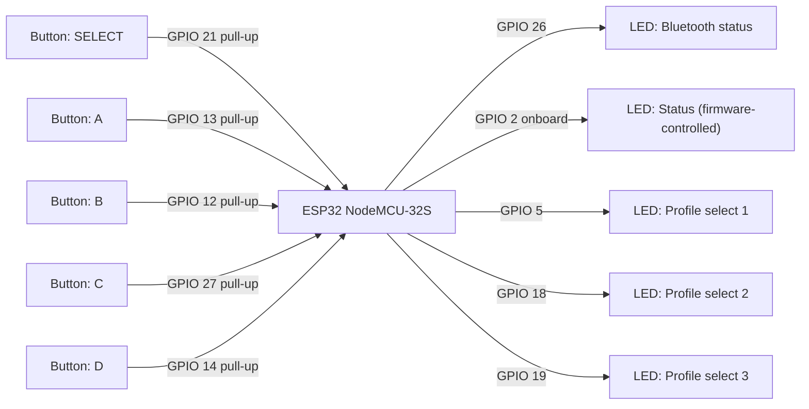
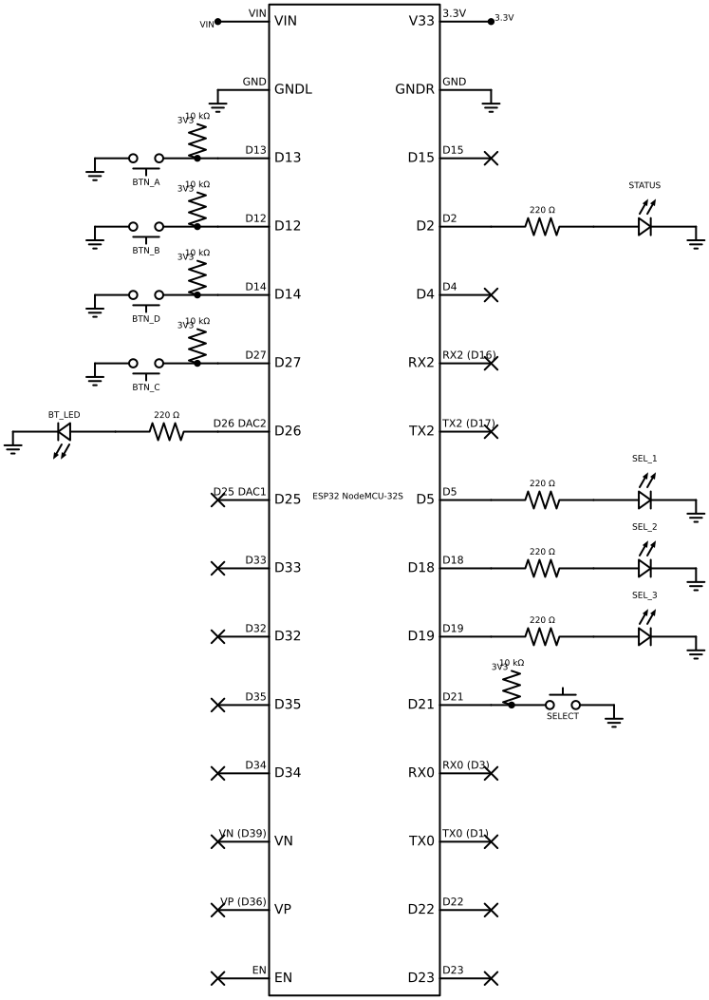
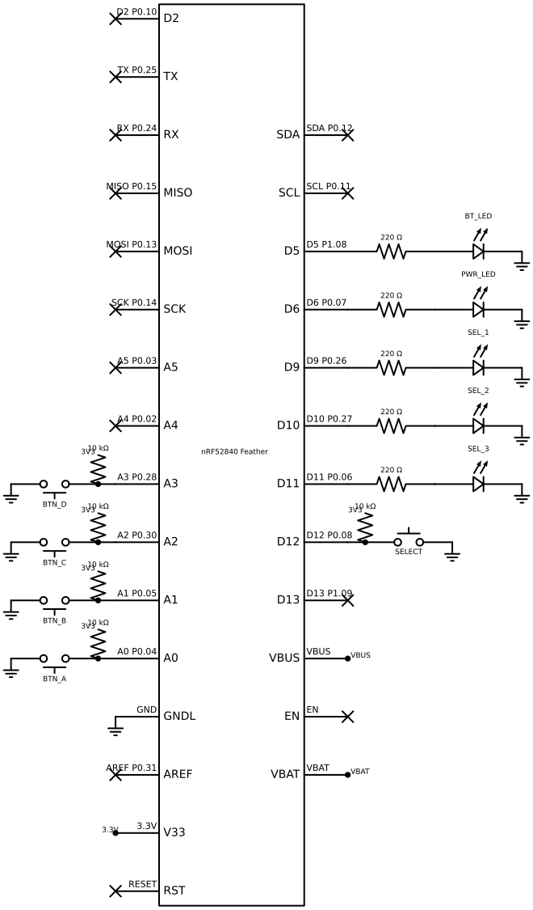
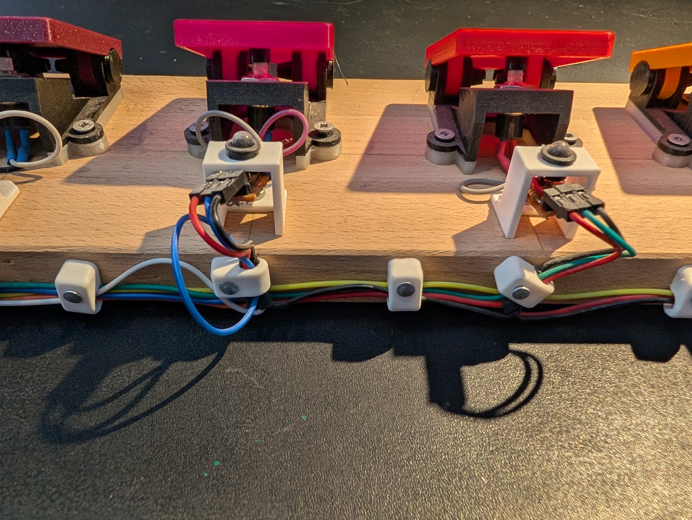
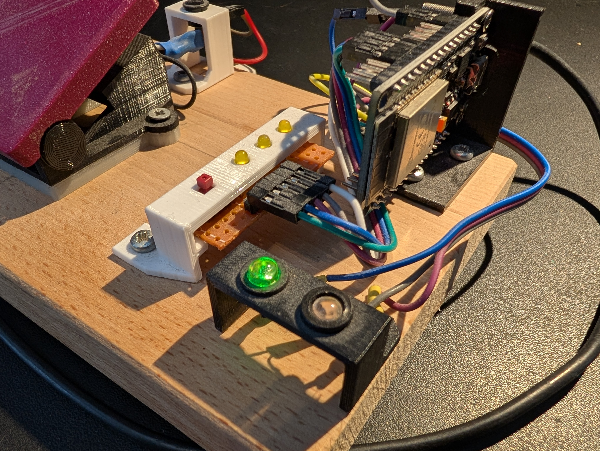
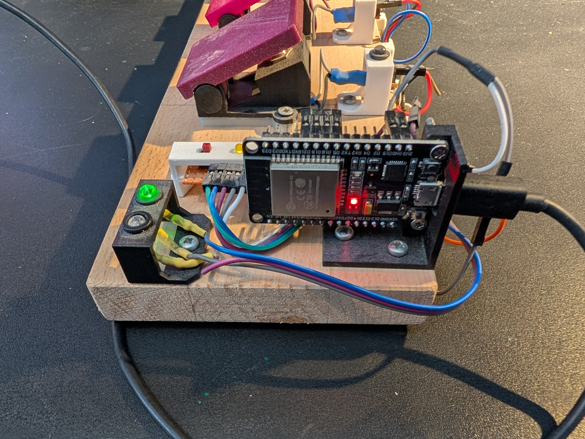
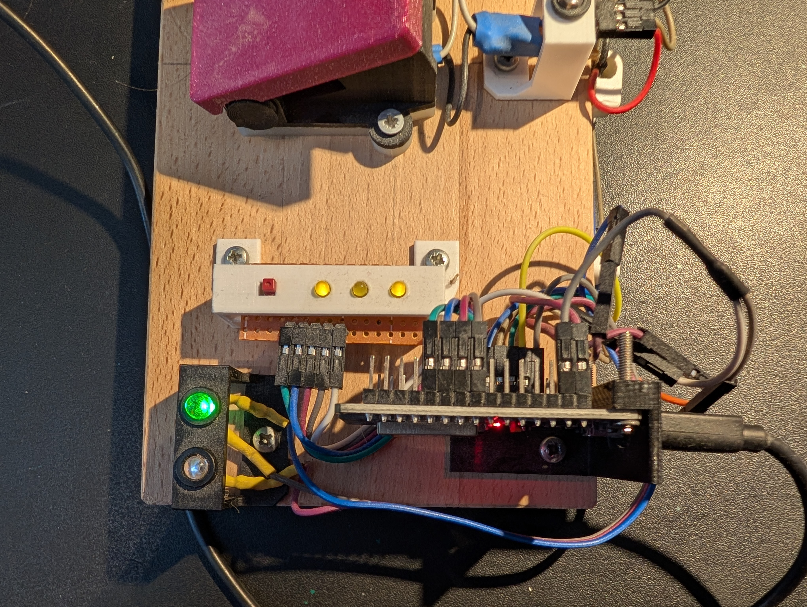

# Build Guide

## Hardware target

ESP32 (NodeMCU-32S) is the only deployed and tested target.
nRF52840 (Adafruit Feather nRF52840) is implemented but not tested — no build guide is provided for it.

## Bill of materials

- ESP32 NodeMCU-32S development board
- 1–26 momentary tactile buttons (action buttons A–Z); default build uses 4 (A, B, C, D)
- 1 momentary tactile button (SELECT / profile cycle)
- 1 × 10 kΩ pull-up resistor per button pin (5 for the default build: SELECT + A/B/C/D).
  The firmware also enables the MCU's internal pull-up, but an external 10 kΩ to 3V3
  gives a much stronger pull and materially reduces EMI pickup on long cable runs
  between the enclosure and the PCB.
- 1–6 LEDs + current-limiting resistors (profile-select indicator array); default build uses 3
- 1 LED + resistor (Bluetooth status)
- 1 LED + resistor (power indicator)
- USB power supply or LiPo battery with regulator
- Enclosure (see options below)

To customise pin assignments or counts, edit
`lib/hardware/esp32/include/builder_config.h` before building.
Wiring more select LEDs raises the maximum number of profiles (see
[HARDWARE_CONFIG.md](HARDWARE_CONFIG.md) for the encoding table).

## Wiring diagram



| Signal | GPIO | Type |
|--------|------|------|
| LED: Bluetooth status | GPIO 26 | Output |
| LED: Status (boot mismatch / delayed-action / load-error) | GPIO 2 (onboard) | Output |
| LED: Profile select 1 | GPIO 5 | Output |
| LED: Profile select 2 | GPIO 18 | Output |
| LED: Profile select 3 | GPIO 19 | Output |
| Button: SELECT | GPIO 21 | Input (pull-up) |
| Button: A | GPIO 13 | Input (pull-up) |
| Button: B | GPIO 12 | Input (pull-up) |
| Button: C | GPIO 27 | Input (pull-up) |
| Button: D | GPIO 14 | Input (pull-up) |

### Circuit schematic



*Reference schematic for the default config. Your build may differ.*

Regenerate the diagram with `python scripts/generate-schematic.py --target esp32`.

## Enclosure options

**3D-printed:** a printable enclosure is available on Printables:
[AwesomeStudioPedal enclosure](https://www.printables.com/model/1683455-awesomestudiopedal)

The model page includes a description, required hardware list, and recommended print settings.

**Soft-touch footswitch alternative:** if you do not have a 3D printer, or need a more durable build
for live use, any standard SPST momentary footswitch works. This option is more robust for repeated
stomping.

## Configuration Builder

Use the web-based [Config Builder](https://tgd1975.github.io/AwesomeStudioPedal/tools/config-builder/)
to generate a `profiles.json` without writing JSON by hand.

## Next step

[FLASHING.md](FLASHING.md) — flash the firmware and upload the configuration.

## Builder Documentation

### Upload Instructions

**ESP32 (using esptool):**

```bash
# Install esptool
pip install esptool

# Upload firmware (replace COM3 with your port)
esptool.py --chip esp32 --port COM3 --baud 921600 write_flash 0x1000 awesome-pedal-esp32-vX.Y.Z.bin
```

**nRF52840 (using nrfjprog):**

```bash
# Install nrfjprog from Nordic Semiconductor
# Connect your device and run:
nrfjprog --program awesome-pedal-nrf52840-vX.Y.Z.bin --verify --reset
```

### Required Tools

**For ESP32:**

- [esptool](https://github.com/espressif/esptool) (Python-based)
- Python 3.7+
- USB drivers for your specific ESP32 board

**For nRF52840:**

- [nRF Command Line Tools](https://www.nordicsemi.com/Products/Development-tools/nrf-command-line-tools)
- J-Link software (for programming)
- USB drivers for your nRF52840 board

## nRF52840 circuit schematic

The nRF52840 target is implemented but not yet tested with a full build guide.
The reference circuit schematic for the default `builder_config.h` is available for builders
who want to get started.



*Reference schematic for the default config. Your build may differ.*

Default GPIO assignments: BT LED=D5, PWR LED=D6, SEL LEDs=D9/D10/D11, SELECT=D12, BTN A-D=A0/A1/A2/A3.
Regenerate the diagram with `python scripts/generate-schematic.py --target nrf52840`.

## Prototype pictures

Overview of the assembled pedal:


Wiring detail:



ESP32 — front, side, and top views:





Enclosure — open and in use:


