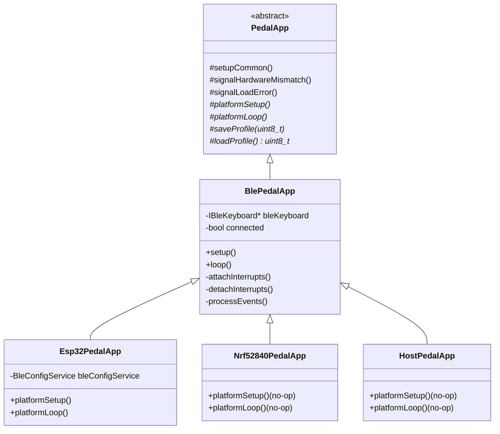
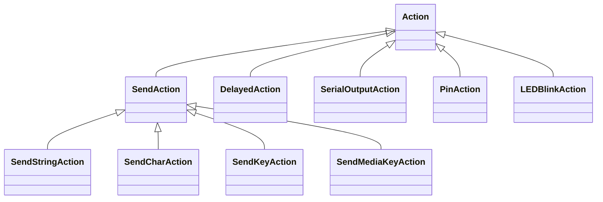

# Architecture

> **Auto-generated API reference** (Doxygen): [tgd1975.github.io/AwesomeStudioPedal](https://tgd1975.github.io/AwesomeStudioPedal/)
> Regenerated on every push to `main` by the Docs CI workflow.

## Pedal application class hierarchy

The pedal logic is structured as a class hierarchy with platform behaviour
in concrete subclasses, not in `#ifdef` branches (see EPIC-020 for the
refactor history).



`PedalApp` owns the hardware-agnostic core: button / LED objects,
`ProfileManager`, `EventDispatcher`, hardware-mismatch / load-error
signaling, button event-handler registration. Subclasses provide
platform behaviour through four pure-virtual hooks.

`BlePedalApp` adds BLE connection tracking, interrupt attach/detach,
`processEvents()`, and the main `setup()` / `loop()` skeleton — shared
across all on-device targets *and* the host test fake.

## Hardware wiring

Circuit schematics are generated by [`scripts/generate-schematic.py`](../../scripts/generate-schematic.py)
using Schemdraw and committed as SVG under `docs/builders/wiring/<target>/main-circuit.svg`.
The full GPIO pin table is in [BUILD_GUIDE.md](../builders/BUILD_GUIDE.md).

## Action class hierarchy



## Component table

| Component | File | Pattern | Responsibility |
|-----------|------|---------|----------------|
| `PedalApp` | `include/pedal_app.h`, `src/pedal_app.cpp` | Template Method | Hardware-agnostic core: hardware setup, profile manager, event handler registration |
| `BlePedalApp` | `include/ble_pedal_app.h`, `src/ble_pedal_app.cpp` | Template Method | BLE connection tracking, ISR fan-out, main setup/loop body |
| `Esp32PedalApp` | `src/esp32/include/esp32_pedal_app.h`, `src/esp32/src/esp32_pedal_app.cpp` | Concrete subclass | NVS persistence (Preferences), `BleConfigService` GATT loop |
| `Nrf52840PedalApp` | `src/nrf52840/include/nrf52840_pedal_app.h`, `src/nrf52840/src/nrf52840_pedal_app.cpp` | Concrete subclass | No-op platform hooks (no NVS, no on-device config service) |
| `HostPedalApp` | `src/host/include/host_pedal_app.h` | Concrete subclass | Test specialization: in-memory persistence, no-op platform hooks |
| `EventDispatcher` | `lib/PedalLogic/include/event_dispatcher.h` | Observer | Press, release, long-press, double-press handlers |
| `ProfileManager` | `lib/PedalLogic/include/profile_manager.h` | Strategy + Composite | Per-profile action sets, profile switching, LED feedback |
| Action hierarchy | `lib/PedalLogic/include/`, `lib/PedalLogic/src/` | Strategy | Polymorphic actions executed on button events |
| `LEDController` | `src/esp32/include/led_controller.h`, `src/esp32/src/led_controller.cpp` (and nRF equivalent) | Adapter | Abstracts LED GPIO behind `ILEDController` |
| `Button` / `ButtonController` | `src/esp32/{include,src}/button*.cpp` (and nRF equivalent) | Adapter | Abstracts button GPIO with debounce behind `IButton` / `IButtonController` |
| `BleKeyboardAdapter` | `src/esp32/{include,src}/ble_keyboard_adapter.*` (and nRF equivalent) | Adapter | Wraps each platform's BLE-keyboard library behind `IBleKeyboard` |
| `IFileSystem` impls | `src/esp32/src/esp32_file_system.cpp`, `src/nrf52840/src/nrf52840_file_system.cpp`, `src/host/src/host_file_system.cpp` | Adapter | LittleFS / Adafruit-LittleFS / `std::ofstream` behind `IFileSystem` |
| `ConfigLoader` | `lib/PedalLogic/src/config_loader.cpp` | — | Reads `pedal_config.json` via injected `IFileSystem` and builds the action graph |

## Hardware abstraction seam

The codebase is split into hardware-independent logic (`lib/PedalLogic/`)
and platform-specific implementations under `src/<target>/{include,src}/`,
one per platform peer (`esp32`, `nrf52840`, `host`).

The seam is defined by these interfaces:

- `ILEDController` — set LED state
- `IButtonController` — read button state
- `IBleKeyboard` — send key events
- `IFileSystem` — read / write files
- `ILogger` — diagnostic output

Hardware-independent code (`PedalApp`, `BlePedalApp`, `EventDispatcher`,
`ProfileManager`, action hierarchy) depends only on these interfaces.
Each platform package implements them with the appropriate driver
(LittleFS on ESP32, Adafruit_LittleFS on nRF52840, `std::ofstream` on host).

The build system selects which platform's implementation gets linked:

- **PIO production builds:** `build_src_filter = -<*> +<esp32/>` (or `+<nrf52840/>`)
  selects per-target source files. Each env's `build_flags` adds the
  matching `-Isrc/<target>/include`.
- **Host tests (CMake):** `test/CMakeLists.txt` lists exactly the
  platform sources it wants — `src/esp32/src/button.cpp`,
  `src/esp32/src/led_controller.cpp`, plus the host-side files under
  `src/host/src/`. There is no `HOST_TEST_BUILD` preprocessor flag.

The full pedal logic — including `BlePedalApp::loop()` end-to-end —
can be exercised on host by constructing `HostPedalApp(mockKb)`. See
[TESTING.md](TESTING.md) for the integration-test pattern.

### nRF52840 framework-library quirk

PIO's Library Dependency Finder in `chain` mode (the default) only
follows direct `.cpp` `#include` lines. If a framework-bundled library
is referenced *only* via a transitive header chain
(`.cpp` → project header → framework `.h`), the LDF won't activate
it.

ESP32 happens to dodge this — its BLE library (NimBLE) is a registry
package pulled in via `lib_deps`. The nRF52840 BLE library (Adafruit
Bluefruit) is bundled inside the `framework-arduinoadafruitnrf52`
package; without a direct `.cpp` include, the LDF wouldn't see it.
The fix is one block at the top of
`src/nrf52840/src/ble_keyboard_adapter.cpp`:

```cpp
#include <Adafruit_nRFCrypto.h>
#include <bluefruit.h>
#include "ble_keyboard_adapter.h"
```

When adding a new target whose framework-bundled libs aren't in the
PIO registry, replicate this pattern. Detailed history in the
[TASK-297 post-mortem](tasks/closed/task-297-collapse-lib-hardware-nrf52840-into-src.md).

## Memory management

- All dynamic memory is managed via `std::unique_ptr`.
- RAII: resources are acquired in constructors and released automatically in destructors.
- No raw `new` or `delete` in application code.
