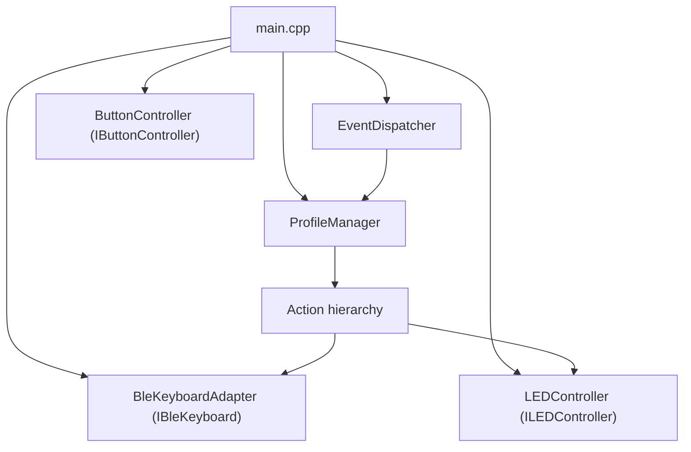
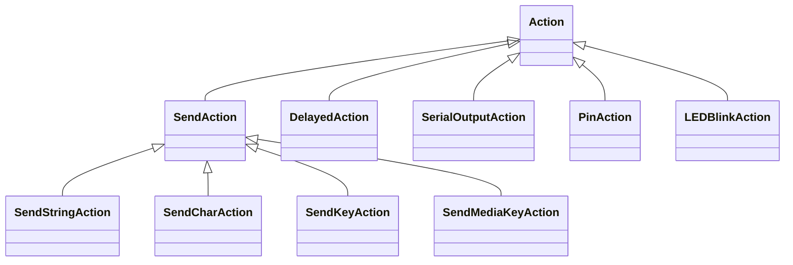

# Architecture

> **Auto-generated API reference** (Doxygen): [tgd1975.github.io/AwesomeStudioPedal](https://tgd1975.github.io/AwesomeStudioPedal/)
> Regenerated on every push to `main` by the Docs CI workflow.

## High-level component diagram

## Hardware wiring

The ESP32 pin assignments are illustrated in the Fritzing diagrams under `docs/media/`:

- [Circuit schematic](../media/AwesomeStudioPedal_esp32_wiring_circuit.png) — quick reference for signal flow
- [Breadboard layout](../media/AwesomeStudioPedal_esp32_wiring_breadboard.png) — physical wiring guide
- [PCB view](../media/AwesomeStudioPedal_esp32_wiring_pcb.png) — PCB layout
- [Fritzing source](../media/AwesomeStudioPedal_esp32_wiring.fzz) — editable source file

The full GPIO pin table is in [BUILD_GUIDE.md](../builders/BUILD_GUIDE.md).

## Action class hierarchy

## Component table

| Component | File | Pattern | Responsibility |
|-----------|------|---------|----------------|
| `main.cpp` | `src/main.cpp` | Composition root | Wires all components together; owns the main loop |
| `EventDispatcher` | `include/event_dispatcher.h` | Observer | Registers button handlers; dispatches button presses to the correct action |
| `ProfileManager` | `include/profile_manager.h` | Strategy + Composite | Stores per-profile action sets; handles profile switching and LED feedback |
| Action hierarchy | `lib/PedalLogic/include/` | Strategy | Polymorphic actions executed on button press |
| `LEDController` | `lib/hardware/esp32/` | Adapter | Abstracts LED GPIO |
| `ButtonController` | `lib/hardware/esp32/` | Adapter | Abstracts button GPIO with debounce |
| `BleKeyboardAdapter` | `lib/hardware/esp32/` | Adapter | Wraps the ESP32 BLE Keyboard library behind `IBleKeyboard` |
| `ConfigLoader` | `lib/PedalLogic/src/config_loader.cpp` | — | Reads `pedal_config.json` from LittleFS and builds the action graph |

## Hardware abstraction seam

The codebase is split into hardware-independent logic (`lib/PedalLogic`) and hardware-specific
drivers (`lib/hardware/esp32`, `lib/hardware/nrf52840`).

The seam is defined by three interface classes:

- `ILEDController` — set LED state
- `IButtonController` — read button state
- `IBleKeyboard` — send key events

Hardware-independent code (EventDispatcher, ProfileManager, Action hierarchy) depends only on these
interfaces. Platform-specific code implements them.

The `HOST_TEST_BUILD` preprocessor flag enables building the logic layer on a development machine
without any ESP32 or Arduino dependencies. When this flag is set, Arduino-specific headers are
replaced by `test/fakes/arduino_shim.h`, and hardware implementations are replaced by mock classes
from `test/mocks/`.

This means the full logic of the pedal can be tested with GoogleTest on any machine, without
hardware.

## Memory management

- All dynamic memory is managed via `std::unique_ptr`.
- RAII: resources are acquired in constructors and released automatically in destructors.
- No raw `new` or `delete` in application code.
