# Mermaid Diagram Style Guide

This document defines the style guidelines for Mermaid diagrams in the AwesomeGuitarPedal project to ensure consistency and readability.

## General Rules

1. **Diagram Types**: Use appropriate diagram types for different purposes:
   - `flowchart TD` (top-down) for process flows and architecture
   - `classDiagram` for class hierarchies and relationships
   - `gantt` for project timelines and planning
   - `graph LR` (left-right) for wiring and connection diagrams

2. **Orientation**:
   - Use `TD` (top-down) for most flowcharts
   - Use `LR` (left-right) for wiring diagrams and simple connections

3. **Colors**: Use the project's color scheme:
   - Primary: `#4F46E5` (indigo-600)
   - Secondary: `#10B981` (emerald-500)
   - Warning: `#F59E0B` (amber-500)
   - Error: `#EF4444` (red-500)

## Flowchart Guidelines

### Node Styling

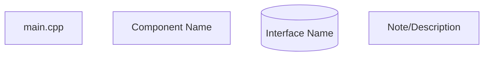

- Use square brackets `[]` for main components
- Use parentheses `()` for interfaces
- Use quotes for multi-word labels
- Keep node names concise but descriptive

### Connections

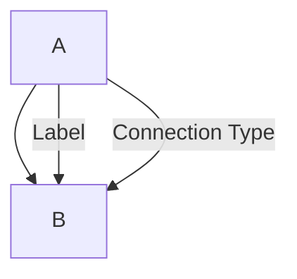

- Use `-->` for simple connections
- Use `-- "Label" -->` for labeled connections
- Use `-->|"Type"|` for typed connections (e.g., GPIO pins)

### Example Architecture Diagram

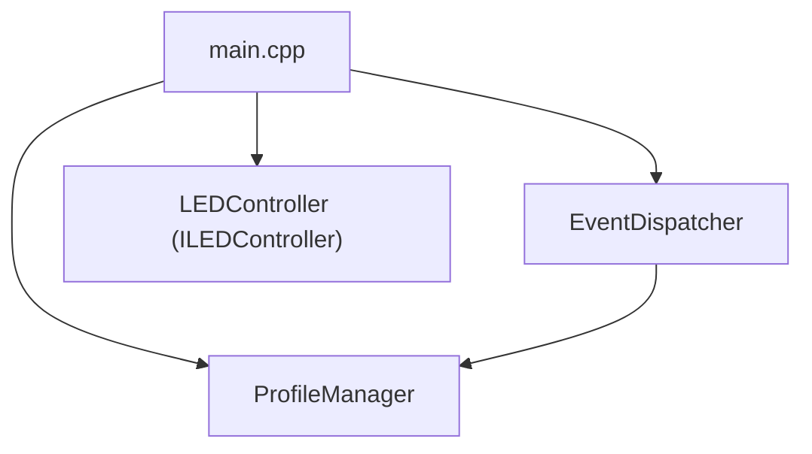

## Class Diagram Guidelines

### Class Notation

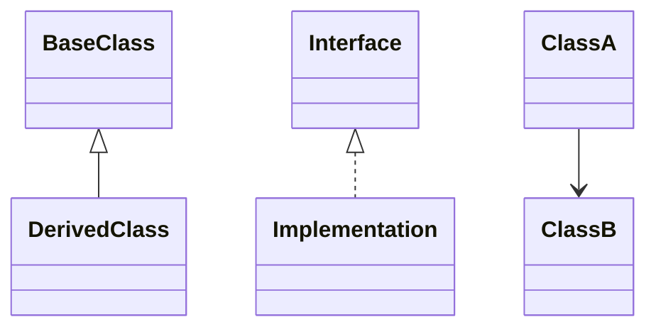

- Use `<|--` for inheritance (solid line, closed arrow)
- Use `<|..` for interface implementation (dotted line, closed arrow)
- Use `-->` for associations (solid line, open arrow)

### Example Class Hierarchy

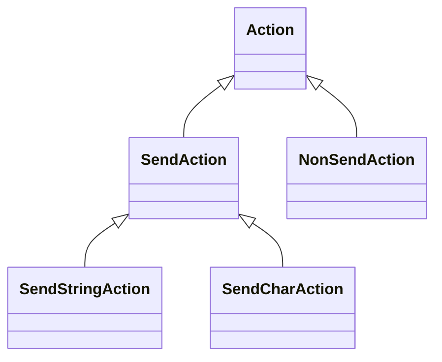

## Gantt Chart Guidelines

### Structure

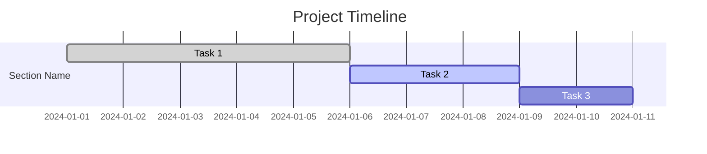

- Use clear, descriptive task names
- Include dates in `YYYY-MM-DD` format
- Use `done`, `active`, and default (pending) status indicators
- Use `after` keyword for dependencies

### Example Timeline

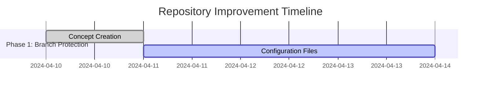

## Wiring Diagram Guidelines

### Node Naming

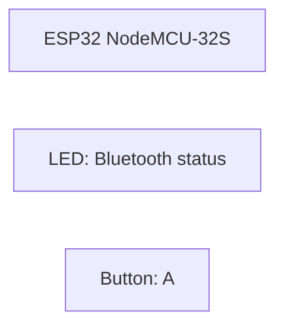

- Use `ESP` for microcontroller
- Use `COMPONENT_TYPE["Description"]` format
- Be specific about component types (LED, Button, etc.)

### Connection Format

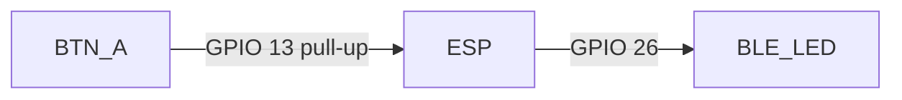

- Include GPIO numbers in connections
- Specify pull-up/pull-down resistors when relevant
- Use consistent direction (components --> ESP for inputs, ESP --> components for outputs)

## Best Practices

1. **Consistency**: Follow the same patterns across all diagrams
2. **Readability**: Keep diagrams focused on one concept per diagram
3. **Maintainability**: Update diagrams when the architecture changes
4. **Accessibility**: Add descriptive titles and labels
5. **Validation**: Test diagrams using `mmdc` before committing

## Validation

To validate Mermaid diagrams:

```bash
# Install mermaid-cli
npm install -g @mermaid-js/mermaid-cli

# Test a specific file
mmdc --input path/to/file.md --output /tmp/test.svg

# Test all diagrams in a directory
find docs/ -name "*.md" -exec mmdc --input {} --output /tmp/test.svg \;
```

## Common Issues and Fixes

1. **Syntax Errors**: Extra spaces in node definitions
   - ❌ `ESP -->|GPIO 5|  SEL1["Label"]` (extra space before SEL1)
   - ✅ `ESP -->|GPIO 5| SEL1["Label"]`

2. **Invalid Characters**: Special characters in labels
   - Use quotes around labels containing special characters

3. **Missing Dependencies**: Gantt chart tasks without proper dependencies
   - Always use `after taskname` for dependent tasks

## Examples from Codebase

### Good Architecture Diagram

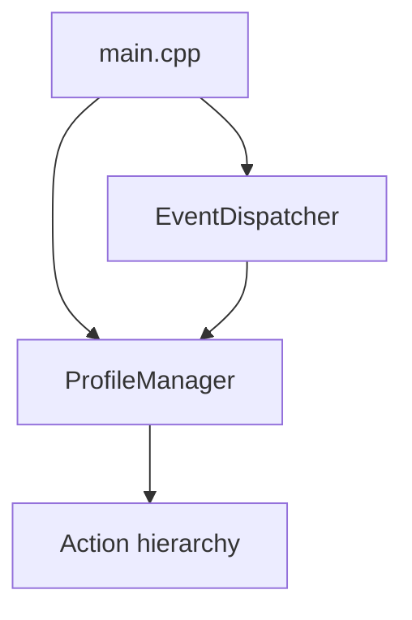

### Good Wiring Diagram

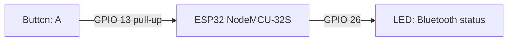

### Good Class Diagram


## Tools and Resources

- [Mermaid Live Editor](https://mermaid.live/) - Interactive diagram editor
- [Mermaid Documentation](https://mermaid.js.org/) - Official documentation
- [Mermaid CLI](https://github.com/mermaid-js/mermaid-cli) - Command line tool

## Enforcement

Diagrams should be validated as part of the CI/CD pipeline to ensure they render correctly. See the Mermaid validation script for automated checking.
