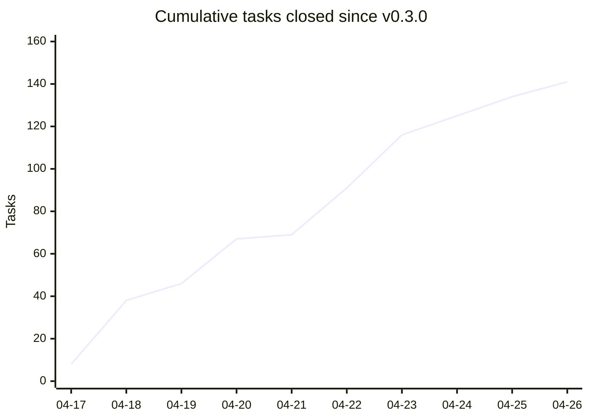
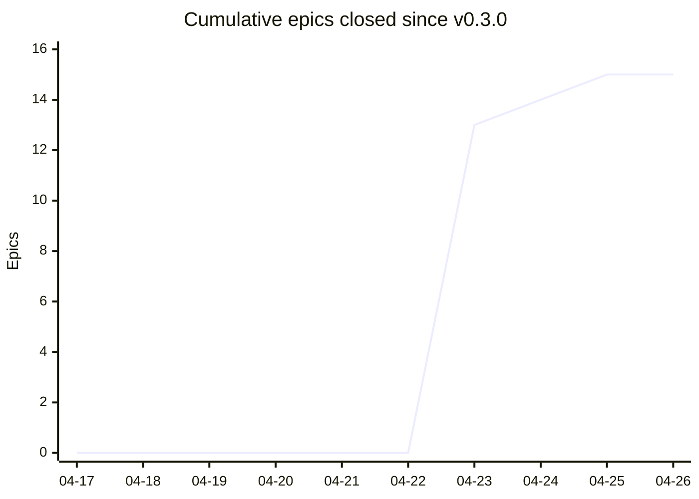
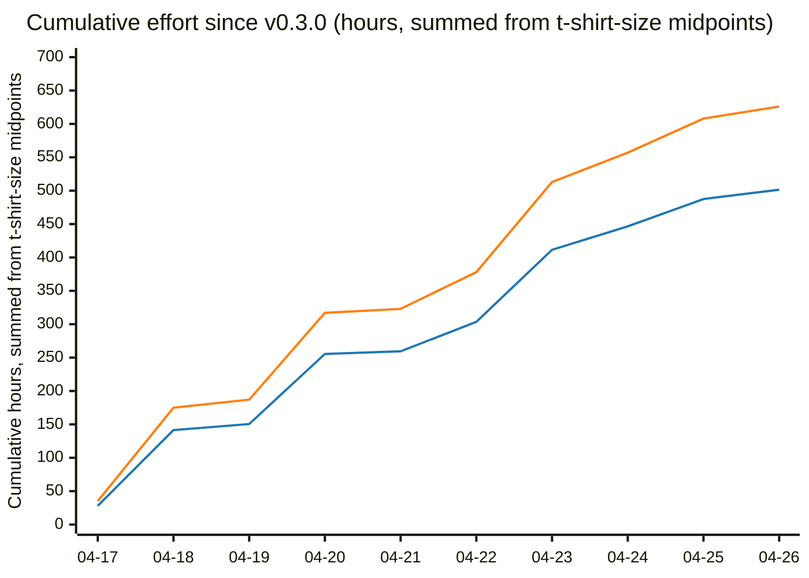

## Archive Reason

2026-04-28 — Implemented as part of IDEA-043 rollout. `scripts/release_burnup.py` exists; `<!-- BURNUP:START --> ... <!-- BURNUP:END -->` block is live in `docs/developers/tasks/OVERVIEW.md` rendering cumulative tasks/epics charts plus the estimate-vs-actual effort-hours chart.

# Release burn-up chart from closed tasks

## Motivation

Traditional burndown charts assume fixed scope and a deadline — neither fits this project. What does fit is a **burn-up since the last release tag**: a cumulative view of work completed, with no target line. The data is already there; the task system records `effort:` in frontmatter and `git log` knows when each task moved to `closed/`.

The chart's purpose is twofold:

- Personal: see at a glance whether the next release is "earning" enough new content to justify cutting.
- External: a visible artifact on GitHub that shows the project is actively progressing, without requiring a campaign or community-building effort.

## Approach

A single script (Python under `scripts/`, or a slash command `/release-progress`) that:

1. Resolves the most recent tag via `git describe --tags --abbrev=0`.
2. Walks `git log <tag>..HEAD --diff-filter=A --no-renames --name-only --date=short --pretty=format:'COMMIT %ad' -- 'docs/developers/tasks/closed/task-*.md' 'docs/developers/tasks/closed/epic-*.md'` to find tasks and epics closed since the tag. The `COMMIT <date>` sentinel and the file paths arrive as separate lines, so the script reads the stream line-by-line: each `COMMIT <date>` line sets the current commit date, every following non-empty line until the next sentinel is a path closed on that date. `--no-renames` ensures a `git mv open/ → closed/` is recorded as an add in `closed/`. After parsing, the script dedupes by basename to handle tasks that have moved through `open/ → active/ → closed/` more than once, keeping the latest closure date per task.
3. Reads each task's frontmatter and maps **both** `effort:` (initial estimate) and `effort_actual:` (post-hoc t-shirt size from [IDEA-043-llm-effort-reassessment-on-close](idea-043-llm-effort-reassessment-on-close.md), when present) to midpoint hours, using the canonical t-shirt vocabulary below:

   | Size | Label | Range | Midpoint (h) |
   |---|---|---|---|
   | XS | `XS (<30m)` | <0.5 h | 0.25 |
   | S  | `Small (<2h)` | 0–2 h | 1 |
   | M  | `Medium (2-8h)` | 2–8 h | 5 |
   | L  | `Large (8-24h)` | 8–24 h | 16 |
   | XL | `Extra Large (24-40h)` | 24–40 h | 32 |
   | XXL | `XXL (>40h)` | >40 h | 56 |

   This is the new canonical set. Legacy variants in already-closed tasks (`Trivial (<30m)`, `Small (1-2h)`, `Small (1-3h)`, `Small (2-4h)`, `Large (>8h)`) are mapped onto the canonical sizes at parse time (`Trivial → XS`, all `Small *` → S, `Large (>8h) → L`). They will fade out naturally as new tasks adopt the canonical labels — no one-time normalization pass needed. The `>40h` midpoint of 56 h is a convention (not a real midpoint of an open-ended range); documented here so it doesn't drift.

   Whichever skill among `ts-task-new`, `ts-task-done` (per IDEA-043-llm-effort-reassessment-on-close), and `ts-epic-new` writes effort labels going forward must use exactly these six canonical strings.

   The hours chart plots **two lines**: cumulative estimate-hours (sum of `effort` across all tasks) and cumulative actual-hours (sum of `effort_actual` across only the tasks that have it). The vast majority of tasks will carry `effort_actual` once IDEA-043-llm-effort-reassessment-on-close is wired into `/ts-task-done`, so the actual line is meaningful and not a fallback-disguised duplicate. Tasks closed by hand (no `effort_actual`) are simply omitted from the actual line — the gap between the two lines is the estimation-drift signal IDEA-043-llm-effort-reassessment-on-close surfaces.

   Epics never carry `effort` of their own — an epic's effort is by definition the aggregation of its child tasks, which are already counted. Epics therefore only contribute to the count chart, not the hours chart.
4. Aggregates per day, computes cumulative count, cumulative estimate-hours, and cumulative actual-hours.
5. Regenerates a delimited section (`<!-- BURNUP:START -->` … `<!-- BURNUP:END -->`) inside [`docs/developers/tasks/OVERVIEW.md`](../../tasks/OVERVIEW.md) — same regeneration model as the existing `<!-- GENERATED -->` block. Regeneration is wired into `scripts/housekeep.py`, which already rewrites OVERVIEW.md on every invocation. The burn-up section adds its own change-detection: build the new block in memory, compare byte-for-byte against the current `BURNUP:START`/`BURNUP:END` slice, and only mutate the file if they differ. That keeps housekeep idempotent on a no-op day (no closes since last tag, no diff in the rendered block) instead of producing a meaningless OVERVIEW.md churn commit each time someone runs it. The section contains:
   - A summary table (date, tasks closed, cum. tasks, est. hours, cum. est. hours, actual hours, cum. actual hours, epics closed, cum. epics).
   - **Two `xychart-beta` blocks rendered side-by-side**: chart 1 = cumulative tasks, chart 2 = cumulative epics. Each chart uses its own natural y-axis scale — Mermaid `xychart-beta` does not support a secondary y-axis, so two separate charts are the only honest way to show two series with very different magnitudes (tasks ~140, epics ~15 in a typical release window).
   - A third `xychart-beta` block underneath for cumulative effort-hours, plotting **two color-distinguished lines** — estimate (e.g. blue) vs. actual (e.g. orange) — with a small Markdown legend below the chart naming each color. Mermaid `xychart-beta` supports per-series color via `themeVariables.xyChart.plotColorPalette`, so series identity does not have to live in the chart title.

Side-by-side rendering on GitHub is achieved with a 2-column Markdown table whose cells contain the Mermaid blocks — GitHub renders Mermaid inside table cells. If that turns out to be unreliable, fall back to two stacked charts (still each with its own scale).

Putting the report directly in `OVERVIEW.md` means it lives where contributors already look for project state — no separate `release-progress.md` to discover, no extra navigation step.

## Example output

Below is what the burn-up section looks like for the period since `v0.3.0` (2026-04-17). The numbers are **illustrative, not derived from a programmatic scan** — they are hand-rolled from real closure dates to show the shape of the report. The `Actual (h)` columns are populated with synthetic values to demonstrate the estimate-vs-actual gap; in a real first run after IDEA-043-llm-effort-reassessment-on-close lands, only tasks closed after that point will carry `effort_actual` and the actual line will start short and grow over time.

### Closed since v0.3.0

| Date | Tasks closed | Cum. tasks | Est. (h) | Cum. est. (h) | Actual (h) | Cum. actual (h) | Epics closed | Cum. epics |
|---|---|---|---|---|---|---|---|---|
| 2026-04-17 | 8 | 8 | 28.0 | 28.0 | 35.0 | 35.0 | 0 | 0 |
| 2026-04-18 | 30 | 38 | 113.5 | 141.5 | 140.0 | 175.0 | 0 | 0 |
| 2026-04-19 | 8 | 46 | 9.0 | 150.5 | 12.0 | 187.0 | 0 | 0 |
| 2026-04-20 | 21 | 67 | 105.0 | 255.5 | 130.0 | 317.0 | 0 | 0 |
| 2026-04-21 | 2 | 69 | 4.0 | 259.5 | 6.0 | 323.0 | 0 | 0 |
| 2026-04-22 | 22 | 91 | 44.0 | 303.5 | 55.0 | 378.0 | 0 | 0 |
| 2026-04-23 | 25 | 116 | 108.0 | 411.5 | 135.0 | 513.0 | 13 | 13 |
| 2026-04-24 | 9 | 125 | 35.0 | 446.5 | 44.0 | 557.0 | 1 | 14 |
| 2026-04-25 | 9 | 134 | 41.0 | 487.5 | 51.0 | 608.0 | 1 | 15 |
| 2026-04-26 | 7 | 141 | 14.0 | 501.5 | 18.0 | 626.0 | 0 | 15 |

### Burn-up — tasks and epics, side-by-side

<!-- markdownlint-disable MD033 -->
<table>
<tr>
<td>

</td>
<td>

</td>
</tr>
</table>
<!-- markdownlint-enable MD033 -->

Two charts, two natural scales. The tasks chart climbs steadily; the epics chart is a step function — nearly all 13 close on 04-23 (a v0.3.x archival sweep), then ones and twos. Each story is readable on its own y-axis without a scaling factor that has to travel with the chart.

### Burn-up by effort-hours — estimate vs. actual

🔵 **Estimate** (initial `effort:`) — 🟠 **Actual** (post-hoc `effort_actual:` per IDEA-043-llm-effort-reassessment-on-close)

The orange line sits consistently above the blue line: in this synthetic example, hindsight effort runs about 25% over the original estimate — the kind of drift signal IDEA-043-llm-effort-reassessment-on-close is meant to surface. The legend colors above match the chart only when Mermaid honours `themeVariables.xyChart.plotColorPalette` — GitHub does, the MkDocs Material plugin (per [IDEA-022](idea-022-mkdocs-documentation-site.md)) may not. If MkDocs renders default colors, the legend turns into a lie; worth re-checking if/when the doc site goes live.

The tasks chart and the hours chart tell different stories: 04-19 shows 8 closed tasks but the flattest hours-line (mostly XS doc tweaks). 04-20 has fewer tasks than 04-22 but far more hours — three Larges that day. Counts alone are misleading; effort-hours alone hide cadence. Showing both is cheap.

## Open questions

- **Mermaid-in-table-cell reliability.** GitHub currently renders Mermaid inside Markdown table cells, but the behaviour is not formally guaranteed across renderers (VS Code preview, MkDocs, future GitHub changes). Fallback: two stacked charts with their own headings — same data, no two-column layout dependency. If the MkDocs Material site lands ([IDEA-022](idea-022-mkdocs-documentation-site.md)) and the table-cell layout breaks there, switch to the stacked fallback rather than maintaining two layouts.
- **Skill rollout for the canonical vocabulary.** The six canonical sizes (XS / S / M / L / XL / XXL) need to land in `ts-task-new`, `ts-task-done` (per IDEA-043-llm-effort-reassessment-on-close), and `ts-epic-new` simultaneously, otherwise new tasks will mix vocabularies. Decide whether the three skill updates ship as one task or three.

## Non-goals

- No velocity prediction or "release ETA" line. There is no fixed scope, so any projection would be fiction.
- No sprint/iteration concept. This is a single timeline since the last tag, full stop.
- No per-epic or per-contributor breakdown in v1. Keep the first version trivially simple; layer on later if it earns its complexity.
