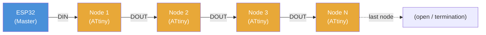
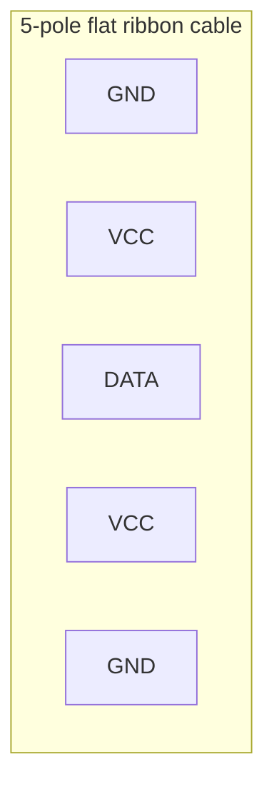
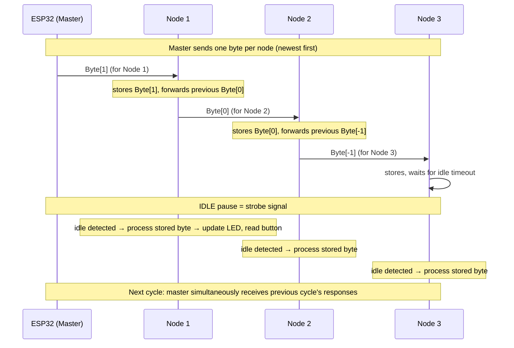
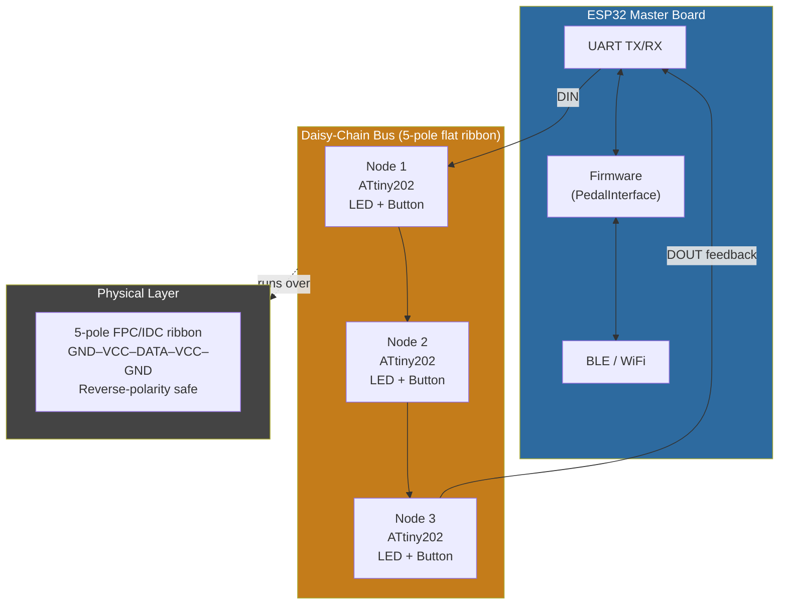

# Daisy-Chain Bus — Final Concept Extract

> Extracted from Signal group chat (Fritz, Roland, Tobi), April 11–13, 2026.
> The final architecture was locked in by Fritz's April 13 proposals.

---

## 1. Context and Motivation

The AwesomeStudioPedal currently wires each pedal footswitch directly to the ESP32 controller. This does not scale: every additional pedal burns another GPIO pin and another cable run. The goal is a **compact, single-cable daisy-chain bus** that connects an arbitrary number of pedals in series, controlled by one ESP32 master.

The prototype on the wooden board (4 colored pedal blocks, visible in the chat photos) already demonstrates the mechanical concept — each block is a pedal node, connected in a chain back to the ESP32.

---

## 2. Physical / Electrical Topology

### 2.1 Chain Architecture



- **Linear daisy chain** — pedals connected in series
- **Up to 16 nodes** per chain (practical limit; hardware can support more)
- Multiple independent chains can hang off one ESP32
- All nodes are **electrically identical** — no host/slave distinction in hardware
- Data flows **one direction** (DOUT of node N → DIN of node N+1); the "feedback" path is built into the shift-register protocol (see §4)

### 2.2 Bus Cable — 5-Pole Flat Ribbon (FINAL)

The cable runs **continuously** along the pedalboard. At each pedal location a small connector branches off the main cable to the node PCB — like a real bus, not point-to-point.



**Pin layout (outer → center → outer):**

| Position | Signal | Notes |
|----------|--------|-------|
| 1 (outer) | GND | |
| 2 | VCC | |
| 3 (center) | DATA | UART single-wire |
| 4 | VCC | doubled for current capacity |
| 5 (outer) | GND | |

**Why this layout?**

- **Reverse-polarity safe by design**: the two outer conductors are both GND. If the connector is plugged in flipped, GND shorts to GND (harmless). VCC and DATA stay protected between the GND rails.
- **Doubled VCC + GND**: ribbon cable contacts are rated ~1.2 A each; doubling gives ~2.4 A for power delivery across the chain.
- **Single DATA line in the center**: fully shielded on both sides by the power conductors.

**Cable type:** ES&S Solutions GmbH flexible/semi-rigid flat ribbon (shown in chat photo). 1.00 mm pitch connectors. The chat explored Molex 152670739 and similar IDC-style options.

The **IDC ribbon cable** photo in the chat (grey cable with multiple in-line connectors) illustrates the exact bus topology: one continuous cable, multiple tap-off connectors at regular intervals.

### 2.3 Connector Format

- IDC-style connectors that pierce the cable insulation — no pre-cut lengths required
- One connector per node, tapping into the continuous cable run
- Mechanically compact; cable routes under or alongside the PCB

---

## 3. Node Hardware (VAR_A)

Fritz sketched the canonical node circuit by hand on April 13. This is the reference design:

```
          DIN ──────────────────────────────────┐
                                                │
          VCC ──┬── Rp ──┬── [µC] ──── DOUT    │
                │        │    ↑                  │
               GND       P   │                  │
                        (btn) │                  │
                              │                  │
          VCC ── RL ── [LED] ─┘                  │
                                                │
         [100 nF decoupling cap to GND]         │
```

**Named "VAR_A" in the sketch.** Clean ASCII reproduction:

```
  VCC ──────┬─── Rp ───┬────── µC ─────► DOUT
            │          │       ▲
           GND         P       │
                     (btn)     │
                               │
  VCC ── RL ── ▷| ────────────┘
               (LED)

  DIN ───────────────────────► µC (RX)

  ⏚ 100 nF (VCC–GND decoupling)
```

### 3.1 Component List per Node

| Component | Value / Part | Notes |
|-----------|-------------|-------|
| µC | ATtiny202 (primary) | 20 MHz, async UART, EEPROM; ATtiny85 also evaluated |
| LED | Low-current type, 1–2 mA | Color TBD; color affects series resistor |
| RL | LED series resistor | Value per LED color — **not** SMD due to color variation |
| Rp | ~10 kΩ pullup | Button input |
| P | Mechanical footswitch | SPST, normally open |
| C | 100 nF | VCC–GND decoupling, SMD |
| Connectors | 2× 5-pole IDC | DIN-side and DOUT-side bus tap |

**Target PCB footprint:** ~12 mm × 12 mm. Must fit under or around the footswitch LED mounting.

### 3.2 Power Budget per Node

| Item | Current |
|------|---------|
| ATtiny202 @ 20 MHz | ~10 mA |
| LED (low-current) | 1–2 mA |
| Pullup bleed | ~0.5 mA |
| **Total per node** | **~13 mA** |
| 16 nodes | **~208 mA** |

Within the cable's 2.4 A capacity with large margin.

---

## 4. Protocol — Asynchronous UART Shift Register

### 4.1 Principle

The chain operates as a **software shift register over UART**. No clock line, no chip-select — timing alone drives synchronization.



### 4.2 Data Flow Detail

Each node does **exactly this on every byte received**:

1. Receive byte on DIN (RX)
2. **Immediately retransmit the previous stored byte** on DOUT (TX) — shift-register behavior
3. Store the newly received byte internally
4. Watch for idle (line silent for > 1 byte-time)
5. On idle: decode stored byte → update LED PWM, read button state
6. Prepare response byte for next cycle

The ESP32 **simultaneously** transmits the new command frame and receives the previous cycle's response frame — full-duplex at the UART level, even though the wire is physically half-duplex per segment.

### 4.3 Timing

**At 500 kBaud (ATtiny202 @ 20 MHz — recommended):**

| Parameter | Value |
|-----------|-------|
| Baud rate | 500 000 bps |
| Time per byte (8N1) | ~20 µs |
| 16 nodes × 20 µs | 320 µs |
| + idle strobe pause | ~20–50 µs |
| **Total cycle time** | **~370 µs** |
| Achievable update rate | ~2 700 Hz |
| Button-to-ESP32 latency | **< 2 ms** ✓ |

**At 115 200 baud (fallback, lower MCU clock):**

| Parameter | Value |
|-----------|-------|
| Time per byte | ~87 µs |
| 16 nodes | ~1.4 ms |
| Total cycle | ~1.5 ms |
| Button-to-ESP32 latency | ~3 ms (marginal) |

→ **500 kBaud / ATtiny202 @ 20 MHz is the target.**

### 4.4 Frame Format (8-bit byte per node)

**Command byte (ESP32 → node):**

| Bits | Field | Description |
|------|-------|-------------|
| 7:6 | Control flags | Reset, config mode, etc. |
| 5:3 | Reserved | Future expansion |
| 2:0 | LED command | Brightness / blink mode / on/off |

**Response byte (node → ESP32):**

| Bits | Field | Description |
|------|-------|-------------|
| 7:3 | Reserved | Future sensor data |
| 2 | LED feedback | Optional brightness readback |
| 1 | Button event type | Short / long / double-tap |
| 0 | Button state | Pressed (1) / released (0) |

### 4.5 Synchronization — No Addressing Needed

- The ESP32 **knows the chain length** (configured at startup; no auto-discovery in this design)
- No chip-select, no address bytes
- Position in the chain = implicit address (byte N in the frame → node N)
- The idle gap is the only synchronization primitive

---

## 5. System Overview



---

## 6. Rejected Alternatives

| Approach | Reason Rejected |
|----------|----------------|
| One-Wire protocol | Too complex for ATtiny firmware; unreliable at scale |
| SPI with clock line | Requires 6-pole cable; extra complexity |
| 4-pole cable | Insufficient current for LEDs across full chain |
| Dual 10-pole connectors | Too wide; doesn't fit aesthetic ("Ein Bus mit 725 Leitungen" — Fritz's bus-with-all-the-wires meme) |
| I²C with addressing | Addressed, but timing on long cables problematic |
| Standard USB/power connector | Overkill; wrong form factor |

The **bus-with-725-wires meme** (AI-generated image of engineer in front of a bus riddled with hundreds of cables) was Fritz's reaction to an early proposal for too many signal lines — it became the running joke measuring if a design had too many wires.

---

## 7. Existing Hardware Context

The chat also references the **current ESP32 master board** (already implemented):

- KiCad schematic and PCB layout visible in chat (ESP32 module with GPIO-connected LEDs and buttons directly wired)
- Breadboard prototype with ESP32, 5 LEDs, 5 buttons visible — this is the "before" system the bus replaces
- The existing board has Button_C/D inputs with 10 kΩ pullups and 220 Ω LED resistors (shown in the partial schematic closeup)

The **wooden prototype board with 4 colored pedal blocks** (orange, red, dark red, magenta) is the physical test fixture for the daisy-chain concept.

---

## 8. Mechanical / Aesthetic Notes

- **Inspiration**: Roli Seaboard M (photo shared in chat) — smooth, integrated, nothing hanging off the sides. Tobi's aesthetic benchmark.
- **Cable routing**: flat ribbon runs hidden under the board surface; only the small tap-off connectors are visible at each pedal
- **PCB size goal**: 12 × 12 mm or smaller — fits entirely under footswitch LED
- **3D-printed fixtures**: shown in chat photos (white 3D-printed bracket holding a footswitch on the wooden board); Prusa CORE One+ was discussed as the printer
- **LED color**: final colors TBD — series resistors are through-hole (not SMD) because resistor value depends on LED color and must be adjustable per batch

---

## 9. Open Questions

| Question | Status |
|----------|--------|
| Max practical chain length (voltage drop) | Needs prototype measurement |
| LED brightness at 1–2 mA — sufficient? | Needs prototype test |
| Mid-cable tap connector type (IDC self-piercing vs. pre-crimped) | Undecided |
| Auto-detection of node count | Deferred — manual config for now |
| Backward compat with future pedal variants | Deferred |
| Cable gauge / total resistance budget | Not calculated yet |

---

## 10. Group Dynamics and Running Jokes

Decades of friendship meant the technical discussion was liberally seasoned with trolling. Captured here for posterity (and so future readers don't mistake the memes for engineering decisions).

### The Bus With 725 Wires

Every time a proposal had too many signal lines, Fritz responded with an AI-generated image of a stressed engineer in a lab coat standing in front of a city bus (number **725**) that had hundreds of coloured cables bursting out of it like a hydra. The image was sent without comment. It was immediately understood. The "725 standard" became the informal unit of cable-count excess — any design that earned a 725 was back to the drawing board.

### Sam & Max — Fritz's Idea Generator

When Fritz had a new proposal brewing, he sent a sequence of Sam & Max adventure-game screenshots:

1. *"Ich würde dieses Vieh gerne einmal umstülpen"* — Sam staring at a problem, wanting to turn it inside out
2. *"Oh, das bringt mich auf eine Idee!"* — the lightbulb moment
3. Max picks up the stray cat and winds up...
4. Max hurls the cat offscreen

The cat represented whatever bad idea was being discarded. The sequence appeared at least twice during the April 12–13 sessions whenever Fritz was about to propose something that would make Tobi uncomfortable.

### "DD-Allüren" (Diva Behaviour)

Fritz's affectionate label for Tobi repeatedly changing requirements mid-discussion. Used with surgical timing, always right after Tobi said "actually, can we also make it..." — usually regarding the aesthetics of the cable or connector. Roland mostly watched from the sidelines and laughed.

### Tobi's Beauty Principle vs. Fritz's Pragmatism

The core creative tension of the whole discussion, recurring throughout:

- **Tobi**: *"Wenn du willst, dass etwas bleibt, mach es nicht nur gut, sondern mach es schön."* (If you want something to last, make it not just good, but beautiful.) — his justification for every aesthetic constraint.
- **Fritz**: *"Lösungsorientiert."* (Solution-oriented.) — his one-word rebuttal to all of the above.

The Roli Seaboard M photo Tobi shared was his visual brief: "I want the pedal system to feel like *this*." Fritz's response was not recorded but can be inferred from the Sam & Max sequence that followed shortly after.

### "Die Indianer haben nur eine Leitung gebraucht"

When Tobi pushed for absolute minimum wire count ("can we do it with just one wire?"), Fritz replied that Native Americans also only needed one wire for the telegraph — and then noted they also died out as a culture, probably for related reasons. The argument for one wire was not pursued further.

### The Age Jokes

Fritz is the elder statesman of the group. His age was a recurring target. At some point Fritz mentioned a health check where he'd claimed to be 65 — the actual number was disputed by the other two. This became a way to undermine any of his arguments: "Well, a 75-year-old would say that."

### "Männer die auf leere Codezeilen starren"

A movie-poster parody (riff on *Men Who Stare at Goats*) — four serious-looking men hunched over a laptop with a blank editor. Caption: *"Kein Code. Keine Ruhm. Nur viele Fehler."* (No code. No glory. Only many bugs.) Posted presumably to describe the current state of the firmware. Nobody disagreed.

### Claude Hitting Its Limit

A screenshot of Claude Pro hitting its usage limit mid-session was shared in the chat — presumably by Tobi, who was using it to help think through the architecture. Fritz's reaction was not recorded. Roland probably laughed.

---

## 11. Relation to IDEA-013

The existing [idea-013-bus-system.md](idea-013-bus-system.md) already captures the ATtiny node concept and the HAL (`PedalInterface`). This document adds the following detail not yet in IDEA-013:

- **5-pole GND–VCC–DATA–VCC–GND pin layout** (the reverse-polarity-safe arrangement)
- **Continuous cable with IDC tap-offs** (not point-to-point segments)
- **500 kBaud UART target** and full timing analysis
- **VAR_A node schematic** (Fritz's hand-drawn reference circuit)
- **Explicit byte frame format** for commands and responses
- **Rejection rationale** for all alternative approaches
- **Power budget** per node and for full 16-node chain
- The "no auto-discovery" decision (chain length configured at startup)
