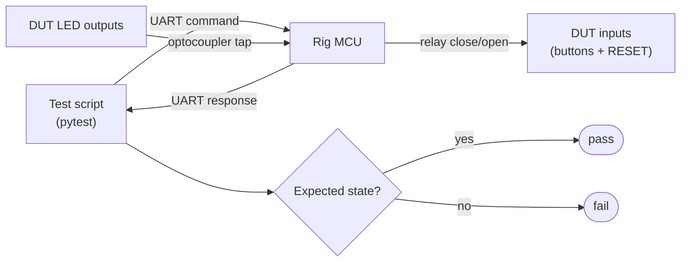
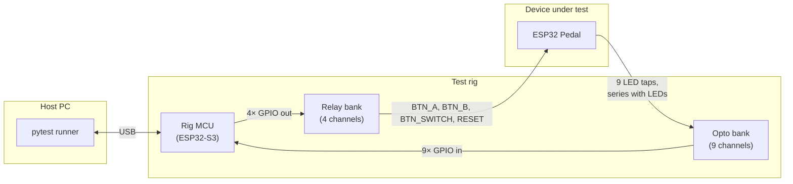
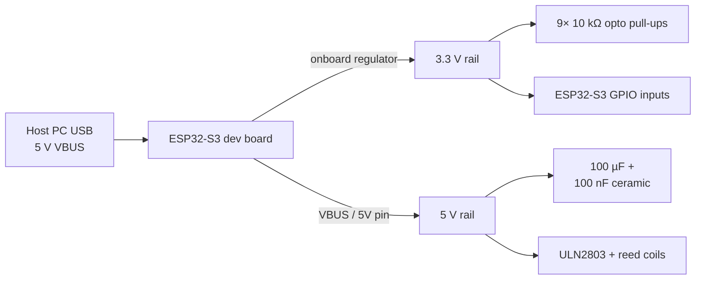
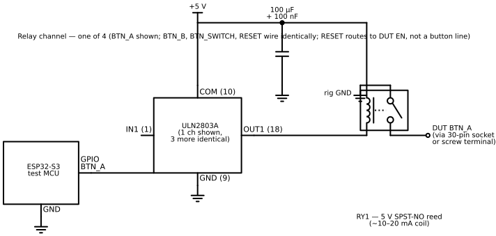
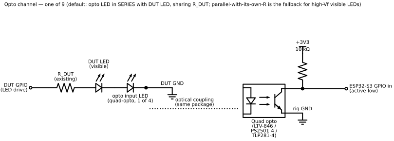
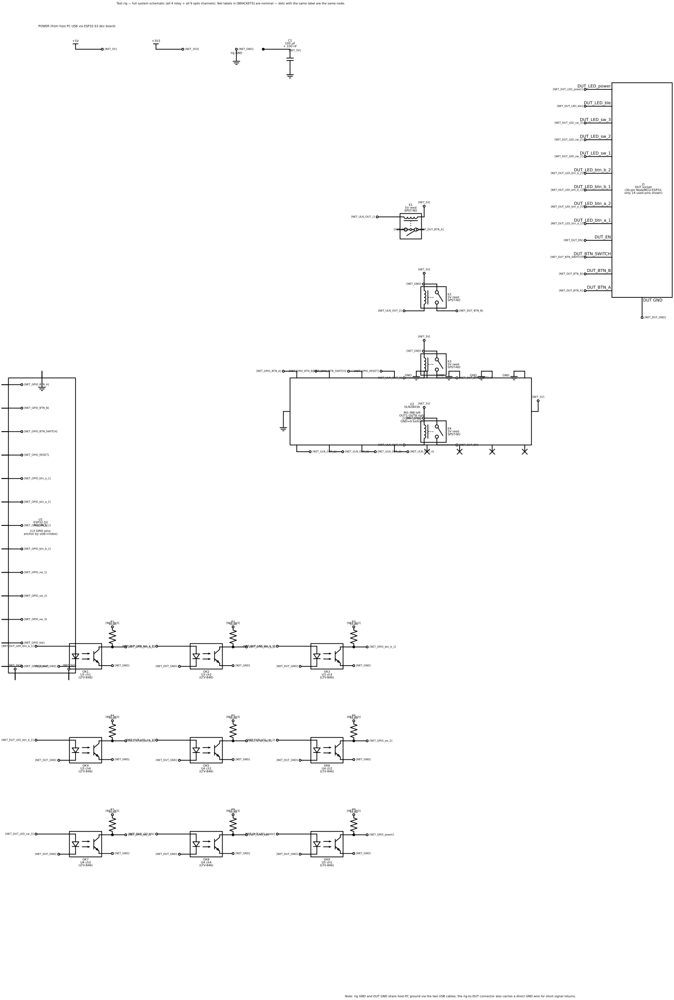
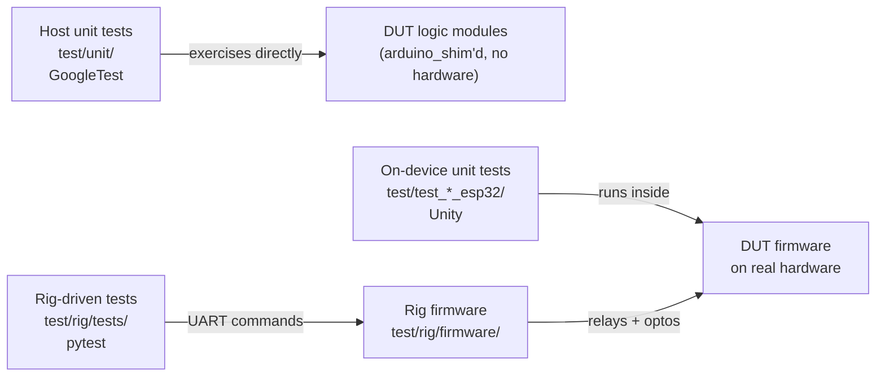
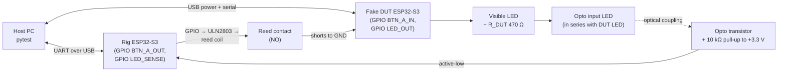
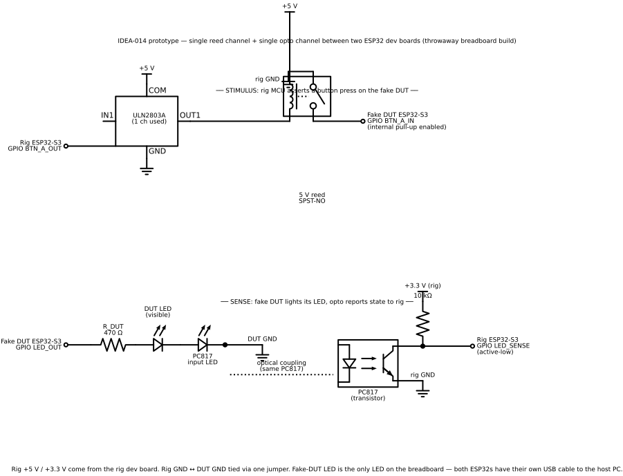

## Index

- [Motivation](#motivation)
- [Concept](#concept)
  - [Relay-Based Input Simulation](#relay-based-input-simulation)
    - [Relay key aspects](#relay-key-aspects)
    - [Relay benefit](#relay-benefit)
    - [Reset Control](#reset-control)
  - [Optocoupler-Based Output Detection](#optocoupler-based-output-detection)
    - [Opto key aspects](#opto-key-aspects)
    - [Opto benefit](#opto-benefit)
- [Combined Test Flow](#combined-test-flow)
- [Simplified Architecture](#simplified-architecture)
- [Implementation Plan](#implementation-plan)
  - [Circuit Description](#circuit-description)
    - [Power](#power)
    - [Stage 1 — MCU outputs drive ULN2803, ULN2803 sinks reed coils](#stage-1--mcu-outputs-drive-uln2803-uln2803-sinks-reed-coils)
    - [Stage 2 — Relay outputs to DUT inputs](#stage-2--relay-outputs-to-dut-inputs)
    - [Stage 3 — DUT LEDs to optocoupler inputs](#stage-3--dut-leds-to-optocoupler-inputs)
    - [Stage 4 — Optocoupler outputs to MCU inputs](#stage-4--optocoupler-outputs-to-mcu-inputs)
    - [DUT connector](#dut-connector)
    - [Schematics](#schematics)
    - [Bill of materials](#bill-of-materials)
  - [Test Suite Integration](#test-suite-integration)
  - [Example Test Case](#example-test-case)
  - [Test Runner Integration](#test-runner-integration)
  - [Timing Considerations](#timing-considerations)
  - [Activation rate safeguards](#activation-rate-safeguards)
- [Channel Allocation Summary](#channel-allocation-summary)
- [Project Structure](#project-structure)
  - [Why this lives in the same repo](#why-this-lives-in-the-same-repo)
  - [Repository layout](#repository-layout)
  - [Test layers — where each kind of test lives](#test-layers--where-each-kind-of-test-lives)
  - [Key design principles](#key-design-principles)
  - [Development Workflow](#development-workflow)
- [Risks, Limitations, and Test Design Rules](#risks-limitations-and-test-design-rules)
  - [Must verify before building hardware](#must-verify-before-building-hardware)
  - [Test design rules](#test-design-rules)
  - [Accepted limitations](#accepted-limitations-not-bugs--design-decisions)
  - [Practical bench considerations](#practical-bench-considerations)
  - [Design decision — discrete reeds, not an off-the-shelf relay module](#design-decision--discrete-reeds-not-an-off-the-shelf-relay-module)
- [Prototype — circuit validation breadboard](#prototype--circuit-validation-breadboard)
  - [Topology](#topology)
  - [Goal](#goal)
  - [Hardware](#hardware-single-channel-each)
  - [Wiring](#wiring)
  - [Firmware](#firmware-sketches)
  - [Fake unit tests](#fake-unit-tests)
  - [Success criteria](#success-criteria)
  - [Out of scope](#out-of-scope)

## Motivation

Host unit tests cover logic, but they cannot verify that the physical firmware behaves
correctly on real hardware. Today, on-device testing requires a human to press buttons
and visually confirm LED states. This idea eliminates that manual step entirely.

## Concept

The rig combines two coupled sub-circuits — relay-driven inputs to stimulate the
DUT, and optocoupler-tapped outputs to observe its LEDs. They are not
alternatives; both are required for a hands-free test loop, and they are
described separately below only because the design considerations differ on
each side.

### Relay-Based Input Simulation

A companion device that uses relays to simulate button presses *and* to pulse the DUT's
reset line, providing galvanic isolation between the test controller and the device
under test (DUT). This approach is more robust and repeatable than servo-based mechanical
pressing, and it lets the test runner force the DUT into a known state — which is
essential for BLE scenarios that depend on advertising restarts, bond-table clearing, or
recovery from a wedged firmware.

#### Relay key aspects

- **Hardware**: 4 reed relays (BTN_A, BTN_B, BTN_SWITCH + RESET channel) driven by a ULN2803 sink driver
- **Controller**: ESP32 test MCU (S3 preferred for native USB) that sends commands and reads responses
- **Isolation**: Reed contacts give a clean break between the test MCU and the DUT input lines (note: rig and DUT still share host-PC ground via USB — see "Accepted limitations")
- **Protocol**: UART-based command set for relay control, reset, and output state reading
- **Design**: Single-PCB carrier with the rig MCU on a dev-board socket and the DUT on a 30-pin NodeMCU-style socket

#### Relay benefit

- More reliable than mechanical servos (no alignment issues)
- Reed relays: ~10–20 mA coil (vs ~70 mA for SRD power relays), ~0.5–1 ms operate, near-silent, 10⁹ operations
- Clean contact break protects both test equipment and DUT input pins
- 4 relay channels cover the full input + reset surface — no oversize, no spares

#### Reset Control

Some firmware behaviour — especially BLE pairing, bond clearing, advertising restart,
and recovery from a hung state — can only be exercised by forcing the DUT into a known
state between tests. The rig allocates **one relay channel** for this, wired to the
DUT's `EN` / `RESET` pin: a short pulse (default 20 ms) pulls it to GND and triggers a
firmware restart without disturbing power rails or USB enumeration.

**Why not full power-cycle?** A hard power-cycle would mean cutting VBUS on the USB-C
cable that connects the DUT to the host PC for flashing and serial. High-current
USB-C cables (5 A / 100 W+) carry E-Marker chips that actively negotiate Power
Delivery on the CC lines; standard 3 A C-to-C cables typically don't, but the
trend is upward. Physically intercepting VBUS in a PD-negotiating cable is at
best fragile and may stop working as cables get smarter. Powering the DUT from a separate
supply just to enable power-cycling adds a second power path and complicates flashing.
Soft reset on `EN` sidesteps the entire problem and covers every BLE state-machine
case we actually need.

The `power` opto channel still earns its keep: it confirms the DUT's 3.3 V rail is
actually up, so the test can detect cable problems and brown-outs before asserting
on functional behaviour. It does **not** prove that firmware is running — the power
LED is typically wired straight to the rail and lights whenever the regulator is up,
even if the bootloader hung or main never reached `setup()`. Use the `ble` LED (or a
deliberate firmware heartbeat pattern on a dedicated channel) when a test needs
firmware-liveness evidence, not just rail-up.

### Optocoupler-Based Output Detection

Optocouplers wired in series with each DUT LED tap one channel per LED, letting
the test controller read output states directly without visual observation and
without loading the DUT's GPIO drive.

#### Opto key aspects

- **Hardware**: 3× quad-channel optocouplers (LTV-846, PS2501-4, or TLP281-4) — 12 channels, 9 used; one channel per DUT LED (4 BTN_A/BTN_B indicators, 3 BTN_SWITCH indicators, 1 BLE LED, 1 power LED)
- **Connection**: Optocoupler input LED **in series** with each visible LED, sharing the DUT's existing current-limit resistor — adds zero extra GPIO load and keeps brightness unchanged
- **Isolation**: Optical coupling decouples DUT signals from the rig MCU input pins (note: not a safety isolation barrier — rig and DUT share host-PC ground via USB)
- **Detection**: Optocoupler transistors pull the test MCU GPIOs low against a 10 kΩ pull-up to 3.3 V (active-low at the MCU, hidden by the Python driver)
- **Design**: Compact 3-package opto bank shares one PCB area; series topology means no per-channel resistor on the rig side

#### Opto benefit

- Direct electrical detection (no camera/lighting issues)
- Optical coupling shields the rig inputs from DUT spikes and ground transients
- Sub-millisecond opto response — bounded by the rig's 10 ms reporting cycle, not the device
- Works with both active-high and active-low LED circuits
- Simple to implement and calibrate

## Combined Test Flow



## Simplified Architecture



## Implementation Plan

### Circuit Description

The circuit splits into four stages: power distribution, MCU output → relay driver,
relay output → DUT inputs, and DUT LEDs → optocouplers → MCU input. Component values
below are for the committed 4-relay / 9-opto channel set.

#### Power

The rig draws all power from the test MCU's USB connection to the host PC, on two
rails:

- **3.3 V logic rail** from the ESP32-S3 dev board's onboard regulator. Powers the
  test MCU itself and the nine optocoupler transistor-side pull-ups.
- **5 V relay rail** taken from the dev board's VBUS / 5 V pin. Powers the four
  reed-relay coils via the ULN2803. A 100 µF electrolytic with a 100 nF ceramic in
  parallel sits at the ULN2803 supply pins for HF decoupling and to ride out the
  short overlap when multiple coils are switched in the same firmware tick.

Steady-state current budget (worst case, all four coils energised):
ESP32-S3 ~50 mA + 4× reed coils ~10–20 mA each (~80 mA total) + 4× activity
LEDs ~6 mA each (~24 mA total) + 9× opto pull-ups ~3 mA combined ≈
**~160 mA** from the dev-board VBUS pin. Comfortably inside the USB-2
500 mA budget, with headroom for the dev board's protection diode.

The DUT has its own USB connection to the host PC for power, flashing, and serial —
the rig does not power the DUT. Rig GND and DUT GND share the host-PC ground via
the two USB cables; a direct GND wire on the rig-to-DUT connector keeps signal
returns short.



#### Stage 1 — MCU outputs drive ULN2803, ULN2803 sinks reed coils

Four ESP32-S3 GPIO outputs connect directly to ULN2803 inputs 1–4 (no series
resistor needed — ULN2803 inputs accept 3.3 V drive comfortably; the chip's
internal 2.7 kΩ base resistor handles drive matching). Inputs 5–8 are tied to GND
so the unused channels are held off.

ULN2803 supply wiring:

- **GND (pin 9)** → rig GND
- **COM (pin 10)** → 5 V rail. This pin returns the chip's internal free-wheeling
  diodes that clamp coil-collapse spikes; tying it to the coil supply removes the
  need for external flyback diodes.

Each ULN2803 output (pins 18 / 17 / 16 / 15 for channels 1 / 2 / 3 / 4) sinks the
low side of one reed-relay coil; the coil's high side goes to 5 V. Driving a
GPIO high energises the corresponding reed; driving it low releases it.

ULN2803 Vce(sat) scales with sink current. Reed coils at 10–20 mA sit far
below the ~50 mA datasheet test point, so the actual saturation drop is
closer to ~0.7 V — leaving ~4.3 V across a reed coil specified for pull-in
at ≥3.75 V (75 % of 5 V), a comfortable margin even with the supply sagging
slightly under USB-cable IR drop. (Mechanical SRD-class 5 V relays at
~70 mA coil current would push Vce(sat) up to ~0.9–1.1 V and would be right
on the edge here; reed coils sidestep that entirely.)

A 3 mm activity LED with a 470 Ω series resistor sits across each ULN2803
output → 5 V so the operator can see at a glance which channels are asserted.
Each indicator draws ~6 mA through the same ULN sink as the coil it shadows
(4× ~6 mA = ~24 mA extra across all four channels) — negligible against the
500 mA package limit and the per-channel ~50 mA reed-coil headroom, but
worth counting toward the dev-board VBUS budget.

#### Stage 2 — Relay outputs to DUT inputs

Each of the four relays is a 5 V SPST-NO **reed relay** (e.g. Meder
SIL05-1A72-71L, Coto 9012-05-00, or Standex MS05-1A87-75D — DIP-style 5 V coil,
≤20 mA coil current, ≥1 A contact rating with sub-milliohm Ron, ~0.5 ms operate).

- **BTN_A / BTN_B / BTN_SWITCH** reeds: contact returns tied to rig GND, switched
  side routed to the corresponding DUT GPIO via the connector. When the reed
  closes, the DUT GPIO is shorted to GND, simulating a button press.
- **RESET** reed: contact returns tied to rig GND, switched side routed to the
  DUT's `EN` pin. A short close (~20 ms) pulls EN low and triggers a soft reset.

All four channels switch only logic-level signal currents (~1 mA), so a single
reed type covers every channel — no need for a higher-rated relay on RESET.

Reed contacts have negligible bounce (typically ≤0.2 ms) compared to the firmware's
20 ms debounce window, so the bounce never enters the test contract.

#### Stage 3 — DUT LEDs to optocoupler inputs

The nine opto channels are packaged as **3× quad-channel optocouplers**
(e.g. LTV-846, PS2501-4, TLP281-4 — 16-pin DIP, 4 isolated channels each;
12 channels total, 9 used; on the 3 unused channels the input-LED anode is
left floating and the cathode tied to GND, so the LED can never forward-bias).

Default topology: opto input LED **in series** with the visible DUT LED, sharing
the DUT's existing current-limit resistor. This adds zero extra GPIO load on the
DUT and keeps the visible LED's brightness unchanged.

- DUT GPIO → DUT's existing series resistor → DUT LED anode → DUT LED cathode →
  **opto input anode → opto input cathode** → DUT GND
- Net Vf budget at 3.3 V drive: Vf_DUT_LED + Vf_opto (~1.2 V) + ULN/driver drop;
  fits comfortably for red/green/yellow LEDs (Vf ~1.8–2.2 V) at the DUT's existing
  drive current (typically 5–15 mA, well within the PC817-class CTR knee).

**Fallback — parallel topology**: used when the series budget is too tight. Two
known cases:

1. **High-Vf visible LED** (blue/white, Vf ≈ 3.0 V) where 3.3 V − 3.0 − 1.2 = −0.9 V
   doesn't even close.
2. **Rail-fed LEDs (e.g. the `power` channel)**. A typical power-LED pattern is
   3.3 V → dropper R → red LED → GND, sized for ~5–8 mA. Inserting the opto in
   series eats another 1.2 V from a budget that started at only 3.3 − 1.9 = 1.4 V,
   collapsing the current through the existing dropper to ~1 mA — both the visible
   LED dims and the opto sits below its CTR knee. This is independent of LED
   package: a 3 mm red LED has the same Vf as a 5 mm one (~1.9 V), so going to
   3 mm doesn't recover the budget. The constraint is the 3.3 V supply, not the
   LED size. Use parallel topology for any LED whose anode is tied to a fixed
   rail rather than driven by a GPIO with headroom to spare.

In the parallel topology each branch has its own current-limit resistor and the
DUT GPIO (or rail) sources both currents — pick this **per channel** after
measurement, not as the default.

| | Default (series) | Fallback (parallel) |
|---|---|---|
| Wiring | DUT R → DUT LED → opto LED → DUT GND | DUT R → DUT LED ‖ R_opto → opto LED → DUT GND |
| Extra GPIO load | none | +If_opto |
| Extra parts on rig side | none | 1× R_opto (~470 Ω) per channel |
| When to use | GPIO-driven red/green/yellow LEDs with Vf ≤ ~2.2 V | blue/white LEDs, rail-fed power LEDs, anywhere the series Vf budget is < ~0.3 V |

The 470 Ω fallback value targets If ≈ 5 mA on the opto input ((3.3 − 1.2) / 470).
Anything above ~3 mA keeps the PC817-class CTR comfortably above its knee.

#### Stage 4 — Optocoupler outputs to MCU inputs

The transistor side of each channel:

- **Collector** → **10 kΩ** pull-up to 3.3 V, also wired directly to a test MCU
  GPIO input
- **Emitter** → rig GND

CTR sanity check: a 10 kΩ pull-up only needs ~0.33 mA of collector current to be
pulled to a clean logic-low. At If ≈ 5 mA on the opto input (default series
topology), even worst-case CTR = 50 % gives 2.5 mA capacity — almost an order
of magnitude of margin. At If as low as 1 mA (heavily attenuated DUT LED), the
pull-down still works.

When the DUT LED is on, the opto input LED is on, the transistor saturates, and
the collector goes to ~0.3 V. When the DUT LED is off, the pull-up holds the
collector at 3.3 V. The MCU therefore reads **active-low**: high = LED off,
low = LED on. The Python driver hides this inversion behind `get_led_states()`.

GPIO inputs that need to capture short pulses are routed to ESP32 pin-change
interrupts; the rest are polled at the rig's ~10 ms reporting cycle.

#### DUT connector

Two 1×15-pin 0.1″ (2.54 mm) female headers, **0.9″ (22.86 mm) row-to-row**, sized
for the wide-body 30-pin NodeMCU-ESP32 module as the default DUT. (The narrow
1.0″ variant exists; do not buy it for this rig.) Pin assignments are mirrored in
`test/rig/PROTOCOL.md` once the firmware lands, but the wiring is committed
here — see "Rig MCU pin map" below.

The same 14 signals are also brought out to a row of 2.54 mm screw terminals in
parallel with the corresponding socket pins, for adapter-PCB or jumper-wire
connections to alternative DUT form factors. Either path can be used; the rig
firmware does not distinguish them.

##### Rig MCU pin map (ESP32-S3-DevKitC-1)

All chosen GPIOs are non-strapping, non-USB (avoid 19 / 20), non-flash on the
N16R8 module. Strapping pins (0, 3, 45, 46) are deliberately avoided so the rig
boots reliably no matter what the DUT is doing on its lines.

| Signal | ESP32-S3 GPIO | Direction |
|---|---|---|
| `BTN_A` (→ ULN2803 IN1) | GPIO 4 | output |
| `BTN_B` (→ ULN2803 IN2) | GPIO 5 | output |
| `BTN_SWITCH` (→ ULN2803 IN3) | GPIO 6 | output |
| `RESET` (→ ULN2803 IN4) | GPIO 7 | output |
| `btn_a_1` (← opto OK1) | GPIO 15 | input |
| `btn_a_2` (← opto OK2) | GPIO 16 | input |
| `btn_b_1` (← opto OK3) | GPIO 17 | input |
| `btn_b_2` (← opto OK4) | GPIO 18 | input |
| `sw_1` (← opto OK5) | GPIO 38 | input |
| `sw_2` (← opto OK6) | GPIO 39 | input |
| `sw_3` (← opto OK7) | GPIO 40 | input |
| `ble` (← opto OK8) | GPIO 41 | input |
| `power` (← opto OK9) | GPIO 42 | input |

#### Schematics

Both representative sub-circuits below are drawn programmatically by
[`idea-014-schematic.py`](assets/idea-014-schematic.py) (schemdraw + matplotlib).
The same script also emits a KiCad-importable netlist (`.net`, legacy
OrCAD/PCBNEW S-expression) next to each `.svg`, so the diagrams and the
KiCad source-of-truth never drift. Import in eeschema/pcbnew via
*File → Import → Netlist*. Regenerate after editing the script:

```bash
python docs/developers/ideas/open/assets/idea-014-schematic.py
```

Outputs (each schematic produces both files):

| Schematic | Image | KiCad netlist |
|---|---|---|
| Relay channel (1 of 4) | `assets/idea-014-relay-channel.svg` | `assets/idea-014-relay-channel.net` |
| Opto channel (1 of 9) | `assets/idea-014-opto-channel.svg` | `assets/idea-014-opto-channel.net` |
| Full system | `assets/idea-014-system.svg` | `assets/idea-014-system.net` |
| Breadboard prototype | `assets/idea-014-prototype.svg` | `assets/idea-014-prototype.net` |

**Relay channel** (1 of 4 — `btn_a` shown. `btn_b` and `btn_switch` wire
identically. `reset` wires identically too, except its switched side routes to
the DUT `EN` pin instead of a button line):



**Opto channel** (1 of 9 — default topology: opto input LED in series with the
DUT LED, sharing the DUT's existing current-limit resistor; falls back to
parallel if a high-Vf visible LED needs it):



**System schematic** (all 4 relay + all 9 opto channels, ESP32-S3, ULN2803, DUT
socket) — uses **labelled nets** (KiCad-style): pins terminating in `[NET_NAME]`
are electrically the same node as every other `[NET_NAME]` stub on the page. This
keeps the diagram tractable and maps 1-to-1 onto KiCad's net-label workflow when
you redraw it in eeschema:



#### Bill of materials

Concrete RS Online (AT) part picks below. Stock numbers verified 2026-04-26;
double-check availability at order time. Where the AT catalogue does not list
a specific part the row falls back to a generic suggestion plus a note.

| Qty | Part | Purpose | RS Online (AT) |
|---|---|---|---|
| 1 | ESP32-S3-DevKitC-1 (N16R8) | test MCU, native USB | Not stocked at at.rs-online.com (2026-04-26). Order direct from Espressif/Mouser/Reichelt, or use Adafruit's repackaged variant via international RS ([5364](https://ex-en.rs-online.com/adafruit-industries-5364-esp32-s3-devkitc-1-esp32-s3-wroom-2) / [5312](https://ex-en.rs-online.com/adafruit-industries-5312-esp32-s3-devkitc-1-n8-esp32-s3-wroom-1-dev-board-8mb-flash)) |
| 1 | ULN2803A (DIP-18) | 8-channel Darlington sink (4 channels used) | STMicroelectronics ULN2803A, PDIP-18 — RS [168-6833](https://at.rs-online.com/web/p/darlington-transistoren/1686833) |
| 4 | 5 V SPST-NO reed relay (e.g. Meder SIL05-1A72-71L, Coto 9012-05-00, Standex MS05-1A87-75D) | one per stimulus channel; ≤20 mA coil, ≥1 A contact | Meder SIL05-1A72-71D, 5 V, 1 A — RS [349-2884](https://at.rs-online.com/web/p/reedrelais/3492884) |
| 3 | Quad optocoupler, 16-pin DIP (e.g. LTV-846, PS2501-4, TLP281-4) | 12 channels total, 9 used; one channel per DUT LED tap | Lite-On LTV-846, DIP-16 — RS [691-2221](https://at.rs-online.com/web/p/optokoppler/6912221) |
| 9 | 10 kΩ resistor, ¼ W | opto transistor-side pull-ups | RS PRO carbon-film 10 kΩ ±5 % 0.25 W — RS [707-7745](https://at.rs-online.com/web/p/durchsteckwiderstande/7077745) |
| 9 | 470 Ω resistor, ¼ W (parallel-fallback channels only) | opto LED current limit; order all 9 up-front, populate only the channels that actually need the parallel fallback (high-Vf LEDs) — leftover resistors cost pennies and avoid a second order | RS PRO carbon-film 470 Ω ±5 % 0.25 W — RS [739-7430](https://at.rs-online.com/web/p/durchsteckwiderstande/7397430) |
| 1 | 100 µF / ≥10 V electrolytic | bulk decoupling on 5 V rail | Panasonic FR-A 100 µF / 16 V radial — RS [739-6799](https://at.rs-online.com/web/p/aluminium-elektrolytkondensatoren/7396799) |
| 1 | 100 nF ceramic | HF decoupling at ULN2803 | RS PRO 100 nF / 50 V X7R THT — RS [180-5103](https://at.rs-online.com/web/p/einschichtige-keramikkondensatoren/1805103) |
| 4 | 3 mm LED | per-channel relay-active indicator | Ledtech L07R3000G3, 3 mm red — RS [228-4913](https://at.rs-online.com/web/p/leds/2284913) |
| 4 | 470 Ω resistor, ¼ W | series resistor for the activity indicator LEDs | (same as above) — RS [739-7430](https://at.rs-online.com/web/p/durchsteckwiderstande/7397430) |
| 2 | 1×15 0.1″ female header, 0.9″ row spacing | DUT socket (wide NodeMCU-ESP32) | No 1×15 turned-pin SIL listed on at.rs-online.com directly (2026-04-26). Build from generic 2.54 mm female headers cut to length, or use two Preci-Dip 110-87-115-41-001101 SIL sockets via international RS. |
| 14 | 2.54 mm screw-terminal positions | jumper-wire fallback for non-default DUTs | RS PRO 2-pole 2.54 mm PCB screw terminal (gang as needed) — RS [790-1098](https://at.rs-online.com/web/p/leiterplatten-printklemmen/7901098) |
| 1 | perfboard or single-layer PCB | carrier | RS PRO 160 × 100 mm matrix board, 2.54 mm pitch — RS [100-4340](https://at.rs-online.com/web/p/matrix-platinen/1004340) |

### Test Suite Integration

**Python Test API:**

```python
class HardwareTestRig:
    def __init__(self, port='/dev/ttyUSB0'):
        self.serial = Serial(port, 115200)
    
    # Firmware debounce window the DUT applies to button inputs (ms).
    # Kept here so the helper sleep matches what the DUT firmware actually
    # filters before the press is observable on a LED output.
    DUT_DEBOUNCE_MS = 20

    def press_button(self, button_name, duration_ms=50):
        """Press and hold button for specified duration.

        Sleeps long enough for the reed to operate, the press window to
        elapse, and the DUT's 20 ms firmware debounce to settle, so a
        following ``get_led_states()`` reads a post-debounce value rather
        than racing the filter.

        Note: this helper does **not** enforce the L1 per-channel cooldown on the
        host side. Tests that stack short presses on the same channel must add
        their own spacing or be prepared to catch ``RelayCooldownError`` when
        the firmware rejects the second activation.
        """
        self._send_command(f'PRESS {button_name} {duration_ms}')
        # reed operate (~1 ms) + press window + firmware debounce + margin
        time.sleep((duration_ms + 5 + self.DUT_DEBOUNCE_MS) / 1000)
    
    def release_all(self):
        """Release all buttons"""
        self._send_command('RELEASE_ALL')
        time.sleep(0.005)  # reed release (~0.5 ms) + generous margin

    def reset(self, pulse_ms=20):
        """Pulse the DUT EN / RESET pin low for a soft restart.

        ESP32 finishes booting ~50–150 ms after the pulse. Verify boot
        completion via the power LED opto rather than relying on sleep alone.
        """
        self._send_command(f'RESET {pulse_ms}')
        time.sleep((pulse_ms + 300) / 1000)  # Relay + ESP32 boot (worst-case ~150 ms) + margin

    def get_led_states(self):
        """Return dict of LED states keyed by name.

        Keys: btn_a_1, btn_a_2, btn_b_1, btn_b_2, sw_1, sw_2, sw_3, ble, power.
        """
        self._send_command('READ_LEDS')
        response = self._read_response()
        return self._parse_led_response(response)
    
    def assert_led_states(self, expected_states, timeout_ms=100):
        """Wait for expected LED states or timeout.

        ``expected_states`` must be a **complete** 9-key dict — comparison is
        full-dict equality, not subset match. Use the ``{**ALL_LEDS_OFF, ...}``
        spread pattern in the example test below to build a complete expected
        state from a baseline plus the keys that differ.

        The 10 ms inter-poll sleep below is deliberately matched to the rig's
        ~10 ms reporting cycle: polling faster wastes UART bandwidth on
        guaranteed-stale reads, polling slower lets transitions slip through
        the gap. Combined with the "≥20 ms minimum observable state-change"
        rule (see test design rules), two consecutive polls always span at
        least one fresh rig sample, so any state that holds for ≥20 ms is
        guaranteed to be observed.
        """
        current = None
        start = time.time()
        while time.time() - start < timeout_ms/1000:
            current = self.get_led_states()
            if current == expected_states:
                return True
            time.sleep(0.01)
        raise AssertionError(f"LED states mismatch. Expected: {expected_states}, Got: {current}")
```

**Protocol naming conventions:**

Channel names appear in two places — relay (stimulus) commands and opto (sense)
commands. Earlier drafts mixed casing (`PRESS A` but `READ_LED btn_a_1`), which is
easy to typo. The wire protocol normalises **both namespaces to lowercase
snake_case** with a stable prefix that tells you which side a name addresses:

| Namespace | Prefix | Members | Used by |
|---|---|---|---|
| Relays (rig → DUT) | `btn_` / `reset` | `btn_a`, `btn_b`, `btn_switch`, `reset` | `PRESS`, also implicit in `RESET` |
| Optos (DUT → rig) | `btn_*_N` / `sw_N` / `ble` / `power` | `btn_a_1`, `btn_a_2`, `btn_b_1`, `btn_b_2`, `sw_1`, `sw_2`, `sw_3`, `ble`, `power` | `READ_LED`, `READ_LEDS` |

Rules:

- Lowercase only. The firmware parser is case-sensitive — `PRESS BTN_A` is rejected.
- Underscores separate words. No hyphens, no spaces.
- A single relay name (`reset`) is a special case because the channel has no group;
  it stays a bare word rather than `reset_1`.
- The two namespaces never collide (every relay name is shorter or differently
  prefixed than every opto name), so a single `READ_LED <name>` cannot accidentally
  address a relay and vice versa.
- The canonical order in `READ_LEDS` responses follows the opto namespace table
  top-to-bottom: `btn_a_1 btn_a_2 btn_b_1 btn_b_2 sw_1 sw_2 sw_3 ble power`.

`test/rig/PROTOCOL.md` is the source of truth and must be updated in the same PR
as any name change on either side.

**Test Protocol (UART):**

- 115200 baud, 8N1
- Command format: `[cmd][space][args]\n`
- Commands:
  - `PRESS <name> <ms>` - Press named relay for `ms` ms (names: `btn_a`, `btn_b`, `btn_switch`)
  - `RELEASE_ALL` - Release all relays (including `reset` if held)
  - `RESET <ms>` - Pulse the EN/RESET line low for `ms` ms (default 20 ms). Equivalent to `PRESS reset <ms>` but spelled out for readability.
  - `READ_LEDS` - Read all 9 LED states (binary string, fixed order)
  - `READ_LED <name>` - Read a specific LED by name (e.g. `READ_LED ble`)
  - `DELAY <ms>` - Delay `ms` ms on the rig
  - `SET_LIMITS L1=<ms> L2=<n>/<ms> L3=<n>/<ms>` - Override the activation rate safeguards (see "Activation rate safeguards" below). Use sparingly. Limits also reset to defaults on every UART (re-)open — see "Well-defined initial state" below.
  - `RESET_LIMITS` - Restore L1/L2/L3 to their compiled-in defaults. Pytest fixtures should call this in teardown after any `SET_LIMITS`.

**Response Format:**

- `LEDS:101010101\n` - 9-bit binary string in fixed order: `btn_a_1 btn_a_2 btn_b_1 btn_b_2 sw_1 sw_2 sw_3 ble power` (1 = on, 0 = off). Order is canonical and documented in `test/rig/PROTOCOL.md`.
- `LED:ble:1\n` - Specific LED state by name
- `OK\n` - Command acknowledged
- `ERROR:<message>\n` - Error response (structured forms documented in "Activation rate safeguards"; the host driver maps `ERROR:COOLDOWN` and `ERROR:BURST` to `RelayCooldownError` / `RelayBurstError`)

**Well-defined initial state:**

The rig firmware guarantees a single, deterministic starting state every time the
UART connection is opened (whether on first boot, after a crash, after a host-side
fixture teardown, or after the host disconnects and reconnects mid-run). This
matters because a half-finished previous run may have left a relay closed or the
safeguard limits loosened — both would silently corrupt the next test.

On every UART (re-)open the firmware atomically:

1. **Opens every relay**, including `reset`. No coil stays energised across a
   reconnect. Equivalent to running `RELEASE_ALL` implicitly.
2. **Restores L1/L2/L3 to compiled-in defaults**, as if `RESET_LIMITS` had been
   called. A crashed test cannot leak loosened safeguards into the next run.
3. **Clears the sliding-window activation history** used by L2/L3, so the first
   activation after reconnect is never spuriously rejected because of pre-crash
   activity.
4. **Emits a `READY firmware=<ver> defaults=L1=20 L2=2/10 L3=4/50\n` banner** so
   the host driver can sanity-check the firmware version and the active limits
   before issuing any commands.

The rig firmware also runs a host-presence watchdog: if no command arrives for
**5 s** while any relay is closed, the firmware opens all relays and emits
`WARN:WATCHDOG_RELEASE\n`. This bounds the worst-case "host process killed
mid-press" damage to 5 s of coil-on time.

The host driver constructor performs the reconnect explicitly (closes the port,
reopens it, waits for `READY`) before the fixture yields, so every test sees the
same starting state regardless of what ran before it.

### Example Test Case

```python
ALL_LEDS_OFF = {
    'btn_a_1': False, 'btn_a_2': False,
    'btn_b_1': False, 'btn_b_2': False,
    'sw_1': False, 'sw_2': False, 'sw_3': False,
    'ble': False, 'power': False,
}

def test_button_a_toggles_btn_a_1(hardware_rig):
    rig = hardware_rig

    # Soft-reset the DUT into a known state, then verify it booted back up
    rig.reset()
    rig.assert_led_states({**ALL_LEDS_OFF, 'power': True})

    # Press button A — its first indicator should latch on
    rig.press_button('btn_a', duration_ms=50)
    rig.assert_led_states({**ALL_LEDS_OFF, 'power': True, 'btn_a_1': True}, timeout_ms=200)

    # Press button A again — its first indicator should latch off
    rig.press_button('btn_a', duration_ms=50)
    rig.assert_led_states({**ALL_LEDS_OFF, 'power': True}, timeout_ms=200)
```

### Test Runner Integration

**PyTest Fixture:**

```python
@pytest.fixture(scope="module")
def hardware_rig():
    rig = HardwareTestRig()
    yield rig
    rig.release_all()
    rig.serial.close()
```

**CI/CD Integration:**

```yaml
# .github/workflows/rig-tests.yml — needs a self-hosted runner that physically owns the rig
jobs:
  rig-test:
    runs-on: [self-hosted, hardware-rig]
    steps:
      - uses: actions/checkout@v4
      - name: Set up Python
        uses: actions/setup-python@v4
        with:
          python-version: '3.10'
      - name: Install dependencies
        run: pip install pytest pyserial
      - name: Run rig-driven tests
        run: pytest test/rig/tests/ --tb=short
        env:
          HARDWARE_RIG_PORT: /dev/ttyUSB0
```

### Timing Considerations

**Minimum Delays:**

- Reed-relay activation: ~0.5–1 ms
- Reed-relay deactivation: ~0.5 ms
- Optocoupler response: <1 ms
- Firmware debounce: 20 ms (configurable)
- LED update: <5 ms
- DUT soft-reset boot: ~50–150 ms after RESET pulse (ESP32)

**Recommended Test Delays:**

- Button press: duration + 5 ms (reed) + 20 ms (firmware debounce)
- State assertion: 50–200 ms timeout
- Sequence steps: 10 ms between actions

### Activation rate safeguards

The rig is exercising a **foot pedal**. Real users press buttons at most a few
times per second; any test that needs faster relay activation than that is
either probing a scenario that cannot occur in the field, or — more likely —
runaway test code. The rig firmware therefore enforces three hard rate limits
on relay activations and refuses to energise the coil if any are violated.

Reasons to enforce this:

- Reed contacts are rated for ~10⁹ ops, but mechanical fatigue still scales
  with activation rate; pointless bursts shorten the rig's useful life.
- Rapid stimulus can brown-out the DUT (especially during BLE radio bursts)
  and produce flaky test results that look like firmware bugs.
- A `while True: rig.press_button('btn_a')` mistake in test code should fail
  *immediately* with a clear exception, not slowly cook the rig overnight.

#### Limits

| ID | Rule | Default |
|---|---|---|
| L1 | Min interval between two activations of the **same** relay | 20 ms |
| L2 | Max activations across **all** relays in any sliding 10 ms window | 2 |
| L3 | Max activations across **all** relays in any sliding 50 ms window | 4 |

"Activation" means the rising edge of a relay close. Releases are not
rate-limited. RESET is treated as just another channel — bursting resets is
also a sign of buggy test code. In practice this is invisible to test
authors: the `rig.reset()` helper sleeps 300 ms after the pulse to let the
DUT boot, and that sleep clears both sliding windows, so a `reset()`
immediately followed by `press_button(...)` never trips L2/L3.

Back-to-back `press_button` calls on different channels are also fine: each
`press_button` issues a UART command (~1 ms wire time at 115200 baud for a
~10 byte command), waits for the firmware to schedule the close, then sleeps
through the press window plus debounce (~70+ ms total for the default
50 ms press). That post-press sleep alone exceeds the 50 ms L3 window, so
two consecutive `press_button(...)` calls cannot land inside the same L2/L3
window in normal use. The tightest legal sequence test code can issue is
therefore ~70 ms apart, well under the L2 (2 in 10 ms) and L3 (4 in 50 ms)
budgets.

The defaults are deliberately *loose enough to pass any realistic foot-pedal
scenario* and *tight enough to catch runaway test code within milliseconds*.
They are configurable via the `SET_LIMITS` wire command, but a test that
needs to override them must say why in a comment — by definition it is no
longer testing a real-world scenario.

#### Where the check lives

The firmware is the only layer that can *prevent* a coil from being pulled.
A host-side check would still race: by the time the host has decided
"this would violate L2", the previous `PRESS` may already be in flight over
UART. Firmware-side rejection is atomic with the activation decision and is
the only place that can guarantee the safeguard.

If the next requested activation would violate any of L1–L3, the firmware
**rejects the command immediately** (does not energise the coil) and returns
a structured error over UART:

- `ERROR:COOLDOWN ch=btn_a since=4 min=10` — L1 violated
- `ERROR:BURST window=10 max=2 observed=3` — L2 violated
- `ERROR:BURST window=50 max=4 observed=5` — L3 violated

#### Python exception types

The host driver translates the wire errors into typed exceptions so test
code can either catch them deliberately (rare — only when explicitly
probing the safeguards themselves) or let them surface as test failures
with an unambiguous message:

```python
class RigSafeguardError(Exception):
    """Base class for rig-side rate-limit violations."""

class RelayCooldownError(RigSafeguardError):
    """A relay was activated again before its per-channel cooldown elapsed.

    Attributes:
        channel:           name of the offending relay (e.g. 'btn_a')
        since_last_ms:     elapsed time since the previous activation
        min_required_ms:   the L1 cooldown threshold in force
    """

class RelayBurstError(RigSafeguardError):
    """Sliding-window activation budget exceeded across all relays.

    Attributes:
        window_ms:         which sliding window (10 or 50) was exceeded
        max_allowed:       the L2/L3 budget for that window
        observed:          how many activations the firmware counted
    """
```

Both exceptions inherit from `RigSafeguardError` so a test can `except
RigSafeguardError` once at the fixture level and fail cleanly with a clear
diagnostic in the report — no need to scrape `ERROR:` strings out of UART
logs.

## Channel Allocation Summary

This table is the **canonical** list of rig channels. The Stage 2 / Stage 4
descriptions above explain wiring per stage and reference the channel names
defined here; if a name appears in both places, this section is the source
of truth.

The rig is built once, with this fixed channel set — no spares, no oversize, no
iterative growth path. This is what the rig must be able to do; nothing more, nothing
less:

| Channel | Direction | Wired to | Purpose |
|---|---|---|---|
| Relay 1 — `BTN_A` | output (rig → DUT) | DUT button A line | press button A |
| Relay 2 — `BTN_B` | output (rig → DUT) | DUT button B line | press button B |
| Relay 3 — `BTN_SWITCH` | output (rig → DUT) | DUT switch button line | press switch button |
| Relay 4 — `RESET` | output (rig → DUT) | DUT `EN` / RESET pin | force clean DUT state via soft reset |
| Opto 1 — `btn_a_1` | input (DUT → rig) | DUT button-A LED 1 | observe button-A indicator |
| Opto 2 — `btn_a_2` | input (DUT → rig) | DUT button-A LED 2 | observe button-A indicator |
| Opto 3 — `btn_b_1` | input (DUT → rig) | DUT button-B LED 1 | observe button-B indicator |
| Opto 4 — `btn_b_2` | input (DUT → rig) | DUT button-B LED 2 | observe button-B indicator |
| Opto 5 — `sw_1` | input (DUT → rig) | DUT switch LED 1 | observe switch state |
| Opto 6 — `sw_2` | input (DUT → rig) | DUT switch LED 2 | observe switch state |
| Opto 7 — `sw_3` | input (DUT → rig) | DUT switch LED 3 | observe switch state |
| Opto 8 — `ble` | input (DUT → rig) | DUT BLE status LED | verify connection / advertising state |
| Opto 9 — `power` | input (DUT → rig) | DUT power LED | verify the DUT is actually powered |

**Notes on the allocation:**

- A 4th button (if needed by a test) reuses one of `BTN_A` / `BTN_B` / `BTN_SWITCH` by
  re-wiring on the rig side; no dedicated channel is allocated for it.
- The `power` channel confirms the DUT's 3.3 V rail is up — useful for detecting
  cable issues and brown-outs before asserting on functional behaviour. It proves
  rail-up, not firmware-up; for firmware liveness see `ble` or a heartbeat pattern.
- Total parts: 4 reed relays (one ULN2803 driver), 3 quad-channel optocouplers
  (9 of 12 channels used), one ESP32-S3 dev board. Buy what you'll use.

## Project Structure

### Why this lives in the same repo

The rig is purpose-built for this project — there is no general-purpose value in
splitting it out. More importantly, **on-device tests must be designed with full
knowledge of the rig**: which DUT pins are reserved for the rig connection, which
firmware test-mode hooks the rig assumes exist, what timing the rig guarantees on RESET
pulses, what the wire protocol's exact command set is. Separating the rig into another
repo would force every cross-cutting change through two PRs and make divergence easy.
In-repo means the wire protocol, the rig firmware, the host driver, and the on-device
tests that depend on them evolve in lockstep.

### Repository layout

The rig lives under `test/rig/`, alongside existing host and on-device tests:

```
test/
├── unit/                       # existing host tests (GoogleTest)
├── test_*_esp32/               # existing on-device unit tests (Unity)
├── test_*_nrf52840/            # existing on-device unit tests (Unity)
├── fakes/                      # existing arduino_shim and friends
└── rig/                        # NEW: hardware test rig
    ├── firmware/               # rig controller firmware (ESP32, PlatformIO)
    │   ├── src/
    │   │   ├── main.cpp
    │   │   ├── protocol.cpp    # UART command parser
    │   │   ├── relay_control.cpp
    │   │   └── led_monitor.cpp
    │   ├── include/
    │   │   └── config.h        # pin map, timing constants
    │   └── platformio.ini      # nested PIO project, independent of DUT firmware
    ├── host/                   # Python driver (no separate package)
    │   ├── __init__.py
    │   ├── rig.py              # HardwareTestRig class
    │   └── protocol.py         # command/response constants, kept in sync with firmware
    ├── tests/                  # rig-driven integration tests (pytest)
    │   ├── conftest.py         # adds host/ to sys.path, defines hardware_rig fixture
    │   ├── test_button_functions.py
    │   ├── test_led_patterns.py
    │   └── test_ble_pairing.py
    ├── hardware/               # schematics + BOM (kept lightweight)
    │   ├── schematic.pdf
    │   └── bom.csv
    ├── PROTOCOL.md             # single source of truth for the UART wire format
    └── README.md               # wiring photo, build & flash, run tests
```

**Notes on the layout:**

- `firmware/platformio.ini` is **a separate PlatformIO project** from the repo's
  top-level [platformio.ini](platformio.ini). The rig firmware shares nothing with the
  DUT build (different libs, different env, different artifacts). Build and flash with
  `pio run -d test/rig/firmware -t upload`.
- `host/` is **not** packaged with `setup.py`. It is imported as a plain module from
  `test/rig/tests/` via `conftest.py` adjusting `sys.path`. The rig is internal tooling;
  pip-installability would add maintenance with no caller to benefit.
- `PROTOCOL.md` is the **single source of truth** for the UART wire format.
  `firmware/src/protocol.cpp` and `host/protocol.py` both reference it — keep them in
  sync manually (the protocol is small enough that codegen is overkill).
- On-device unit tests under `test/test_*_esp32/` may not import anything from
  `test/rig/`, but they must be **designed with the rig in mind**: reserve DUT pins for
  the rig connection, expose any test-mode hooks the rig needs, and document timing
  assumptions in the test file.

### Test layers — where each kind of test lives

| Layer | Where | Runs on | Driven by |
|---|---|---|---|
| Host unit tests | `test/unit/` | Host PC | `make test-host` (GoogleTest) |
| On-device unit tests | `test/test_*_esp32/`, `test/test_*_nrf52840/` | DUT itself | `make test-esp32-*` (Unity) |
| Rig-driven integration tests | `test/rig/tests/` | Host PC, exercises real DUT through the rig | `pytest test/rig/tests/` |

The three layers reach different targets:



### Key design principles

**1. Co-evolution with the project:**

- DUT firmware and rig firmware change together via single-PR edits.
- Wire protocol is documented once in `test/rig/PROTOCOL.md` and referenced by both
  sides.
- Cross-cutting changes (e.g. moving a DUT pin reserved for RESET) touch both
  firmwares in the same commit.

**2. Separation of concerns within the rig:**

- Hardware design separate from firmware.
- Host driver separate from test cases.
- Protocol parser separate from rig logic.

**3. Testability of the rig itself:**

- Rig firmware can be built and unit-tested without hardware via PlatformIO `native`.
- Host driver can run against a fake serial port for development without the rig.
- Rig-driven integration tests skip cleanly when the rig is not connected
  (pytest marker + `HARDWARE_RIG_PORT` env var).

### Development Workflow

**1. Hardware Development:**

```bash
# Design schematic and PCB
kiCad hardware/schematic/relay-board.kicad_sch
kiCad hardware/pcb/relay-board.kicad_pcb

# Generate manufacturing files
kiCad hardware/pcb/relay-board.kicad_pcb --plot
```

**2. Rig firmware development:**

```bash
# Build and flash rig firmware (independent of DUT firmware build)
pio run -d test/rig/firmware -t upload --upload-port /dev/ttyUSB0

# Optional: native unit tests for protocol parser etc.
pio test -d test/rig/firmware -e native
```

**3. Host driver development:**

```bash
# Driver-level tests against a fake serial port (no hardware required)
pytest test/rig/host/tests/
```

**4. Rig-driven integration tests:**

```bash
# Run all rig tests (DUT + rig must be connected)
pytest test/rig/tests/ -v

# Run a single test
pytest test/rig/tests/test_button_functions.py -v
```

**5. CI/CD pipeline (optional — needs a self-hosted runner that physically owns the rig):**

```yaml
# .github/workflows/rig-tests.yml — runs on a self-hosted runner that owns the rig
name: Rig-driven tests
on: [push, pull_request]

jobs:
  rig-test:
    runs-on: [self-hosted, hardware-rig]
    steps:
      - uses: actions/checkout@v4
      - name: Set up Python
        uses: actions/setup-python@v4
        with:
          python-version: '3.10'
      - name: Install dependencies
        run: pip install pytest pyserial
      - name: Run rig-driven tests
        run: pytest test/rig/tests/ --tb=short
        env:
          HARDWARE_RIG_PORT: ${{ secrets.HARDWARE_RIG_PORT }}
```

## Risks, Limitations, and Test Design Rules

Items below are split by what they actually are: the one thing that could invalidate
the build if not verified up-front, rules test authors must follow to get reliable
results, limitations we accept as part of the design (not bugs to mitigate), and
practical bench considerations.

### Must verify before building hardware

- **Per-channel Vf budget for the series-default opto topology**: confirm
  `V_supply ≥ Vf_DUT_LED + Vf_opto (~1.2 V) + driver drop` for each channel at
  the DUT's existing drive current. For 3.3 V drive with red/green/yellow LEDs
  (Vf ~1.8–2.2 V) the budget is comfortable. For blue/white LEDs (Vf ≈ 3.0 V)
  switch that channel to the parallel-fallback topology with R_opto ≈ 470 Ω.
  Measure once on the DUT before populating the opto bank.
- **`power` channel almost certainly needs the parallel fallback**. Power LEDs
  are usually wired rail → R → LED → GND, leaving no Vf headroom for an opto in
  series. Plan to populate that one channel with R_opto from the start; confirm
  by measurement before soldering the rest.

### Test design rules

- **Minimum observable state-change duration ≥ 2× rig reporting cycle**. The rig
  controller polls and reports its observed LED states at a fixed cycle (target
  ~10 ms). Any DUT signal that test code wants to assert on must hold its state for
  at least twice that — so ≥ 20 ms minimum. This happens to align with the firmware's
  20 ms button debounce window, so for the kinds of state changes a user-facing
  feature would ever produce, the rule is automatically satisfied. Tests that try to
  observe transient pulses shorter than this will see flaky reads — don't write them,
  or reduce them to "did we ever see the transition" rather than "what was the exact
  pulse width".

### Accepted limitations (not bugs — design decisions)

- **PWM-dimmed LEDs are out of scope**. If a DUT LED uses PWM for brightness, the
  optocoupler output toggles at the PWM frequency rather than the logical on/off
  state. The rig reads logical-state LEDs only. None of the 9 channels in the
  committed allocation are PWM-driven, but if any LED is later switched to PWM, the
  rig will not assert on it correctly — that LED becomes "human-visible only".
  Document new PWM LEDs as out of scope when they're added.
- **Galvanic isolation is not end-to-end**. Reed contacts decouple the test-MCU
  side from the DUT-input side, and the optos decouple the DUT-output side from
  the test-MCU side, but the test MCU and the DUT share host-PC ground via the
  two USB cables. The optical/contact break is useful for transient and ESD
  hygiene, but it is **not a safety isolation barrier** — don't lean on the
  "kV-class isolation" headline figures from datasheets in this topology. Accepted
  as-is.
- **Reed contact bounce (≤0.2 ms typical)**. Reed contacts bounce far less than
  mechanical SRD-class relays, but bounce is not zero. The firmware's 20 ms
  debounce window absorbs it entirely for the functional tests we actually write.
  We do not write debounce-timing tests through the rig — that would belong in
  host unit tests against shimmed logic, not in rig-driven integration tests, so
  the bounce never enters the test contract.

### Practical bench considerations

- **Bulk decoupling on the 5 V relay rail**. Inductive loads ramp current over
  L/R rather than producing true inrush, but switching multiple coils in the
  same firmware tick can briefly sag VBUS through a thin USB cable. A 100 µF
  electrolytic near the ULN2803 (with a 100 nF ceramic in parallel for HF
  decoupling) is plenty — reed coils draw ~10–20 mA each, so the 4-coil steady
  draw is ~40–80 mA, well inside the dev-board VBUS pin's headroom.
- **Scope creep**. The 4-relay / 9-opto set is the *committed* spec. New channels
  are cheap to imagine but each adds wiring, a line in `PROTOCOL.md`, and one more
  thing that can fail to read. Add deliberately, only when an actual test needs it.

### Design decision — discrete reeds, not an off-the-shelf relay module

We considered using a pre-built 4-channel relay module (e.g. the common
SRD-05VDC-SL-C boards sold for Arduino) to replace the ULN2803 + reed wiring in
Stages 1–2. The decision is to **stay with the discrete reed design**, but the
reasoning is narrower than it might first appear — most of the textbook
objections to mechanical SRD relays do not actually apply here:

- **Cycle life is a non-issue.** SRD relays are rated for ~10⁵ electrical
  operations vs ~10⁹ for reeds. For this project's expected activation volume
  (a foot-pedal CI rig, not a 24/7 ATE machine), 10⁵ is plenty — relay wear-out
  is not on the failure-mode list.
- **Acoustic click is a non-issue.** SRDs click audibly on every activation;
  this rig sits next to a CI runner, not on a desk during a recording session.
  Nobody cares.
- **Power budget is a non-issue at realistic duty cycles.** The "4× 70 mA =
  285 mA continuous" worst case assumes all four coils held closed
  simultaneously for seconds at a time. Real tests don't do that: the longest
  hold needed is the BLE-pairing long-press (~1 s on one channel), pedal
  long-press behaviour is proven within ~1 s, and overlapping holds across
  channels is rare and brief. Average draw with one SRD coil held is ~70 mA on
  top of ~50 mA MCU + ~3 mA opto rail — comfortably inside USB-2's 500 mA
  budget. A small bulk cap (the 1000 µF mentioned in conversation, or the
  100 µF / 100 nF already in the BoM) covers the millisecond-scale switching
  transient when a second channel briefly overlaps.

So why keep the discrete reed design? Two practical reasons, neither
performance-related:

- **No off-the-shelf reed-relay module exists at a hobby price point** (web
  search, April 2026). Reed relays are sold as bare components (SIP-1A05,
  Meder SIL05, Coto 9012); PCB-level reed products are industrial ATE cards
  (Pickering PXI etc.) at four-figure prices. The choice is therefore
  "discrete reeds on perfboard" vs "SRD module with the headline numbers
  re-evaluated above" — not "reed module vs SRD module".
- **The discrete design is already specified, schematic-drawn, and BoM'd.**
  Switching to an SRD module would mean re-doing the Stage 1–2 description,
  the activity-LED placement, the per-channel pin map, and the power-rail
  analysis for a build-time saving of ~1.5 h. Not worth the doc churn.

If a builder later prefers an SRD module (reasonable trade-off given the
above), the substitution is mechanically clean: drive the module's active-low
inputs from the same four ESP32-S3 GPIOs, drop the ULN2803 + indicator-LED
section, and add bulk decoupling on the module's VCC. The rest of the rig
(opto bank, host driver, protocol, safeguards) is unchanged.

## Prototype — circuit validation breadboard

Before laying out the full 4-relay / 9-opto rig, build a **minimal breadboard
proof** to validate the two circuit concepts and the rig↔DUT software loop in
isolation. Scope is strictly limited: **one** reed-relay channel, **one**
optocoupler channel, two ESP32 dev boards, hand-wired test code on both sides.
This is a throwaway exercise — its only job is to provide confidence that the
circuits behave as predicted and that the UART command/response loop closes
end-to-end. **No PCB. No full pin map. No test-framework integration. No
multi-channel safeguards.** If the prototype works, the design proceeds to PCB.
If anything is off, fix it before multiplying the channel count by 4 or 9.

### Topology



### Goal

Answer three yes/no questions:

1. Does the reed-relay channel reliably close the fake-DUT GPIO to GND when the
   rig MCU asserts its ULN2803 input, with margin on Vce(sat) at the chosen
   5 V coil?
2. Does the in-series optocoupler tap deliver a clean active-low signal to the
   rig MCU when the fake DUT lights its LED, without dimming the visible LED?
3. Can the rig firmware enforce L1 (per-channel cooldown) and report
   `ERROR:COOLDOWN`, with the host driver raising `RelayCooldownError`?

### Hardware (single channel each)

Concrete RS Online (AT) part picks below. Stock numbers verified 2026-04-26;
double-check availability at order time.

| Qty | Part | Role | RS Online (AT) |
|---|---|---|---|
| 2 | ESP32-S3 dev board | one as **rig**, one as **fake DUT** | Not stocked at at.rs-online.com (2026-04-26). Order direct from Espressif/Mouser/Reichelt, or use Adafruit's repackaged variant via international RS ([5364](https://ex-en.rs-online.com/adafruit-industries-5364-esp32-s3-devkitc-1-esp32-s3-wroom-2)) |
| 1 | ULN2803A | drives the one reed coil (overkill for one channel; use it because the production rig uses it) | STMicroelectronics ULN2803A, PDIP-18 — RS [168-6833](https://at.rs-online.com/web/p/darlington-transistoren/1686833) |
| 1 | 5 V SPST-NO reed relay | same family as the production BoM | Meder SIL05-1A72-71D — RS [349-2884](https://at.rs-online.com/web/p/reedrelais/3492884) |
| 1 | PC817 | single-channel optocoupler (a quad isn't worth it at N=1) | Sharp PC817 DIP-4 — RS [175-110](https://at.rs-online.com/web/p/optokoppler/0175110) |
| 1 | 10 kΩ resistor | opto pull-up to rig 3.3 V | RS PRO carbon-film 10 kΩ ±5 % 0.25 W — RS [707-7745](https://at.rs-online.com/web/p/durchsteckwiderstande/7077745) |
| 1 | LED + appropriate series R (~470 Ω) | fake-DUT visible LED that the opto taps | Ledtech 3 mm red LED — RS [228-4913](https://at.rs-online.com/web/p/leds/2284913) + RS PRO 470 Ω 0.25 W — RS [739-7430](https://at.rs-online.com/web/p/durchsteckwiderstande/7397430) |
| 1 | 100 µF + 100 nF | bulk + HF decoupling on rig 5 V rail | Panasonic FR-A 100 µF / 16 V — RS [739-6799](https://at.rs-online.com/web/p/aluminium-elektrolytkondensatoren/7396799) + RS PRO 100 nF / 50 V X7R — RS [180-5103](https://at.rs-online.com/web/p/einschichtige-keramikkondensatoren/1805103) |
| 1 | breadboard + jumpers | one half-row each side is plenty | (any generic breadboard + jumper wire kit) |

### Wiring

**Rig side** (host-PC USB powers it):

- Rig GPIO `BTN_A_OUT` → ULN2803 IN1
- ULN2803 OUT1 → reed coil low side; coil high side → rig 5 V
- ULN2803 COM → rig 5 V; ULN2803 GND → rig GND
- Reed COM → rig GND; reed NO → fake-DUT GPIO `BTN_A_IN` (jumper across the breadboard)
- Opto transistor side: emitter → rig GND; collector → 10 kΩ pull-up to rig 3.3 V and to rig GPIO `LED_SENSE`

**Fake DUT side** (own USB cable to host PC for power and serial):

- DUT GPIO `BTN_A_IN` with internal pull-up enabled (relay close pulls it low)
- DUT GPIO `LED_OUT` → 470 Ω → DUT LED anode → opto input anode → opto input cathode → DUT GND  *(series default)*

The rig and DUT GNDs are tied together via a single jumper — same as in the production rig, where the two USB cables already share host-PC ground.

The single-channel prototype, drawn end-to-end (stim path on top, sense path on
bottom; produced by the same `idea-014-schematic.py` script as the production
diagrams):



### Firmware sketches

Two tiny PlatformIO projects under `test/rig/prototype/`:

- **`firmware-rig/`**: minimal serial command parser. Implements `PRESS btn_a <ms>`, `READ_LED`, and the L1 cooldown check. Returns `OK`, `LED:1`/`LED:0`, or `ERROR:COOLDOWN ch=btn_a since=… min=…`. ~80 lines.
- **`firmware-dut/`**: the fake DUT. On `BTN_A_IN` falling edge, toggles `LED_OUT`, then ignores further edges for 5 ms to swallow reed bounce (≤0.2 ms typical, but a single missed/doubled toggle would invalidate the 1000-cycle success criterion). No protocol — it just behaves like a one-button toy. ~30 lines.

Neither needs a build system more elaborate than `pio run -t upload`.

**Why the prototype DUT uses 5 ms debounce, not the production 20 ms:** the
production pedal firmware filters button inputs with a 20 ms debounce window
because that is the right value for a human-pressed foot switch (covers both
mechanical bounce and the worst-case ~10 ms bounce of cheap tactile switches,
without feeling laggy). The prototype is a different question: it is asking
"does the reed-relay edge land cleanly enough that a *minimal* debounce filter
is sufficient?" Using the production 20 ms here would hide reed-bounce problems
behind a window 100× wider than reed bounce itself and the prototype would pass
even with a marginal contact. The 5 ms value is chosen to be ≥ 25× the typical
reed bounce (0.2 ms) — comfortable margin against bounce — but tight enough that
a sloppy contact would actually fail the test.

Concrete consequence for the production rig: timing numbers measured on the
prototype (e.g. how long after `PRESS btn_a` the LED transition is observable)
will be ~15 ms shorter than the same measurement on the production DUT, because
the production DUT will sit on the press for an extra 15 ms before its filter
emits a state change. Don't copy `press_button` sleep tunings from the prototype
into the production helper without re-deriving them against the 20 ms window.
The production helper already accounts for this — see `DUT_DEBOUNCE_MS = 20` in
the API above.

### Fake unit tests

A handful of pytest cases under `test/rig/prototype/tests/` against a `HardwareTestRig`-shaped helper that talks to the rig firmware over UART:

```python
def test_press_toggles_led(rig):
    assert rig.read_led() is False
    rig.press('btn_a', 50)
    assert rig.read_led() is True
    rig.press('btn_a', 50)
    assert rig.read_led() is False

def test_cooldown_violation_raises(rig):
    rig.press('btn_a', 5)
    with pytest.raises(RelayCooldownError):
        rig.press('btn_a', 5)  # ~10 ms gap (5 ms press + 5 ms helper margin) → violates L1 (20 ms)
```

That is the entire test surface for the prototype. Two tests, one positive, one negative. If both pass, the proof is done.

### Success criteria

- Press → LED toggle observed reliably over **1000 consecutive cycles** with no missed reads (run the positive test in a loop overnight).
- Visible LED brightness on the fake DUT is unchanged with the opto installed vs without (eyeball is fine — if it's visibly dimmer, the series budget is wrong).
- L1 violation is rejected by the rig firmware in <1 ms and surfaces as `RelayCooldownError` on the host every single time.

### Out of scope

Deliberately **not** part of the prototype:

- Full pin map, PCB, screw terminals, NodeMCU socket
- L2/L3 sliding-window safeguards (only one relay; the rules are trivially satisfied)
- More than one opto channel — CTR variation across the 9 production channels is checked once on the prototype, then trusted
- Reset relay on EN, BLE LED, power LED, any of the other 8 opto channels
- Pytest fixtures, CI integration, `PROTOCOL.md`

The prototype is allowed to skip `PROTOCOL.md`, but the production rig
**must not**: the production firmware and the production host driver both
reference `test/rig/PROTOCOL.md` as the single source of truth for the wire
format, and that file must land *before* the production rig firmware is
merged. Treat it as a hard prerequisite of the first non-prototype PR.

When the prototype answers the three goal questions with "yes", tear down the breadboard and start the PCB. The prototype is not maintained.
