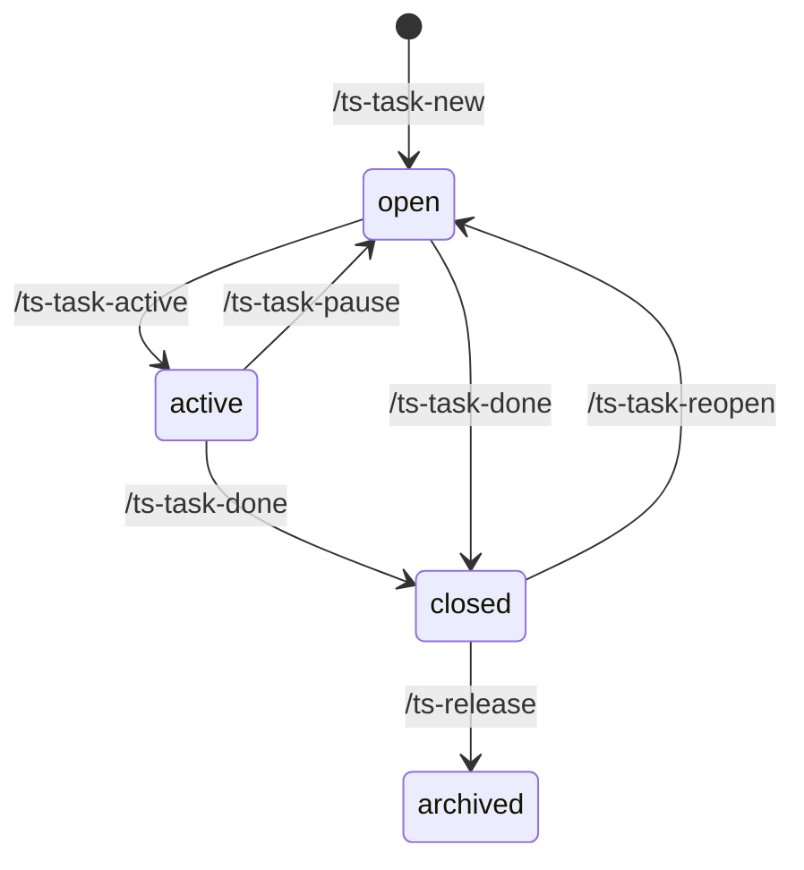
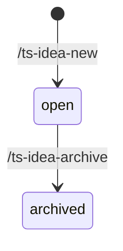
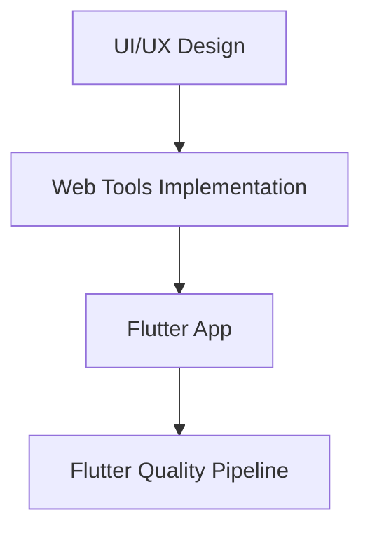
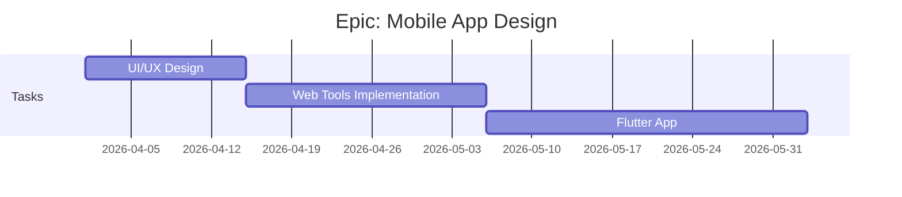
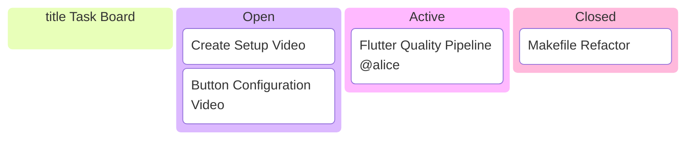

## Core Principles

1. **Small Team Focus**: Designed for 1–5 person teams (including solo developers)
2. **Docs-as-Code**: All task and idea management lives in version control
3. **Minimal Overhead**: Automation handles formatting, indexing, and visualizations
4. **Two-Track Workflow**: Ideas (lightweight, qualitative) and Tasks (structured, actionable) are separate but connected
5. **Configurable**: Every subsystem (ideas, epics, active state, releases) can be enabled or disabled per project

## System Architecture


Ideas are exploratory. Tasks are commitments. The idea-to-epic conversion is the bridge.

---

## Task System

### Directory Structure

```
docs/developers/tasks/            ← configurable via tasks.base_folder
├── OVERVIEW.md                   # Main dashboard (generated)                ✅ exists
├── EPICS.md                      # Epic-level visualization (generated)      🆕 to create
├── KANBAN.md                     # Kanban board (generated)                  🆕 to create
├── open/
│   ├── task-NNN-*.md             # Open task files                           ✅ exists
│   └── epic-NNN-*.md             # Open epic files                           🆕 to create
├── active/                       # 🆕 optional (if tasks.active.enabled)
│   ├── task-NNN-*.md             # Tasks currently being worked on
│   └── epic-NNN-*.md             # Epics with at least one active task
├── closed/
│   ├── task-NNN-*.md             # Completed tasks                           ✅ exists
│   └── epic-NNN-*.md             # Fully completed epics
└── archive/
    └── vX.Y.Z/
        ├── OVERVIEW.md           # Per-release overview (generated)          ✅ exists
        ├── task-NNN-*.md
        └── epic-NNN-*.md
```

### Task File Format

**Frontmatter:**

```yaml
---
id: TASK-NNN                                                  # Required
title: Short title                                            # Required: imperative verb phrase
status: open|active|closed                                    # Required
opened: YYYY-MM-DD                                            # Required: creation date
closed: YYYY-MM-DD                                            # Set by /ts-task-done
effort: Small (<2h)|Medium (2-8h)|Large (8-24h)|Extra Large (24-40h)  # Required
complexity: Junior|Medium|Senior                              # Required
human-in-loop: No|Clarification|Support|Main                  # Required
epic: EpicName                                                # Optional: parent epic
order: N                                                      # Optional: execution order within epic
prerequisites: [TASK-NNN]                                     # Optional: must complete first
assigned: username                                            # Optional: owner
---
```

**Body sections:**

```markdown
## Description
What needs to be done and why.

## Acceptance Criteria
- [ ] Specific, verifiable outcome

## Test Plan
**Host tests** (`make test-host`):
- Add `test/unit/test_feature.cpp`
- Cover: scenario 1, scenario 2

## Documentation
- `docs/builders/GUIDE.md` — add section about X
(omit this section if no doc changes needed)

## Prerequisites
- **TASK-NNN** — what it delivers
(omit this section if none)

## Notes
Dependencies, risks, context.
```

### Epic File Format

An epic is a named collection of related tasks. Storing it as a file allows it to carry a description, goals, and history — not just a label on tasks.

**Frontmatter:**

```yaml
---
id: EPIC-NNN                    # Required
title: Short title              # Required
status: open|active|closed      # Derived by housekeep.py — do not set manually
opened: YYYY-MM-DD              # Required: creation date
closed: YYYY-MM-DD              # Set when all tasks closed
assigned: username              # Optional: epic owner (may differ from task owners)
---
```

**Body sections:**

```markdown
## Goal
What this epic achieves and why it matters.

## Scope
What is in scope and explicitly what is not.

## Tasks
<!-- generated by update_task_overview.py — do not edit manually -->

## Notes
Risks, dependencies, decisions made during planning.
```

**Epic status derivation** (applied by `housekeep.py`):

| Condition | Epic status |
|---|---|
| No tasks reference this epic yet | `open` |
| All tasks are `open` | `open` |
| At least one task is `active` | `active` |
| Mix of `open` and `closed`, none `active` | `active` |
| All tasks are `closed` | `closed` |

The epic file is moved to the matching folder (`open/`, `active/`, `closed/`) automatically by the housekeeping script. When an epic is closed, it can be archived with `/ts-release`.

### Workflow States



| State | Location | Transition in | Transition out |
|---|---|---|---|
| `open` | `open/` | `/ts-task-new`, `/ts-task-pause`, `/ts-task-reopen` | `/ts-task-active`, `/ts-task-done` |
| `active` | `active/` | `/ts-task-active` | `/ts-task-pause`, `/ts-task-done` |
| `closed` | `closed/` | `/ts-task-done` | `/ts-task-reopen`, `/ts-release` |
| archived | `archive/vX.Y.Z/` | `/ts-release` | — |

> The `active` state and `active/` folder are optional. Set `tasks.active.enabled: false` in config to disable the state and collapse open+active into a single `open/` folder.

### Assigned Field

The `assigned` field is optional on both tasks and epics. When present, it is shown in all generated views:

- **OVERVIEW.md**: extra column `Assigned` (shown only if at least one task has the field set)
- **KANBAN.md**: shown as a badge on the card — `@username`
- **EPICS.md**: shown in the epic header row

---

## Idea System

### Directory Structure

```
docs/developers/ideas/            ← configurable via ideas.base_folder
├── OVERVIEW.md                   # Generated index of open ideas
├── open/
│   └── idea-NNN-*.md             # Active ideas
└── archived/
    └── idea-NNN-*.md             # Converted or discarded ideas
```

> **Current state:** Existing idea files live flat in `docs/developers/ideas/`. They need to be moved to `open/` as part of the implementation.

### Idea File Format

Ideas are intentionally lightweight. No required body sections, no metrics, no deadlines.

**Frontmatter:**

```yaml
---
id: IDEA-NNN        # Required: unique identifier
title: Short title  # Required
description: One line summary.  # Optional: shown in OVERVIEW.md and README
---
```

**Body:** Free-form Markdown. The directory (open vs. archived) is the only status signal — no status field in frontmatter needed.

### Idea Lifecycle

An idea has exactly two states and no intermediate active state. Ideas are a lightweight concept phase — the file is a thinking tool, not a work item.



**`open`** — the idea is being considered or is waiting. Write freely: questions, sketches, references, concerns. No structure is required. An idea can stay open for days or months.

**`archived`** — a decision was made. There are two reasons to archive:

1. **Transferred to work** — the idea became concrete enough to act on. Create an epic+tasks, then archive the idea. The idea file should note what epic it became.
2. **Abandoned or superseded** — the idea was decided against, became irrelevant, or was absorbed into another idea. The idea file should note why.

In both cases, archived ideas are never deleted — they are permanent history.

> **There is no "active" state for ideas.** Ideas don't get worked on; tasks do. When you decide an idea is ready, the transition is: create tasks → archive idea. The idea's job is done at that point.

---

## Skills Reference

### Commit policy

Skills that *create or move* work items (ts-task-new, ts-task-active, ts-task-pause, ts-task-reopen, ts-epic-new, ts-idea-new) do **not** commit — you batch-create ten tasks and commit once yourself. Skills that *close or archive* work items (ts-task-done, ts-idea-archive, ts-release) **do** commit, because each closure is a meaningful, atomic checkpoint worth its own history entry.

### Skill naming convention

> **Decision: Option B** — all skills use the `ts-` system prefix with `<domain>-<verb>` structure (e.g. `ts-task-new`, `ts-idea-list`). This ensures namespace safety when installed alongside other skill packs and makes tab-completion predictable.

### Task Skills

| Skill | What it does | Commits? |
|---|---|---|
| `/ts-task-new "Title"` | Scaffolds a task, suggests description/criteria/test plan, runs `housekeep.py`. | No |
| `/ts-task-active TASK-NNN` | Sets `status: active`, moves to `active/`, runs `housekeep.py`. | No |
| `/ts-task-pause TASK-NNN` | Stops active work; sets `status: open`, moves back to `open/`, runs `housekeep.py`. | No |
| `/ts-task-done TASK-NNN` | Sets `status: closed`, adds `closed:` date, moves to `closed/`, runs `housekeep.py`. | Yes |
| `/ts-task-reopen TASK-NNN` | Undoes a premature close; sets `status: open`, moves from `closed/` to `open/`, runs `housekeep.py`. | No |
| `/ts-task-list` | Displays all open+active tasks from OVERVIEW.md; groups by epic; marks `human-in-loop: Main` with ★; shows `assigned` and `status` per task. | — |

**`/ts-task-new` options:**

| Flag | Values | Notes |
|---|---|---|
| `--effort` | `S` / `M` / `L` / `XL` | Small / Medium / Large / Extra Large |
| `--complexity` | `Junior` / `Medium` / `Senior` | |
| `--epic` | free text | Parent epic name |
| `--order` | integer | Execution sequence within the epic |
| `--assigned` | username | Task owner |

### Epic Skills

| Skill | What it does | Commits? |
|---|---|---|
| `/ts-epic-new "Title"` | Scaffolds an epic file in `open/`, auto-increments EPIC-NNN, runs `housekeep.py`. | No |
| `/ts-epic-list` *(suggested)* | Lists all epics with derived status, assigned owner, and open/active/closed task counts. Reads from `EPICS.md` or directly from epic files. Pairs with `/ts-task-list` for a full project overview. | — |

> `/ts-epic-list` follows naturally from `/ts-task-list` and `/ts-idea-list` — if all three list commands exist, any project state can be read from the CLI without opening generated files manually. Implement alongside `/ts-task-list` in Phase 5.

### Idea Skills

| Skill | What it does | Commits? |
|---|---|---|
| `/ts-idea-new "Title"` | Creates a new idea file in `open/`, auto-increments IDEA-NNN, runs `update_idea_overview.py`. | No |
| `/ts-idea-list` | Lists all open ideas (reads from `open/`). | — |
| `/ts-idea-archive IDEA-NNN` | Moves idea from `open/` to `archived/`, runs `update_idea_overview.py`. | Yes |

---

## Scripts Reference

| Script | What it does | Triggered by |
|---|---|---|
| `scripts/housekeep.py` | Moves tasks and epics to the correct folder based on their `status` field; derives epic status from tasks; regenerates all overview files | `/ts-task-*` skills, pre-commit hook, manually |
| `scripts/update_idea_overview.py` | Generates `docs/developers/ideas/OVERVIEW.md` and optionally injects a summary into another file (e.g. `README.md`) | `/ts-idea-new`, `/ts-idea-archive`, manually |

### Housekeeping Script (`housekeep.py`)

`housekeep.py` is the central engine of the task system. It:

1. Scans all task files across all state folders (`open/`, `active/`, `closed/`, `archive/`)
2. Reads each file's `status` frontmatter field
3. Moves files to the correct folder if they are in the wrong one
4. Derives epic status from the tasks that reference each epic, then moves the epic file accordingly
5. Regenerates `OVERVIEW.md`, `EPICS.md`, and `KANBAN.md`
6. Respects the config — if `tasks.active.enabled: false`, any file with `status: active` is treated as `open`

**Invocation:**

```bash
python scripts/housekeep.py            # dry run by default
python scripts/housekeep.py --apply    # actually move files
```

**As a pre-commit hook** (optional): `housekeep.py --apply` can be wired into `.git/hooks/pre-commit` so that misplaced task files are corrected automatically before every commit.

---

## Configuration

All scripts and skills read a single config file at a configurable path (default: `docs/developers/task-system.yaml`). Set `TASK_SYSTEM_CONFIG` env var to override.

```yaml
ideas:
  enabled: true                          # set false to disable the idea system entirely
  base_folder: docs/developers/ideas     # root folder for idea files

tasks:
  enabled: true
  base_folder: docs/developers/tasks     # root folder for task and epic files
  active:
    enabled: true                        # set false to collapse open+active into open/
  releases:
    enabled: true                        # set false to skip archive/vX.Y.Z/ structure
  epics:
    enabled: true                        # set false to skip epic file creation and EPICS.md

scripts:
  base_folder: scripts                   # where housekeep.py and update_idea_overview.py live

visualizations:
  epics:
    enabled: true
    style: dependency-graph              # or: gantt
  kanban:
    enabled: true

# Optional: inject a generated summary into another file.
# inject:
#   - source: ideas/OVERVIEW.md
#     target: README.md
#     marker: FUTURE_IDEAS
```

**Behaviour rules:**

| Condition | Behaviour |
|---|---|
| `ideas.enabled: false` | No idea files, no `/ts-idea-*` skills, no `ideas/OVERVIEW.md` |
| `tasks.active.enabled: false` | No `active/` folder; `status: active` treated as `open`; `/ts-task-active` skill disabled |
| `tasks.releases.enabled: false` | No `archive/vX.Y.Z/` structure; `/ts-release` skill skips archive step |
| `tasks.epics.enabled: false` | No epic files; no `EPICS.md` generated (overrides `visualizations.epics`); `/ts-epic-new` skill disabled; `--epic` flag on `/ts-task-new` still sets the field as a plain grouping label in OVERVIEW.md |
| `visualizations.epics.enabled: false` | `housekeep.py` skips generating `EPICS.md` (only relevant when `tasks.epics.enabled: true`) |
| `visualizations.kanban.enabled: false` | `housekeep.py` skips generating `KANBAN.md` |
| `visualizations.epics.style: gantt` | `EPICS.md` uses Gantt charts instead of dependency graphs |
| `inject` entries present | Each update script appends/replaces the named block in the target file |

The `inject` option is intentionally commented out in the default config. Enable it deliberately.

---

## Visualizations

### OVERVIEW.md

Generated by `housekeep.py`. Lists all open and active tasks, grouped by epic if epics are enabled.

**Columns:** ID · Title · Status · Effort · Complexity · Human-in-loop · Assigned · Opened

The `Assigned` column is omitted if no task in the project has the field set.

### EPICS.md

Generated by `housekeep.py`. One section per epic.

**Default: dependency graph** — shows task relationships derived from `prerequisites` fields.



**Alternative: Gantt chart** — shows tasks as a timeline based on `opened` date and `effort`.



If an epic has no `prerequisites` relationships between its tasks, the dependency graph degrades gracefully to a flat list.

### KANBAN.md

Generated by `housekeep.py`. Shows tasks across their state columns.



Archived tasks (already released) are not shown on the kanban — they live under `archive/vX.Y.Z/` and are visible in the per-release OVERVIEW.md. The "Closed" column maps to the `closed` state (done, pending next release).

---

## Idea-to-Epic Workflow

When an idea is ready for real work, it converts into a structured epic with tasks, then gets archived.


**Process:**

1. Review the idea (`/ts-idea-list` or open the file directly).
2. Create an epic file (optional but recommended when epics are enabled).
3. Create tasks: `/ts-task-new "First task" --epic "EpicName"` (repeat as needed).
4. Archive the idea: `/ts-idea-archive NNN`.

**Key principles:**

- No formal approval — in a team of 1–5, just decide.
- No backlinks from tasks back to the idea — the commit message and epic name provide sufficient context.
- Archived ideas are never deleted — preserved for reference and history.

---

## Installation and Setup

### Prerequisites

- Python 3.9+
- PyYAML (`pip install pyyaml`)
- A git repository

### Steps

1. **Copy the scripts folder** into your project:

   ```
   scripts/housekeep.py
   scripts/update_idea_overview.py
   ```

2. **Create the config file** at `docs/developers/task-system.yaml` (or wherever you prefer — set `TASK_SYSTEM_CONFIG` to point to it).
   Use the template in the [Configuration](#configuration) section above. Toggle off any subsystems you don't need.

3. **Create the folder structure** (only the folders for enabled subsystems):

   ```bash
   python scripts/housekeep.py --init
   ```

   This creates the required `open/`, `active/`, `closed/`, `archive/` folders under `tasks.base_folder` and `ideas.base_folder`, and generates stub `OVERVIEW.md`, `EPICS.md`, and `KANBAN.md` files.

4. **Copy the skills** into `.claude/skills/` and register them in `.vibe/config.toml` under `enabled_skills`:

   ```toml
   enabled_skills = [
     "ts-task-new", "ts-task-active", "ts-task-pause", "ts-task-done", "ts-task-reopen", "ts-task-list",
     "ts-epic-new",
     "ts-idea-new", "ts-idea-archive", "ts-idea-list",
     "ts-release"
   ]
   ```

5. **(Optional) Install the pre-commit hook:**

   ```bash
   echo 'python scripts/housekeep.py --apply' >> .git/hooks/pre-commit
   chmod +x .git/hooks/pre-commit
   ```

6. **Migrate existing task files** (if any):

   ```bash
   python scripts/housekeep.py --apply
   ```

   The script will inspect each file's `status` field and move it to the correct folder.

---

## Making It Shippable

The goal is to package the task system so it can be dropped into any project with minimal friction — including publication to an "awesome skills" repository.

### What Gets Shipped

| Artifact | Description |
|---|---|
| `scripts/housekeep.py` | Central engine — moves files, derives epic status, regenerates overviews |
| `scripts/update_idea_overview.py` | Idea overview generator |
| `.claude/skills/ts-task-*/` | All task-related skills (`ts-task-new`, `ts-task-active`, `ts-task-pause`, `ts-task-done`, `ts-task-reopen`, `ts-task-list`) |
| `.claude/skills/ts-epic-new/` | Epic creation skill |
| `.claude/skills/ts-epic-list/` | Epic listing skill |
| `.claude/skills/ts-idea-*/` | All idea-related skills (`ts-idea-new`, `ts-idea-archive`, `ts-idea-list`) |
| `.claude/skills/ts-release/` | Release skill (archives closed tasks into versioned folders) |
| `docs/developers/task-system.yaml` | Config template |
| `docs/developers/TASK_SYSTEM.md` | End-user guide (this idea, condensed and cleaned up) |

### Distribution Options

**Option A — Copy-paste (simplest):**  
Publish a GitHub repo (`awesome-task-system`) containing the scripts and skills. Users clone or download and copy the relevant folders. A `--init` flag on `housekeep.py` handles first-time setup.

**Option B — Git subtree / submodule:**  
Users add the repo as a subtree under `.claude/skills/task-system/`. Scripts and skills update via `git subtree pull`. Works well for teams that want to track updates.

**Option C — Skill pack (Claude Code native):**  
If Claude Code gains a skill-pack or marketplace concept, ship as a single installable pack with a manifest. The config file and `--init` bootstrap remain the same.

**Recommendation:** Start with Option A. The config file and `--init` flag make onboarding fast. Publish to GitHub with a permissive license (MIT). Advertise in awesome-claude-code / awesome-claude-skills lists. Upgrade to B/C when there is evidence of multi-project use.

### Versioning the Skill Pack

- The skill pack has its own `VERSION` file (e.g. `0.1.0`).
- `housekeep.py --version` prints it.
- `CHANGELOG.md` at the skill pack root tracks breaking changes to the config format.
- Scripts check config schema version and warn (not fail) if the config was written for an older version.

---

## Implementation Plan

### Phase 1 — Rename `group` → `epic` (1 day)

1. Update all existing task frontmatter: `group:` → `epic:`
2. Update `update_task_overview.py` to read `epic` field
3. Update `/ts-task-new` skill: `--group` → `--epic`, field name in template
4. Update OVERVIEW.md column header and inline documentation

### Phase 2 — Idea system (1 day)

1. Create `docs/developers/ideas/open/` and move all existing idea files there
2. Create `docs/developers/ideas/archived/`
3. Write `scripts/update_idea_overview.py` (replaces `update_future_ideas.py`):
   - Generate `docs/developers/ideas/OVERVIEW.md`
   - Update `README.md` "Future Ideas" section (via `inject` config)
4. Create `/ts-idea-new`, `/ts-idea-list`, `/ts-idea-archive` skills
5. Register all three skills in `.vibe/config.toml`

### Phase 3 — Housekeeping + active state + epic files (2 days)

1. Write `scripts/housekeep.py` (replaces `update_task_overview.py`):
   - `--apply` flag (default is dry-run)
   - Moves task files to the correct folder based on their `status` field
   - Handles `status: active` → `active/` folder
   - Derives epic status from tasks; moves epic files accordingly
   - Regenerates `OVERVIEW.md`, `EPICS.md`, `KANBAN.md`
2. Add `active/` folder to task directory structure
3. Create `/ts-task-active`, `/ts-task-pause`, and `/ts-task-reopen` skills
4. Create epic file format; create `/ts-epic-new` skill
5. Register new skills in `.vibe/config.toml`

### Phase 4 — Configuration (1 day)

1. Create `docs/developers/task-system.yaml` with default values
2. Update all scripts and skills to read config from that file
3. Implement `housekeep.py --init` for first-time folder/stub setup
4. Wire `assigned` field into all generated overviews

### Phase 5 — Visualization files + listing skills (1 day)

1. Extend `housekeep.py` to generate `EPICS.md` (dependency graph style, with Gantt as config option)
2. Extend `housekeep.py` to generate `KANBAN.md` (with `assigned` badges)
3. Implement `/ts-epic-list` skill (list all epics with status, assigned, task counts)

### Phase 6 — Shippable packaging (1 day)

1. Extract scripts and skills into a standalone `awesome-task-system` repo layout
2. Write `docs/developers/TASK_SYSTEM.md` end-user guide
3. Add `VERSION` file and `housekeep.py --version` flag
4. Test `--init` bootstrap in a fresh repo
5. Publish to GitHub with MIT license

---

## Future Extensions

1. **Priority field**: `priority: Low|Medium|High|Critical`
2. **Labels**: `labels: [frontend, bug, documentation]`
3. **METRICS.md**: Aggregated stats (tasks closed per week, effort distribution)
4. **Web viewer**: Responsive HTML export of the generated visualizations
5. **Skill pack marketplace**: Once Claude Code gains a native packaging concept, publish as an installable pack

---

## Decision Log

| Decision | Rationale |
|---|---|
| Mermaid for all visualizations | Built into GitHub/GitLab — no external dependencies |
| Separate EPICS.md and KANBAN.md | Keeps OVERVIEW.md focused; dashboard pages load fast |
| `epic` over `group` | More standard agile terminology |
| `assigned` as optional | Supports solo and small-team use equally; no ceremony when solo |
| Ideas in `open/archived/` subdirectories | File location = status — no extra frontmatter field needed; mirrors task system |
| Idea frontmatter stays minimal | Ideas are qualitative — adding status/epic/dependency tracking adds ceremony without value |
| No backlinks from tasks to originating idea | Tasks don't need to know their origin; epic name and commit message provide enough context |
| `update_idea_overview.py` replaces `update_future_ideas.py` | One script, two outputs: README section stays updated and a dedicated OVERVIEW.md is generated |
| No METRICS.md in core implementation | Too complex for a 1-person team right now; deferred to future extensions |
| Dependency graph as default EPICS style | Directly reflects `prerequisites` relationships — more actionable than a timeline for a small team; Gantt available as config option |
| Single `task-system.yaml` config file | All scripts and skills read one source of truth; makes the system portable |
| `inject` disabled by default | Useful but surprising — coupling scripts to files outside their base folder should be an explicit opt-in |
| Epic status is derived, not manually set | Prevents human/file drift; housekeep.py is the single source of truth |
| `housekeep.py` replaces `update_task_overview.py` | Single script handles moves + regeneration; simpler mental model than two scripts with overlapping responsibilities |
| `housekeep.py --apply` default is dry-run | Safe to run anywhere without side effects; `--apply` makes the intent explicit |
| Distribution starts with copy-paste (Option A) | Lowest friction; `--init` flag handles onboarding; upgrade path to subtree/pack is clear when needed |
| Only closing/archiving skills commit | Creating or moving 10 tasks shouldn't produce 10 commits; batch creation is a normal workflow. Terminal transitions (ts-task-done, ts-idea-archive, ts-release) each warrant their own history entry |
| Epic files have a dedicated `/ts-epic-new` skill | Consistent with how tasks and ideas are created; allows `housekeep.py` to track epic status and move the file automatically |
| Partial epic completion (some open, some closed) → `active` | The epic is in progress — work has started but isn't finished; this is the most common mid-sprint state and should be visible as such |
| Epic with no tasks defaults to `open` | An epic can be planned before tasks are created; defaulting to `open` avoids the script needing to handle a null state |
| Kanban shows `closed` column, not `done` | Matches the actual state name; `closed` = done and pending release, which is distinct from archived (already released) |
| `tasks.epics.enabled: false` overrides `visualizations.epics` | If there are no epic files, generating EPICS.md is meaningless; the task-level toggle is the authoritative gate |
| `/ts-task-reopen` renamed to `/ts-task-pause`; new `/ts-task-reopen` for closed→open | "Reopen" semantically means undoing a close, not undoing a start. Both operations are needed; naming now matches intent |
| Ideas have no active state | Ideas are a thinking tool, not a work item. The moment an idea is ready to act on, it becomes tasks — there is no "working on an idea" phase in the system |
| `/ts-idea-archive` vs `/ts-task-done` — different words, same intent | Tasks go through releases after closing; "archive" would collide with that meaning. Ideas go directly to permanent history; "done" would imply finished work rather than a decided concept |
| `/ts-epic-list` listing skill added alongside `/ts-task-list` and `/ts-idea-list` | All three domains need a CLI list command; without `/ts-epic-list` an engineer must open EPICS.md manually to get a project overview |
| Skill naming: `ts-<domain>-<verb>` (Option B) | Unified `ts-` prefix prevents namespace collisions with other skill packs; consistent domain-verb structure makes all skill names guessable; tab-completing `ts-` reveals the full system |

---

## Derived Tasks

18 tasks across 6 epics, one epic per implementation phase. Order within each epic is the suggested execution sequence. Use `/ts-task-new` to create individual task files when work on a phase begins.

### Epic: Rename group → epic (Phase 1)

| Order | Title | Effort | Complexity | Human-in-loop |
|---|---|---|---|---|
| 1 | Migrate all existing task frontmatter: `group:` → `epic:` | Small | Junior | No |
| 2 | Update `ts-task-new`, `update_task_overview.py`, and `ts-task-list` to use `epic` field | Small | Medium | Clarification |

### Epic: Idea System (Phase 2)

| Order | Title | Effort | Complexity | Human-in-loop |
|---|---|---|---|---|
| 1 | Restructure ideas folder: create `open/` and `archived/`, migrate existing files | Small | Junior | No |
| 2 | Write `scripts/update_idea_overview.py` — generates `ideas/OVERVIEW.md`, replaces `update_future_ideas.py` | Medium | Medium | Clarification |
| 3 | Create `ts-idea-new`, `ts-idea-list`, `ts-idea-archive` skills and register in `.vibe/config.toml` | Medium | Medium | Clarification |

### Epic: Housekeeping + Active State + Epic Files (Phase 3)

| Order | Title | Effort | Complexity | Human-in-loop |
|---|---|---|---|---|
| 1 | Write `scripts/housekeep.py` — file moves, epic status derivation, overview regeneration, `--apply` flag | Large | Senior | Support |
| 2 | Create `ts-task-active`, `ts-task-pause`, `ts-task-reopen` skills | Medium | Medium | Clarification |
| 3 | Define epic file format and create `ts-epic-new` skill | Medium | Medium | Clarification |
| 4 | Update `ts-task-list` to show `active` state and read from both `open/` and `active/` folders | Small | Medium | Clarification |

### Epic: Configuration (Phase 4)

| Order | Title | Effort | Complexity | Human-in-loop |
|---|---|---|---|---|
| 1 | Create `docs/developers/task-system.yaml` and make all scripts and skills config-aware | Medium | Medium | Support |
| 2 | Implement `housekeep.py --init` for first-time setup; wire `assigned` field into all generated views | Medium | Medium | Clarification |

### Epic: Visualizations and Listing Skills (Phase 5)

| Order | Title | Effort | Complexity | Human-in-loop |
|---|---|---|---|---|
| 1 | Extend `housekeep.py` to generate `EPICS.md` (dependency graph default, Gantt as config option) | Medium | Medium | Clarification |
| 2 | Extend `housekeep.py` to generate `KANBAN.md` with `assigned` badges and `Closed` column | Small | Medium | Clarification |
| 3 | Implement `ts-epic-list` skill — list all epics with derived status, assigned owner, task counts | Small | Medium | Clarification |

### Epic: Shippable Packaging (Phase 6)

| Order | Title | Effort | Complexity | Human-in-loop |
|---|---|---|---|---|
| 1 | Restructure scripts and skills into standalone `awesome-task-system` repository layout | Medium | Medium | Support |
| 2 | Write `TASK_SYSTEM.md` end-user guide; add `VERSION` file and `housekeep.py --version` flag | Medium | Junior | Support |
| 3 | Test `housekeep.py --init` end-to-end in a fresh repository | Small | Junior | Support |
| 4 | Publish to GitHub with MIT license | Small | Junior | Main |
