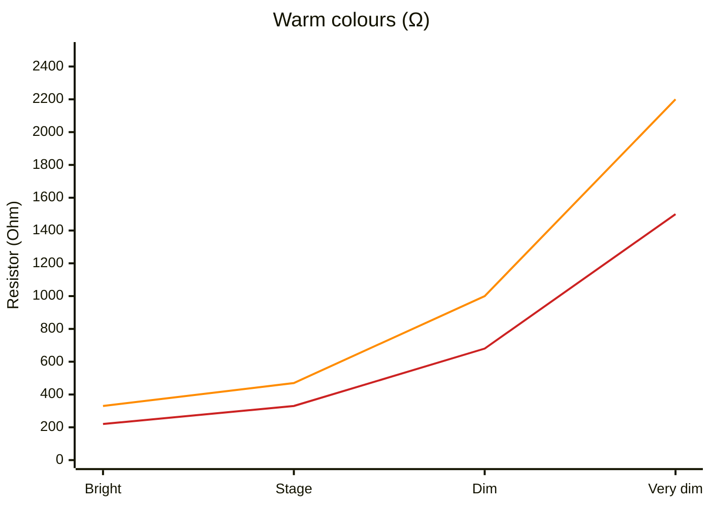
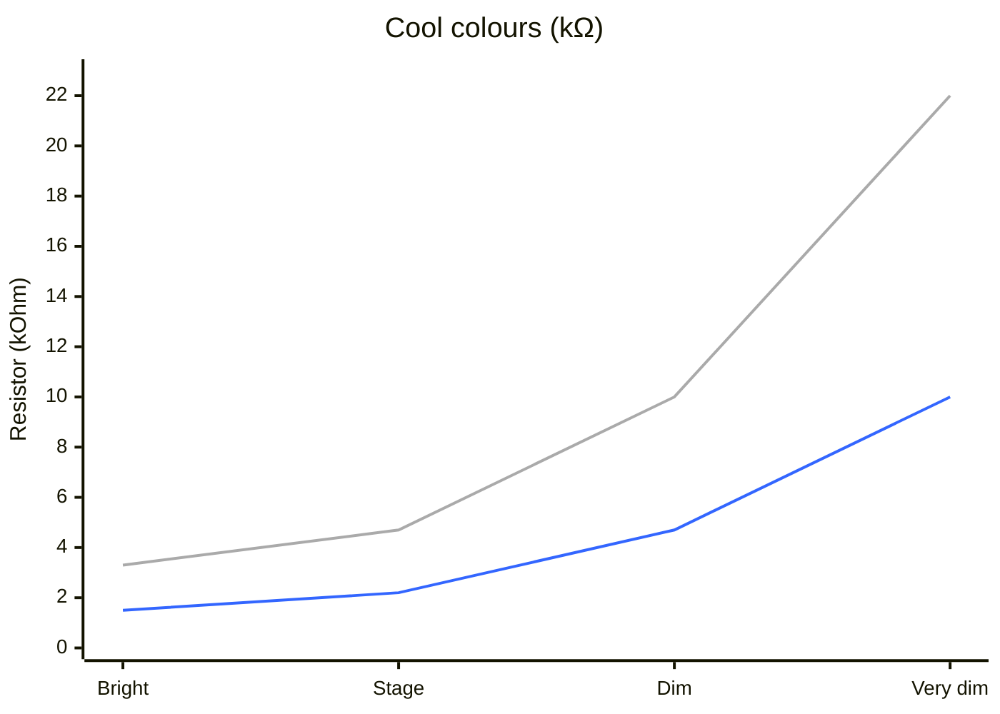

## Context

The rugged two-button pedal (IDEA-012) uses 5 mm through-hole LEDs in panel-mount
sockets, driven directly by GPIO pins on a 3.3 V microcontroller (ESP32 / nRF52840).

Different LED colours have different forward voltages and luminous intensities — a red
and a blue LED driven by the same resistor from the same supply will look noticeably
different in brightness. This guide gives builders a single ready-made table so they
don't need to know Ohm's law to pick the right resistor.

This guide belongs in the **builder documentation** (public MkDocs site, IDEA-022),
not in developer-facing docs.

---

## Resistor table — 3.3 V GPIO, direct DC drive

> **Not yet verified on hardware.** The resistor values below are calculated from
> datasheet figures and have not been bench-tested. Treat them as a starting point
> and dial in by eye before finalising a build.

All resistors target a matched perceived brightness of **~23 mcd** — bright enough to
read at a glance under stage lighting, soft enough not to dazzle in a dark room.
Resistor values are from the **E6 maker-kit subset** (220 Ω, 330 Ω, 470 Ω, 680 Ω,
1 kΩ, 2.2 kΩ, 4.7 kΩ …); always round **up** to the next E6 value — never down.
To calculate a value for a part not listed, use `R = (3.3 V − Vf) / If`, then round
up to the next E6. **Never use a resistor below 220 Ω** on a 3.3 V GPIO — the
ESP32 GPIO is rated for 12 mA per pin (40 mA total); the worst-case calculation
(Vf ≈ 1.7 V, supply at high-end tolerance 3.45 V, capped at 10 mA) gives 180 Ω,
and 220 Ω is the next E6 step up. The recommended red entry (330 Ω) sits comfortably
above this floor. Cool colours (blue and above) vary more between parts; if yours looks
too bright or too dim, step one E6 value up (dimmer) or down (brighter), but stay at
or above 220 Ω.

| Colour | Recommended part (Kingbright @ RS Austria) | Lens | Vf typ | Resistor (E6) | Operating current | Brightness |
|---|---|---|---|---|---|---|
| **Red** | [L-7113ID](https://at.rs-online.com/web/p/leds-sichtbares-licht/6193158) | Diffused | 1.9 V | **330 Ω** | 4.2 mA | ~21 mcd |
| **Orange** | [L-53ND](https://at.rs-online.com/web/p/leds/2285994) | Diffused | 2.05 V | **470 Ω** | 2.7 mA | ~22 mcd |
| **Yellow** | [L-7113YC](https://at.rs-online.com/web/p/leds/4516543) | Water clear | 1.95 V | **470 Ω** | 2.9 mA | ~23 mcd |
| **Green / yellow-green** | [L-7113GC](https://at.rs-online.com/web/p/led/4516537/) | Water clear | 2.0 V | **470 Ω** | 2.8 mA | ~22 mcd |
| **Amber** | any standard-brightness 5 mm AlInGaP amber | Either | ~2.1 V | **470 Ω** | ~2.6 mA | ~22 mcd |
| **Blue** | any standard 5 mm InGaN blue | Water clear | ~2.85 V | **2.2 kΩ** | ~0.2 mA | ~23 mcd |
| **Purple / violet** | any standard 5 mm InGaN | Water clear | ~2.85 V | **2.2 kΩ** | ~0.2 mA | ~23 mcd |
| **Pink** | any standard 5 mm InGaN/phosphor pink | Water clear | ~2.85 V | **2.2 kΩ** | ~0.2 mA | ~23 mcd |
| **White** | any standard 5 mm phosphor-converted white | Water clear | ~2.7 V | **4.7 kΩ** | ~0.13 mA | ~23 mcd |

**Brightness check.** Too dim: if you can't see the LED in a lit room at arm's length.
Too bright: if you flinch looking at it in a dark room. The ~23 mcd target sits between
these — readable under stage lighting without dazzling. Builders who want softer
indicators can step all resistors up by one E6 (330 → 470 Ω, 470 → 680 Ω, etc.);
going brighter is not available without exceeding the GPIO current limit.

**Super-bright variants.** "Super-bright" or "high-efficiency" warm-colour LEDs have
the same Vf but are 5–20× more efficient per mA — they will be painfully bright at
the resistor values above. Use standard-brightness parts, or increase the resistor
until the LED matches by eye (expect 1.5–4.7 kΩ for AlInGaP super-bright parts).

**Clear-lens LEDs** (yellow, green, cool colours) benefit from a frosted or
translucent panel-mount bezel to diffuse the light and give all indicators a similar
soft appearance from the front.

### Brightness selector — E6 resistor per colour and target level

Pick a column for your desired brightness, read off the resistor for your colour.
All mcd figures are approximate; cool-colour values vary more between parts.

| Colour | Bright (~30 mcd) | Stage (~23 mcd) | Dim (~10 mcd) | Very dim (~5 mcd) |
|---|---|---|---|---|
| **Red** | 220 Ω * | 330 Ω | 680 Ω | 1.5 kΩ |
| **Orange** | 330 Ω | 470 Ω | 1 kΩ | 2.2 kΩ |
| **Yellow** | 330 Ω | 470 Ω | 1 kΩ | 2.2 kΩ |
| **Green / yellow-green** | 330 Ω | 470 Ω | 1 kΩ | 2.2 kΩ |
| **Amber** | 330 Ω | 470 Ω | 1 kΩ | 2.2 kΩ |
| **Blue** | 1.5 kΩ | 2.2 kΩ | 4.7 kΩ | 10 kΩ |
| **Purple / violet** | 1.5 kΩ | 2.2 kΩ | 4.7 kΩ | 10 kΩ |
| **Pink** | 1.5 kΩ | 2.2 kΩ | 4.7 kΩ | 10 kΩ |
| **White** | 3.3 kΩ | 4.7 kΩ | 10 kΩ | 22 kΩ |

\* 220 Ω is the hard minimum for any 5 mm LED on a 3.3 V GPIO — do not go lower.

#### Resistor trend

Warm and cool families span a 100:1 resistance range, so they use separate y-axes.

<!-- markdownlint-disable MD033 -->

Red — Orange / Yellow / Green / Amber

Blue / Purple / Pink — White

<!-- markdownlint-enable MD033 -->

---

## Dependencies

| Idea | Dependency |
|---|---|
| IDEA-012 (Rugged pedal) | Primary consumer of this guide — builders choosing LED colours for that build. |
| IDEA-022 (MkDocs site) | Guide is published in the Builders section of the docs site. |
| IDEA-011 (PCB design) | If/when a PCB exists, the resistor moves from the LED leg onto the board — values from this table still apply. |
