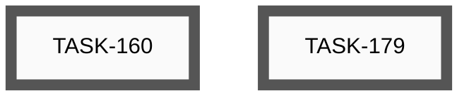
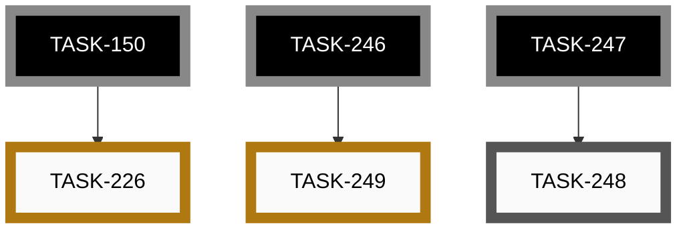
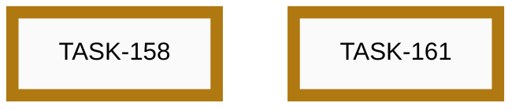
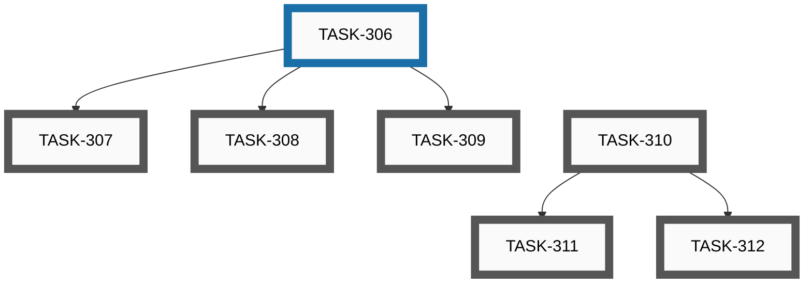
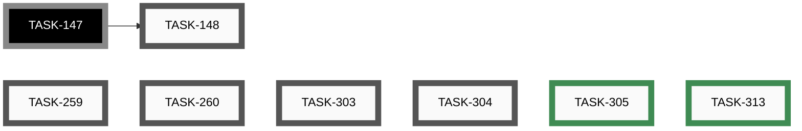

# Epics

_Auto-generated by `housekeep.py`. Do not edit manually._

**Overall:** 🔵 **active** — █░░░░░░░░░ 2/28 (7%) across 6 groups — 21 open · 1 active · 4 paused · 2 closed

## Index

| Epic | Title | Status | Open | Active | Paused | Closed | Done |
|------|-------|--------|-----:|-------:|-------:|-------:|------|
| [EPIC-012](#epic-012-app-store-distribution) | App store distribution | ⚪ _open_ | 2 | 0 | 0 | 0 | ░░░░░░░░░░ 0% |
| [EPIC-014](#epic-014-end-to-end-feature-tests) | End-to-end feature tests | 🔵 **active** | 1 | 0 | 2 | 0 | ░░░░░░░░░░ 0% |
| [EPIC-017](#epic-017-video-content-and-channel) | Video content and channel | ⚪ _open_ | 7 | 0 | 0 | 0 | ░░░░░░░░░░ 0% |
| [EPIC-019](#epic-019-iphone-app--build-test-and-ship) | iPhone app — build, test and ship | 🔵 **active** | 0 | 0 | 2 | 0 | ░░░░░░░░░░ 0% |
| [EPIC-020](#epic-020-config-driven-runtime-customisation) | Config-driven runtime customisation | 🔵 **active** | 6 | 1 | 0 | 0 | ░░░░░░░░░░ 0% |
| [—](#unassigned) | _(no epic)_ | 🔵 **active** | 5 | 0 | 0 | 2 | ███░░░░░░░ 29% |

---

## EPIC-012: App store distribution

[↑ back to top](#index)

**Status:** ⚪ _open_ — ░░░░░░░░░░ 0/2 (0%)

| Order | ID | Title | Status | Effort |
|-------|----|-------|--------|--------|
| 1 | [TASK-179](open/task-179-determine-android-app-release.md) | Determine how to add the Android app to the release on GitHub | ⚪ _open_ | Small (<2h) |
| 2 | [TASK-160](open/task-160-publish-android-play-store.md) | Publish app to Google Play Store | ⚪ _open_ | Large (8-24h) |

## EPIC-014: End-to-end feature tests

[↑ back to top](#index)

**Status:** 🔵 **active** — ░░░░░░░░░░ 0/3 (0%)

| Order | ID | Title | Status | Effort |
|-------|----|-------|--------|--------|
| 2 | [TASK-248](open/task-248-ble-pairing-test-windows-fallback.md) | BLE pairing test — Windows manual fallback (and macOS if a host appears) | ⚪ _open_ | Small (<2h) |
| 1 | [TASK-226](paused/task-226-feature-test-cli-scan-two-pedals.md) | Feature Test — CLI scan with two pedals (S-04) | 🟡 **paused** | Small (<2h) |
| 3 | [TASK-249](paused/task-249-nrf52840-pairing-pin-unwired.md) | nRF52840 pairing_pin is entirely unwired (security parity with ESP32) | 🟡 **paused** | Medium (2-8h) |

## EPIC-017: Video content and channel

[↑ back to top](#index)

**Status:** ⚪ _open_ — ░░░░░░░░░░ 0/7 (0%)

```mermaid
graph LR
    TASK_033["TASK-033"]:::open
    TASK_034["TASK-034"]:::open
    TASK_035["TASK-035"]:::open
    TASK_036["TASK-036"]:::open
    TASK_037["TASK-037"]:::open
    TASK_038["TASK-038"]:::open
    TASK_049["TASK-049"]:::open
    TASK_033 ~~~ TASK_034 ~~~ TASK_035 ~~~ TASK_036 ~~~ TASK_037 ~~~ TASK_038 ~~~ TASK_049
    click TASK_033 "open/task-033-create-setup-installation-demo-video.md"
    click TASK_034 "open/task-034-create-button-configuration-demo-video.md"
    click TASK_035 "open/task-035-create-builder-workflow-demo-video.md"
    click TASK_036 "open/task-036-create-advanced-features-demo-video.md"
    click TASK_037 "open/task-037-create-real-world-usage-demo-video.md"
    click TASK_038 "open/task-038-create-troubleshooting-demo-video.md"
    click TASK_049 "open/task-049-setup-video-platform-channel.md"
    classDef open    fill:#FAFAFA,stroke:#555,stroke-width:8px,color:#000
    classDef active  fill:#FAFAFA,stroke:#1A6FA8,stroke-width:8px,color:#000
    classDef closed  fill:#FAFAFA,stroke:#3F8B53,stroke-width:8px,color:#000
    classDef paused  fill:#FAFAFA,stroke:#B07810,stroke-width:8px,color:#000
    classDef openExt    fill:#000,stroke:#888,stroke-width:8px,color:#FFF
    classDef activeExt  fill:#000,stroke:#3FA9F5,stroke-width:8px,color:#FFF
    classDef closedExt  fill:#000,stroke:#7CC68A,stroke-width:8px,color:#FFF
    classDef pausedExt  fill:#000,stroke:#F0B030,stroke-width:8px,color:#FFF
```

| Order | ID | Title | Status | Effort |
|-------|----|-------|--------|--------|
| 1 | [TASK-033](open/task-033-create-setup-installation-demo-video.md) | Create Setup/Installation Demo Video | ⚪ _open_ | Large (8-24h) |
| 2 | [TASK-034](open/task-034-create-button-configuration-demo-video.md) | Create Button Configuration Demo Video | ⚪ _open_ | Large (8-24h) |
| 3 | [TASK-035](open/task-035-create-builder-workflow-demo-video.md) | Create Builder Workflow Demo Video | ⚪ _open_ | Large (8-24h) |
| 4 | [TASK-036](open/task-036-create-advanced-features-demo-video.md) | Create Advanced Features Demo Video | ⚪ _open_ | Extra Large (24-40h) |
| 5 | [TASK-037](open/task-037-create-real-world-usage-demo-video.md) | Create Real-World Usage Demo Video | ⚪ _open_ | Extra Large (24-40h) |
| 6 | [TASK-038](open/task-038-create-troubleshooting-demo-video.md) | Create Troubleshooting Demo Video | ⚪ _open_ | Large (8-24h) |
| 7 | [TASK-049](open/task-049-setup-video-platform-channel.md) | Setup video platform channel | ⚪ _open_ | Small (<2h) |

## EPIC-019: iPhone app — build, test and ship

[↑ back to top](#index)

**Status:** 🔵 **active** — ░░░░░░░░░░ 0/2 (0%)

| Order | ID | Title | Status | Effort |
|-------|----|-------|--------|--------|
| 1 | [TASK-158](paused/task-158-feature-test-ios-build-deploy.md) | Feature Test — Build, deploy and test the iOS app on iPhone | 🟡 **paused** | Medium (4-8h) |
| 2 | [TASK-161](paused/task-161-publish-ios-app-store.md) | Publish app to Apple App Store | 🟡 **paused** | Large (8-24h) |

## EPIC-020: Config-driven runtime customisation

[↑ back to top](#index)

**Status:** 🔵 **active** — ░░░░░░░░░░ 0/7 (0%)

| Order | ID | Title | Status | Effort |
|-------|----|-------|--------|--------|
| 2 | [TASK-307](open/task-307-profile-independent-actions-simulator.md) | Profile-independent actions — web simulator support | ⚪ _open_ | Small (<2h) |
| 3 | [TASK-308](open/task-308-profile-independent-actions-config-builder.md) | Profile-independent actions — web config builder support | ⚪ _open_ | Small (<2h) |
| 4 | [TASK-309](open/task-309-profile-independent-actions-flutter-app.md) | Profile-independent actions — Flutter app support | ⚪ _open_ | Small (<2h) |
| 5 | [TASK-310](open/task-310-configurable-ble-device-name-firmware.md) | Configurable BLE device name — firmware + schema | ⚪ _open_ | Medium (2-8h) |
| 6 | [TASK-311](open/task-311-configurable-ble-device-name-config-builder.md) | Configurable BLE device name — web config builder support | ⚪ _open_ | Small (<2h) |
| 7 | [TASK-312](open/task-312-configurable-ble-device-name-flutter-app.md) | Configurable BLE device name — Flutter app support | ⚪ _open_ | Small (<2h) |
| 1 | [TASK-306](active/task-306-profile-independent-actions-firmware.md) | Profile-independent actions — firmware + schema | 🔵 **active** | Medium (2-8h) |

## Unassigned

[↑ back to top](#index)

**Status:** 🔵 **active** — ███░░░░░░░ 2/7 (29%)

| Order | ID | Title | Status | Effort |
|-------|----|-------|--------|--------|
| ? | [TASK-148](open/task-148-reorganise-developer-documentation.md) | Reorganise Developer Documentation | ⚪ _open_ | Medium (2-8h) |
| ? | [TASK-259](open/task-259-android-app-test-protocol.md) | Android app test protocol — record device and Android version per test run | ⚪ _open_ | Small (<2h) |
| ? | [TASK-260](open/task-260-unify-version-numbers-across-deliverables.md) | Unify version numbers across all deliverables (firmware, app, CLI, simulator, …) | ⚪ _open_ | Medium (2-8h) |
| ? | [TASK-303](open/task-303-simulator-boots-with-demo-loaded.md) | Simulator boots with demo profiles loaded; community gallery still reachable | ⚪ _open_ | Small (<2h) |
| ? | [TASK-304](open/task-304-simulator-button-no-hover-reaction.md) | Simulator pedal buttons must not react to mouse hover | ⚪ _open_ | XS (<30m) |
| ? | ~~[TASK-305](closed/task-305-add-category-field-to-ideas.md)~~ | ~~Add category field to ideas and surface it in OVERVIEW~~ | 🟢 closed | Medium (2-8h) |
| ? | ~~[TASK-313](closed/task-313-emoji-icons-for-idea-categories.md)~~ | ~~Add emoji icons to idea category column in OVERVIEW~~ | 🟢 closed | Small (<2h) |

