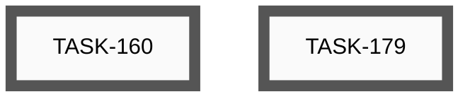
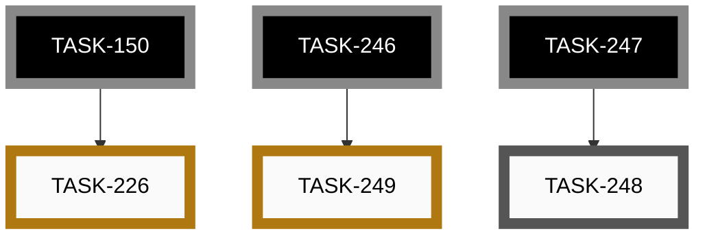
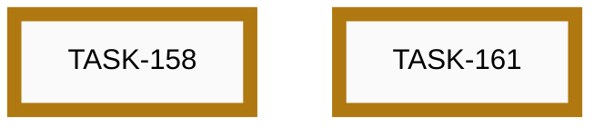
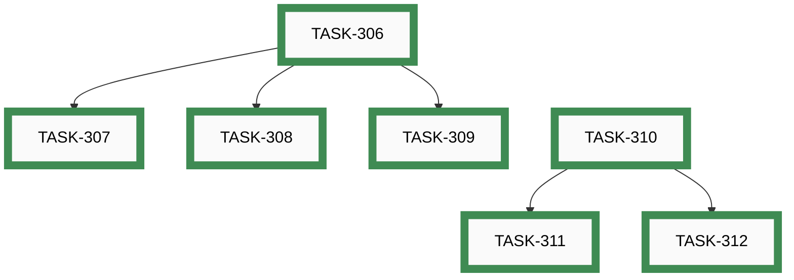
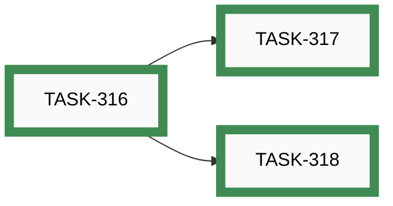
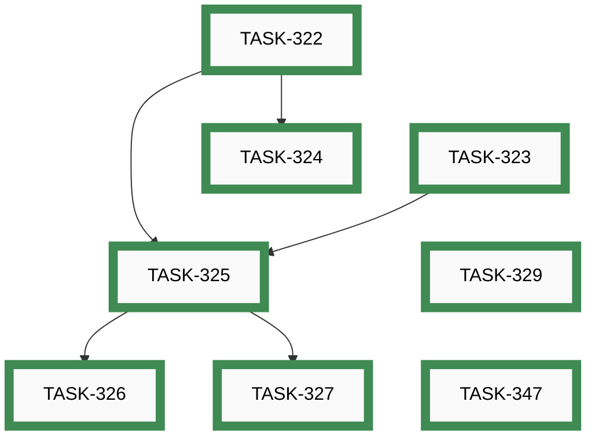
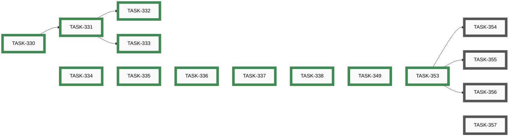
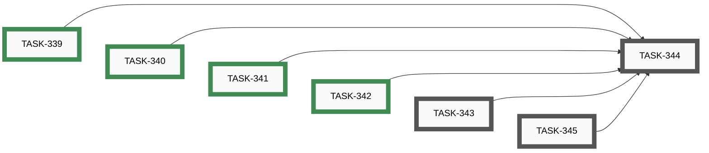

# Epics

_Auto-generated by `housekeep.py`. Do not edit manually._

**Overall:** 🔵 **active** — ███████░░░ 49/72 (68%) across 10 groups — 19 open · 0 active · 4 paused · 49 closed

## Index

| Epic | Title | Status | Open | Active | Paused | Closed | Done |
|------|-------|--------|-----:|-------:|-------:|-------:|------|
| [EPIC-012](#epic-012-app-store-distribution) | App store distribution | ⚪ _open_ | 2 | 0 | 0 | 0 | ░░░░░░░░░░ 0% |
| [EPIC-014](#epic-014-end-to-end-feature-tests) | End-to-end feature tests | 🔵 **active** | 1 | 0 | 2 | 0 | ░░░░░░░░░░ 0% |
| [EPIC-017](#epic-017-video-content-and-channel) | Video content and channel | ⚪ _open_ | 7 | 0 | 0 | 0 | ░░░░░░░░░░ 0% |
| [EPIC-019](#epic-019-iphone-app--build-test-and-ship) | iPhone app — build, test and ship | 🔵 **active** | 0 | 0 | 2 | 0 | ░░░░░░░░░░ 0% |
| [EPIC-020](#epic-020-config-driven-runtime-customisation) | Config-driven runtime customisation | 🟢 closed | 0 | 0 | 0 | 7 | ██████████ 100% |
| [EPIC-021](#epic-021-epic-suggested-branch-with-soft-enforcement) | Epic-suggested branch with soft enforcement | 🟢 closed | 0 | 0 | 0 | 3 | ██████████ 100% |
| [EPIC-022](#epic-022-atomic-commit-and-mandatory-commit-path) | Atomic /commit and mandatory commit path | 🟢 closed | 0 | 0 | 0 | 8 | ██████████ 100% |
| [EPIC-023](#epic-023-app-content-pages-and-connection-visibility) | App content pages and connection visibility | 🔵 **active** | 4 | 0 | 0 | 11 | ███████░░░ 73% |
| [EPIC-024](#epic-024-logo-and-branding-consistency-across-apps-and-tools) | Logo and branding consistency across apps and tools | 🔵 **active** | 3 | 0 | 0 | 4 | ██████░░░░ 57% |
| [—](#unassigned) | _(no epic)_ | 🔵 **active** | 2 | 0 | 0 | 16 | █████████░ 89% |

---

## EPIC-012: App store distribution

[↑ back to top](#index)

**Status:** ⚪ _open_ — ░░░░░░░░░░ 0/2 (0%)

| Order | ID | Title | Status | Effort |
|-------|----|-------|--------|--------|
| 1 | [TASK-179](open/task-179-determine-android-app-release.md) | Determine how to add the Android app to the release on GitHub | ⚪ _open_ | Small (&lt;2h) |
| 2 | [TASK-160](open/task-160-publish-android-play-store.md) | Publish app to Google Play Store | ⚪ _open_ | Large (8-24h) |

## EPIC-014: End-to-end feature tests

[↑ back to top](#index)

**Status:** 🔵 **active** — ░░░░░░░░░░ 0/3 (0%)

| Order | ID | Title | Status | Effort |
|-------|----|-------|--------|--------|
| 2 | [TASK-248](open/task-248-ble-pairing-test-windows-fallback.md) | BLE pairing test — Windows manual fallback (and macOS if a host appears) | ⚪ _open_ | Small (&lt;2h) |
| 1 | [TASK-226](paused/task-226-feature-test-cli-scan-two-pedals.md) | Feature Test — CLI scan with two pedals (S-04) | 🟡 **paused** | Small (&lt;2h) |
| 3 | [TASK-249](paused/task-249-nrf52840-pairing-pin-unwired.md) | nRF52840 pairing_pin is entirely unwired (security parity with ESP32) | 🟡 **paused** | Medium (2-8h) |

## EPIC-017: Video content and channel

[↑ back to top](#index)

**Status:** ⚪ _open_ — ░░░░░░░░░░ 0/7 (0%)

| Order | ID | Title | Status | Effort |
|-------|----|-------|--------|--------|
| 1 | [TASK-033](open/task-033-create-setup-installation-demo-video.md) | Create Setup/Installation Demo Video | ⚪ _open_ | Large (8-24h) |
| 2 | [TASK-034](open/task-034-create-button-configuration-demo-video.md) | Create Button Configuration Demo Video | ⚪ _open_ | Large (8-24h) |
| 3 | [TASK-035](open/task-035-create-builder-workflow-demo-video.md) | Create Builder Workflow Demo Video | ⚪ _open_ | Large (8-24h) |
| 4 | [TASK-036](open/task-036-create-advanced-features-demo-video.md) | Create Advanced Features Demo Video | ⚪ _open_ | Extra Large (24-40h) |
| 5 | [TASK-037](open/task-037-create-real-world-usage-demo-video.md) | Create Real-World Usage Demo Video | ⚪ _open_ | Extra Large (24-40h) |
| 6 | [TASK-038](open/task-038-create-troubleshooting-demo-video.md) | Create Troubleshooting Demo Video | ⚪ _open_ | Large (8-24h) |
| 7 | [TASK-049](open/task-049-setup-video-platform-channel.md) | Setup video platform channel | ⚪ _open_ | Small (&lt;2h) |

## EPIC-019: iPhone app — build, test and ship

[↑ back to top](#index)

**Status:** 🔵 **active** — ░░░░░░░░░░ 0/2 (0%)

| Order | ID | Title | Status | Effort |
|-------|----|-------|--------|--------|
| 1 | [TASK-158](paused/task-158-feature-test-ios-build-deploy.md) | Feature Test — Build, deploy and test the iOS app on iPhone | 🟡 **paused** | Medium (4-8h) |
| 2 | [TASK-161](paused/task-161-publish-ios-app-store.md) | Publish app to Apple App Store | 🟡 **paused** | Large (8-24h) |

## EPIC-020: Config-driven runtime customisation

[↑ back to top](#index)

**Status:** 🟢 closed — ██████████ 7/7 (100%)

| Order | ID | Title | Status | Effort |
|-------|----|-------|--------|--------|
| 1 | ~~[TASK-306](closed/task-306-profile-independent-actions-firmware.md)~~ | ~~Profile-independent actions — firmware + schema~~ | 🟢 closed | Medium (2-8h) |
| 2 | ~~[TASK-307](closed/task-307-profile-independent-actions-simulator.md)~~ | ~~Profile-independent actions — web simulator support~~ | 🟢 closed | Small (&lt;2h) |
| 3 | ~~[TASK-308](closed/task-308-profile-independent-actions-config-builder.md)~~ | ~~Profile-independent actions — web config builder support~~ | 🟢 closed | Small (&lt;2h) |
| 4 | ~~[TASK-309](closed/task-309-profile-independent-actions-flutter-app.md)~~ | ~~Profile-independent actions — Flutter app support~~ | 🟢 closed | Small (&lt;2h) |
| 5 | ~~[TASK-310](closed/task-310-configurable-ble-device-name-firmware.md)~~ | ~~Configurable BLE device name — firmware + schema~~ | 🟢 closed | Medium (2-8h) |
| 6 | ~~[TASK-311](closed/task-311-configurable-ble-device-name-config-builder.md)~~ | ~~Configurable BLE device name — web config builder support~~ | 🟢 closed | Small (&lt;2h) |
| 7 | ~~[TASK-312](closed/task-312-configurable-ble-device-name-flutter-app.md)~~ | ~~Configurable BLE device name — Flutter app support~~ | 🟢 closed | Small (&lt;2h) |

## EPIC-021: Epic-suggested branch with soft enforcement

[↑ back to top](#index)

**Status:** 🟢 closed — ██████████ 3/3 (100%)

| Order | ID | Title | Status | Effort |
|-------|----|-------|--------|--------|
| 1 | ~~[TASK-316](closed/task-316-epic-branch-frontmatter-field.md)~~ | ~~Add optional `branch:` field to epic frontmatter~~ | 🟢 closed | Small (&lt;2h) |
| 2 | ~~[TASK-317](closed/task-317-ts-epic-new-autofill-branch.md)~~ | ~~`/ts-epic-new` auto-fills `branch: feature/&lt;epic-slug&gt;`~~ | 🟢 closed | Small (&lt;2h) |
| 3 | ~~[TASK-318](closed/task-318-ts-task-active-branch-nag.md)~~ | ~~`/ts-task-active` nags when current branch ≠ epic's `branch:`~~ | 🟢 closed | Medium (2-8h) |

## EPIC-022: Atomic /commit and mandatory commit path

[↑ back to top](#index)

**Status:** 🟢 closed — ██████████ 8/8 (100%)

| Order | ID | Title | Status | Effort |
|-------|----|-------|--------|--------|
| 1 | ~~[TASK-322](closed/task-322-decide-commit-provenance-and-bypass-mechanism.md)~~ | ~~Decide commit-provenance signal and bypass mechanism for /commit~~ | 🟢 closed | Small (&lt;2h) |
| 2 | ~~[TASK-323](closed/task-323-convert-commit-skill-to-pathspec-form.md)~~ | ~~Convert /commit skill to pathspec form~~ | 🟢 closed | Small (&lt;2h) |
| 3 | ~~[TASK-324](closed/task-324-update-claudemd-and-add-commit-policy-page.md)~~ | ~~Update CLAUDE.md and add COMMIT_POLICY.md rationale page~~ | 🟢 closed | Small (&lt;2h) |
| 4 | ~~[TASK-325](closed/task-325-implement-precommit-hook-enforcement.md)~~ | ~~Implement pre-commit hook enforcement of /commit-only commits~~ | 🟢 closed | Medium (2-8h) |
| 5 | ~~[TASK-326](closed/task-326-route-other-commit-skills-through-commit.md)~~ | ~~Route /release, /release-branch, and other commit-issuing skills through /commit~~ | 🟢 closed | Medium (2-8h) |
| 6 | ~~[TASK-327](closed/task-327-decide-partial-hunk-policy.md)~~ | ~~Decide partial-hunk policy — unsupported, or /commit --partial escape hatch~~ | 🟢 closed | Small (&lt;2h) |
| 7 | ~~[TASK-329](closed/task-329-drop-auto-git-add-from-commit-pathspec.md)~~ | ~~Drop auto-git-add for untracked files from commit-pathspec.sh~~ | 🟢 closed | Small (&lt;2h) |
| 8 | ~~[TASK-347](closed/task-347-fix-commit-rename-and-deletion-handling.md)~~ | ~~Fix /commit + commit-pathspec.sh to handle deletions and renames (orphan-deletion bug)~~ | 🟢 closed | Small (&lt;2h) |

## EPIC-023: App content pages and connection visibility

[↑ back to top](#index)

**Status:** 🔵 **active** — ███████░░░ 11/15 (73%)

| Order | ID | Title | Status | Effort |
|-------|----|-------|--------|--------|
| 12 | [TASK-354](open/task-354-firmware-version-read-characteristic.md) | Firmware — expose firmware-version read characteristic (+ DIS 0x180A decision) | ⚪ _open_ | Small (&lt;2h) |
| 13 | [TASK-355](open/task-355-firmware-config-readback.md) | Firmware — config readback (option chosen in TASK-353) | ⚪ _open_ | Medium (2-8h) |
| 14 | [TASK-356](open/task-356-firmware-active-profile-notify.md) | Firmware — active-profile-index notify characteristic | ⚪ _open_ | Small (&lt;2h) |
| 15 | [TASK-357](open/task-357-reconcile-max-config-bytes-doc-vs-code.md) | Reconcile MAX_CONFIG_BYTES between BLE protocol doc and reassembler code | ⚪ _open_ | XS (&lt;30m) |
| 1 | ~~[TASK-330](closed/task-330-decide-content-page-open-questions.md)~~ | ~~Decide content-page open questions (source-of-truth, i18n, context-awareness, first-run)~~ | 🟢 closed | Small (&lt;2h) |
| 2 | ~~[TASK-331](closed/task-331-add-info-about-page.md)~~ | ~~Add Info/About page to the Flutter app~~ | 🟢 closed | Medium (2-8h) |
| 3 | ~~[TASK-332](closed/task-332-add-howto-quickstart-page.md)~~ | ~~Add How-To quickstart page (3–5 steps)~~ | 🟢 closed | Small (&lt;2h) |
| 4 | ~~[TASK-333](closed/task-333-add-profiles-troubleshooting-legal-pages.md)~~ | ~~Add Profiles explainer, Troubleshooting, and Legal pages~~ | 🟢 closed | Medium (2-8h) |
| 5 | ~~[TASK-334](closed/task-334-add-startup-splash-screen.md)~~ | ~~Add startup splash screen (Flutter + native)~~ | 🟢 closed | Medium (2-8h) |
| 6 | ~~[TASK-335](closed/task-335-add-connection-status-strip-and-details-sheet.md)~~ | ~~Add connection status strip and details sheet~~ | 🟢 closed | Medium (2-8h) |
| 7 | ~~[TASK-336](closed/task-336-add-connected-pedal-page-board-only.md)~~ | ~~Add Connected-Pedal page (board only; firmware/config sections placeholdered)~~ | 🟢 closed | Medium (2-8h) |
| 8 | ~~[TASK-337](closed/task-337-firmware-expose-version-config-active-profile.md)~~ | ~~Firmware — expose firmware version, readable config, active-profile notify (BLE) [SPLIT]~~ | 🟢 closed | Large (8-24h) |
| 9 | ~~[TASK-338](closed/task-338-add-hid-display-table-and-live-keystroke-page.md)~~ | ~~Add HID-usage display lookup table (generated) and Live-keystroke page~~ | 🟢 closed | Medium (2-8h) |
| 10 | ~~[TASK-349](closed/task-349-display-unified-version-in-mobile-app.md)~~ | ~~Display unified version in mobile app~~ | 🟢 closed | Small (&lt;2h) |
| 11 | ~~[TASK-353](closed/task-353-feasibility-firmware-ble-readback-surfaces.md)~~ | ~~Feasibility & impact analysis — firmware BLE readback surfaces~~ | 🟢 closed | Small (&lt;2h) |

## EPIC-024: Logo and branding consistency across apps and tools

[↑ back to top](#index)

**Status:** 🔵 **active** — ██████░░░░ 4/7 (57%)

| Order | ID | Title | Status | Effort |
|-------|----|-------|--------|--------|
| 5 | [TASK-343](open/task-343-add-github-social-preview-image.md) | Add GitHub social preview image | ⚪ _open_ | Small (&lt;2h) |
| 6 | [TASK-344](open/task-344-archive-idea-049-after-logo-tasks-shipped.md) | Archive IDEA-049 after logo tasks shipped | ⚪ _open_ | XS (&lt;30m) |
| 7 | [TASK-345](open/task-345-swap-android-launcher-icon-to-asp-mark.md) | Swap Android launcher icon to ASP mark | ⚪ _open_ | Medium (2-8h) |
| 1 | ~~[TASK-339](closed/task-339-add-asp-logo-to-web-simulator-header.md)~~ | ~~Add ASP logo to web simulator header~~ | 🟢 closed | Small (&lt;2h) |
| 2 | ~~[TASK-340](closed/task-340-add-asp-logo-to-profile-builder-header.md)~~ | ~~Add ASP logo to profile builder header~~ | 🟢 closed | Small (&lt;2h) |
| 3 | ~~[TASK-341](closed/task-341-add-asp-logo-to-configuration-builder-header.md)~~ | ~~Add ASP logo to configuration builder header~~ | 🟢 closed | Small (&lt;2h) |
| 4 | ~~[TASK-342](closed/task-342-add-asp-logo-to-mobile-app-appbar.md)~~ | ~~Add ASP logo to mobile app AppBar~~ | 🟢 closed | Small (&lt;2h) |

## Unassigned

[↑ back to top](#index)

**Status:** 🔵 **active** — █████████░ 16/18 (89%)

```mermaid
graph LR
    TASK_148["TASK-148"]:::open
    TASK_352["TASK-352"]:::open
    TASK_259["TASK-259"]:::closed
    TASK_260["TASK-260"]:::closed
    TASK_303["TASK-303"]:::closed
    TASK_304["TASK-304"]:::closed
    TASK_305["TASK-305"]:::closed
    TASK_313["TASK-313"]:::closed
    TASK_314["TASK-314"]:::closed
    TASK_315["TASK-315"]:::closed
    TASK_319["TASK-319"]:::closed
    TASK_320["TASK-320"]:::closed
    TASK_321["TASK-321"]:::closed
    TASK_328["TASK-328"]:::closed
    TASK_346["TASK-346"]:::closed
    TASK_348["TASK-348"]:::closed
    TASK_350["TASK-350"]:::closed
    TASK_351["TASK-351"]:::closed
    TASK_147["TASK-147"]:::openExt
    TASK_147 --> TASK_148
    TASK_260 --> TASK_350
    TASK_259 ~~~ TASK_260 ~~~ TASK_303 ~~~ TASK_304 ~~~ TASK_305 ~~~ TASK_313 ~~~ TASK_314 ~~~ TASK_315 ~~~ TASK_319 ~~~ TASK_320 ~~~ TASK_321 ~~~ TASK_328 ~~~ TASK_346 ~~~ TASK_348 ~~~ TASK_351 ~~~ TASK_352
    click TASK_148 "open/task-148-reorganise-developer-documentation.md"
    click TASK_352 "open/task-352-investigate-pre-commit-hook-latency.md"
    click TASK_259 "closed/task-259-android-app-test-protocol.md"
    click TASK_260 "closed/task-260-unify-version-numbers-across-deliverables.md"
    click TASK_303 "closed/task-303-simulator-boots-with-demo-loaded.md"
    click TASK_304 "closed/task-304-simulator-button-no-hover-reaction.md"
    click TASK_305 "closed/task-305-add-category-field-to-ideas.md"
    click TASK_313 "closed/task-313-emoji-icons-for-idea-categories.md"
    click TASK_314 "closed/task-314-nbsp-between-icon-and-category.md"
    click TASK_315 "closed/task-315-idea-sub-file-naming-convention.md"
    click TASK_319 "closed/task-319-remove-wireviz-precommit-block.md"
    click TASK_320 "closed/task-320-remove-ble-flag-precommit-check.md"
    click TASK_321 "closed/task-321-fix-ci-failures-mermaid-clang-tidy.md"
    click TASK_328 "closed/task-328-prevent-parallel-housekeep-execution.md"
    click TASK_346 "closed/task-346-content-sensitive-precommit-checks.md"
    click TASK_348 "closed/task-348-derive-clang-tidy-set-from-compile-commands.md"
    click TASK_350 "closed/task-350-display-unified-version-in-web-tooling.md"
    click TASK_351 "closed/task-351-ensure-autogenerated-markdown-is-lint-clean.md"
    classDef open    fill:#FAFAFA,stroke:#555,stroke-width:8px,color:#000
    classDef active  fill:#FAFAFA,stroke:#1A6FA8,stroke-width:8px,color:#000
    classDef closed  fill:#FAFAFA,stroke:#3F8B53,stroke-width:8px,color:#000
    classDef paused  fill:#FAFAFA,stroke:#B07810,stroke-width:8px,color:#000
    classDef openExt    fill:#000,stroke:#888,stroke-width:8px,color:#FFF
    classDef activeExt  fill:#000,stroke:#3FA9F5,stroke-width:8px,color:#FFF
    classDef closedExt  fill:#000,stroke:#7CC68A,stroke-width:8px,color:#FFF
    classDef pausedExt  fill:#000,stroke:#F0B030,stroke-width:8px,color:#FFF
```

| Order | ID | Title | Status | Effort |
|-------|----|-------|--------|--------|
| ? | [TASK-148](open/task-148-reorganise-developer-documentation.md) | Reorganise Developer Documentation | ⚪ _open_ | Medium (2-8h) |
| ? | [TASK-352](open/task-352-investigate-pre-commit-hook-latency.md) | Investigate pre-commit hook latency — reorganize, parallelize, or skip irrelevant checks | ⚪ _open_ | Medium (2-8h) |
| ? | ~~[TASK-259](closed/task-259-android-app-test-protocol.md)~~ | ~~Android app test protocol — record device and Android version per test run~~ | 🟢 closed | Small (&lt;2h) |
| ? | ~~[TASK-260](closed/task-260-unify-version-numbers-across-deliverables.md)~~ | ~~Unify version numbers across all deliverables (firmware, app, CLI, simulator, …)~~ | 🟢 closed | Medium (2-8h) |
| ? | ~~[TASK-303](closed/task-303-simulator-boots-with-demo-loaded.md)~~ | ~~Simulator boots with demo profiles loaded; community gallery still reachable~~ | 🟢 closed | Small (&lt;2h) |
| ? | ~~[TASK-304](closed/task-304-simulator-button-no-hover-reaction.md)~~ | ~~Simulator pedal buttons must not react to mouse hover~~ | 🟢 closed | XS (&lt;30m) |
| ? | ~~[TASK-305](closed/task-305-add-category-field-to-ideas.md)~~ | ~~Add category field to ideas and surface it in OVERVIEW~~ | 🟢 closed | Medium (2-8h) |
| ? | ~~[TASK-313](closed/task-313-emoji-icons-for-idea-categories.md)~~ | ~~Add emoji icons to idea category column in OVERVIEW~~ | 🟢 closed | Small (&lt;2h) |
| ? | ~~[TASK-314](closed/task-314-nbsp-between-icon-and-category.md)~~ | ~~Use non-breaking space between category icon and name~~ | 🟢 closed | XS (&lt;30m) |
| ? | ~~[TASK-315](closed/task-315-idea-sub-file-naming-convention.md)~~ | ~~Idea sub-file naming convention — one IDEA = one OVERVIEW row~~ | 🟢 closed | Small (&lt;2h) |
| ? | ~~[TASK-319](closed/task-319-remove-wireviz-precommit-block.md)~~ | ~~Pre-commit hook — remove WireViz regen block and verify no remnants~~ | 🟢 closed | Small (&lt;2h) |
| ? | ~~[TASK-320](closed/task-320-remove-ble-flag-precommit-check.md)~~ | ~~Pre-commit hook — remove BLE_CONFIG_TEST_BUILD check (orphan from TASK-236)~~ | 🟢 closed | XS (&lt;30m) |
| ? | ~~[TASK-321](closed/task-321-fix-ci-failures-mermaid-clang-tidy.md)~~ | ~~Fix CI failures (Mermaid lint, clang-tidy) and prevent dirty pushes~~ | 🟢 closed | Medium (2-8h) |
| ? | ~~[TASK-328](closed/task-328-prevent-parallel-housekeep-execution.md)~~ | ~~Prevent parallel execution of housekeep.py (and audit sibling scripts)~~ | 🟢 closed | Small (&lt;2h) |
| ? | ~~[TASK-346](closed/task-346-content-sensitive-precommit-checks.md)~~ | ~~Make pre-commit C++ and app checks content-sensitive~~ | 🟢 closed | Small (&lt;2h) |
| ? | ~~[TASK-348](closed/task-348-derive-clang-tidy-set-from-compile-commands.md)~~ | ~~Derive clang-tidy lint set from compile_commands.json~~ | 🟢 closed | Small (&lt;2h) |
| ? | ~~[TASK-350](closed/task-350-display-unified-version-in-web-tooling.md)~~ | ~~Display unified version in web tooling (simulator + builders)~~ | 🟢 closed | Small (&lt;2h) |
| ? | ~~[TASK-351](closed/task-351-ensure-autogenerated-markdown-is-lint-clean.md)~~ | ~~Ensure all autogenerated markdown is markdownlint-clean~~ | 🟢 closed | Medium (2-8h) |
