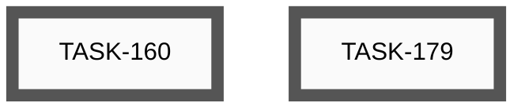
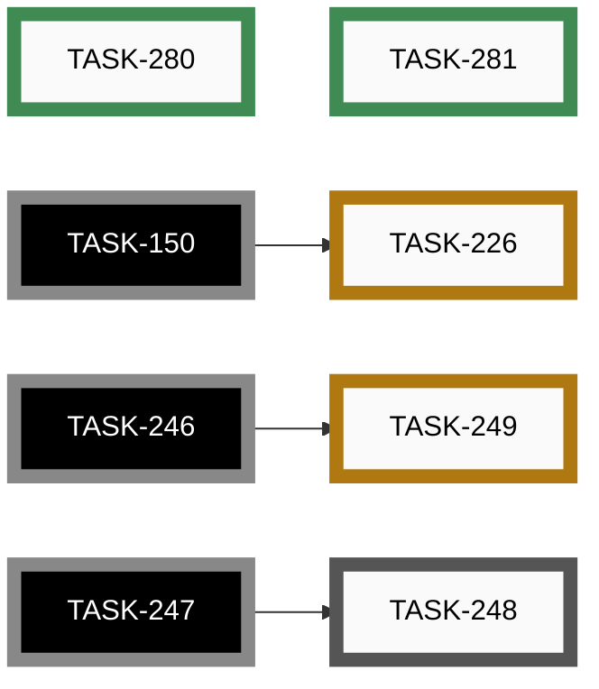
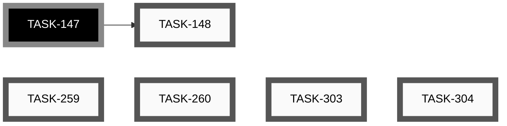

# Epics

_Auto-generated by `housekeep.py`. Do not edit manually._

**Overall:** 🔵 **active** — ██████░░░░ 25/44 (57%) across 7 groups — 15 open · 0 active · 4 paused · 25 closed

## Index

| Epic | Title | Status | Open | Active | Paused | Closed | Done |
|------|-------|--------|-----:|-------:|-------:|-------:|------|
| [EPIC-012](#epic-012-app-store-distribution) | App store distribution | ⚪ _open_ | 2 | 0 | 0 | 0 | ░░░░░░░░░░ 0% |
| [EPIC-014](#epic-014-end-to-end-feature-tests) | End-to-end feature tests | 🔵 **active** | 1 | 0 | 2 | 2 | ████░░░░░░ 40% |
| [EPIC-017](#epic-017-video-content-and-channel) | Video content and channel | ⚪ _open_ | 7 | 0 | 0 | 0 | ░░░░░░░░░░ 0% |
| [EPIC-019](#epic-019-iphone-app--build-test-and-ship) | iPhone app — build, test and ship | 🔵 **active** | 0 | 0 | 2 | 0 | ░░░░░░░░░░ 0% |
| [EPIC-020](#epic-020-hal-refactor--replace-ifdef-soup-with-platform-class-hierarchy) | HAL Refactor — replace #ifdef soup with platform class hierarchy | 🟢 closed | 0 | 0 | 0 | 15 | ██████████ 100% |
| [EPIC-021](#epic-021-agent-collaboration-skill-gaps-surfaced-by-chat-history-mining) | Agent-collaboration skill gaps surfaced by chat-history mining | 🟢 closed | 0 | 0 | 0 | 8 | ██████████ 100% |
| [—](#unassigned) | _(no epic)_ | ⚪ _open_ | 5 | 0 | 0 | 0 | ░░░░░░░░░░ 0% |

---

## EPIC-012: App store distribution

[↑ back to top](#index)

**Status:** ⚪ _open_ — ░░░░░░░░░░ 0/2 (0%)

| Order | ID | Title | Status | Effort |
|-------|----|-------|--------|--------|
| 1 | [TASK-179](open/task-179-determine-android-app-release.md) | Determine how to add the Android app to the release on GitHub | ⚪ _open_ | Small (<2h) |
| 2 | [TASK-160](open/task-160-publish-android-play-store.md) | Publish app to Google Play Store | ⚪ _open_ | Large (8-24h) |

## EPIC-014: End-to-end feature tests

[↑ back to top](#index)

**Status:** 🔵 **active** — ████░░░░░░ 2/5 (40%)

| Order | ID | Title | Status | Effort |
|-------|----|-------|--------|--------|
| 2 | [TASK-248](open/task-248-ble-pairing-test-windows-fallback.md) | BLE pairing test — Windows manual fallback (and macOS if a host appears) | ⚪ _open_ | Small (<2h) |
| 1 | [TASK-226](paused/task-226-feature-test-cli-scan-two-pedals.md) | Feature Test — CLI scan with two pedals (S-04) | 🟡 **paused** | Small (<2h) |
| 3 | [TASK-249](paused/task-249-nrf52840-pairing-pin-unwired.md) | nRF52840 pairing_pin is entirely unwired (security parity with ESP32) | 🟡 **paused** | Medium (2-8h) |
| 4 | ~~[TASK-280](closed/task-280-defect-action-editor-value-carries-over-on-type-change.md)~~ | ~~Defect — Action Editor value field carries over when Action Type changes~~ | 🟢 closed | Small (<2h) |
| 5 | ~~[TASK-281](closed/task-281-defect-validation-banner-stale-on-action-edit.md)~~ | ~~Defect — Validation banner stale until profile count changes~~ | 🟢 closed | XS (<30m) |

## EPIC-017: Video content and channel

[↑ back to top](#index)

**Status:** ⚪ _open_ — ░░░░░░░░░░ 0/7 (0%)

| Order | ID | Title | Status | Effort |
|-------|----|-------|--------|--------|
| 1 | [TASK-033](open/task-033-create-setup-installation-demo-video.md) | Create Setup/Installation Demo Video | ⚪ _open_ | Large (8-24h) |
| 2 | [TASK-034](open/task-034-create-button-configuration-demo-video.md) | Create Button Configuration Demo Video | ⚪ _open_ | Large (8-24h) |
| 3 | [TASK-035](open/task-035-create-builder-workflow-demo-video.md) | Create Builder Workflow Demo Video | ⚪ _open_ | Large (8-24h) |
| 4 | [TASK-036](open/task-036-create-advanced-features-demo-video.md) | Create Advanced Features Demo Video | ⚪ _open_ | Extra Large (24-40h) |
| 5 | [TASK-037](open/task-037-create-real-world-usage-demo-video.md) | Create Real-World Usage Demo Video | ⚪ _open_ | Extra Large (24-40h) |
| 6 | [TASK-038](open/task-038-create-troubleshooting-demo-video.md) | Create Troubleshooting Demo Video | ⚪ _open_ | Large (8-24h) |
| 7 | [TASK-049](open/task-049-setup-video-platform-channel.md) | Setup video platform channel | ⚪ _open_ | Small (<2h) |

## EPIC-019: iPhone app — build, test and ship

[↑ back to top](#index)

**Status:** 🔵 **active** — ░░░░░░░░░░ 0/2 (0%)

| Order | ID | Title | Status | Effort |
|-------|----|-------|--------|--------|
| 1 | [TASK-158](paused/task-158-feature-test-ios-build-deploy.md) | Feature Test — Build, deploy and test the iOS app on iPhone | 🟡 **paused** | Medium (4-8h) |
| 2 | [TASK-161](paused/task-161-publish-ios-app-store.md) | Publish app to Apple App Store | 🟡 **paused** | Large (8-24h) |

## EPIC-020: HAL Refactor — replace #ifdef soup with platform class hierarchy

[↑ back to top](#index)

**Status:** 🟢 closed — ██████████ 15/15 (100%)

| Order | ID | Title | Status | Effort |
|-------|----|-------|--------|--------|
| 1 | ~~[TASK-261](closed/task-261-reorganize-entry-points-per-target-subfolders.md)~~ | ~~Reorganize entry points into per-target subfolders~~ | 🟢 closed | Small (<2h) |
| 2 | ~~[TASK-282](closed/task-282-introduce-pedalapp-and-esp32pedalapp.md)~~ | ~~Introduce PedalApp base + Esp32PedalApp, migrate ESP32 #ifdef blocks~~ | 🟢 closed | Medium (2-8h) |
| 3 | ~~[TASK-289](closed/task-289-add-nrf52840pedalapp-retire-shared-main.md)~~ | ~~Add Nrf52840PedalApp, retire shared main.cpp~~ | 🟢 closed | Small (<2h) |
| 4 | ~~[TASK-292](closed/task-292-extract-blepedalapp-shared-layer.md)~~ | ~~Extract BlePedalApp shared layer (Phase 2)~~ | 🟢 closed | Medium (2-8h) |
| 5 | ~~[TASK-293](closed/task-293-hostpedalapp-fake-eliminate-guards-logger-timing.md)~~ | ~~Phase 3a — HostPedalApp fake; eliminate HOST_TEST_BUILD from logger / timing~~ | 🟢 closed | Medium (2-8h) |
| 6 | ~~[TASK-294](closed/task-294-eliminate-host-test-build-from-actions.md)~~ | ~~Phase 3b — eliminate HOST_TEST_BUILD from action implementations~~ | 🟢 closed | Small (<2h) |
| 7 | ~~[TASK-295](closed/task-295-ifilesystem-di-finish-phase-3.md)~~ | ~~Phase 3c — IFileSystem DI; eliminate HOST_TEST_BUILD from littlefs (finish Phase 3)~~ | 🟢 closed | Medium (2-8h) |
| 8 | ~~[TASK-296](closed/task-296-collapse-lib-hardware-esp32-into-src.md)~~ | ~~Phase 4a — collapse lib/hardware/esp32 into src/esp32~~ | 🟢 closed | Small (<2h) |
| 9 | ~~[TASK-297](closed/task-297-collapse-lib-hardware-nrf52840-into-src.md)~~ | ~~Phase 4b — collapse lib/hardware/nrf52840 into src/nrf52840; delete lib/hardware/~~ | 🟢 closed | Small (<2h) |
| 10 | ~~[TASK-298](closed/task-298-mirror-include-src-layout-under-target.md)~~ | ~~Phase 4c — mirror include/ + src/ layout under each target~~ | 🟢 closed | XS (<30m) |
| 11 | ~~[TASK-299](closed/task-299-consolidate-host-platform-under-src.md)~~ | ~~Phase 4d — consolidate host platform implementations under src/host/~~ | 🟢 closed | XS (<30m) |
| 12 | ~~[TASK-300](closed/task-300-host-pedal-app-inherits-blepedalapp.md)~~ | ~~Phase 4e — HostPedalApp inherits BlePedalApp; accepts injected dependencies~~ | 🟢 closed | Small (<2h) |
| 13 | ~~[TASK-301](closed/task-301-per-pin-fake-gpio.md)~~ | ~~Phase 4f — per-pin fake_gpio for multi-button host tests~~ | 🟢 closed | Small (<2h) |
| 14 | ~~[TASK-302](closed/task-302-end-to-end-app-integration-tests.md)~~ | ~~Phase 4g — end-to-end PedalApp integration tests on host~~ | 🟢 closed | Small (<2h) |
| 15 | ~~[TASK-303](closed/task-303-phase-5-docs-overhaul.md)~~ | ~~Phase 5 — docs overhaul to match the post-EPIC-020 architecture~~ | 🟢 closed | Medium (2-8h) |

## EPIC-021: Agent-collaboration skill gaps surfaced by chat-history mining

[↑ back to top](#index)

**Status:** 🟢 closed — ██████████ 8/8 (100%)

| Order | ID | Title | Status | Effort |
|-------|----|-------|--------|--------|
| 1 | ~~[TASK-283](closed/task-283-ui-driving-skill.md)~~ | ~~Make UI-driving via adb a first-class skill the agent actually uses~~ | 🟢 closed | Medium (2-8h) |
| 2 | ~~[TASK-284](closed/task-284-housekeep-skill.md)~~ | ~~Add /housekeep skill wrapping scripts/housekeep.py --apply~~ | 🟢 closed | Small (<2h) |
| 3 | ~~[TASK-285](closed/task-285-commit-skill.md)~~ | ~~Add /commit skill encoding the --no-verify decision protocol~~ | 🟢 closed | Small (<2h) |
| 4 | ~~[TASK-286](closed/task-286-doc-check-auto-trigger.md)~~ | ~~Promote doc-check from advisory to auto-trigger on .md file moves~~ | 🟢 closed | Small (<2h) |
| 5 | ~~[TASK-287](closed/task-287-status-skill.md)~~ | ~~Add /status skill bundling branch + last 3 commits + git status --short~~ | 🟢 closed | XS (<30m) |
| 6 | ~~[TASK-288](closed/task-288-explore-subagent-guidance.md)~~ | ~~Add CLAUDE.md guidance to prefer Explore subagent for multi-step searches~~ | 🟢 closed | XS (<30m) |
| 7 | ~~[TASK-290](closed/task-290-direnv-project-envvars.md)~~ | ~~Project-level env-var setup (direnv or equivalent) to kill source/cd churn~~ | 🟢 closed | Small (<2h) |
| 8 | ~~[TASK-291](closed/task-291-ble-reset-skill.md)~~ | ~~Add /ble-reset skill encapsulating the flaky-pairing recovery dance~~ | 🟢 closed | Small (<2h) |

## Unassigned

[↑ back to top](#index)

**Status:** ⚪ _open_ — ░░░░░░░░░░ 0/5 (0%)

| Order | ID | Title | Status | Effort |
|-------|----|-------|--------|--------|
| ? | [TASK-148](open/task-148-reorganise-developer-documentation.md) | Reorganise Developer Documentation | ⚪ _open_ | Medium (2-8h) |
| ? | [TASK-259](open/task-259-android-app-test-protocol.md) | Android app test protocol — record device and Android version per test run | ⚪ _open_ | Small (<2h) |
| ? | [TASK-260](open/task-260-unify-version-numbers-across-deliverables.md) | Unify version numbers across all deliverables (firmware, app, CLI, simulator, …) | ⚪ _open_ | Medium (2-8h) |
| ? | [TASK-303](open/task-303-simulator-boots-with-demo-loaded.md) | Simulator boots with demo profiles loaded; community gallery still reachable | ⚪ _open_ | Small (<2h) |
| ? | [TASK-304](open/task-304-simulator-button-no-hover-reaction.md) | Simulator pedal buttons must not react to mouse hover | ⚪ _open_ | XS (<30m) |

