# Epics

_Auto-generated by `housekeep.py`. Do not edit manually._

**Overall:** 🔵 **active** — █████████░ 169/186 (91%) across 21 groups — 13 open · 0 active · 4 paused · 169 closed

## Index

| Epic | Title | Status | Open | Active | Paused | Closed | Done |
|------|-------|--------|-----:|-------:|-------:|-------:|------|
| [EPIC-001](#epic-001-task-and-idea-management-system) | Task and idea management system | 🟢 closed | 0 | 0 | 0 | 17 | ██████████ 100% |
| [EPIC-002](#epic-002-ble-configuration-service) | BLE Configuration Service | 🟢 closed | 0 | 0 | 0 | 7 | ██████████ 100% |
| [EPIC-003](#epic-003-idea-archive-cleanup) | Idea archive cleanup | 🟢 closed | 0 | 0 | 0 | 4 | ██████████ 100% |
| [EPIC-004](#epic-004-community-profiles-repository) | Community profiles repository | 🟢 closed | 0 | 0 | 0 | 12 | ██████████ 100% |
| [EPIC-005](#epic-005-io-test-rig) | I/O test rig | 🟢 closed | 0 | 0 | 0 | 3 | ██████████ 100% |
| [EPIC-006](#epic-006-long-press-and-double-press-detection) | Long-press and double-press detection | 🟢 closed | 0 | 0 | 0 | 8 | ██████████ 100% |
| [EPIC-007](#epic-007-macro-action-system) | Macro action system | 🟢 closed | 0 | 0 | 0 | 5 | ██████████ 100% |
| [EPIC-008](#epic-008-flutter-mobile-app) | Flutter mobile app | 🟢 closed | 0 | 0 | 0 | 16 | ██████████ 100% |
| [EPIC-009](#epic-009-release-workflow) | Release workflow | 🟢 closed | 0 | 0 | 0 | 1 | ██████████ 100% |
| [EPIC-010](#epic-010-circuit-diagrams-as-code-schemdraw) | Circuit diagrams as code (Schemdraw) | 🟢 closed | 0 | 0 | 0 | 8 | ██████████ 100% |
| [EPIC-011](#epic-011-uiux-design-and-brand-identity) | UI/UX design and brand identity | 🟢 closed | 0 | 0 | 0 | 4 | ██████████ 100% |
| [EPIC-012](#epic-012-app-store-distribution) | App store distribution | ⚪ _open_ | 2 | 0 | 0 | 0 | ░░░░░░░░░░ 0% |
| [EPIC-013](#epic-013-developer-experience) | Developer experience | 🟢 closed | 0 | 0 | 0 | 1 | ██████████ 100% |
| [EPIC-014](#epic-014-end-to-end-feature-tests) | End-to-end feature tests | 🔵 **active** | 1 | 0 | 2 | 42 | █████████░ 93% |
| [EPIC-015](#epic-015-hardware-aware-configuration) | Hardware-aware configuration | 🟢 closed | 0 | 0 | 0 | 5 | ██████████ 100% |
| [EPIC-016](#epic-016-wiring-harness-diagrams-as-code-wireviz) | Wiring harness diagrams as code (WireViz) | 🟢 closed | 0 | 0 | 0 | 12 | ██████████ 100% |
| [EPIC-017](#epic-017-video-content-and-channel) | Video content and channel | ⚪ _open_ | 7 | 0 | 0 | 0 | ░░░░░░░░░░ 0% |
| [EPIC-018](#epic-018-circuit-skill-documentation-diagrams) | Circuit-skill documentation diagrams | 🟢 closed | 0 | 0 | 0 | 5 | ██████████ 100% |
| [EPIC-019](#epic-019-iphone-app--build-test-and-ship) | iPhone app — build, test and ship | 🔵 **active** | 0 | 0 | 2 | 0 | ░░░░░░░░░░ 0% |
| [EPIC-020](#epic-020-coordinated-task-system-rollout--single-source-of-truth-paused-effort-actuals-burn-up) | Coordinated task-system rollout — single source of truth, paused, effort actuals, burn-up | 🟢 closed | 0 | 0 | 0 | 7 | ██████████ 100% |
| [—](#unassigned) | _(no epic)_ | 🔵 **active** | 3 | 0 | 0 | 12 | ████████░░ 80% |

---

## EPIC-001: Task and idea management system

[↑ back to top](#index)

**Status:** 🟢 closed — ██████████ 17/17 (100%)

```mermaid
graph LR
    TASK_208["TASK-208"]:::closed
    TASK_209["TASK-209"]:::closed
    TASK_210["TASK-210"]:::closed
    TASK_211["TASK-211"]:::closed
    TASK_212["TASK-212"]:::closed
    TASK_213["TASK-213"]:::closed
    TASK_214["TASK-214"]:::closed
    TASK_215["TASK-215"]:::closed
    TASK_216["TASK-216"]:::closed
    TASK_217["TASK-217"]:::closed
    TASK_218["TASK-218"]:::closed
    TASK_219["TASK-219"]:::closed
    TASK_220["TASK-220"]:::closed
    TASK_221["TASK-221"]:::closed
    TASK_222["TASK-222"]:::closed
    TASK_223["TASK-223"]:::closed
    TASK_224["TASK-224"]:::closed
    TASK_208 --> TASK_209
    TASK_209 --> TASK_210
    TASK_210 --> TASK_211
    TASK_211 --> TASK_212
    TASK_212 --> TASK_213
    TASK_213 --> TASK_214
    TASK_213 --> TASK_215
    TASK_214 --> TASK_216
    TASK_216 --> TASK_217
    TASK_217 --> TASK_218
    TASK_218 --> TASK_219
    TASK_219 --> TASK_220
    TASK_215 --> TASK_221
    TASK_221 --> TASK_222
    TASK_222 --> TASK_223
    TASK_222 --> TASK_224
    click TASK_208 "closed/task-208-migrate-task-frontmatter-group-to-epic.md"
    click TASK_209 "closed/task-209-update-task-skills-to-use-epic-field.md"
    click TASK_210 "closed/task-210-restructure-ideas-folder-open-archived.md"
    click TASK_211 "closed/task-211-write-update-idea-overview-script.md"
    click TASK_212 "closed/task-212-create-ts-idea-skills.md"
    click TASK_213 "closed/task-213-write-housekeep-script.md"
    click TASK_214 "closed/task-214-create-ts-task-active-pause-reopen-skills.md"
    click TASK_215 "closed/task-215-create-epic-file-format-and-ts-epic-new-skill.md"
    click TASK_216 "closed/task-216-update-ts-task-list-for-active-state.md"
    click TASK_217 "closed/task-217-create-task-system-yaml-config.md"
    click TASK_218 "closed/task-218-implement-housekeep-init-and-assigned-field.md"
    click TASK_219 "closed/task-219-extend-housekeep-generate-epics-md.md"
    click TASK_220 "closed/task-220-extend-housekeep-generate-kanban-md.md"
    click TASK_221 "closed/task-221-implement-ts-epic-list-skill.md"
    click TASK_222 "closed/task-222-restructure-into-standalone-repo.md"
    click TASK_223 "closed/task-223-write-task-system-end-user-guide.md"
    click TASK_224 "closed/task-224-test-housekeep-init-fresh-repo.md"
    classDef open    fill:#FAFAFA,stroke:#555,stroke-width:8px,color:#000
    classDef active  fill:#FAFAFA,stroke:#1A6FA8,stroke-width:8px,color:#000
    classDef closed  fill:#FAFAFA,stroke:#3F8B53,stroke-width:8px,color:#000
    classDef paused  fill:#FAFAFA,stroke:#B07810,stroke-width:8px,color:#000
    classDef openExt    fill:#000,stroke:#888,stroke-width:8px,color:#FFF
    classDef activeExt  fill:#000,stroke:#3FA9F5,stroke-width:8px,color:#FFF
    classDef closedExt  fill:#000,stroke:#7CC68A,stroke-width:8px,color:#FFF
    classDef pausedExt  fill:#000,stroke:#F0B030,stroke-width:8px,color:#FFF
```

| Order | ID | Title | Status | Effort |
|-------|----|-------|--------|--------|
| 1 | ~~[TASK-208](closed/task-208-migrate-task-frontmatter-group-to-epic.md)~~ | ~~Migrate all existing task frontmatter from `group:` to `epic:`~~ | 🟢 closed | Small (<2h) |
| 2 | ~~[TASK-209](closed/task-209-update-task-skills-to-use-epic-field.md)~~ | ~~Update `ts-task-new`, `update_task_overview.py`, and `ts-task-list` to use `epic` field~~ | 🟢 closed | Small (<2h) |
| 3 | ~~[TASK-210](closed/task-210-restructure-ideas-folder-open-archived.md)~~ | ~~Restructure ideas folder — create `open/` and `archived/` subdirectories and migrate existing files~~ | 🟢 closed | Small (<2h) |
| 4 | ~~[TASK-211](closed/task-211-write-update-idea-overview-script.md)~~ | ~~Write `scripts/update_idea_overview.py` — generates `ideas/OVERVIEW.md`, replaces `update_future_ideas.py`~~ | 🟢 closed | Medium (2-8h) |
| 5 | ~~[TASK-212](closed/task-212-create-ts-idea-skills.md)~~ | ~~Create `ts-idea-new`, `ts-idea-list`, `ts-idea-archive` skills and register in `.vibe/config.toml`~~ | 🟢 closed | Medium (2-8h) |
| 6 | ~~[TASK-213](closed/task-213-write-housekeep-script.md)~~ | ~~Write `scripts/housekeep.py` — file moves, epic status derivation, overview regeneration, `--apply` flag~~ | 🟢 closed | Large (8-24h) |
| 7 | ~~[TASK-214](closed/task-214-create-ts-task-active-pause-reopen-skills.md)~~ | ~~Create `ts-task-active`, `ts-task-pause`, and `ts-task-reopen` skills~~ | 🟢 closed | Medium (2-8h) |
| 8 | ~~[TASK-215](closed/task-215-create-epic-file-format-and-ts-epic-new-skill.md)~~ | ~~Define epic file format and create `ts-epic-new` skill~~ | 🟢 closed | Medium (2-8h) |
| 9 | ~~[TASK-216](closed/task-216-update-ts-task-list-for-active-state.md)~~ | ~~Update `ts-task-list` to show `active` state and read from both `open/` and `active/` folders~~ | 🟢 closed | Small (<2h) |
| 10 | ~~[TASK-217](closed/task-217-create-task-system-yaml-config.md)~~ | ~~Create `docs/developers/task-system.yaml` and make all scripts and skills config-aware~~ | 🟢 closed | Medium (2-8h) |
| 11 | ~~[TASK-218](closed/task-218-implement-housekeep-init-and-assigned-field.md)~~ | ~~Implement `housekeep.py --init` for first-time setup; wire `assigned` field into all generated views~~ | 🟢 closed | Medium (2-8h) |
| 12 | ~~[TASK-219](closed/task-219-extend-housekeep-generate-epics-md.md)~~ | ~~Extend `housekeep.py` to generate `EPICS.md` (dependency graph default, Gantt as config option)~~ | 🟢 closed | Medium (2-8h) |
| 13 | ~~[TASK-220](closed/task-220-extend-housekeep-generate-kanban-md.md)~~ | ~~Extend `housekeep.py` to generate `KANBAN.md` with `assigned` badges and `Closed` column~~ | 🟢 closed | Small (<2h) |
| 14 | ~~[TASK-221](closed/task-221-implement-ts-epic-list-skill.md)~~ | ~~Implement `ts-epic-list` skill — list all epics with derived status, assigned owner, task counts~~ | 🟢 closed | Small (<2h) |
| 15 | ~~[TASK-222](closed/task-222-restructure-into-standalone-repo.md)~~ | ~~Restructure scripts and skills into standalone `awesome-task-system` repository layout~~ | 🟢 closed | Medium (2-8h) |
| 16 | ~~[TASK-223](closed/task-223-write-task-system-end-user-guide.md)~~ | ~~Write `TASK_SYSTEM.md` end-user guide; add `VERSION` file and `housekeep.py --version` flag~~ | 🟢 closed | Medium (2-8h) |
| 17 | ~~[TASK-224](closed/task-224-test-housekeep-init-fresh-repo.md)~~ | ~~Test `housekeep.py --init` end-to-end in a fresh repository~~ | 🟢 closed | Small (<2h) |

## EPIC-002: BLE Configuration Service

[↑ back to top](#index)

**Status:** 🟢 closed — ██████████ 7/7 (100%)

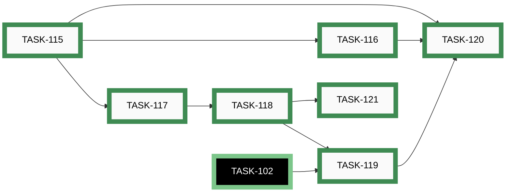

| Order | ID | Title | Status | Effort |
|-------|----|-------|--------|--------|
| 1 | ~~[TASK-115](closed/task-115-profiles-schema-json.md)~~ | ~~Create profiles.schema.json and Pre-Commit Validation~~ | 🟢 closed | Small (<2h) |
| 2 | ~~[TASK-116](closed/task-116-config-schema-json.md)~~ | ~~Create config.schema.json and data/config.json~~ | 🟢 closed | Small (<2h) |
| 3 | ~~[TASK-117](closed/task-117-ble-config-gatt-spec.md)~~ | ~~BLE Config GATT Service Spec Document~~ | 🟢 closed | Small (<2h) |
| 4 | ~~[TASK-118](closed/task-118-esp32-ble-config-service.md)~~ | ~~ESP32 BLE Config Service Implementation~~ | 🟢 closed | Large (>8h) |
| 5 | ~~[TASK-119](closed/task-119-python-cli-tool.md)~~ | ~~Python CLI Tool for Profile Upload~~ | 🟢 closed | Medium (2-8h) |
| 6 | ~~[TASK-120](closed/task-120-cli-ble-host-tests.md)~~ | ~~Host and Unit Tests for CLI and BLE Reassembly~~ | 🟢 closed | Medium (2-8h) |
| 7 | ~~[TASK-121](closed/task-121-ble-config-integration-tests.md)~~ | ~~BLE Config Integration Tests (Host + On-Device)~~ | 🟢 closed | Large (>8h) |

## EPIC-003: Idea archive cleanup

[↑ back to top](#index)

**Status:** 🟢 closed — ██████████ 4/4 (100%)

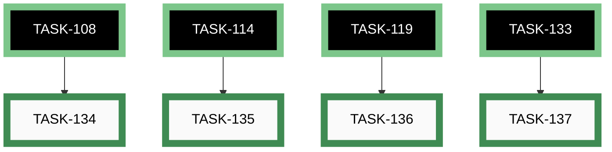

| Order | ID | Title | Status | Effort |
|-------|----|-------|--------|--------|
| 1 | ~~[TASK-134](closed/task-134-cleanup-idea-009-010.md)~~ | ~~Delete idea-009 and idea-010 After Group B~~ | 🟢 closed | Trivial (<30m) |
| 2 | ~~[TASK-135](closed/task-135-cleanup-idea-006.md)~~ | ~~Delete idea-006 After Group C~~ | 🟢 closed | Trivial (<30m) |
| 3 | ~~[TASK-136](closed/task-136-cleanup-idea-002.md)~~ | ~~Delete idea-002 After CLI Ships~~ | 🟢 closed | Trivial (<30m) |
| 4 | ~~[TASK-137](closed/task-137-cleanup-idea-001.md)~~ | ~~Delete idea-001 After App Ships~~ | 🟢 closed | Trivial (<30m) |

## EPIC-004: Community profiles repository

[↑ back to top](#index)

**Status:** 🟢 closed — ██████████ 12/12 (100%)


| Order | ID | Title | Status | Effort |
|-------|----|-------|--------|--------|
| 1 | ~~[TASK-166](closed/task-166-community-profiles-scaffold-folder.md)~~ | ~~Scaffold profiles/ folder structure and CONTRIBUTING.md~~ | 🟢 closed | Small (<2h) |
| 2 | ~~[TASK-167](closed/task-167-community-profiles-starter-sets.md)~~ | ~~Write 12 starter profile sets~~ | 🟢 closed | Medium (2-8h) |
| 3 | ~~[TASK-168](closed/task-168-community-profiles-generate-index-script.md)~~ | ~~Write generate-profiles-index script and validate-profiles npm command~~ | 🟢 closed | Small (<2h) |
| 4 | ~~[TASK-169](closed/task-169-community-profiles-ci-schema-validation.md)~~ | ~~CI — schema validation for profiles/ PRs~~ | 🟢 closed | Small (<2h) |
| 5 | ~~[TASK-170](closed/task-170-community-profiles-ci-minbuttons-check.md)~~ | ~~CI — minButtons consistency check for profiles/~~ | 🟢 closed | Small (<2h) |
| 6 | ~~[TASK-171](closed/task-171-community-profiles-ci-index-staleness.md)~~ | ~~CI — index.json staleness check~~ | 🟢 closed | Small (<2h) |
| 7 | ~~[TASK-172](closed/task-172-community-profiles-config-builder-modal.md)~~ | ~~Web Config Builder — community profiles gallery modal~~ | 🟢 closed | Medium (2-8h) |
| 8 | ~~[TASK-173](closed/task-173-community-profiles-config-builder-filter.md)~~ | ~~Web Config Builder — button-count filter in profiles gallery~~ | 🟢 closed | Small (<2h) |
| 9 | ~~[TASK-174](closed/task-174-community-profiles-simulator-gallery.md)~~ | ~~Web Simulator — "Choose a starting point" gallery~~ | 🟢 closed | Medium (2-8h) |
| 10 | ~~[TASK-175](closed/task-175-community-profiles-flutter-service.md)~~ | ~~Flutter — CommunityProfilesService~~ | 🟢 closed | Medium (2-8h) |
| 11 | ~~[TASK-176](closed/task-176-community-profiles-flutter-screen.md)~~ | ~~Flutter — Community Profiles screen~~ | 🟢 closed | Medium (2-8h) |
| 12 | ~~[TASK-177](closed/task-177-community-profiles-flutter-navigation.md)~~ | ~~Flutter — wire Community Profiles into app navigation~~ | 🟢 closed | Small (<2h) |

## EPIC-005: I/O test rig

[↑ back to top](#index)

**Status:** 🟢 closed — ██████████ 3/3 (100%)


| Order | ID | Title | Status | Effort |
|-------|----|-------|--------|--------|
| 1 | ~~[TASK-101](closed/task-101-pinaction-host-test-audit.md)~~ | ~~Audit and Fill PinAction Host Test Gaps~~ | 🟢 closed | Small (<2h) |
| 2 | ~~[TASK-102](closed/task-102-getjsonproperties-on-pinaction.md)~~ | ~~Implement getJsonProperties on PinAction~~ | 🟢 closed | Small (<2h) |
| 3 | ~~[TASK-103](closed/task-103-on-device-gpio-testrig-esp32.md)~~ | ~~On-Device GPIO Testrig for PinAction (ESP32)~~ | 🟢 closed | Medium (2-8h) |

## EPIC-006: Long-press and double-press detection

[↑ back to top](#index)

**Status:** 🟢 closed — ██████████ 8/8 (100%)

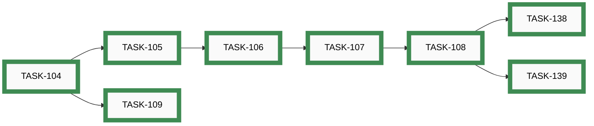

| Order | ID | Title | Status | Effort |
|-------|----|-------|--------|--------|
| 1 | ~~[TASK-104](closed/task-104-button-longpress-doublepress-detection.md)~~ | ~~Button Long-Press and Double-Press Detection~~ | 🟢 closed | Medium (2-8h) |
| 2 | ~~[TASK-105](closed/task-105-eventdispatcher-multievent-api.md)~~ | ~~EventDispatcher Multi-Event API~~ | 🟢 closed | Small (<2h) |
| 3 | ~~[TASK-106](closed/task-106-config-schema-multievent.md)~~ | ~~Config Schema Extension for Multi-Event Bindings~~ | 🟢 closed | Small (<2h) |
| 4 | ~~[TASK-107](closed/task-107-mainloop-multievent-wiring.md)~~ | ~~Wire Multi-Event Dispatch in main.cpp~~ | 🟢 closed | Small (<2h) |
| 5 | ~~[TASK-108](closed/task-108-host-tests-longpress-doublepress.md)~~ | ~~Host Tests for Long Press and Double Press~~ | 🟢 closed | Medium (2-8h) |
| 6 | ~~[TASK-109](closed/task-109-ondevice-multipress-test.md)~~ | ~~On-Device Multi-Press Integration Test (ESP32)~~ | 🟢 closed | Medium (2-8h) |
| 7 | ~~[TASK-138](closed/task-138-simulator-longpress-doublepress.md)~~ | ~~Simulator — Long-Press and Double-Press Support~~ | 🟢 closed | Medium (2-8h) |
| 8 | ~~[TASK-139](closed/task-139-config-builder-longpress-doublepress.md)~~ | ~~Profile Configurator — Long-Press and Double-Press Fields~~ | 🟢 closed | Medium (2-8h) |

## EPIC-007: Macro action system

[↑ back to top](#index)

**Status:** 🟢 closed — ██████████ 5/5 (100%)

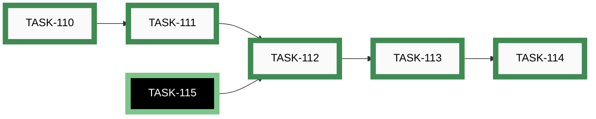

| Order | ID | Title | Status | Effort |
|-------|----|-------|--------|--------|
| 1 | ~~[TASK-110](closed/task-110-macro-action-type-keylookup.md)~~ | ~~Add Macro to Action::Type and key_lookup~~ | 🟢 closed | Trivial (<30m) |
| 2 | ~~[TASK-111](closed/task-111-macroaction-class.md)~~ | ~~MacroAction Class and Step Engine~~ | 🟢 closed | Medium (2-8h) |
| 3 | ~~[TASK-112](closed/task-112-config-loader-macro-steps.md)~~ | ~~Config Loader: Parse Macro Steps~~ | 🟢 closed | Small (<2h) |
| 4 | ~~[TASK-113](closed/task-113-mainloop-macro-update.md)~~ | ~~Wire MacroAction::update in main.cpp~~ | 🟢 closed | Trivial (<30m) |
| 5 | ~~[TASK-114](closed/task-114-host-tests-macroaction.md)~~ | ~~Host Tests for MacroAction~~ | 🟢 closed | Medium (2-8h) |

## EPIC-008: Flutter mobile app

[↑ back to top](#index)

**Status:** 🟢 closed — ██████████ 16/16 (100%)

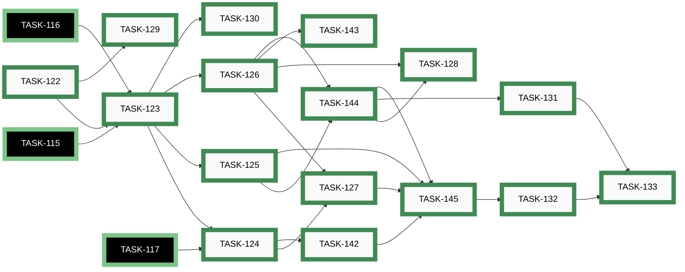

| Order | ID | Title | Status | Effort |
|-------|----|-------|--------|--------|
| 1 | ~~[TASK-122](closed/task-122-repo-restructure-app-dir.md)~~ | ~~Repo Restructure — Add app/ Dir, Update CI and Devcontainer~~ | 🟢 closed | Medium (2-8h) |
| 2 | ~~[TASK-123](closed/task-123-flutter-project-scaffold.md)~~ | ~~Flutter Project Scaffold and Navigation~~ | 🟢 closed | Medium (2-8h) |
| 3 | ~~[TASK-124](closed/task-124-flutter-ble-service.md)~~ | ~~BLE Service Layer — Scan, Connect, Disconnect~~ | 🟢 closed | Medium (2-8h) |
| 4 | ~~[TASK-142](closed/task-142-ble-chunked-upload.md)~~ | ~~BLE Service Layer — Chunked Upload Protocol~~ | 🟢 closed | Small (<2h) |
| 5 | ~~[TASK-125](closed/task-125-dart-data-models.md)~~ | ~~Dart Data Models and Schema Validation Service~~ | 🟢 closed | Medium (2-8h) |
| 6 | ~~[TASK-126](closed/task-126-profile-configurator-ui.md)~~ | ~~Profile Configurator UI — Core Screens and Basic Action Editor~~ | 🟢 closed | Medium (2-8h) |
| 7 | ~~[TASK-143](closed/task-143-advanced-action-widgets.md)~~ | ~~Profile Configurator UI — Advanced Action Widgets~~ | 🟢 closed | Medium (2-8h) |
| 8 | ~~[TASK-144](closed/task-144-json-preview-validation.md)~~ | ~~Profile Configurator UI — JsonPreviewScreen and Validation Banner~~ | 🟢 closed | Small (<2h) |
| 9 | ~~[TASK-127](closed/task-127-ble-scan-upload-flow.md)~~ | ~~BLE Scanner Screen~~ | 🟢 closed | Small (<2h) |
| 10 | ~~[TASK-145](closed/task-145-ble-upload-screen.md)~~ | ~~BLE Upload Screen with Progress~~ | 🟢 closed | Small (<2h) |
| 11 | ~~[TASK-128](closed/task-128-file-import-export.md)~~ | ~~File Import / Export and Auto-Save~~ | 🟢 closed | Small (<2h) |
| 12 | ~~[TASK-129](closed/task-129-ios-ble-permissions.md)~~ | ~~iOS BLE Permissions and Build Verification~~ | 🟢 closed | Small (<2h) |
| 13 | ~~[TASK-130](closed/task-130-app-tests.md)~~ | ~~App Unit, Widget, and Integration Tests~~ | 🟢 closed | Medium (2-8h) |
| 14 | ~~[TASK-131](closed/task-131-docs-builders-cli.md)~~ | ~~Builders Docs — CLI Tool Usage~~ | 🟢 closed | Small (<2h) |
| 15 | ~~[TASK-132](closed/task-132-docs-builders-app.md)~~ | ~~Builders Docs — Mobile App Walkthrough~~ | 🟢 closed | Small (<2h) |
| 16 | ~~[TASK-133](closed/task-133-docs-musicians-profile-management.md)~~ | ~~Musicians Docs — Profile Management Overview~~ | 🟢 closed | Small (<2h) |

## EPIC-009: Release workflow

[↑ back to top](#index)

**Status:** 🟢 closed — ██████████ 1/1 (100%)


| Order | ID | Title | Status | Effort |
|-------|----|-------|--------|--------|
| 1 | ~~[TASK-146](closed/task-146-update-release-workflow.md)~~ | ~~Update Release Workflow and README~~ | 🟢 closed | Small (<2h) |

## EPIC-010: Circuit diagrams as code (Schemdraw)

[↑ back to top](#index)

**Status:** 🟢 closed — ██████████ 8/8 (100%)

```mermaid
graph LR
    TASK_200["TASK-200"]:::closed
    TASK_201["TASK-201"]:::closed
    TASK_202["TASK-202"]:::closed
    TASK_203["TASK-203"]:::closed
    TASK_204["TASK-204"]:::closed
    TASK_205["TASK-205"]:::closed
    TASK_206["TASK-206"]:::closed
    TASK_207["TASK-207"]:::closed
    TASK_200 --> TASK_201
    TASK_201 --> TASK_202
    TASK_201 --> TASK_203
    TASK_202 --> TASK_203
    TASK_203 --> TASK_204
    TASK_201 --> TASK_205
    TASK_202 --> TASK_205
    TASK_203 --> TASK_206
    TASK_204 --> TASK_206
    TASK_205 --> TASK_206
    TASK_206 --> TASK_207
    click TASK_200 "closed/task-200-install-schemdraw-verify-toolchain.md"
    click TASK_201 "closed/task-201-spike-esp32-circuit-schemdraw.md"
    click TASK_202 "closed/task-202-author-nrf52840-circuit-schemdraw.md"
    click TASK_203 "closed/task-203-replace-pre-commit-hook-schemdraw.md"
    click TASK_204 "closed/task-204-update-ci-staleness-guard-schemdraw.md"
    click TASK_205 "closed/task-205-update-builder-docs-schemdraw.md"
    click TASK_206 "closed/task-206-remove-wireviz-artefacts.md"
    click TASK_207 "closed/task-207-reopen-update-idea-019.md"
    classDef open    fill:#FAFAFA,stroke:#555,stroke-width:8px,color:#000
    classDef active  fill:#FAFAFA,stroke:#1A6FA8,stroke-width:8px,color:#000
    classDef closed  fill:#FAFAFA,stroke:#3F8B53,stroke-width:8px,color:#000
    classDef paused  fill:#FAFAFA,stroke:#B07810,stroke-width:8px,color:#000
    classDef openExt    fill:#000,stroke:#888,stroke-width:8px,color:#FFF
    classDef activeExt  fill:#000,stroke:#3FA9F5,stroke-width:8px,color:#FFF
    classDef closedExt  fill:#000,stroke:#7CC68A,stroke-width:8px,color:#FFF
    classDef pausedExt  fill:#000,stroke:#F0B030,stroke-width:8px,color:#FFF
```

| Order | ID | Title | Status | Effort |
|-------|----|-------|--------|--------|
| 1 | ~~[TASK-200](closed/task-200-install-schemdraw-verify-toolchain.md)~~ | ~~Install Schemdraw and verify toolchain~~ | 🟢 closed | Small (<2h) |
| 2 | ~~[TASK-201](closed/task-201-spike-esp32-circuit-schemdraw.md)~~ | ~~Move and adapt ESP32 circuit schematic script~~ | 🟢 closed | Small (1-2h) |
| 3 | ~~[TASK-202](closed/task-202-author-nrf52840-circuit-schemdraw.md)~~ | ~~Extend schematic script for nRF52840 and generate SVG~~ | 🟢 closed | Small (1-2h) |
| 4 | ~~[TASK-203](closed/task-203-replace-pre-commit-hook-schemdraw.md)~~ | ~~Replace pre-commit hook — WireViz → Schemdraw~~ | 🟢 closed | Small (<2h) |
| 5 | ~~[TASK-204](closed/task-204-update-ci-staleness-guard-schemdraw.md)~~ | ~~Update CI staleness guard — WireViz → Schemdraw~~ | 🟢 closed | Small (<2h) |
| 6 | ~~[TASK-205](closed/task-205-update-builder-docs-schemdraw.md)~~ | ~~Update builder documentation — replace harness diagrams with circuit schematics~~ | 🟢 closed | Small (<2h) |
| 7 | ~~[TASK-206](closed/task-206-remove-wireviz-artefacts.md)~~ | ~~Remove WireViz artefacts and tooling~~ | 🟢 closed | Small (<2h) |
| 8 | ~~[TASK-207](closed/task-207-reopen-update-idea-019.md)~~ | ~~Reopen and close IDEA-019 with Schemdraw solution~~ | 🟢 closed | Small (<2h) |

## EPIC-011: UI/UX design and brand identity

[↑ back to top](#index)

**Status:** 🟢 closed — ██████████ 4/4 (100%)


| Order | ID | Title | Status | Effort |
|-------|----|-------|--------|--------|
| 1 | ~~[TASK-163](closed/task-163-implement-design-web-tools.md)~~ | ~~Implement design — web simulator and configurators~~ | 🟢 closed | Large (8-24h) |
| 2 | ~~[TASK-164](closed/task-164-implement-design-flutter-app.md)~~ | ~~Implement design — Flutter mobile app~~ | 🟢 closed | Large (8-24h) |
| 3 | ~~[TASK-178](closed/task-178-brand-identity-readme-svg-paths.md)~~ | ~~Brand identity — README header and SVG wordmark text-to-paths~~ | 🟢 closed | Small (<2h) |
| 4 | ~~[TASK-162](closed/task-162-ui-ux-design.md)~~ | ~~Create UI/UX design for simulator, configurators, and mobile app~~ | 🟢 closed | Large (8-24h) |

## EPIC-012: App store distribution

[↑ back to top](#index)

**Status:** ⚪ _open_ — ░░░░░░░░░░ 0/2 (0%)


| Order | ID | Title | Status | Effort |
|-------|----|-------|--------|--------|
| 1 | [TASK-179](open/task-179-determine-android-app-release.md) | Determine how to add the Android app to the release on GitHub | ⚪ _open_ | Small (<2h) |
| 2 | [TASK-160](open/task-160-publish-android-play-store.md) | Publish app to Google Play Store | ⚪ _open_ | Large (8-24h) |

## EPIC-013: Developer experience

[↑ back to top](#index)

**Status:** 🟢 closed — ██████████ 1/1 (100%)


| Order | ID | Title | Status | Effort |
|-------|----|-------|--------|--------|
| 1 | ~~[TASK-159](closed/task-159-makefile-refactor.md)~~ | ~~Refactor Makefile — add app targets and improve help presentation~~ | 🟢 closed | Small (2-4h) |

## EPIC-014: End-to-end feature tests

[↑ back to top](#index)

**Status:** 🔵 **active** — █████████░ 42/45 (93%)

```mermaid
graph LR
    TASK_248["TASK-248"]:::open
    TASK_226["TASK-226"]:::paused
    TASK_249["TASK-249"]:::paused
    TASK_149["TASK-149"]:::closed
    TASK_150["TASK-150"]:::closed
    TASK_151["TASK-151"]:::closed
    TASK_152["TASK-152"]:::closed
    TASK_153["TASK-153"]:::closed
    TASK_154["TASK-154"]:::closed
    TASK_155["TASK-155"]:::closed
    TASK_156["TASK-156"]:::closed
    TASK_157["TASK-157"]:::closed
    TASK_227["TASK-227"]:::closed
    TASK_228["TASK-228"]:::closed
    TASK_229["TASK-229"]:::closed
    TASK_230["TASK-230"]:::closed
    TASK_231["TASK-231"]:::closed
    TASK_232["TASK-232"]:::closed
    TASK_233["TASK-233"]:::closed
    TASK_234["TASK-234"]:::closed
    TASK_235["TASK-235"]:::closed
    TASK_238["TASK-238"]:::closed
    TASK_240["TASK-240"]:::closed
    TASK_246["TASK-246"]:::closed
    TASK_247["TASK-247"]:::closed
    TASK_250["TASK-250"]:::closed
    TASK_251["TASK-251"]:::closed
    TASK_252["TASK-252"]:::closed
    TASK_253["TASK-253"]:::closed
    TASK_255["TASK-255"]:::closed
    TASK_256["TASK-256"]:::closed
    TASK_257["TASK-257"]:::closed
    TASK_258["TASK-258"]:::closed
    TASK_261["TASK-261"]:::closed
    TASK_262["TASK-262"]:::closed
    TASK_263["TASK-263"]:::closed
    TASK_264["TASK-264"]:::closed
    TASK_265["TASK-265"]:::closed
    TASK_266["TASK-266"]:::closed
    TASK_267["TASK-267"]:::closed
    TASK_273["TASK-273"]:::closed
    TASK_276["TASK-276"]:::closed
    TASK_277["TASK-277"]:::closed
    TASK_278["TASK-278"]:::closed
    TASK_279["TASK-279"]:::closed
    TASK_236["TASK-236"]:::closedExt
    TASK_237["TASK-237"]:::closedExt
    TASK_247 --> TASK_248
    TASK_150 --> TASK_226
    TASK_246 --> TASK_249
    TASK_227 --> TASK_150
    TASK_150 --> TASK_151
    TASK_152 --> TASK_151
    TASK_234 --> TASK_151
    TASK_235 --> TASK_152
    TASK_251 --> TASK_155
    TASK_252 --> TASK_155
    TASK_253 --> TASK_155
    TASK_257 --> TASK_155
    TASK_229 --> TASK_238
    TASK_236 --> TASK_238
    TASK_237 --> TASK_238
    TASK_237 --> TASK_246
    TASK_246 --> TASK_247
    TASK_233 --> TASK_261
    TASK_240 --> TASK_261
    TASK_149 ~~~ TASK_153 ~~~ TASK_154 ~~~ TASK_156 ~~~ TASK_157 ~~~ TASK_227 ~~~ TASK_228 ~~~ TASK_229 ~~~ TASK_230 ~~~ TASK_231 ~~~ TASK_232 ~~~ TASK_233 ~~~ TASK_234 ~~~ TASK_235 ~~~ TASK_240 ~~~ TASK_250 ~~~ TASK_251 ~~~ TASK_252 ~~~ TASK_253 ~~~ TASK_255 ~~~ TASK_256 ~~~ TASK_257 ~~~ TASK_258 ~~~ TASK_262 ~~~ TASK_263 ~~~ TASK_264 ~~~ TASK_265 ~~~ TASK_266 ~~~ TASK_267 ~~~ TASK_273 ~~~ TASK_276 ~~~ TASK_277 ~~~ TASK_278 ~~~ TASK_279
    click TASK_248 "open/task-248-ble-pairing-test-windows-fallback.md"
    click TASK_226 "open/task-226-feature-test-cli-scan-two-pedals.md"
    click TASK_249 "open/task-249-nrf52840-pairing-pin-unwired.md"
    click TASK_149 "closed/task-149-feature-test-cli-validate.md"
    click TASK_150 "closed/task-150-feature-test-cli-scan.md"
    click TASK_151 "closed/task-151-feature-test-cli-upload.md"
    click TASK_152 "closed/task-152-feature-test-cli-upload-config.md"
    click TASK_153 "closed/task-153-feature-test-app-home-ble.md"
    click TASK_154 "closed/task-154-feature-test-app-profiles.md"
    click TASK_155 "closed/task-155-feature-test-app-action-editor.md"
    click TASK_156 "closed/task-156-feature-test-app-upload-preview.md"
    click TASK_157 "closed/task-157-feature-test-e2e-integration-edge.md"
    click TASK_227 "closed/task-227-defect-cli-scan-bleak3-and-ble-off.md"
    click TASK_228 "closed/task-228-defect-adv-override-leaks-to-production.md"
    click TASK_229 "closed/task-229-defect-ble-pairing-policy-mitm.md"
    click TASK_230 "closed/task-230-fix-precommit-hook-deleted-script.md"
    click TASK_231 "closed/task-231-power-led-hardwired-signals-invisible.md"
    click TASK_232 "closed/task-232-defect-action-serializers-placeholder.md"
    click TASK_233 "closed/task-233-defect-upload-skips-schema-validation.md"
    click TASK_234 "closed/task-234-defect-upload-raw-traceback-on-disconnect.md"
    click TASK_235 "closed/task-235-defect-hw-identity-char-returns-pointer-bytes.md"
    click TASK_238 "closed/task-238-on-device-verify-ble-config-and-pairing-pin.md"
    click TASK_240 "closed/task-240-defect-firmware-json-parser-undersized.md"
    click TASK_246 "closed/task-246-defect-pairing-pin-enforced-as-just-works.md"
    click TASK_247 "closed/task-247-automate-ble-pairing-test-via-bluetoothctl.md"
    click TASK_250 "closed/task-250-defect-android-manifest-missing-ble-permissions.md"
    click TASK_251 "closed/task-251-defect-android-app-navigation-back-exits.md"
    click TASK_252 "closed/task-252-defect-action-editor-save-no-nav-and-named-key-type.md"
    click TASK_253 "closed/task-253-defect-app-layout-overflow-and-mediakey-filter.md"
    click TASK_255 "closed/task-255-defect-profile-list-blank-name-validation-and-export-ux.md"
    click TASK_256 "closed/task-256-defect-profile-list-accessibility-empty-content-desc.md"
    click TASK_257 "closed/task-257-defect-action-editor-raw-hid-not-parsed-by-firmware.md"
    click TASK_258 "closed/task-258-defect-app-scan-empty-while-os-sees-device.md"
    click TASK_261 "closed/task-261-defect-upload-chunk-size-exceeds-android-mtu.md"
    click TASK_262 "closed/task-262-defect-ble-scanner-no-error-state.md"
    click TASK_263 "closed/task-263-defect-scanner-device-name-truncated.md"
    click TASK_264 "closed/task-264-defect-validation-banner-misses-runtime-invalid-actions.md"
    click TASK_265 "closed/task-265-defect-action-editor-dropdown-assertion-crash.md"
    click TASK_266 "closed/task-266-defect-upload-platformexception-swallowed-ui-hangs.md"
    click TASK_267 "closed/task-267-defect-no-ui-to-import-hardware-config.md"
    click TASK_273 "closed/task-273-defect-firmware-no-reboot-after-config-write-hw.md"
    click TASK_276 "closed/task-276-defect-action-editor-drops-longpress-on-resave.md"
    click TASK_277 "closed/task-277-defect-raw-hid-hint-misleading-0x28.md"
    click TASK_278 "closed/task-278-usability-session-action-editor.md"
    click TASK_279 "closed/task-279-defect-add-8th-profile-silent-rejection.md"
    click TASK_236 "closed/task-236-retire-ble-config-test-build.md"
    click TASK_237 "closed/task-237-ble-pairing-pin.md"
    classDef open    fill:#FAFAFA,stroke:#555,stroke-width:8px,color:#000
    classDef active  fill:#FAFAFA,stroke:#1A6FA8,stroke-width:8px,color:#000
    classDef closed  fill:#FAFAFA,stroke:#3F8B53,stroke-width:8px,color:#000
    classDef paused  fill:#FAFAFA,stroke:#B07810,stroke-width:8px,color:#000
    classDef openExt    fill:#000,stroke:#888,stroke-width:8px,color:#FFF
    classDef activeExt  fill:#000,stroke:#3FA9F5,stroke-width:8px,color:#FFF
    classDef closedExt  fill:#000,stroke:#7CC68A,stroke-width:8px,color:#FFF
    classDef pausedExt  fill:#000,stroke:#F0B030,stroke-width:8px,color:#FFF
```

| Order | ID | Title | Status | Effort |
|-------|----|-------|--------|--------|
| 2 | [TASK-248](open/task-248-ble-pairing-test-windows-fallback.md) | BLE pairing test — Windows manual fallback (and macOS if a host appears) | ⚪ _open_ | Small (<2h) |
| 1 | [TASK-226](paused/task-226-feature-test-cli-scan-two-pedals.md) | Feature Test — CLI scan with two pedals (S-04) | 🟡 **paused** | Small (<2h) |
| 3 | [TASK-249](paused/task-249-nrf52840-pairing-pin-unwired.md) | nRF52840 pairing_pin is entirely unwired (security parity with ESP32) | 🟡 **paused** | Medium (2-8h) |
| 4 | ~~[TASK-257](closed/task-257-defect-action-editor-raw-hid-not-parsed-by-firmware.md)~~ | ~~Defect — Action Editor "Key (raw HID)" values like 0x28 are not parsed by firmware~~ | 🟢 closed | Small (1-3h) |
| 5 | ~~[TASK-153](closed/task-153-feature-test-app-home-ble.md)~~ | ~~Feature Test — App home screen & BLE connection~~ | 🟢 closed | Small (2-4h) |
| 6 | ~~[TASK-154](closed/task-154-feature-test-app-profiles.md)~~ | ~~Feature Test — App profile list & profile editor~~ | 🟢 closed | Small (2-4h) |
| 7 | ~~[TASK-155](closed/task-155-feature-test-app-action-editor.md)~~ | ~~Feature Test — App action editor (all action types)~~ | 🟢 closed | Small (2-4h) |
| 8 | ~~[TASK-156](closed/task-156-feature-test-app-upload-preview.md)~~ | ~~Feature Test — App upload screen & JSON preview~~ | 🟢 closed | Small (2-4h) |
| 9 | ~~[TASK-157](closed/task-157-feature-test-e2e-integration-edge.md)~~ | ~~Feature Test — E2E musician workflows & edge cases~~ | 🟢 closed | Medium (4-8h) |
| 10 | ~~[TASK-250](closed/task-250-defect-android-manifest-missing-ble-permissions.md)~~ | ~~Defect — Android manifest missing BLE permissions; app cannot scan or connect~~ | 🟢 closed | Small (1-2h) |
| 11 | ~~[TASK-149](closed/task-149-feature-test-cli-validate.md)~~ | ~~Feature Test — CLI validate command~~ | 🟢 closed | Small (1-2h) |
| 12 | ~~[TASK-150](closed/task-150-feature-test-cli-scan.md)~~ | ~~Feature Test — CLI scan command~~ | 🟢 closed | Small (1-2h) |
| 13 | ~~[TASK-151](closed/task-151-feature-test-cli-upload.md)~~ | ~~Feature Test — CLI upload command~~ | 🟢 closed | Small (2-4h) |
| 14 | ~~[TASK-152](closed/task-152-feature-test-cli-upload-config.md)~~ | ~~Feature Test — CLI upload-config command~~ | 🟢 closed | Small (1-2h) |
| 15 | ~~[TASK-227](closed/task-227-defect-cli-scan-bleak3-and-ble-off.md)~~ | ~~Defect — CLI scan broken on bleak ≥ 3.0 and on disabled BLE adapter~~ | 🟢 closed | Small (<2h) |
| 16 | ~~[TASK-228](closed/task-228-defect-adv-override-leaks-to-production.md)~~ | ~~Defect — BLE advertisement override leaks from test build into production, breaks HID discoverability~~ | 🟢 closed | Small (<2h) |
| 17 | ~~[TASK-229](closed/task-229-defect-ble-pairing-policy-mitm.md)~~ | ~~Defect — BLE pairing policy (MITM=true) prevents Linux/Windows pairing of a no-display pedal~~ | 🟢 closed | Small (<2h) |
| 18 | ~~[TASK-230](closed/task-230-fix-precommit-hook-deleted-script.md)~~ | ~~Fix pre-commit hook — invokes deleted scripts/update_future_ideas.py~~ | 🟢 closed | Small (<2h) |
| 19 | ~~[TASK-231](closed/task-231-power-led-hardwired-signals-invisible.md)~~ | ~~Defect — Power LED hardwired to VCC; firmware error signals are invisible~~ | 🟢 closed | Small (<2h) |
| 20 | ~~[TASK-232](closed/task-232-defect-action-serializers-placeholder.md)~~ | ~~Defect — Action getJsonProperties placeholders lose information on round-trip~~ | 🟢 closed | Small (<2h) |
| 21 | ~~[TASK-233](closed/task-233-defect-upload-skips-schema-validation.md)~~ | ~~Defect — CLI upload and firmware both accept schema-invalid profiles.json~~ | 🟢 closed | Small (<2h) |
| 22 | ~~[TASK-234](closed/task-234-defect-upload-raw-traceback-on-disconnect.md)~~ | ~~Defect — CLI upload shows raw Python traceback when BLE disconnects mid-transfer~~ | 🟢 closed | Small (<2h) |
| 23 | ~~[TASK-235](closed/task-235-defect-hw-identity-char-returns-pointer-bytes.md)~~ | ~~Defect — Hardware-identity BLE characteristic returned 4 bytes of pointer address instead of the string~~ | 🟢 closed | Small (<2h) |
| 24 | ~~[TASK-238](closed/task-238-on-device-verify-ble-config-and-pairing-pin.md)~~ | ~~On-device verification — BLE config integration test on production firmware + pairing PIN smoke test~~ | 🟢 closed | Small (<2h) |
| 25 | ~~[TASK-240](closed/task-240-defect-firmware-json-parser-undersized.md)~~ | ~~Defect — firmware JSON parser undersized vs. advertised MAX_CONFIG_BYTES~~ | 🟢 closed | Medium (2-8h) |
| 26 | ~~[TASK-246](closed/task-246-defect-pairing-pin-enforced-as-just-works.md)~~ | ~~Defect — pairing_pin advertises PIN protection but pairs Just-Works (MITM bit never set)~~ | 🟢 closed | Small (<2h) |
| 27 | ~~[TASK-247](closed/task-247-automate-ble-pairing-test-via-bluetoothctl.md)~~ | ~~Automate BLE pairing smoke test via bluetoothctl (Linux)~~ | 🟢 closed | Small (<2h) |
| 28 | ~~[TASK-251](closed/task-251-defect-android-app-navigation-back-exits.md)~~ | ~~Defect — system BACK exits the app from any sub-screen instead of popping~~ | 🟢 closed | Small (1-3h) |
| 29 | ~~[TASK-252](closed/task-252-defect-action-editor-save-no-nav-and-named-key-type.md)~~ | ~~Defect — Action Editor: Save doesn't navigate; "Key (named)" emits SendCharAction~~ | 🟢 closed | Small (1-3h) |
| 30 | ~~[TASK-253](closed/task-253-defect-app-layout-overflow-and-mediakey-filter.md)~~ | ~~Defect — UI overflow in landscape & Media Key dropdown; Media Key filter not implemented~~ | 🟢 closed | Small (1-3h) |
| 31 | ~~[TASK-255](closed/task-255-defect-profile-list-blank-name-validation-and-export-ux.md)~~ | ~~Defect — Profile List blank-name validation invisible & Export UX (share sheet + UUID filename)~~ | 🟢 closed | Small (1-3h) |
| 32 | ~~[TASK-256](closed/task-256-defect-profile-list-accessibility-empty-content-desc.md)~~ | ~~Defect — Profile List accessibility (empty content-desc on FAB and row icons)~~ | 🟢 closed | Small (1-3h) |
| 33 | ~~[TASK-262](closed/task-262-defect-ble-scanner-no-error-state.md)~~ | ~~Defect — BLE scanner shows indefinite spinner when Bluetooth is off or permission is denied~~ | 🟢 closed | Small (2-4h) |
| 34 | ~~[TASK-263](closed/task-263-defect-scanner-device-name-truncated.md)~~ | ~~Defect — Scanner list truncates pedal device name to "AwesomeStudioPe"~~ | 🟢 closed | Small (<2h) |
| 35 | ~~[TASK-264](closed/task-264-defect-validation-banner-misses-runtime-invalid-actions.md)~~ | ~~Defect — Profile List validation banner stays green when an action's value is schema-valid but runtime-unresolvable~~ | 🟢 closed | Small (2-4h) |
| 36 | ~~[TASK-265](closed/task-265-defect-action-editor-dropdown-assertion-crash.md)~~ | ~~Defect — Action Editor crashes with Flutter dropdown assertion when opened on a profile whose action value cannot be resolved~~ | 🟢 closed | Small (2-4h) |
| 37 | ~~[TASK-266](closed/task-266-defect-upload-platformexception-swallowed-ui-hangs.md)~~ | ~~Defect — Upload Profiles swallows non-FlutterBluePlusException errors; UI hangs at "chunk N/N" with no SnackBar or dialog~~ | 🟢 closed | Small (2-4h) |
| 38 | ~~[TASK-267](closed/task-267-defect-no-ui-to-import-hardware-config.md)~~ | ~~Defect — Upload Hardware Config button is unreachable; the app has no UI to load a hardware config from disk~~ | 🟢 closed | Small (2-4h) |
| 39 | ~~[TASK-261](closed/task-261-defect-upload-chunk-size-exceeds-android-mtu.md)~~ | ~~Defect — Upload chunk size (510 B) exceeds Android writeWithoutResponse MTU cap (252 B)~~ | 🟢 closed | Small (2-4h) |
| 40 | ~~[TASK-258](closed/task-258-defect-app-scan-empty-while-os-sees-device.md)~~ | ~~Defect — In-app BLE scan returns no devices while Android system Bluetooth picker sees the pedal~~ | 🟢 closed | Small (2-4h) |
| 41 | ~~[TASK-273](closed/task-273-defect-firmware-no-reboot-after-config-write-hw.md)~~ | ~~Defect — Firmware does not reboot after CONFIG_WRITE_HW upload~~ | 🟢 closed | Small (<2h) |
| 42 | ~~[TASK-276](closed/task-276-defect-action-editor-drops-longpress-on-resave.md)~~ | ~~Defect — Action Editor drops `longPress` field when an action is re-saved~~ | 🟢 closed | Small (2-4h) |
| 43 | ~~[TASK-277](closed/task-277-defect-raw-hid-hint-misleading-0x28.md)~~ | ~~Defect — "Key (raw HID)" value field hint reads `e.g. 0x28` but `0x28` does not type Enter~~ | 🟢 closed | Small (<2h) |
| 44 | ~~[TASK-278](closed/task-278-usability-session-action-editor.md)~~ | ~~Usability session — Action Editor with non-developer tester (AE-U1, AE-U2)~~ | 🟢 closed | Small (2-4h) |
| 45 | ~~[TASK-279](closed/task-279-defect-add-8th-profile-silent-rejection.md)~~ | ~~Defect — adding 8th profile silently rejected (no validation banner)~~ | 🟢 closed | Small (<2h) |

## EPIC-015: Hardware-aware configuration

[↑ back to top](#index)

**Status:** 🟢 closed — ██████████ 5/5 (100%)

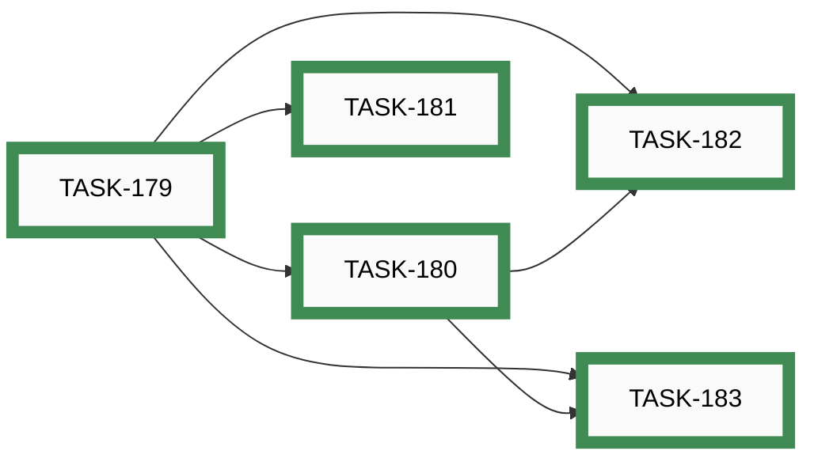

| Order | ID | Title | Status | Effort |
|-------|----|-------|--------|--------|
| 1 | ~~[TASK-179](closed/task-179-add-hardware-field-to-config-schema.md)~~ | ~~Add hardware field to config.json and schema~~ | 🟢 closed | Small (<2h) |
| 2 | ~~[TASK-180](closed/task-180-firmware-reject-hardware-mismatch.md)~~ | ~~Firmware — reject config with wrong hardware field at boot~~ | 🟢 closed | Medium (2-8h) |
| 3 | ~~[TASK-181](closed/task-181-configuration-builder-hardware-selector.md)~~ | ~~Configuration Builder — hardware selector, per-board defaults, and pinout diagram~~ | 🟢 closed | Medium (2-8h) |
| 4 | ~~[TASK-182](closed/task-182-cli-upload-config-hardware-guard.md)~~ | ~~CLI upload-config — validate hardware field before upload~~ | 🟢 closed | Small (<2h) |
| 5 | ~~[TASK-183](closed/task-183-flutter-app-hardware-aware-config.md)~~ | ~~Flutter app — hardware-aware config editing and upload guard~~ | 🟢 closed | Medium (2-8h) |

## EPIC-016: Wiring harness diagrams as code (WireViz)

[↑ back to top](#index)

**Status:** 🟢 closed — ██████████ 12/12 (100%)

```mermaid
graph LR
    TASK_187["TASK-187"]:::closed
    TASK_188["TASK-188"]:::closed
    TASK_189["TASK-189"]:::closed
    TASK_190["TASK-190"]:::closed
    TASK_191["TASK-191"]:::closed
    TASK_192["TASK-192"]:::closed
    TASK_193["TASK-193"]:::closed
    TASK_194["TASK-194"]:::closed
    TASK_195["TASK-195"]:::closed
    TASK_196["TASK-196"]:::closed
    TASK_197["TASK-197"]:::closed
    TASK_199["TASK-199"]:::closed
    TASK_187 --> TASK_188
    TASK_188 --> TASK_189
    TASK_189 --> TASK_190
    TASK_190 --> TASK_191
    TASK_189 --> TASK_192
    TASK_192 --> TASK_193
    TASK_193 --> TASK_194
    TASK_194 --> TASK_195
    TASK_195 --> TASK_196
    TASK_195 --> TASK_197
    TASK_196 --> TASK_199
    TASK_193 --> TASK_199
    click TASK_187 "closed/task-187-install-wireviz-and-graphviz.md"
    click TASK_188 "closed/task-188-author-esp32-main-harness-yml.md"
    click TASK_189 "closed/task-189-generate-esp32-svg-bom-commit.md"
    click TASK_190 "closed/task-190-embed-esp32-svg-in-build-guide.md"
    click TASK_191 "closed/task-191-retire-esp32-fritzing-artefacts.md"
    click TASK_192 "closed/task-192-add-pre-commit-hook-wireviz.md"
    click TASK_193 "closed/task-193-add-ci-staleness-guard.md"
    click TASK_194 "closed/task-194-author-nrf52840-main-harness-yml.md"
    click TASK_195 "closed/task-195-generate-nrf52840-svg-bom-embed.md"
    click TASK_196 "closed/task-196-retire-remaining-fritzing-artefacts.md"
    click TASK_197 "closed/task-197-close-idea-019.md"
    click TASK_199 "closed/task-199-end-to-end-validation.md"
    classDef open    fill:#FAFAFA,stroke:#555,stroke-width:8px,color:#000
    classDef active  fill:#FAFAFA,stroke:#1A6FA8,stroke-width:8px,color:#000
    classDef closed  fill:#FAFAFA,stroke:#3F8B53,stroke-width:8px,color:#000
    classDef paused  fill:#FAFAFA,stroke:#B07810,stroke-width:8px,color:#000
    classDef openExt    fill:#000,stroke:#888,stroke-width:8px,color:#FFF
    classDef activeExt  fill:#000,stroke:#3FA9F5,stroke-width:8px,color:#FFF
    classDef closedExt  fill:#000,stroke:#7CC68A,stroke-width:8px,color:#FFF
    classDef pausedExt  fill:#000,stroke:#F0B030,stroke-width:8px,color:#FFF
```

| Order | ID | Title | Status | Effort |
|-------|----|-------|--------|--------|
| 1 | ~~[TASK-187](closed/task-187-install-wireviz-and-graphviz.md)~~ | ~~Install WireViz and Graphviz; verify in devcontainer and local dev~~ | 🟢 closed | Small (<2h) |
| 2 | ~~[TASK-188](closed/task-188-author-esp32-main-harness-yml.md)~~ | ~~Author docs/builders/wiring/esp32/main-harness.yml~~ | 🟢 closed | Small (<2h) |
| 3 | ~~[TASK-189](closed/task-189-generate-esp32-svg-bom-commit.md)~~ | ~~Generate ESP32 SVG + BOM and commit both~~ | 🟢 closed | Small (<2h) |
| 4 | ~~[TASK-190](closed/task-190-embed-esp32-svg-in-build-guide.md)~~ | ~~Embed ESP32 wiring SVG in BUILD_GUIDE.md with reference banner~~ | 🟢 closed | Small (<2h) |
| 5 | ~~[TASK-192](closed/task-192-add-pre-commit-hook-wireviz.md)~~ | ~~Add pre-commit hook to regenerate WireViz outputs on YAML changes~~ | 🟢 closed | Small (<2h) |
| 6 | ~~[TASK-191](closed/task-191-retire-esp32-fritzing-artefacts.md)~~ | ~~Retire ESP32 Fritzing artefacts from docs/media/~~ | 🟢 closed | Small (<2h) |
| 7 | ~~[TASK-193](closed/task-193-add-ci-staleness-guard.md)~~ | ~~Add CI staleness guard for WireViz generated outputs~~ | 🟢 closed | Small (<2h) |
| 8 | ~~[TASK-194](closed/task-194-author-nrf52840-main-harness-yml.md)~~ | ~~Author docs/builders/wiring/nrf52840/main-harness.yml~~ | 🟢 closed | Small (<2h) |
| 9 | ~~[TASK-195](closed/task-195-generate-nrf52840-svg-bom-embed.md)~~ | ~~Generate nRF52840 SVG + BOM, commit, embed in docs, add banner~~ | 🟢 closed | Small (<2h) |
| 10 | ~~[TASK-196](closed/task-196-retire-remaining-fritzing-artefacts.md)~~ | ~~Retire remaining Fritzing artefacts from docs/media/~~ | 🟢 closed | Small (<2h) |
| 11 | ~~[TASK-197](closed/task-197-close-idea-019.md)~~ | ~~Close IDEA-019 — mark wiring-as-code as implemented~~ | 🟢 closed | Small (<2h) |
| 12 | ~~[TASK-199](closed/task-199-end-to-end-validation.md)~~ | ~~End-to-end validation of the wiring-as-code workflow~~ | 🟢 closed | Small (<2h) |

## EPIC-017: Video content and channel

[↑ back to top](#index)

**Status:** ⚪ _open_ — ░░░░░░░░░░ 0/7 (0%)


| Order | ID | Title | Status | Effort |
|-------|----|-------|--------|--------|
| 1 | [TASK-033](open/task-033-create-setup-installation-demo-video.md) | Create Setup/Installation Demo Video | ⚪ _open_ | Large (8-24h) |
| 2 | [TASK-034](open/task-034-create-button-configuration-demo-video.md) | Create Button Configuration Demo Video | ⚪ _open_ | Large (8-24h) |
| 3 | [TASK-035](open/task-035-create-builder-workflow-demo-video.md) | Create Builder Workflow Demo Video | ⚪ _open_ | Large (8-24h) |
| 4 | [TASK-036](open/task-036-create-advanced-features-demo-video.md) | Create Advanced Features Demo Video | ⚪ _open_ | Extra Large (24-40h) |
| 5 | [TASK-037](open/task-037-create-real-world-usage-demo-video.md) | Create Real-World Usage Demo Video | ⚪ _open_ | Extra Large (24-40h) |
| 6 | [TASK-038](open/task-038-create-troubleshooting-demo-video.md) | Create Troubleshooting Demo Video | ⚪ _open_ | Large (8-24h) |
| 7 | [TASK-049](open/task-049-setup-video-platform-channel.md) | Setup video platform channel | ⚪ _open_ | Small (<2h) |

## EPIC-018: Circuit-skill documentation diagrams

[↑ back to top](#index)

**Status:** 🟢 closed — ██████████ 5/5 (100%)


| Order | ID | Title | Status | Effort |
|-------|----|-------|--------|--------|
| 1 | ~~[TASK-241](closed/task-241-diagram-pipeline-and-dataflow.md)~~ | ~~Diagrams — pipeline and dataflow (A1, A2, A3)~~ | 🟢 closed | Medium (2-8h) |
| 2 | ~~[TASK-242](closed/task-242-diagram-static-structure.md)~~ | ~~Diagrams — static structure (D1, D2, D4)~~ | 🟢 closed | Medium (2-8h) |
| 3 | ~~[TASK-243](closed/task-243-diagram-slot-vocabulary-spatial.md)~~ | ~~Diagram — slot vocabulary spatial map (E1)~~ | 🟢 closed | Large (8-24h) |
| 4 | ~~[TASK-244](closed/task-244-diagram-contributor-workflow.md)~~ | ~~Diagram — contributor workflow sequence (C1)~~ | 🟢 closed | Small (<2h) |
| 5 | ~~[TASK-245](closed/task-245-diagram-decision-flows.md)~~ | ~~Diagrams — decision flows (B1, B2, B4)~~ | 🟢 closed | Medium (2-8h) |

## EPIC-019: iPhone app — build, test and ship

[↑ back to top](#index)

**Status:** 🔵 **active** — ░░░░░░░░░░ 0/2 (0%)


| Order | ID | Title | Status | Effort |
|-------|----|-------|--------|--------|
| 1 | [TASK-158](paused/task-158-feature-test-ios-build-deploy.md) | Feature Test — Build, deploy and test the iOS app on iPhone | 🟡 **paused** | Medium (4-8h) |
| 2 | [TASK-161](paused/task-161-publish-ios-app-store.md) | Publish app to Apple App Store | 🟡 **paused** | Large (8-24h) |

## EPIC-020: Coordinated task-system rollout — single source of truth, paused, effort actuals, burn-up

[↑ back to top](#index)

**Status:** 🟢 closed — ██████████ 7/7 (100%)

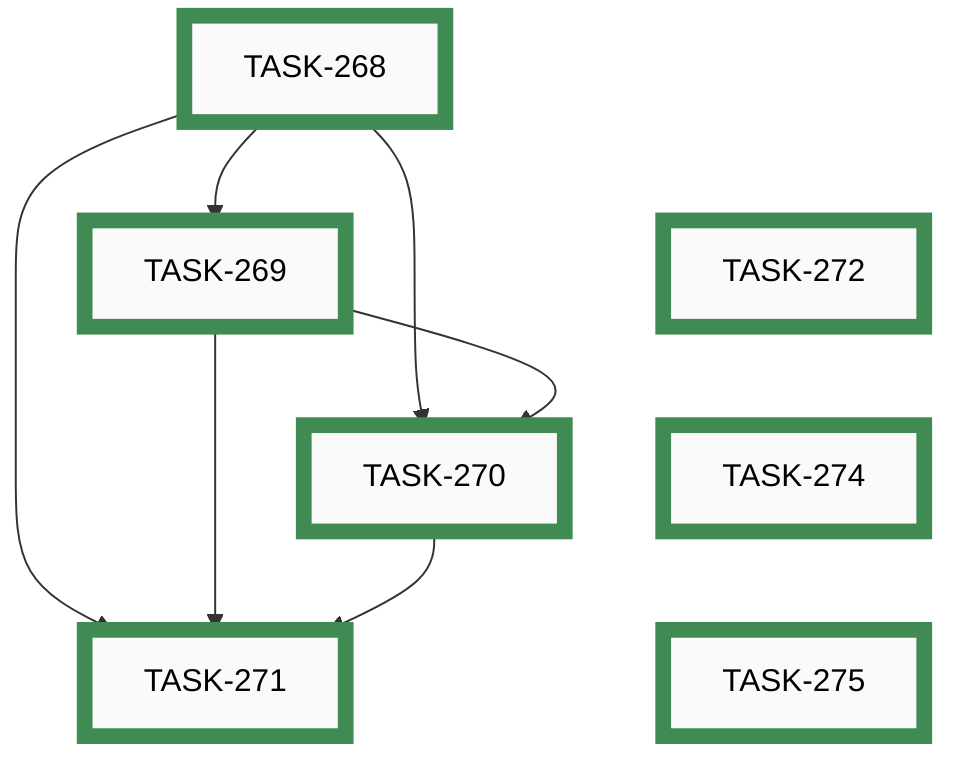

| Order | ID | Title | Status | Effort |
|-------|----|-------|--------|--------|
| 1 | ~~[TASK-268](closed/task-268-task-system-single-source-of-truth.md)~~ | ~~Single source of truth for awesome-task-system/ — sync script + divergence guard~~ | 🟢 closed | Large (8-24h) |
| 2 | ~~[TASK-269](closed/task-269-paused-as-first-class-task-status.md)~~ | ~~Paused as first-class task status — paused/ folder, status, and lifecycle~~ | 🟢 closed | Large (8-24h) |
| 3 | ~~[TASK-270](closed/task-270-effort-actual-on-close.md)~~ | ~~effort_actual on close — post-hoc t-shirt size written by /ts-task-done~~ | 🟢 closed | Small (<2h) |
| 4 | ~~[TASK-271](closed/task-271-release-burnup-chart.md)~~ | ~~Release burn-up chart — auto-generated section in tasks/OVERVIEW.md~~ | 🟢 closed | Medium (2-8h) |
| 5 | ~~[TASK-272](closed/task-272-soft-nudge-split-large-tasks.md)~~ | ~~Soft nudge to split L/XL tasks at scaffold time~~ | 🟢 closed | Small (<2h) |
| 6 | ~~[TASK-274](closed/task-274-epics-md-section-order-and-back-to-top.md)~~ | ~~EPICS.md per-epic sections in index order with back-to-top links~~ | 🟢 closed | Small (<2h) |
| 7 | ~~[TASK-275](closed/task-275-snapshot-overviews-on-release.md)~~ | ~~Snapshot OVERVIEW / EPICS / KANBAN into archive/<version>/ on release~~ | 🟢 closed | Small (<2h) |

## Unassigned

[↑ back to top](#index)

**Status:** 🔵 **active** — ████████░░ 12/15 (80%)

```mermaid
graph LR
    TASK_148["TASK-148"]:::open
    TASK_259["TASK-259"]:::open
    TASK_260["TASK-260"]:::open
    TASK_140["TASK-140"]:::closed
    TASK_141["TASK-141"]:::closed
    TASK_142["TASK-142"]:::closed
    TASK_143["TASK-143"]:::closed
    TASK_147["TASK-147"]:::closed
    TASK_165["TASK-165"]:::closed
    TASK_184["TASK-184"]:::closed
    TASK_186["TASK-186"]:::closed
    TASK_236["TASK-236"]:::closed
    TASK_237["TASK-237"]:::closed
    TASK_239["TASK-239"]:::closed
    TASK_254["TASK-254"]:::closed
    TASK_123["TASK-123"]:::closedExt
    TASK_147 --> TASK_148
    TASK_123 --> TASK_147
    TASK_236 --> TASK_237
    TASK_140 ~~~ TASK_141 ~~~ TASK_142 ~~~ TASK_143 ~~~ TASK_165 ~~~ TASK_184 ~~~ TASK_186 ~~~ TASK_236 ~~~ TASK_239 ~~~ TASK_254 ~~~ TASK_259 ~~~ TASK_260
    click TASK_148 "open/task-148-reorganise-developer-documentation.md"
    click TASK_259 "open/task-259-android-app-test-protocol.md"
    click TASK_260 "open/task-260-unify-version-numbers-across-deliverables.md"
    click TASK_140 "closed/task-140-mobile-responsive-tools.md"
    click TASK_141 "closed/task-141-auto-install-python-packages.md"
    click TASK_142 "closed/task-142-pre-commit-hook-devcontainer-validation.md"
    click TASK_143 "closed/task-143-pre-commit-hook-secrets-detection.md"
    click TASK_147 "closed/task-147-android-emulator-setup-guide.md"
    click TASK_165 "closed/task-165-flutter-dart-code-quality-pipeline.md"
    click TASK_184 "closed/task-184-schema-defect-action-value-pin-required.md"
    click TASK_186 "closed/task-186-fix-stale-libdeps-cache-local-hardware-libs.md"
    click TASK_236 "closed/task-236-retire-ble-config-test-build.md"
    click TASK_237 "closed/task-237-ble-pairing-pin.md"
    click TASK_239 "closed/task-239-wiring-diagrams-button-pullup-resistors.md"
    click TASK_254 "closed/task-254-paused-tasks-must-be-active.md"
    click TASK_123 "closed/task-123-flutter-project-scaffold.md"
    classDef open    fill:#FAFAFA,stroke:#555,stroke-width:8px,color:#000
    classDef active  fill:#FAFAFA,stroke:#1A6FA8,stroke-width:8px,color:#000
    classDef closed  fill:#FAFAFA,stroke:#3F8B53,stroke-width:8px,color:#000
    classDef paused  fill:#FAFAFA,stroke:#B07810,stroke-width:8px,color:#000
    classDef openExt    fill:#000,stroke:#888,stroke-width:8px,color:#FFF
    classDef activeExt  fill:#000,stroke:#3FA9F5,stroke-width:8px,color:#FFF
    classDef closedExt  fill:#000,stroke:#7CC68A,stroke-width:8px,color:#FFF
    classDef pausedExt  fill:#000,stroke:#F0B030,stroke-width:8px,color:#FFF
```

| Order | ID | Title | Status | Effort |
|-------|----|-------|--------|--------|
| ? | [TASK-148](open/task-148-reorganise-developer-documentation.md) | Reorganise Developer Documentation | ⚪ _open_ | Medium (2-8h) |
| ? | [TASK-259](open/task-259-android-app-test-protocol.md) | Android app test protocol — record device and Android version per test run | ⚪ _open_ | Small (<2h) |
| ? | [TASK-260](open/task-260-unify-version-numbers-across-deliverables.md) | Unify version numbers across all deliverables (firmware, app, CLI, simulator, …) | ⚪ _open_ | Medium (2-8h) |
| ? | ~~[TASK-140](closed/task-140-mobile-responsive-tools.md)~~ | ~~Mobile-Responsive Layout for Simulator and Configurator Tools~~ | 🟢 closed | Large (8-24h) |
| ? | ~~[TASK-141](closed/task-141-auto-install-python-packages.md)~~ | ~~Auto-Install Python Packages in Dev Container~~ | 🟢 closed | Small (<2h) |
| ? | ~~[TASK-142](closed/task-142-pre-commit-hook-devcontainer-validation.md)~~ | ~~Pre-Commit Hook for Dev Container Validation~~ | 🟢 closed | Small (<2h) |
| ? | ~~[TASK-143](closed/task-143-pre-commit-hook-secrets-detection.md)~~ | ~~Pre-Commit Hook for Secrets Detection~~ | 🟢 closed | Small (<2h) |
| ? | ~~[TASK-147](closed/task-147-android-emulator-setup-guide.md)~~ | ~~Android Emulator Setup Guide for App Development~~ | 🟢 closed | Small (<2h) |
| ? | ~~[TASK-165](closed/task-165-flutter-dart-code-quality-pipeline.md)~~ | ~~Flutter/Dart code quality pipeline — pre-commit hooks, CI, skills, and Makefile targets~~ | 🟢 closed | Medium (2-8h) |
| ? | ~~[TASK-184](closed/task-184-schema-defect-action-value-pin-required.md)~~ | ~~Schema defect — action value/pin fields not required~~ | 🟢 closed | Small (<2h) |
| ? | ~~[TASK-186](closed/task-186-fix-stale-libdeps-cache-local-hardware-libs.md)~~ | ~~Fix stale libdeps cache for local hardware libs in test environments~~ | 🟢 closed | Small (<2h) |
| ? | ~~[TASK-236](closed/task-236-retire-ble-config-test-build.md)~~ | ~~Retire BLE_CONFIG_TEST_BUILD — update runner.py to test production firmware path~~ | 🟢 closed | Medium (2-8h) |
| ? | ~~[TASK-237](closed/task-237-ble-pairing-pin.md)~~ | ~~BLE pairing PIN — configurable in hardware config, applied to NimBLE security~~ | 🟢 closed | Large (8-24h) |
| ? | ~~[TASK-239](closed/task-239-wiring-diagrams-button-pullup-resistors.md)~~ | ~~Update wiring diagrams — add external pull-up resistors to button pins~~ | 🟢 closed | Small (<2h) |
| ? | ~~[TASK-254](closed/task-254-paused-tasks-must-be-active.md)~~ | ~~Enforce active status for paused tasks blocked by defects~~ | 🟢 closed | Small (<2h) |

