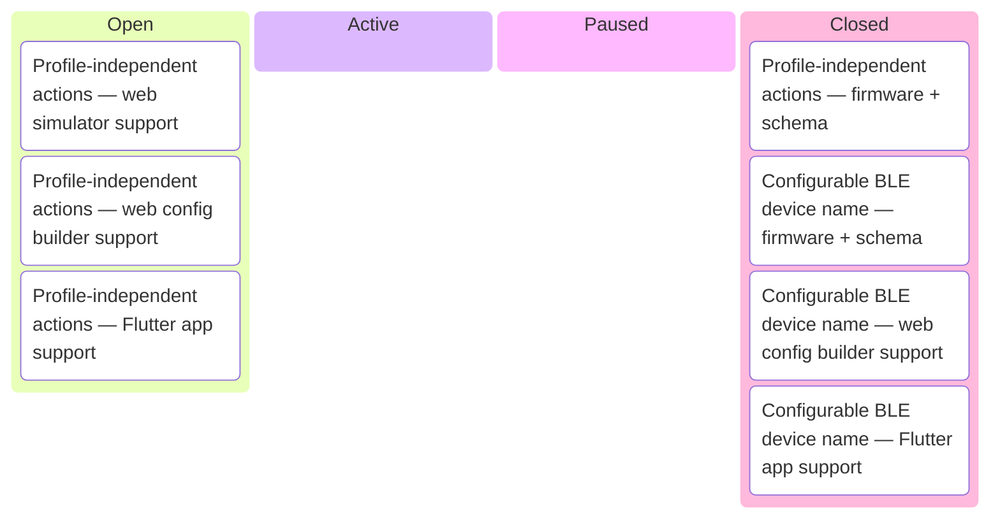
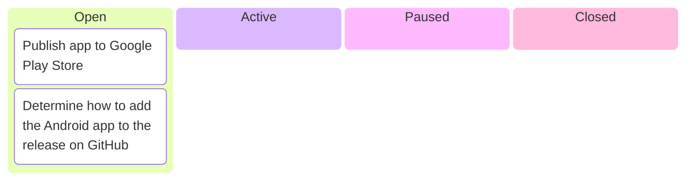
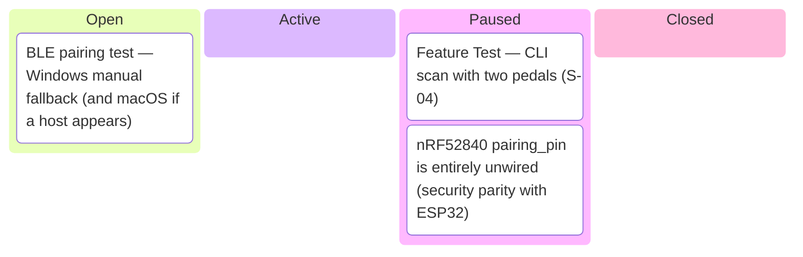
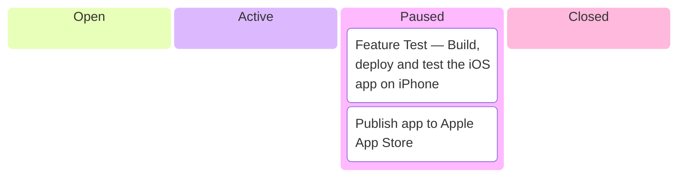
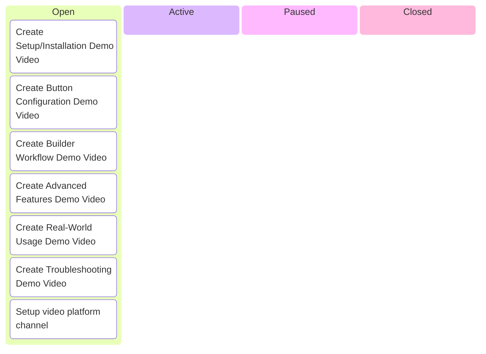
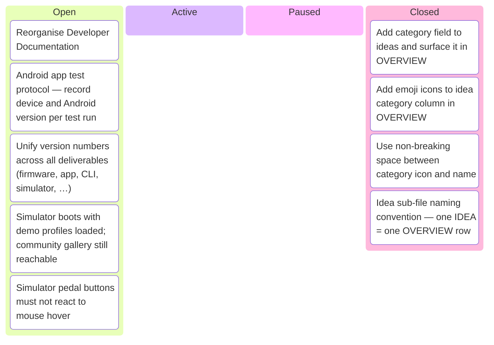

# Kanban Board

_Auto-generated by `housekeep.py`. Do not edit manually._

**Epics:** [config-driven-runtime-customisation](#config-driven-runtime-customisation) · [distribution](#distribution) · [feature_test](#feature_test) · [iphone-app](#iphone-app) · [video-content](#video-content) · [Other](#other)

## config-driven-runtime-customisation

_⚪ 3 open · 🔵 0 active · 🟡 0 paused · 🟢 4 closed · ██████░░░░ 57%_

## distribution

_⚪ 2 open · 🔵 0 active · 🟡 0 paused · 🟢 0 closed · ░░░░░░░░░░ 0%_

## feature_test

_⚪ 1 open · 🔵 0 active · 🟡 2 paused · 🟢 0 closed · ░░░░░░░░░░ 0%_

## iphone-app

_⚪ 0 open · 🔵 0 active · 🟡 2 paused · 🟢 0 closed · ░░░░░░░░░░ 0%_

## video-content

_⚪ 7 open · 🔵 0 active · 🟡 0 paused · 🟢 0 closed · ░░░░░░░░░░ 0%_

## Other

_⚪ 5 open · 🔵 0 active · 🟡 0 paused · 🟢 4 closed · ████░░░░░░ 44%_

