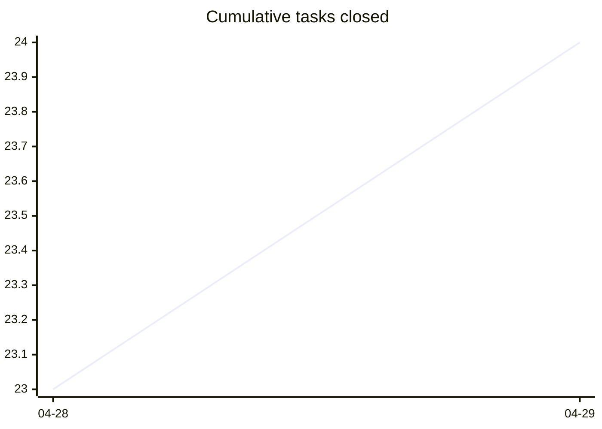
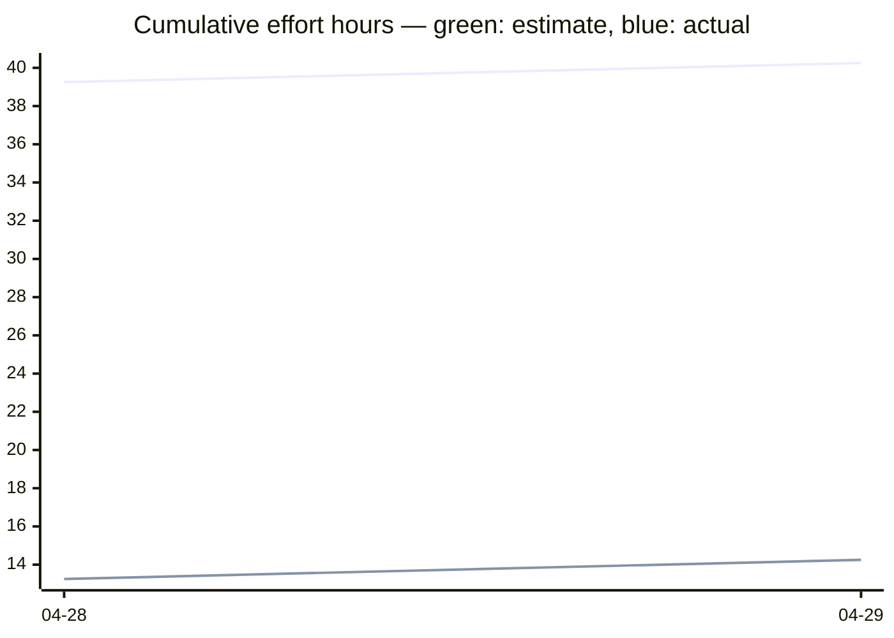

# Task Overview

<!-- HEADER -->

⚪ **Open: 15** | 🔵 **Active: 0** | 🟡 **Paused: 4** | 🟢 **Closed: 25** | **Total: 44** | ██████░░░░ 57%

**Jump to:** [Burn-up](#burn-up) · [Active Tasks](#active-tasks) · [Paused Tasks](#paused-tasks) · [Open Tasks](#open-tasks) · [Closed Tasks](#closed-tasks)

<!-- END HEADER -->

<!-- BURNUP:START -->

<a id="burn-up"></a>

## Burn-up since v0.4.0

<table><tr><td>



</td><td>

```mermaid
xychart-beta
    title "Cumulative epics closed"
    x-axis ["04-28", "04-29"]
    line [1, 1]
```

</td><td>



</td></tr></table>

_Legend: green line = estimate (midpoint hours from `effort:`); blue line = actual (midpoint hours from `effort_actual:`)._

| Date | Tasks closed | Cum. tasks | Est. h | Cum. est. h | Actual h | Cum. actual h | Epics closed | Cum. epics |
|------|-------------:|-----------:|-------:|------------:|---------:|--------------:|-------------:|-----------:|
| 2026-04-28 | 23 | 23 | 39.2 | 39.2 | 13.2 | 13.2 | 1 | 1 |
| 2026-04-29 | 1 | 24 | 1 | 40.2 | 1 | 14.2 | 0 | 1 |
<!-- BURNUP:END -->

<!-- GENERATED -->

## Active Tasks

_No active tasks._

## Paused Tasks

| ID | Title | Effort | Complexity | Status |
|----|-------|--------|------------|--------|
| [TASK-158](paused/task-158-feature-test-ios-build-deploy.md) | Feature Test — Build, deploy and test the iOS app on iPhone | Medium (4-8h) | Medium | 🟡 **paused** |
| [TASK-161](paused/task-161-publish-ios-app-store.md) | Publish app to Apple App Store | Large (8-24h) | High | 🟡 **paused** |
| [TASK-226](paused/task-226-feature-test-cli-scan-two-pedals.md) | Feature Test — CLI scan with two pedals (S-04) | Small (<2h) | Low | 🟡 **paused** |
| [TASK-249](paused/task-249-nrf52840-pairing-pin-unwired.md) | nRF52840 pairing_pin is entirely unwired (security parity with ESP32) | Medium (2-8h) | Medium | 🟡 **paused** |

## Open Tasks

| ID | Title | Effort | Complexity | Status |
|----|-------|--------|------------|--------|
| [TASK-033](open/task-033-create-setup-installation-demo-video.md) | Create Setup/Installation Demo Video | Large (8-24h) | Medium | ⚪ open |
| [TASK-034](open/task-034-create-button-configuration-demo-video.md) | Create Button Configuration Demo Video | Large (8-24h) | Medium | ⚪ open |
| [TASK-035](open/task-035-create-builder-workflow-demo-video.md) | Create Builder Workflow Demo Video | Large (8-24h) | Medium | ⚪ open |
| [TASK-036](open/task-036-create-advanced-features-demo-video.md) | Create Advanced Features Demo Video | Extra Large (24-40h) | Senior | ⚪ open |
| [TASK-037](open/task-037-create-real-world-usage-demo-video.md) | Create Real-World Usage Demo Video | Extra Large (24-40h) | Senior | ⚪ open |
| [TASK-038](open/task-038-create-troubleshooting-demo-video.md) | Create Troubleshooting Demo Video | Large (8-24h) | Medium | ⚪ open |
| [TASK-049](open/task-049-setup-video-platform-channel.md) | Setup video platform channel | Small (<2h) | Junior | ⚪ open |
| [TASK-148](open/task-148-reorganise-developer-documentation.md) | Reorganise Developer Documentation | Medium (2-8h) | Medium | ⚪ open |
| [TASK-160](open/task-160-publish-android-play-store.md) | Publish app to Google Play Store | Large (8-24h) | Medium | ⚪ open |
| [TASK-179](open/task-179-determine-android-app-release.md) | Determine how to add the Android app to the release on GitHub | Small (<2h) | Junior | ⚪ open |
| [TASK-248](open/task-248-ble-pairing-test-windows-fallback.md) | BLE pairing test — Windows manual fallback (and macOS if a host appears) | Small (<2h) | Small | ⚪ open |
| [TASK-259](open/task-259-android-app-test-protocol.md) | Android app test protocol — record device and Android version per test run | Small (<2h) | Junior | ⚪ open |
| [TASK-260](open/task-260-unify-version-numbers-across-deliverables.md) | Unify version numbers across all deliverables (firmware, app, CLI, simulator, …) | Medium (2-8h) | Medium | ⚪ open |
| [TASK-303](open/task-303-simulator-boots-with-demo-loaded.md) | Simulator boots with demo profiles loaded; community gallery still reachable | Small (<2h) | Junior | ⚪ open |
| [TASK-304](open/task-304-simulator-button-no-hover-reaction.md) | Simulator pedal buttons must not react to mouse hover | XS (<30m) | Junior | ⚪ open |

## Closed Tasks

| ID | Title | Effort |
|----|-------|--------|
| [TASK-261](closed/task-261-reorganize-entry-points-per-target-subfolders.md) | Reorganize entry points into per-target subfolders | Small (<2h) |
| [TASK-280](closed/task-280-defect-action-editor-value-carries-over-on-type-change.md) | Defect — Action Editor value field carries over when Action Type changes | Small (<2h) |
| [TASK-281](closed/task-281-defect-validation-banner-stale-on-action-edit.md) | Defect — Validation banner stale until profile count changes | XS (<30m) |
| [TASK-282](closed/task-282-introduce-pedalapp-and-esp32pedalapp.md) | Introduce PedalApp base + Esp32PedalApp, migrate ESP32 #ifdef blocks | Medium (2-8h) |
| [TASK-283](closed/task-283-ui-driving-skill.md) | Make UI-driving via adb a first-class skill the agent actually uses | Medium (2-8h) |
| [TASK-284](closed/task-284-housekeep-skill.md) | Add /housekeep skill wrapping scripts/housekeep.py --apply | Small (<2h) |
| [TASK-285](closed/task-285-commit-skill.md) | Add /commit skill encoding the --no-verify decision protocol | Small (<2h) |
| [TASK-286](closed/task-286-doc-check-auto-trigger.md) | Promote doc-check from advisory to auto-trigger on .md file moves | Small (<2h) |
| [TASK-287](closed/task-287-status-skill.md) | Add /status skill bundling branch + last 3 commits + git status --short | XS (<30m) |
| [TASK-288](closed/task-288-explore-subagent-guidance.md) | Add CLAUDE.md guidance to prefer Explore subagent for multi-step searches | XS (<30m) |
| [TASK-289](closed/task-289-add-nrf52840pedalapp-retire-shared-main.md) | Add Nrf52840PedalApp, retire shared main.cpp | Small (<2h) |
| [TASK-290](closed/task-290-direnv-project-envvars.md) | Project-level env-var setup (direnv or equivalent) to kill source/cd churn | Small (<2h) |
| [TASK-291](closed/task-291-ble-reset-skill.md) | Add /ble-reset skill encapsulating the flaky-pairing recovery dance | Small (<2h) |
| [TASK-292](closed/task-292-extract-blepedalapp-shared-layer.md) | Extract BlePedalApp shared layer (Phase 2) | Medium (2-8h) |
| [TASK-293](closed/task-293-hostpedalapp-fake-eliminate-guards-logger-timing.md) | Phase 3a — HostPedalApp fake; eliminate HOST_TEST_BUILD from logger / timing | Medium (2-8h) |
| [TASK-294](closed/task-294-eliminate-host-test-build-from-actions.md) | Phase 3b — eliminate HOST_TEST_BUILD from action implementations | Small (<2h) |
| [TASK-295](closed/task-295-ifilesystem-di-finish-phase-3.md) | Phase 3c — IFileSystem DI; eliminate HOST_TEST_BUILD from littlefs (finish Phase 3) | Medium (2-8h) |
| [TASK-296](closed/task-296-collapse-lib-hardware-esp32-into-src.md) | Phase 4a — collapse lib/hardware/esp32 into src/esp32 | Small (<2h) |
| [TASK-297](closed/task-297-collapse-lib-hardware-nrf52840-into-src.md) | Phase 4b — collapse lib/hardware/nrf52840 into src/nrf52840; delete lib/hardware/ | Small (<2h) |
| [TASK-298](closed/task-298-mirror-include-src-layout-under-target.md) | Phase 4c — mirror include/ + src/ layout under each target | XS (<30m) |
| [TASK-299](closed/task-299-consolidate-host-platform-under-src.md) | Phase 4d — consolidate host platform implementations under src/host/ | XS (<30m) |
| [TASK-300](closed/task-300-host-pedal-app-inherits-blepedalapp.md) | Phase 4e — HostPedalApp inherits BlePedalApp; accepts injected dependencies | Small (<2h) |
| [TASK-301](closed/task-301-per-pin-fake-gpio.md) | Phase 4f — per-pin fake_gpio for multi-button host tests | Small (<2h) |
| [TASK-302](closed/task-302-end-to-end-app-integration-tests.md) | Phase 4g — end-to-end PedalApp integration tests on host | Small (<2h) |
| [TASK-303](closed/task-303-phase-5-docs-overhaul.md) | Phase 5 — docs overhaul to match the post-EPIC-020 architecture | Medium (2-8h) |

## Archived Releases

- [v0.2.0](archive/v0.2.0/OVERVIEW.md)
- [v0.3.0](archive/v0.3.0/OVERVIEW.md)
- [v0.4.0](archive/v0.4.0/OVERVIEW.md)
<!-- END GENERATED -->
