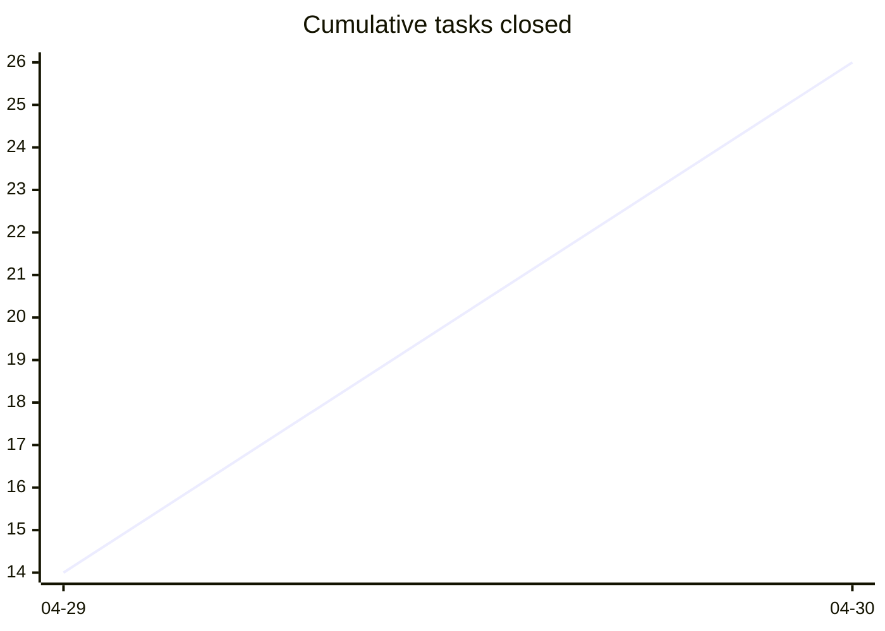
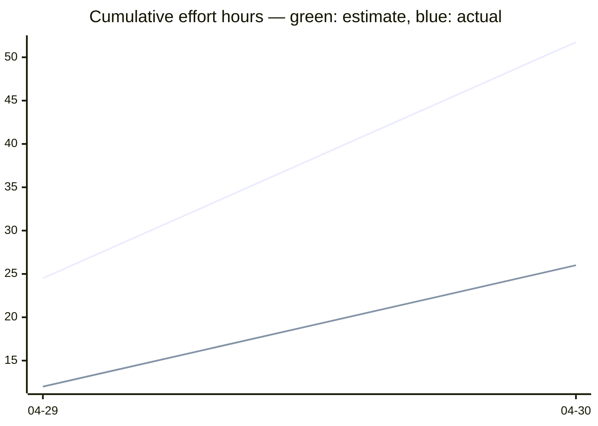

# Task Overview

<!-- HEADER -->

⚪ **Open: 13** | 🔵 **Active: 1** | 🟡 **Paused: 4** | 🟢 **Closed: 26** | **Total: 44** | ██████░░░░ 59%

**Jump to:** [Burn-up](#burn-up) · [Active Tasks](#active-tasks) · [Paused Tasks](#paused-tasks) · [Open Tasks](#open-tasks) · [Closed Tasks](#closed-tasks)

<!-- END HEADER -->

<!-- BURNUP:START -->

<a id="burn-up"></a>

## Burn-up since v0.4.1

<table><tr><td>



</td><td>

```mermaid
xychart-beta
    title "Cumulative epics closed"
    x-axis ["04-29", "04-30"]
    line [1, 3]
```

</td><td>



</td></tr></table>

_Legend: green line = estimate (midpoint hours from `effort:`); blue line = actual (midpoint hours from `effort_actual:`)._

| Date | Tasks closed | Cum. tasks | Est. h | Cum. est. h | Actual h | Cum. actual h | Epics closed | Cum. epics |
|------|-------------:|-----------:|-------:|------------:|---------:|--------------:|-------------:|-----------:|
| 2026-04-29 | 14 | 14 | 24.5 | 24.5 | 12 | 12 | 1 | 1 |
| 2026-04-30 | 12 | 26 | 27.2 | 51.8 | 14 | 26 | 2 | 3 |
<!-- BURNUP:END -->

<!-- GENERATED -->

## Active Tasks

| ID | Title | Effort | Complexity | Status |
|----|-------|--------|------------|--------|
| [TASK-328](active/task-328-prevent-parallel-housekeep-execution.md) | Prevent parallel execution of housekeep.py (and audit sibling scripts) | Small (<2h) | Medium | 🔵 **active** |

## Paused Tasks

| ID | Title | Effort | Complexity | Status |
|----|-------|--------|------------|--------|
| [TASK-158](paused/task-158-feature-test-ios-build-deploy.md) | Feature Test — Build, deploy and test the iOS app on iPhone | Medium (4-8h) | Medium | 🟡 **paused** |
| [TASK-161](paused/task-161-publish-ios-app-store.md) | Publish app to Apple App Store | Large (8-24h) | High | 🟡 **paused** |
| [TASK-226](paused/task-226-feature-test-cli-scan-two-pedals.md) | Feature Test — CLI scan with two pedals (S-04) | Small (<2h) | Low | 🟡 **paused** |
| [TASK-249](paused/task-249-nrf52840-pairing-pin-unwired.md) | nRF52840 pairing_pin is entirely unwired (security parity with ESP32) | Medium (2-8h) | Medium | 🟡 **paused** |

## Open Tasks

| ID | Title | Effort | Complexity | Status |
|----|-------|--------|------------|--------|
| [TASK-033](open/task-033-create-setup-installation-demo-video.md) | Create Setup/Installation Demo Video | Large (8-24h) | Medium | ⚪ open |
| [TASK-034](open/task-034-create-button-configuration-demo-video.md) | Create Button Configuration Demo Video | Large (8-24h) | Medium | ⚪ open |
| [TASK-035](open/task-035-create-builder-workflow-demo-video.md) | Create Builder Workflow Demo Video | Large (8-24h) | Medium | ⚪ open |
| [TASK-036](open/task-036-create-advanced-features-demo-video.md) | Create Advanced Features Demo Video | Extra Large (24-40h) | Senior | ⚪ open |
| [TASK-037](open/task-037-create-real-world-usage-demo-video.md) | Create Real-World Usage Demo Video | Extra Large (24-40h) | Senior | ⚪ open |
| [TASK-038](open/task-038-create-troubleshooting-demo-video.md) | Create Troubleshooting Demo Video | Large (8-24h) | Medium | ⚪ open |
| [TASK-049](open/task-049-setup-video-platform-channel.md) | Setup video platform channel | Small (<2h) | Junior | ⚪ open |
| [TASK-148](open/task-148-reorganise-developer-documentation.md) | Reorganise Developer Documentation | Medium (2-8h) | Medium | ⚪ open |
| [TASK-160](open/task-160-publish-android-play-store.md) | Publish app to Google Play Store | Large (8-24h) | Medium | ⚪ open |
| [TASK-179](open/task-179-determine-android-app-release.md) | Determine how to add the Android app to the release on GitHub | Small (<2h) | Junior | ⚪ open |
| [TASK-248](open/task-248-ble-pairing-test-windows-fallback.md) | BLE pairing test — Windows manual fallback (and macOS if a host appears) | Small (<2h) | Small | ⚪ open |
| [TASK-260](open/task-260-unify-version-numbers-across-deliverables.md) | Unify version numbers across all deliverables (firmware, app, CLI, simulator, …) | Medium (2-8h) | Medium | ⚪ open |
| [TASK-329](open/task-329-drop-auto-git-add-from-commit-pathspec.md) | Drop auto-git-add for untracked files from commit-pathspec.sh | Small (<2h) | Medium | ⚪ open |

## Closed Tasks

| ID | Title | Effort |
|----|-------|--------|
| [TASK-259](closed/task-259-android-app-test-protocol.md) | Android app test protocol — record device and Android version per test run | Small (<2h) |
| [TASK-303](closed/task-303-simulator-boots-with-demo-loaded.md) | Simulator boots with demo profiles loaded; community gallery still reachable | Small (<2h) |
| [TASK-304](closed/task-304-simulator-button-no-hover-reaction.md) | Simulator pedal buttons must not react to mouse hover | XS (<30m) |
| [TASK-305](closed/task-305-add-category-field-to-ideas.md) | Add category field to ideas and surface it in OVERVIEW | Medium (2-8h) |
| [TASK-306](closed/task-306-profile-independent-actions-firmware.md) | Profile-independent actions — firmware + schema | Medium (2-8h) |
| [TASK-307](closed/task-307-profile-independent-actions-simulator.md) | Profile-independent actions — web simulator support | Small (<2h) |
| [TASK-308](closed/task-308-profile-independent-actions-config-builder.md) | Profile-independent actions — web config builder support | Small (<2h) |
| [TASK-309](closed/task-309-profile-independent-actions-flutter-app.md) | Profile-independent actions — Flutter app support | Small (<2h) |
| [TASK-310](closed/task-310-configurable-ble-device-name-firmware.md) | Configurable BLE device name — firmware + schema | Medium (2-8h) |
| [TASK-311](closed/task-311-configurable-ble-device-name-config-builder.md) | Configurable BLE device name — web config builder support | Small (<2h) |
| [TASK-312](closed/task-312-configurable-ble-device-name-flutter-app.md) | Configurable BLE device name — Flutter app support | Small (<2h) |
| [TASK-313](closed/task-313-emoji-icons-for-idea-categories.md) | Add emoji icons to idea category column in OVERVIEW | Small (<2h) |
| [TASK-314](closed/task-314-nbsp-between-icon-and-category.md) | Use non-breaking space between category icon and name | XS (<30m) |
| [TASK-315](closed/task-315-idea-sub-file-naming-convention.md) | Idea sub-file naming convention — one IDEA = one OVERVIEW row | Small (<2h) |
| [TASK-316](closed/task-316-epic-branch-frontmatter-field.md) | Add optional `branch:` field to epic frontmatter | Small (<2h) |
| [TASK-317](closed/task-317-ts-epic-new-autofill-branch.md) | `/ts-epic-new` auto-fills `branch: feature/<epic-slug>` | Small (<2h) |
| [TASK-318](closed/task-318-ts-task-active-branch-nag.md) | `/ts-task-active` nags when current branch ≠ epic's `branch:` | Medium (2-8h) |
| [TASK-319](closed/task-319-remove-wireviz-precommit-block.md) | Pre-commit hook — remove WireViz regen block and verify no remnants | Small (<2h) |
| [TASK-320](closed/task-320-remove-ble-flag-precommit-check.md) | Pre-commit hook — remove BLE_CONFIG_TEST_BUILD check (orphan from TASK-236) | XS (<30m) |
| [TASK-321](closed/task-321-fix-ci-failures-mermaid-clang-tidy.md) | Fix CI failures (Mermaid lint, clang-tidy) and prevent dirty pushes | Medium (2-8h) |
| [TASK-322](closed/task-322-decide-commit-provenance-and-bypass-mechanism.md) | Decide commit-provenance signal and bypass mechanism for /commit | Small (<2h) |
| [TASK-323](closed/task-323-convert-commit-skill-to-pathspec-form.md) | Convert /commit skill to pathspec form | Small (<2h) |
| [TASK-324](closed/task-324-update-claudemd-and-add-commit-policy-page.md) | Update CLAUDE.md and add COMMIT_POLICY.md rationale page | Small (<2h) |
| [TASK-325](closed/task-325-implement-precommit-hook-enforcement.md) | Implement pre-commit hook enforcement of /commit-only commits | Medium (2-8h) |
| [TASK-326](closed/task-326-route-other-commit-skills-through-commit.md) | Route /release, /release-branch, and other commit-issuing skills through /commit | Medium (2-8h) |
| [TASK-327](closed/task-327-decide-partial-hunk-policy.md) | Decide partial-hunk policy — unsupported, or /commit --partial escape hatch | Small (<2h) |

## Archived Releases

- [v0.2.0](archive/v0.2.0/OVERVIEW.md)
- [v0.3.0](archive/v0.3.0/OVERVIEW.md)
- [v0.4.0](archive/v0.4.0/OVERVIEW.md)
- [v0.4.1](archive/v0.4.1/OVERVIEW.md)
<!-- END GENERATED -->
