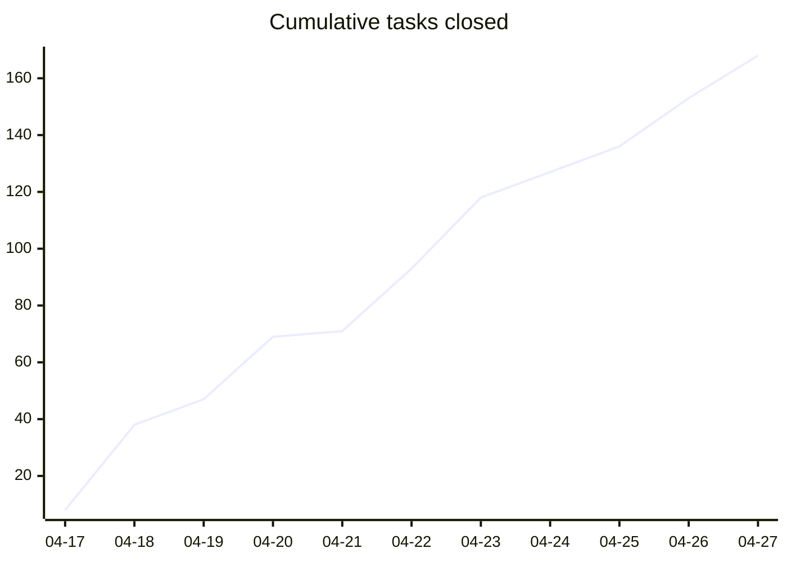
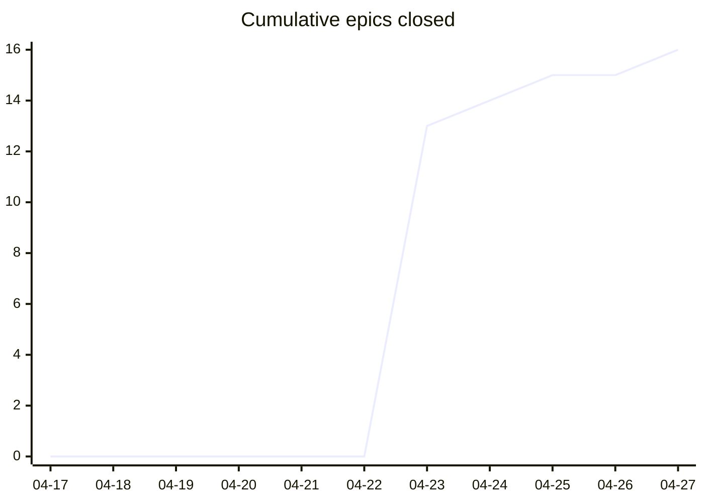
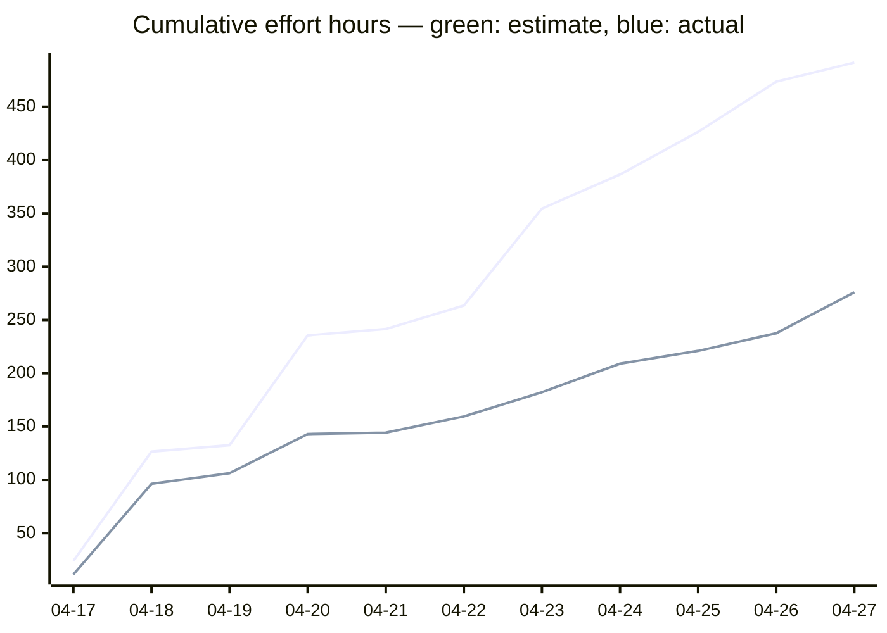

# Task Overview

<!-- HEADER -->

⚪ **Open: 13** | 🔵 **Active: 0** | 🟡 **Paused: 4** | 🟢 **Closed: 169** | **Total: 186** | █████████░ 91%

**Jump to:** [Burn-up](#burn-up) · [Active Tasks](#active-tasks) · [Paused Tasks](#paused-tasks) · [Open Tasks](#open-tasks) · [Closed Tasks](#closed-tasks)

<!-- END HEADER -->

<!-- BURNUP:START -->

## Burn-up since v0.3.0

<table><tr><td>

</td><td>

</td><td>

</td></tr></table>

_Legend: green line = estimate (midpoint hours from `effort:`); blue line = actual (midpoint hours from `effort_actual:`)._

| Date | Tasks closed | Cum. tasks | Est. h | Cum. est. h | Actual h | Cum. actual h | Epics closed | Cum. epics |
|------|-------------:|-----------:|-------:|------------:|---------:|--------------:|-------------:|-----------:|
| 2026-04-17 | 8 | 8 | 24 | 24 | 11.2 | 11.2 | 0 | 0 |
| 2026-04-18 | 30 | 38 | 102.5 | 126.5 | 85 | 96.2 | 0 | 0 |
| 2026-04-19 | 9 | 47 | 6 | 132.5 | 10 | 106.2 | 0 | 0 |
| 2026-04-20 | 22 | 69 | 103 | 235.5 | 36.8 | 143 | 0 | 0 |
| 2026-04-21 | 2 | 71 | 6 | 241.5 | 1.2 | 144.2 | 0 | 0 |
| 2026-04-22 | 22 | 93 | 22 | 263.5 | 15.2 | 159.5 | 0 | 0 |
| 2026-04-23 | 25 | 118 | 91 | 354.5 | 22.8 | 182.2 | 13 | 13 |
| 2026-04-24 | 9 | 127 | 32 | 386.5 | 26.8 | 209 | 1 | 14 |
| 2026-04-25 | 9 | 136 | 40 | 426.5 | 12 | 221 | 1 | 15 |
| 2026-04-26 | 17 | 153 | 47 | 473.5 | 16.5 | 237.5 | 0 | 15 |
| 2026-04-27 | 15 | 168 | 18 | 491.5 | 38.5 | 276 | 1 | 16 |
<!-- BURNUP:END -->

<!-- GENERATED -->

## Active Tasks

_No active tasks._

## Paused Tasks

| ID | Title | Effort | Complexity | Status |
|----|-------|--------|------------|--------|
| [TASK-158](paused/task-158-feature-test-ios-build-deploy.md) | Feature Test — Build, deploy and test the iOS app on iPhone | Medium (4-8h) | Medium | 🟡 **paused** |
| [TASK-161](paused/task-161-publish-ios-app-store.md) | Publish app to Apple App Store | Large (8-24h) | High | 🟡 **paused** |
| [TASK-226](paused/task-226-feature-test-cli-scan-two-pedals.md) | Feature Test — CLI scan with two pedals (S-04) | Small (<2h) | Low | 🟡 **paused** |
| [TASK-249](paused/task-249-nrf52840-pairing-pin-unwired.md) | nRF52840 pairing_pin is entirely unwired (security parity with ESP32) | Medium (2-8h) | Medium | 🟡 **paused** |

## Open Tasks

| ID | Title | Effort | Complexity | Status |
|----|-------|--------|------------|--------|
| [TASK-033](open/task-033-create-setup-installation-demo-video.md) | Create Setup/Installation Demo Video | Large (8-24h) | Medium | ⚪ open |
| [TASK-034](open/task-034-create-button-configuration-demo-video.md) | Create Button Configuration Demo Video | Large (8-24h) | Medium | ⚪ open |
| [TASK-035](open/task-035-create-builder-workflow-demo-video.md) | Create Builder Workflow Demo Video | Large (8-24h) | Medium | ⚪ open |
| [TASK-036](open/task-036-create-advanced-features-demo-video.md) | Create Advanced Features Demo Video | Extra Large (24-40h) | Senior | ⚪ open |
| [TASK-037](open/task-037-create-real-world-usage-demo-video.md) | Create Real-World Usage Demo Video | Extra Large (24-40h) | Senior | ⚪ open |
| [TASK-038](open/task-038-create-troubleshooting-demo-video.md) | Create Troubleshooting Demo Video | Large (8-24h) | Medium | ⚪ open |
| [TASK-049](open/task-049-setup-video-platform-channel.md) | Setup video platform channel | Small (<2h) | Junior | ⚪ open |
| [TASK-148](open/task-148-reorganise-developer-documentation.md) | Reorganise Developer Documentation | Medium (2-8h) | Medium | ⚪ open |
| [TASK-160](open/task-160-publish-android-play-store.md) | Publish app to Google Play Store | Large (8-24h) | Medium | ⚪ open |
| [TASK-179](open/task-179-determine-android-app-release.md) | Determine how to add the Android app to the release on GitHub | Small (<2h) | Junior | ⚪ open |
| [TASK-248](open/task-248-ble-pairing-test-windows-fallback.md) | BLE pairing test — Windows manual fallback (and macOS if a host appears) | Small (<2h) | Small | ⚪ open |
| [TASK-259](open/task-259-android-app-test-protocol.md) | Android app test protocol — record device and Android version per test run | Small (<2h) | Junior | ⚪ open |
| [TASK-260](open/task-260-unify-version-numbers-across-deliverables.md) | Unify version numbers across all deliverables (firmware, app, CLI, simulator, …) | Medium (2-8h) | Medium | ⚪ open |

## Closed Tasks

| ID | Title | Effort |
|----|-------|--------|
| [TASK-101](closed/task-101-pinaction-host-test-audit.md) | Audit and Fill PinAction Host Test Gaps | Small (<2h) |
| [TASK-102](closed/task-102-getjsonproperties-on-pinaction.md) | Implement getJsonProperties on PinAction | Small (<2h) |
| [TASK-103](closed/task-103-on-device-gpio-testrig-esp32.md) | On-Device GPIO Testrig for PinAction (ESP32) | Medium (2-8h) |
| [TASK-104](closed/task-104-button-longpress-doublepress-detection.md) | Button Long-Press and Double-Press Detection | Medium (2-8h) |
| [TASK-105](closed/task-105-eventdispatcher-multievent-api.md) | EventDispatcher Multi-Event API | Small (<2h) |
| [TASK-106](closed/task-106-config-schema-multievent.md) | Config Schema Extension for Multi-Event Bindings | Small (<2h) |
| [TASK-107](closed/task-107-mainloop-multievent-wiring.md) | Wire Multi-Event Dispatch in main.cpp | Small (<2h) |
| [TASK-108](closed/task-108-host-tests-longpress-doublepress.md) | Host Tests for Long Press and Double Press | Medium (2-8h) |
| [TASK-109](closed/task-109-ondevice-multipress-test.md) | On-Device Multi-Press Integration Test (ESP32) | Medium (2-8h) |
| [TASK-110](closed/task-110-macro-action-type-keylookup.md) | Add Macro to Action::Type and key_lookup | Trivial (<30m) |
| [TASK-111](closed/task-111-macroaction-class.md) | MacroAction Class and Step Engine | Medium (2-8h) |
| [TASK-112](closed/task-112-config-loader-macro-steps.md) | Config Loader: Parse Macro Steps | Small (<2h) |
| [TASK-113](closed/task-113-mainloop-macro-update.md) | Wire MacroAction::update in main.cpp | Trivial (<30m) |
| [TASK-114](closed/task-114-host-tests-macroaction.md) | Host Tests for MacroAction | Medium (2-8h) |
| [TASK-115](closed/task-115-profiles-schema-json.md) | Create profiles.schema.json and Pre-Commit Validation | Small (<2h) |
| [TASK-116](closed/task-116-config-schema-json.md) | Create config.schema.json and data/config.json | Small (<2h) |
| [TASK-117](closed/task-117-ble-config-gatt-spec.md) | BLE Config GATT Service Spec Document | Small (<2h) |
| [TASK-118](closed/task-118-esp32-ble-config-service.md) | ESP32 BLE Config Service Implementation | Large (>8h) |
| [TASK-119](closed/task-119-python-cli-tool.md) | Python CLI Tool for Profile Upload | Medium (2-8h) |
| [TASK-120](closed/task-120-cli-ble-host-tests.md) | Host and Unit Tests for CLI and BLE Reassembly | Medium (2-8h) |
| [TASK-121](closed/task-121-ble-config-integration-tests.md) | BLE Config Integration Tests (Host + On-Device) | Large (>8h) |
| [TASK-122](closed/task-122-repo-restructure-app-dir.md) | Repo Restructure — Add app/ Dir, Update CI and Devcontainer | Medium (2-8h) |
| [TASK-123](closed/task-123-flutter-project-scaffold.md) | Flutter Project Scaffold and Navigation | Medium (2-8h) |
| [TASK-124](closed/task-124-flutter-ble-service.md) | BLE Service Layer — Scan, Connect, Disconnect | Medium (2-8h) |
| [TASK-125](closed/task-125-dart-data-models.md) | Dart Data Models and Schema Validation Service | Medium (2-8h) |
| [TASK-126](closed/task-126-profile-configurator-ui.md) | Profile Configurator UI — Core Screens and Basic Action Editor | Medium (2-8h) |
| [TASK-127](closed/task-127-ble-scan-upload-flow.md) | BLE Scanner Screen | Small (<2h) |
| [TASK-128](closed/task-128-file-import-export.md) | File Import / Export and Auto-Save | Small (<2h) |
| [TASK-129](closed/task-129-ios-ble-permissions.md) | iOS BLE Permissions and Build Verification | Small (<2h) |
| [TASK-130](closed/task-130-app-tests.md) | App Unit, Widget, and Integration Tests | Medium (2-8h) |
| [TASK-131](closed/task-131-docs-builders-cli.md) | Builders Docs — CLI Tool Usage | Small (<2h) |
| [TASK-132](closed/task-132-docs-builders-app.md) | Builders Docs — Mobile App Walkthrough | Small (<2h) |
| [TASK-133](closed/task-133-docs-musicians-profile-management.md) | Musicians Docs — Profile Management Overview | Small (<2h) |
| [TASK-134](closed/task-134-cleanup-idea-009-010.md) | Delete idea-009 and idea-010 After Group B | Trivial (<30m) |
| [TASK-135](closed/task-135-cleanup-idea-006.md) | Delete idea-006 After Group C | Trivial (<30m) |
| [TASK-136](closed/task-136-cleanup-idea-002.md) | Delete idea-002 After CLI Ships | Trivial (<30m) |
| [TASK-137](closed/task-137-cleanup-idea-001.md) | Delete idea-001 After App Ships | Trivial (<30m) |
| [TASK-138](closed/task-138-simulator-longpress-doublepress.md) | Simulator — Long-Press and Double-Press Support | Medium (2-8h) |
| [TASK-139](closed/task-139-config-builder-longpress-doublepress.md) | Profile Configurator — Long-Press and Double-Press Fields | Medium (2-8h) |
| [TASK-140](closed/task-140-mobile-responsive-tools.md) | Mobile-Responsive Layout for Simulator and Configurator Tools | Large (8-24h) |
| [TASK-141](closed/task-141-auto-install-python-packages.md) | Auto-Install Python Packages in Dev Container | Small (<2h) |
| [TASK-142](closed/task-142-ble-chunked-upload.md) | BLE Service Layer — Chunked Upload Protocol | Small (<2h) |
| [TASK-142](closed/task-142-pre-commit-hook-devcontainer-validation.md) | Pre-Commit Hook for Dev Container Validation | Small (<2h) |
| [TASK-143](closed/task-143-advanced-action-widgets.md) | Profile Configurator UI — Advanced Action Widgets | Medium (2-8h) |
| [TASK-143](closed/task-143-pre-commit-hook-secrets-detection.md) | Pre-Commit Hook for Secrets Detection | Small (<2h) |
| [TASK-144](closed/task-144-json-preview-validation.md) | Profile Configurator UI — JsonPreviewScreen and Validation Banner | Small (<2h) |
| [TASK-145](closed/task-145-ble-upload-screen.md) | BLE Upload Screen with Progress | Small (<2h) |
| [TASK-146](closed/task-146-update-release-workflow.md) | Update Release Workflow and README | Small (<2h) |
| [TASK-147](closed/task-147-android-emulator-setup-guide.md) | Android Emulator Setup Guide for App Development | Small (<2h) |
| [TASK-149](closed/task-149-feature-test-cli-validate.md) | Feature Test — CLI validate command | Small (1-2h) |
| [TASK-150](closed/task-150-feature-test-cli-scan.md) | Feature Test — CLI scan command | Small (1-2h) |
| [TASK-151](closed/task-151-feature-test-cli-upload.md) | Feature Test — CLI upload command | Small (2-4h) |
| [TASK-152](closed/task-152-feature-test-cli-upload-config.md) | Feature Test — CLI upload-config command | Small (1-2h) |
| [TASK-153](closed/task-153-feature-test-app-home-ble.md) | Feature Test — App home screen & BLE connection | Small (2-4h) |
| [TASK-154](closed/task-154-feature-test-app-profiles.md) | Feature Test — App profile list & profile editor | Small (2-4h) |
| [TASK-155](closed/task-155-feature-test-app-action-editor.md) | Feature Test — App action editor (all action types) | Small (2-4h) |
| [TASK-156](closed/task-156-feature-test-app-upload-preview.md) | Feature Test — App upload screen & JSON preview | Small (2-4h) |
| [TASK-157](closed/task-157-feature-test-e2e-integration-edge.md) | Feature Test — E2E musician workflows & edge cases | Medium (4-8h) |
| [TASK-159](closed/task-159-makefile-refactor.md) | Refactor Makefile — add app targets and improve help presentation | Small (2-4h) |
| [TASK-162](closed/task-162-ui-ux-design.md) | Create UI/UX design for simulator, configurators, and mobile app | Large (8-24h) |
| [TASK-163](closed/task-163-implement-design-web-tools.md) | Implement design — web simulator and configurators | Large (8-24h) |
| [TASK-164](closed/task-164-implement-design-flutter-app.md) | Implement design — Flutter mobile app | Large (8-24h) |
| [TASK-165](closed/task-165-flutter-dart-code-quality-pipeline.md) | Flutter/Dart code quality pipeline — pre-commit hooks, CI, skills, and Makefile targets | Medium (2-8h) |
| [TASK-166](closed/task-166-community-profiles-scaffold-folder.md) | Scaffold profiles/ folder structure and CONTRIBUTING.md | Small (<2h) |
| [TASK-167](closed/task-167-community-profiles-starter-sets.md) | Write 12 starter profile sets | Medium (2-8h) |
| [TASK-168](closed/task-168-community-profiles-generate-index-script.md) | Write generate-profiles-index script and validate-profiles npm command | Small (<2h) |
| [TASK-169](closed/task-169-community-profiles-ci-schema-validation.md) | CI — schema validation for profiles/ PRs | Small (<2h) |
| [TASK-170](closed/task-170-community-profiles-ci-minbuttons-check.md) | CI — minButtons consistency check for profiles/ | Small (<2h) |
| [TASK-171](closed/task-171-community-profiles-ci-index-staleness.md) | CI — index.json staleness check | Small (<2h) |
| [TASK-172](closed/task-172-community-profiles-config-builder-modal.md) | Web Config Builder — community profiles gallery modal | Medium (2-8h) |
| [TASK-173](closed/task-173-community-profiles-config-builder-filter.md) | Web Config Builder — button-count filter in profiles gallery | Small (<2h) |
| [TASK-174](closed/task-174-community-profiles-simulator-gallery.md) | Web Simulator — "Choose a starting point" gallery | Medium (2-8h) |
| [TASK-175](closed/task-175-community-profiles-flutter-service.md) | Flutter — CommunityProfilesService | Medium (2-8h) |
| [TASK-176](closed/task-176-community-profiles-flutter-screen.md) | Flutter — Community Profiles screen | Medium (2-8h) |
| [TASK-177](closed/task-177-community-profiles-flutter-navigation.md) | Flutter — wire Community Profiles into app navigation | Small (<2h) |
| [TASK-178](closed/task-178-brand-identity-readme-svg-paths.md) | Brand identity — README header and SVG wordmark text-to-paths | Small (<2h) |
| [TASK-179](closed/task-179-add-hardware-field-to-config-schema.md) | Add hardware field to config.json and schema | Small (<2h) |
| [TASK-180](closed/task-180-firmware-reject-hardware-mismatch.md) | Firmware — reject config with wrong hardware field at boot | Medium (2-8h) |
| [TASK-181](closed/task-181-configuration-builder-hardware-selector.md) | Configuration Builder — hardware selector, per-board defaults, and pinout diagram | Medium (2-8h) |
| [TASK-182](closed/task-182-cli-upload-config-hardware-guard.md) | CLI upload-config — validate hardware field before upload | Small (<2h) |
| [TASK-183](closed/task-183-flutter-app-hardware-aware-config.md) | Flutter app — hardware-aware config editing and upload guard | Medium (2-8h) |
| [TASK-184](closed/task-184-schema-defect-action-value-pin-required.md) | Schema defect — action value/pin fields not required | Small (<2h) |
| [TASK-186](closed/task-186-fix-stale-libdeps-cache-local-hardware-libs.md) | Fix stale libdeps cache for local hardware libs in test environments | Small (<2h) |
| [TASK-187](closed/task-187-install-wireviz-and-graphviz.md) | Install WireViz and Graphviz; verify in devcontainer and local dev | Small (<2h) |
| [TASK-188](closed/task-188-author-esp32-main-harness-yml.md) | Author docs/builders/wiring/esp32/main-harness.yml | Small (<2h) |
| [TASK-189](closed/task-189-generate-esp32-svg-bom-commit.md) | Generate ESP32 SVG + BOM and commit both | Small (<2h) |
| [TASK-190](closed/task-190-embed-esp32-svg-in-build-guide.md) | Embed ESP32 wiring SVG in BUILD_GUIDE.md with reference banner | Small (<2h) |
| [TASK-191](closed/task-191-retire-esp32-fritzing-artefacts.md) | Retire ESP32 Fritzing artefacts from docs/media/ | Small (<2h) |
| [TASK-192](closed/task-192-add-pre-commit-hook-wireviz.md) | Add pre-commit hook to regenerate WireViz outputs on YAML changes | Small (<2h) |
| [TASK-193](closed/task-193-add-ci-staleness-guard.md) | Add CI staleness guard for WireViz generated outputs | Small (<2h) |
| [TASK-194](closed/task-194-author-nrf52840-main-harness-yml.md) | Author docs/builders/wiring/nrf52840/main-harness.yml | Small (<2h) |
| [TASK-195](closed/task-195-generate-nrf52840-svg-bom-embed.md) | Generate nRF52840 SVG + BOM, commit, embed in docs, add banner | Small (<2h) |
| [TASK-196](closed/task-196-retire-remaining-fritzing-artefacts.md) | Retire remaining Fritzing artefacts from docs/media/ | Small (<2h) |
| [TASK-197](closed/task-197-close-idea-019.md) | Close IDEA-019 — mark wiring-as-code as implemented | Small (<2h) |
| [TASK-199](closed/task-199-end-to-end-validation.md) | End-to-end validation of the wiring-as-code workflow | Small (<2h) |
| [TASK-200](closed/task-200-install-schemdraw-verify-toolchain.md) | Install Schemdraw and verify toolchain | Small (<2h) |
| [TASK-201](closed/task-201-spike-esp32-circuit-schemdraw.md) | Move and adapt ESP32 circuit schematic script | Small (1-2h) |
| [TASK-202](closed/task-202-author-nrf52840-circuit-schemdraw.md) | Extend schematic script for nRF52840 and generate SVG | Small (1-2h) |
| [TASK-203](closed/task-203-replace-pre-commit-hook-schemdraw.md) | Replace pre-commit hook — WireViz → Schemdraw | Small (<2h) |
| [TASK-204](closed/task-204-update-ci-staleness-guard-schemdraw.md) | Update CI staleness guard — WireViz → Schemdraw | Small (<2h) |
| [TASK-205](closed/task-205-update-builder-docs-schemdraw.md) | Update builder documentation — replace harness diagrams with circuit schematics | Small (<2h) |
| [TASK-206](closed/task-206-remove-wireviz-artefacts.md) | Remove WireViz artefacts and tooling | Small (<2h) |
| [TASK-207](closed/task-207-reopen-update-idea-019.md) | Reopen and close IDEA-019 with Schemdraw solution | Small (<2h) |
| [TASK-208](closed/task-208-migrate-task-frontmatter-group-to-epic.md) | Migrate all existing task frontmatter from `group:` to `epic:` | Small (<2h) |
| [TASK-209](closed/task-209-update-task-skills-to-use-epic-field.md) | Update `ts-task-new`, `update_task_overview.py`, and `ts-task-list` to use `epic` field | Small (<2h) |
| [TASK-210](closed/task-210-restructure-ideas-folder-open-archived.md) | Restructure ideas folder — create `open/` and `archived/` subdirectories and migrate existing files | Small (<2h) |
| [TASK-211](closed/task-211-write-update-idea-overview-script.md) | Write `scripts/update_idea_overview.py` — generates `ideas/OVERVIEW.md`, replaces `update_future_ideas.py` | Medium (2-8h) |
| [TASK-212](closed/task-212-create-ts-idea-skills.md) | Create `ts-idea-new`, `ts-idea-list`, `ts-idea-archive` skills and register in `.vibe/config.toml` | Medium (2-8h) |
| [TASK-213](closed/task-213-write-housekeep-script.md) | Write `scripts/housekeep.py` — file moves, epic status derivation, overview regeneration, `--apply` flag | Large (8-24h) |
| [TASK-214](closed/task-214-create-ts-task-active-pause-reopen-skills.md) | Create `ts-task-active`, `ts-task-pause`, and `ts-task-reopen` skills | Medium (2-8h) |
| [TASK-215](closed/task-215-create-epic-file-format-and-ts-epic-new-skill.md) | Define epic file format and create `ts-epic-new` skill | Medium (2-8h) |
| [TASK-216](closed/task-216-update-ts-task-list-for-active-state.md) | Update `ts-task-list` to show `active` state and read from both `open/` and `active/` folders | Small (<2h) |
| [TASK-217](closed/task-217-create-task-system-yaml-config.md) | Create `docs/developers/task-system.yaml` and make all scripts and skills config-aware | Medium (2-8h) |
| [TASK-218](closed/task-218-implement-housekeep-init-and-assigned-field.md) | Implement `housekeep.py --init` for first-time setup; wire `assigned` field into all generated views | Medium (2-8h) |
| [TASK-219](closed/task-219-extend-housekeep-generate-epics-md.md) | Extend `housekeep.py` to generate `EPICS.md` (dependency graph default, Gantt as config option) | Medium (2-8h) |
| [TASK-220](closed/task-220-extend-housekeep-generate-kanban-md.md) | Extend `housekeep.py` to generate `KANBAN.md` with `assigned` badges and `Closed` column | Small (<2h) |
| [TASK-221](closed/task-221-implement-ts-epic-list-skill.md) | Implement `ts-epic-list` skill — list all epics with derived status, assigned owner, task counts | Small (<2h) |
| [TASK-222](closed/task-222-restructure-into-standalone-repo.md) | Restructure scripts and skills into standalone `awesome-task-system` repository layout | Medium (2-8h) |
| [TASK-223](closed/task-223-write-task-system-end-user-guide.md) | Write `TASK_SYSTEM.md` end-user guide; add `VERSION` file and `housekeep.py --version` flag | Medium (2-8h) |
| [TASK-224](closed/task-224-test-housekeep-init-fresh-repo.md) | Test `housekeep.py --init` end-to-end in a fresh repository | Small (<2h) |
| [TASK-227](closed/task-227-defect-cli-scan-bleak3-and-ble-off.md) | Defect — CLI scan broken on bleak ≥ 3.0 and on disabled BLE adapter | Small (<2h) |
| [TASK-228](closed/task-228-defect-adv-override-leaks-to-production.md) | Defect — BLE advertisement override leaks from test build into production, breaks HID discoverability | Small (<2h) |
| [TASK-229](closed/task-229-defect-ble-pairing-policy-mitm.md) | Defect — BLE pairing policy (MITM=true) prevents Linux/Windows pairing of a no-display pedal | Small (<2h) |
| [TASK-230](closed/task-230-fix-precommit-hook-deleted-script.md) | Fix pre-commit hook — invokes deleted scripts/update_future_ideas.py | Small (<2h) |
| [TASK-231](closed/task-231-power-led-hardwired-signals-invisible.md) | Defect — Power LED hardwired to VCC; firmware error signals are invisible | Small (<2h) |
| [TASK-232](closed/task-232-defect-action-serializers-placeholder.md) | Defect — Action getJsonProperties placeholders lose information on round-trip | Small (<2h) |
| [TASK-233](closed/task-233-defect-upload-skips-schema-validation.md) | Defect — CLI upload and firmware both accept schema-invalid profiles.json | Small (<2h) |
| [TASK-234](closed/task-234-defect-upload-raw-traceback-on-disconnect.md) | Defect — CLI upload shows raw Python traceback when BLE disconnects mid-transfer | Small (<2h) |
| [TASK-235](closed/task-235-defect-hw-identity-char-returns-pointer-bytes.md) | Defect — Hardware-identity BLE characteristic returned 4 bytes of pointer address instead of the string | Small (<2h) |
| [TASK-236](closed/task-236-retire-ble-config-test-build.md) | Retire BLE_CONFIG_TEST_BUILD — update runner.py to test production firmware path | Medium (2-8h) |
| [TASK-237](closed/task-237-ble-pairing-pin.md) | BLE pairing PIN — configurable in hardware config, applied to NimBLE security | Large (8-24h) |
| [TASK-238](closed/task-238-on-device-verify-ble-config-and-pairing-pin.md) | On-device verification — BLE config integration test on production firmware + pairing PIN smoke test | Small (<2h) |
| [TASK-239](closed/task-239-wiring-diagrams-button-pullup-resistors.md) | Update wiring diagrams — add external pull-up resistors to button pins | Small (<2h) |
| [TASK-240](closed/task-240-defect-firmware-json-parser-undersized.md) | Defect — firmware JSON parser undersized vs. advertised MAX_CONFIG_BYTES | Medium (2-8h) |
| [TASK-241](closed/task-241-diagram-pipeline-and-dataflow.md) | Diagrams — pipeline and dataflow (A1, A2, A3) | Medium (2-8h) |
| [TASK-242](closed/task-242-diagram-static-structure.md) | Diagrams — static structure (D1, D2, D4) | Medium (2-8h) |
| [TASK-243](closed/task-243-diagram-slot-vocabulary-spatial.md) | Diagram — slot vocabulary spatial map (E1) | Large (8-24h) |
| [TASK-244](closed/task-244-diagram-contributor-workflow.md) | Diagram — contributor workflow sequence (C1) | Small (<2h) |
| [TASK-245](closed/task-245-diagram-decision-flows.md) | Diagrams — decision flows (B1, B2, B4) | Medium (2-8h) |
| [TASK-246](closed/task-246-defect-pairing-pin-enforced-as-just-works.md) | Defect — pairing_pin advertises PIN protection but pairs Just-Works (MITM bit never set) | Small (<2h) |
| [TASK-247](closed/task-247-automate-ble-pairing-test-via-bluetoothctl.md) | Automate BLE pairing smoke test via bluetoothctl (Linux) | Small (<2h) |
| [TASK-250](closed/task-250-defect-android-manifest-missing-ble-permissions.md) | Defect — Android manifest missing BLE permissions; app cannot scan or connect | Small (1-2h) |
| [TASK-251](closed/task-251-defect-android-app-navigation-back-exits.md) | Defect — system BACK exits the app from any sub-screen instead of popping | Small (1-3h) |
| [TASK-252](closed/task-252-defect-action-editor-save-no-nav-and-named-key-type.md) | Defect — Action Editor: Save doesn't navigate; "Key (named)" emits SendCharAction | Small (1-3h) |
| [TASK-253](closed/task-253-defect-app-layout-overflow-and-mediakey-filter.md) | Defect — UI overflow in landscape & Media Key dropdown; Media Key filter not implemented | Small (1-3h) |
| [TASK-254](closed/task-254-paused-tasks-must-be-active.md) | Enforce active status for paused tasks blocked by defects | Small (<2h) |
| [TASK-255](closed/task-255-defect-profile-list-blank-name-validation-and-export-ux.md) | Defect — Profile List blank-name validation invisible & Export UX (share sheet + UUID filename) | Small (1-3h) |
| [TASK-256](closed/task-256-defect-profile-list-accessibility-empty-content-desc.md) | Defect — Profile List accessibility (empty content-desc on FAB and row icons) | Small (1-3h) |
| [TASK-257](closed/task-257-defect-action-editor-raw-hid-not-parsed-by-firmware.md) | Defect — Action Editor "Key (raw HID)" values like 0x28 are not parsed by firmware | Small (1-3h) |
| [TASK-258](closed/task-258-defect-app-scan-empty-while-os-sees-device.md) | Defect — In-app BLE scan returns no devices while Android system Bluetooth picker sees the pedal | Small (2-4h) |
| [TASK-261](closed/task-261-defect-upload-chunk-size-exceeds-android-mtu.md) | Defect — Upload chunk size (510 B) exceeds Android writeWithoutResponse MTU cap (252 B) | Small (2-4h) |
| [TASK-262](closed/task-262-defect-ble-scanner-no-error-state.md) | Defect — BLE scanner shows indefinite spinner when Bluetooth is off or permission is denied | Small (2-4h) |
| [TASK-263](closed/task-263-defect-scanner-device-name-truncated.md) | Defect — Scanner list truncates pedal device name to "AwesomeStudioPe" | Small (<2h) |
| [TASK-264](closed/task-264-defect-validation-banner-misses-runtime-invalid-actions.md) | Defect — Profile List validation banner stays green when an action's value is schema-valid but runtime-unresolvable | Small (2-4h) |
| [TASK-265](closed/task-265-defect-action-editor-dropdown-assertion-crash.md) | Defect — Action Editor crashes with Flutter dropdown assertion when opened on a profile whose action value cannot be resolved | Small (2-4h) |
| [TASK-266](closed/task-266-defect-upload-platformexception-swallowed-ui-hangs.md) | Defect — Upload Profiles swallows non-FlutterBluePlusException errors; UI hangs at "chunk N/N" with no SnackBar or dialog | Small (2-4h) |
| [TASK-267](closed/task-267-defect-no-ui-to-import-hardware-config.md) | Defect — Upload Hardware Config button is unreachable; the app has no UI to load a hardware config from disk | Small (2-4h) |
| [TASK-268](closed/task-268-task-system-single-source-of-truth.md) | Single source of truth for awesome-task-system/ — sync script + divergence guard | Large (8-24h) |
| [TASK-269](closed/task-269-paused-as-first-class-task-status.md) | Paused as first-class task status — paused/ folder, status, and lifecycle | Large (8-24h) |
| [TASK-270](closed/task-270-effort-actual-on-close.md) | effort_actual on close — post-hoc t-shirt size written by /ts-task-done | Small (<2h) |
| [TASK-271](closed/task-271-release-burnup-chart.md) | Release burn-up chart — auto-generated section in tasks/OVERVIEW.md | Medium (2-8h) |
| [TASK-272](closed/task-272-soft-nudge-split-large-tasks.md) | Soft nudge to split L/XL tasks at scaffold time | Small (<2h) |
| [TASK-273](closed/task-273-defect-firmware-no-reboot-after-config-write-hw.md) | Defect — Firmware does not reboot after CONFIG_WRITE_HW upload | Small (<2h) |
| [TASK-274](closed/task-274-epics-md-section-order-and-back-to-top.md) | EPICS.md per-epic sections in index order with back-to-top links | Small (<2h) |
| [TASK-275](closed/task-275-snapshot-overviews-on-release.md) | Snapshot OVERVIEW / EPICS / KANBAN into archive/<version>/ on release | Small (<2h) |
| [TASK-276](closed/task-276-defect-action-editor-drops-longpress-on-resave.md) | Defect — Action Editor drops `longPress` field when an action is re-saved | Small (2-4h) |
| [TASK-277](closed/task-277-defect-raw-hid-hint-misleading-0x28.md) | Defect — "Key (raw HID)" value field hint reads `e.g. 0x28` but `0x28` does not type Enter | Small (<2h) |
| [TASK-278](closed/task-278-usability-session-action-editor.md) | Usability session — Action Editor with non-developer tester (AE-U1, AE-U2) | Small (2-4h) |
| [TASK-279](closed/task-279-defect-add-8th-profile-silent-rejection.md) | Defect — adding 8th profile silently rejected (no validation banner) | Small (<2h) |

## Archived Releases

- [v0.2.0](archive/v0.2.0/OVERVIEW.md)
- [v0.3.0](archive/v0.3.0/OVERVIEW.md)
<!-- END GENERATED -->
