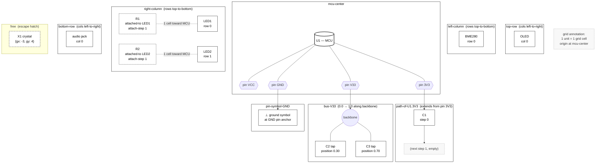

## Description

A hand-authored SVG that shows the layout engine's slot vocabulary as a spatial
sketch — MCU at the center, the four column/row regions around it, an example
`path-of-<pin>` chain extending from a power pin, a `bus-<name>` backbone with two
taps, a `pin-symbol` ground terminal, and a `free` slot in the corner with its
grid-coordinate annotation. Embeds in
[idea-027-layout-engine-concept.md §4.1](../../ideas/open/idea-027-layout-engine-concept.md).

This is the highest-leverage diagram in the whole epic. The slot vocabulary is the
layout engine's core abstraction and the doc currently describes it only via
prose tables. A reader trying to picture "where is `right-column row 5`?" cannot
do so without internalising five tables. One sketch unlocks the rest of the
chapter.

The diagram is a static SVG (not Mermaid) — Mermaid's auto-layout cannot reliably
produce a recognisable "MCU surrounded by columns" picture, and forcing manual
node positions in Mermaid loses the auto-layout advantage. Hand-authoring as SVG
is the right medium for a one-shot reference picture.

## Acceptance Criteria

- [ ] SVG committed at `docs/developers/ideas/open/assets/idea-027-slots.svg`
      (create the `assets/` directory)
- [ ] Embedded in
      [idea-027-layout-engine-concept.md §4.1](../../ideas/open/idea-027-layout-engine-concept.md)
      via standard Markdown image link, placed after the slot-vocabulary tables
- [ ] All nine slot kinds visible and labelled: `mcu-center`, `left-column`,
      `right-column`, `top-row`, `bottom-row`, `path-of-<pin>` (one example),
      `bus-<name>` (one example with two taps), `pin-symbol-<pin>` (one example),
      `free` (one example with `{gx, gy}` annotation)
- [ ] At least one example of an `attached-to` placement (resistor stacked with
      LED) shown to illustrate the §4.2 attachment rule
- [ ] Black-on-white aesthetic matching the project's existing SVGs
- [ ] Renders cleanly in GitHub Markdown preview (no broken paths, no inline
      script tags, no external font dependencies)

## Test Plan

Render the SVG in a browser and in the IDE Markdown preview to confirm the
embed works. Re-read §4.1 with the diagram in view: every slot mentioned in the
prose should be findable in the sketch within five seconds. If a reader has to
hunt for a slot in the picture, the labelling needs work.

No automated test — visual review only. Capture a PNG snapshot for the PR
description so reviewers can see the diagram inline without cloning.

## Notes

Authoring tools — any SVG editor (Inkscape, draw.io export-to-SVG, hand-edited
XML) is fine as long as the output passes the GitHub-rendering check. Avoid
embedded scripts and external font references.

This is the only Tier-1 diagram that is *not* Mermaid. Budget the higher effort
accordingly — the visual judgement (label placement, region proportions, what
counts as a "good example circuit" to overlay) is the work, not the SVG syntax.

Optional follow-up (not part of this task): a second annotated SVG showing the
`attach-step` rule in detail — an LED with two attached components at
`attach-step: 1` and `2`, plus the illegal cases (`3`, non-contiguous, shared
step). That's the E2 diagram from the analysis; defer to a separate task only if
§4.2 attachment prose proves confusing in review.

## Authoring sketch — element inventory (Mermaid)

The Mermaid below is **not the deliverable**; it's a checklist of every element
and relationship the SVG must contain. Mermaid cannot replicate the "MCU
surrounded by regions" picture, so each subgraph is one slot region, nodes
inside are the example occupants, and edges show attachment / tap / pin-anchor
relationships. Use this as a reference when authoring the SVG to confirm
nothing is missing.

## Proposed SVG layout

**Canvas:** ~900 × 700, black-on-white, 1 px strokes, sans-serif labels.

**Coordinate convention:** origin at MCU center; faint dotted grid
(1 cell ≈ 40 px) covering the whole canvas — this lets the `{gx, gy}`
annotation read naturally.

**Regions** (labelled, faintly-shaded rectangles):

| Region | Position on canvas | Approx size |
|---|---|---|
| `mcu-center` | dead center | 160 × 160 (the MCU square itself) |
| `top-row` | band above MCU, full width minus margins | 720 × 80 |
| `bottom-row` | band below MCU, full width minus margins | 720 × 80 |
| `left-column` | band left of MCU, full height minus margins | 80 × 360 |
| `right-column` | band right of MCU, full height minus margins | 80 × 360 |

Each region label sits *outside* the rectangle (e.g. "left-column" rotated
90° on the outer edge) so it never collides with occupants.

**Overlay examples** (the storytelling layer):

1. **`right-column`** — `LED1` at row 0 and `LED2` at row 1, plus `R1` and
   `R2` drawn one grid cell *inside* their LEDs (toward MCU). Faint dashed
   leader from R1 to LED1 with the label
   `attached-to: LED1, attach-step 1`. This single cluster covers the §4.2
   attachment rule.
2. **`top-row`** — `OLED` glyph at col 0; on the *opposite* side of the row,
   draw a **`bus-V33` backbone** as a thick horizontal line spanning most of
   the row, with two perpendicular stubs labelled `C2 @ 0.30` and
   `C3 @ 0.70`. Putting the bus inside the top-row band reuses space and
   reinforces "buses live where their endpoints take them".
3. **`path-of-U1.3V3`** — short chain extending **upward** from the MCU's
   3V3 pin into the top-row gap, with `C1` drawn at `step 0`, leader
   labelled `path-of-U1.3V3, step 0`. One small arrow showing "extends
   outward" so the reader gets the direction rule.
4. **`pin-symbol-GND`** — standard ground symbol (⏚) placed *at* the MCU's
   GND pin, on the bottom edge. Leader:
   `pin-symbol-GND — sits at the pin anchor itself`.
5. **`free` slot** — bottom-right corner, *outside* all four regions.
   Dashed-outline box with a small `X1` crystal glyph and the annotation
   `free { gx: -3, gy: 4 }`. A small footnote marker: "discouraged — see
   §10".
6. **`bottom-row`** — one occupant, e.g. `audio jack @ col 0`, just so the
   row isn't visually empty.
7. **`left-column`** — one occupant, `BME280 @ row 0`, same reason.

**Labelling discipline:**

- Region names in **bold**, slot-instance names (e.g. `path-of-U1.3V3`) in
  monospace.
- All index annotations (`row 0`, `col 0`, `step 0`, `position 0.30`,
  `attach-step 1`, `{gx, gy}`) in monospace and tucked next to their
  occupant, never inside the region label.
- One small legend box top-left: dashed outline = `attached-to`, ⏚ =
  `pin-symbol`, dotted grid = `free`-slot coordinate space.

**Five-second test:** four cardinal regions are obvious by position; path /
bus / symbol / free slots are visually distinct (chain vs. backbone vs.
terminal vs. dashed-box-with-coords); attachment rule is shown by example
rather than prose.
