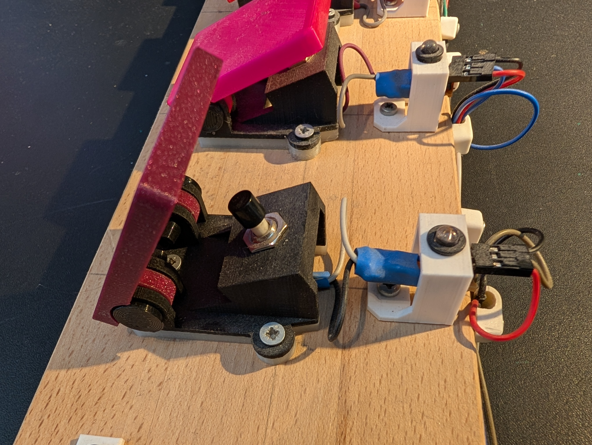

# User Guide

## What this pedal does

AwesomeStudioPedal appears as a Bluetooth keyboard to your device. Press a button, something happens —
a key is sent, a media command is triggered, or a text snippet is typed. No cables. No driver. No app.
Everything you need is built into the pedal.

*The pedal with its enclosure open, showing the buttons and LED array.*

## Why no driver

Because it identifies itself as a standard Bluetooth keyboard, it works out of the box on iPad,
Android, Windows, Mac, and Linux — no software installation required.

## Powering on

Connect a USB power supply or battery. After a moment:

- The power LED turns solid on.
- The Bluetooth LED is off until a device connects.

## Connecting via Bluetooth

The pedal advertises itself as **AwesomeStudioPedal** and appears as a keyboard in your device's Bluetooth
settings.

### First pairing

| Platform | Where to pair |
|----------|--------------|
| iOS / iPadOS | Settings → Bluetooth → AwesomeStudioPedal |
| Android | Settings → Connected devices → Pair new device → AwesomeStudioPedal |
| macOS | System Settings → Bluetooth → AwesomeStudioPedal |
| Windows | Settings → Bluetooth & devices → Add device → Bluetooth → AwesomeStudioPedal |
| Linux | Bluetooth manager or `bluetoothctl` — look for: AwesomeStudioPedal |

### Reconnection

Once paired, the pedal reconnects automatically when powered on. You do not need to pair again.

### One device at a time

The pedal connects to one device at a time. To switch to a different device, remove the pairing on
the current host first, then pair on the new one.

### Troubleshooting

If the pedal does not appear in the device list, it may still be paired to another device. Remove
that pairing first. If it still does not appear, power-cycle the pedal.

## LED states

| LED | State | Meaning |
|-----|-------|---------|
| Power | Solid on | Pedal running normally |
| Power | Blinking | A timed delay is counting down |
| Power | Off | Not powered |
| Bluetooth | Solid on | Connected — buttons A–D are active |
| Bluetooth | Off | Not connected — pedal is advertising |
| All 5 LEDs | Blink 5 times then resume | Config error — factory defaults loaded |

Buttons A–D do nothing until the Bluetooth LED is solid. The SELECT button (profile cycling) works
regardless of connection state.

## The buttons

- Four action buttons: **A**, **B**, **C**, **D**
- One **SELECT** button: cycles through profiles

*Pressing an action button during a session.*

## Profiles and the LED array

Three small LEDs show which profile is active. You do not need to understand binary — use this table:

| LED 3 (MSB) | LED 2 | LED 1 (LSB) | Active profile |
|:-----------:|:-----:|:-----------:|----------------|
| off | off | on  | 01 — Score Navigator |
| off | on  | off | 02 — Pixel Camera Remote |
| off | on  | on  | 03 — VLC Mobile Controller |
| on  | off | off | 04 — OBS Stream Deck |
| on  | off | on  | 05 — DAW Looper |
| on  | on  | off | 06 — Social and Comms |
| on  | on  | on  | 07 — System Debug |

Tip: a small printed card taped to your pedalboard saves you from memorising this at a gig.

## What each profile does

See [PROFILES.md](PROFILES.md) for a full list of buttons and their actions.
