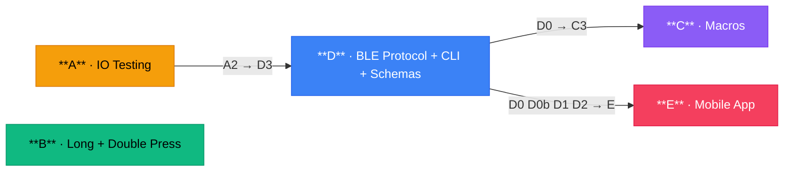
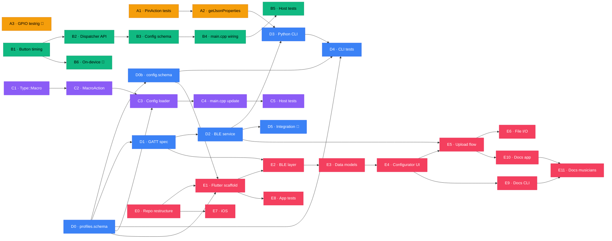

# Sprint Implementation Plan

**Branch:** `feature/idea-realizations`
**Scope:** IDEA-001, IDEA-002, IDEA-006, IDEA-009, IDEA-010 + IO Action testing & testrig

---

## Overview

| Group | Topic | Ideas | Priority |
|---|---|---|---|
| A | IO Action Testing & Testrig | existing PinAction | 1 — complete what's built |
| B | Long Press + Double Press | IDEA-009, IDEA-010 | 2 — shared event-system refactor |
| C | Macros | IDEA-006 | 3 — self-contained, no new deps |
| D | BLE Config Protocol + CLI + Schemas | IDEA-001, IDEA-002 | 4 — large architectural change |
| E | Mobile App (Android + optional iOS) | IDEA-001 | 5 — consumes D; needs repo restructure |

---

## Group A — IO Action Testing & Testrig

**Goal:** Close coverage gaps on the recently added `PinAction` and establish an on-device test rig so future GPIO actions can be validated on real hardware.

### A1 — Host test audit & gap fill

**Files touched:** `test/unit/test_pin_action.cpp`, `test/unit/test_action_parsing.cpp`

Missing test cases to add:

- `PinAction` name round-trip (`setName` / `getName` survives construction).
- `PinToggle` state is per-instance (two independent `PinAction` objects toggle independently).
- `config_loader` parses all five pin types from JSON and produces correct `PinAction::getType()`.
- `config_loader` rejects a pin action with missing or negative `pin` field (returns `nullptr`).
No new production code required; only new `TEST_F` cases.

### A2 — `getJsonProperties` on PinAction

**Files touched:** `lib/PedalLogic/include/pin_action.h`, `lib/PedalLogic/src/pin_action.cpp`

`Action::getJsonProperties` is a virtual no-op on the base class. `PinAction` should override it to emit:

```json
{ "pin": 27 }
```

The type string is already handled by `ProfileManager::getActionTypeString`. This enables future CLI export and the config builder round-trip.

Add a corresponding `TEST_F` case in `test/unit/test_pin_action.cpp` verifying that `getJsonProperties` emits the correct `"pin"` value.

### A3 — On-device GPIO testrig (ESP32)

**Files touched:** `test/test_pin_io_esp32/` (new directory), `Makefile`

The NodeMCU-32S has an onboard LED on **GPIO 2**, which is unassigned in `builder_config.h`. Use it as the testrig output: no jumper or logic analyser needed, and the LED provides immediate visual confirmation alongside the Unity `digitalRead` assertions.

Create a Unity on-device test that:

1. Configures GPIO 2 as OUTPUT (no `pinMode` conflict — pin is free).
2. For each `PinAction` mode, instantiates a `PinAction(mode, 2)`, calls `execute()` (and `executeRelease()` where applicable), and asserts the expected state via `digitalRead(2)`.
3. Reports PASS/FAIL over serial using Unity assertions.

Note: the NodeMCU-32S onboard LED is **active-high** (LED on = HIGH). The test assertions match this polarity. If ported to a board with an active-low LED, the `PinLow` / `PinLowWhilePressed` cases will be the visible ones instead — documented in the test file header.

Add `make test-esp32-pin-io` target to `Makefile`.

This is the only task in Group A that requires hardware — mark it as `[hardware-required]`.

---

## Group B — Long Press & Double Press

**Goal:** Single button supports up to three distinct trigger events: short press, long press, double press. Each maps to a separate action in the profile config. Changes are additive — existing single-action profiles continue to work unchanged.

### B1 — `IButton` / `Button` timing extensions

**Files touched:** `lib/PedalLogic/include/i_button.h`, `lib/hardware/esp32/include/button.h`, `lib/hardware/esp32/src/button.cpp`

> **nRF52840 scope note:** The nRF52840 has a parallel `Button` implementation in `lib/hardware/nrf52840/`. Long press and double press are **out of scope for this sprint** on that platform — the `IButton` interface will gain the new pure-virtual methods, so the nRF52840 `Button` will need stub implementations returning `0` / `false` to satisfy the compiler. Full nRF52840 support is a follow-up.

Add to `IButton`:

```cpp
virtual unsigned long holdDurationMs() const = 0;  // ms since last press, 0 if not held
virtual bool doublePressEvent() = 0;               // true once per confirmed double-press
```

`Button` implementation:

- **Long press:** record `pressStartTime_` in `isr()` on falling edge; `holdDurationMs()` returns `millis() - pressStartTime_` while held (`awaitingRelease == true`), 0 otherwise.
- **Double press:** on each `isr()` rising edge, if a previous press happened within `doublePressWindow_` (default 300 ms) set `doublePressFlag_`. `doublePressEvent()` returns and clears it like `event()` does. Default window is configurable via `setDoublePressWindow(ms)`.

`doublePressEvent()` must be checked before `event()` in the main loop — if a double press is confirmed the single press should NOT also fire.

### B2 — `EventDispatcher` multi-event API

**Files touched:** `lib/PedalLogic/include/event_dispatcher.h`, `lib/PedalLogic/src/event_dispatcher.cpp`

Add:

```cpp
void registerLongPressHandler(uint8_t button, EventCallback cb, uint32_t thresholdMs = 500);
void registerDoublePressHandler(uint8_t button, EventCallback cb);
void dispatchLongPress(uint8_t button);
void dispatchDoublePress(uint8_t button);
```

Long-press dispatch is called from `loop()` when `holdDurationMs() >= threshold` and not yet fired for this hold. A `longPressArmed_` flag per button prevents repeated firing while held.

### B3 — Config schema extension

**Files touched:** `lib/PedalLogic/src/config_loader.cpp`, `lib/PedalLogic/include/profile.h`, `lib/PedalLogic/src/profile.cpp`, `data/profiles.json`

Button config gains two optional extra keys:

```json
"A": {
  "type": "SendKey", "value": "KEY_F1", "name": "Play",
  "longPress":   { "type": "SendMediaKey", "value": "MEDIA_STOP",   "name": "Stop" },
  "doublePress": { "type": "SendKey",      "value": "KEY_F2",        "name": "Record" }
}
```

If `longPress` or `doublePress` is absent the behaviour is unchanged. The config loader calls the existing action-parsing logic recursively for the sub-objects. Both sub-actions are stored in `Profile` alongside the primary action (new `addLongPressAction` / `addDoublePressAction` accessors).

### B4 — `main.cpp` main-loop integration

**Files touched:** `src/main.cpp`

In `loop()`, after the existing `event()` / `releaseEvent()` poll, add:

```cpp
if (btn->doublePressEvent())        eventDispatcher.dispatchDoublePress(i);
else if (btn->event())               eventDispatcher.dispatch(i);

if (btn->holdDurationMs() >= LONG_PRESS_THRESHOLD && !longPressArmed[i]) {
    eventDispatcher.dispatchLongPress(i);
    longPressArmed[i] = true;
}
if (!btn->awaitingRelease) longPressArmed[i] = false;
```

The 500 ms long-press threshold is defined as a `constexpr` in `main.cpp` (overridable in `config.h` per hardware variant).

### B5 — Host tests

**Files touched:** `test/unit/test_button.cpp`, `test/unit/test_event_dispatcher.cpp`, `test/unit/test_action_parsing.cpp`, `test/CMakeLists.txt`

New test cases:

- `Button`: `holdDurationMs()` returns 0 before press, non-zero while held, 0 after release.
- `Button`: `doublePressEvent()` fires exactly once for two presses within window; does not fire for single press; does not fire for two presses outside window.
- `EventDispatcher`: long-press handler fires once per hold, not repeatedly.
- `EventDispatcher`: double-press handler fires; single-press handler does NOT also fire.
- `config_loader`: parses `longPress` and `doublePress` sub-objects into correct action types.

### B6 — On-device integration test `[hardware-required]`

**Files touched:** `test/test_multipress_esp32/` (new)

Unity test that:

1. Simulates short press (ISR triggered, release before 500 ms) → asserts only short-press callback fires.
2. Simulates hold (ISR triggered, release after 600 ms) → asserts only long-press fires.
3. Simulates two presses within 300 ms → asserts only double-press fires.

---

## Group C — Macros

**Goal:** A single button press can trigger a composed sequence of action-groups, where actions within each group fire simultaneously and groups execute in order.

### C1 — `Action::Type::Macro` and key_lookup registration

**Files touched:** `lib/PedalLogic/include/action.h`, `lib/PedalLogic/src/key_lookup.cpp`

Add `Macro` to the `Action::Type` enum. Register `"Macro"` in `lookupActionType()`.

### C2 — `MacroAction` class

**Prerequisite:** C1 (`Action::Type::Macro` must exist before `MacroAction::getType()` can return it).

**Files touched:** `lib/PedalLogic/include/macro_action.h` (new), `lib/PedalLogic/src/macro_action.cpp` (new)

```cpp
class MacroAction : public Action {
public:
    using Step = std::vector<std::unique_ptr<Action>>;
    void addStep(Step step);

    void execute() override;        // starts step 0
    void executeRelease() override; // propagates to all active step actions
    bool isInProgress() const override;
    void update();                  // advances to next step when current completes

    Action::Type getType() const override { return Action::Type::Macro; }
private:
    std::vector<Step> steps_;
    size_t currentStep_ = 0;
    bool running_ = false;
};
```

`execute()` fires all actions in `steps_[0]` simultaneously. Each call to `update()` checks whether all actions in `currentStep_` have `isInProgress() == false`; if so it advances and fires the next step. `isInProgress()` returns `true` until the last step completes.

For actions that complete synchronously (most BLE and pin actions), `update()` advances immediately on the same loop tick. Delayed actions hold the step until their timer expires.

### C3 — Config loader extension

**Prerequisite:** D0 (`profiles.schema.json` must define the macro step shape before the loader is written to match it).

**Files touched:** `lib/PedalLogic/src/config_loader.cpp`, `test/CMakeLists.txt`

Parse the `steps` array:

```json
"A": {
  "type": "Macro",
  "name": "Scene launch",
  "steps": [
    [{ "type": "PinHigh", "pin": 27 }],
    [{ "type": "SendKey", "value": "KEY_F1" }, { "type": "SendKey", "value": "KEY_F2" }],
    [{ "type": "Delayed", "delayMs": 500, "action": { "type": "PinLow", "pin": 27 } }]
  ]
}
```

Each element in `steps` is a JSON array of action objects, parsed recursively using the existing action-factory logic.

### C4 — `main.cpp` update integration

**Files touched:** `src/main.cpp`

In `loop()`, after the existing `DelayedAction` update call, add:

```cpp
for (uint8_t i = 0; i < hardwareConfig.numButtons; i++) {
    if (auto* macro = dynamic_cast<MacroAction*>(
            profileManager->getAction(profileManager->getCurrentProfile(), i))) {
        macro->update();
    }
}
```

If the cast overhead is a concern, `Action` can gain a `virtual void update() {}` no-op and `MacroAction` overrides it — eliminating the cast.

### C5 — Host tests

**Files touched:** `test/unit/test_macro_action.cpp` (new), `test/CMakeLists.txt`

Test cases:

- Single-step macro with one action: fires on `execute()`, `isInProgress()` false immediately after.
- Single-step macro with two parallel actions: both fire on `execute()`.
- Two-step sequential macro: step 2 does not fire until step 1 completes (`isInProgress` == true in between).
- Macro with a `DelayedAction` step: advances only after `fake_time` exceeds delay threshold.
- `executeRelease()` propagates to all actions in the active step.
- Config loader round-trip: parse a three-step macro JSON, verify action types and step counts.

---

## Group D — BLE Config Protocol (IDEA-001 + IDEA-002)

**Goal:** Enable the pedal to receive and store a new `profiles.json` over BLE, making it configurable from any BLE-capable host (mobile app or CLI). IDEA-001 (mobile app) and IDEA-002 (CLI) both consume this protocol, so the firmware side is shared.

### D0 — `profiles.schema.json`

**Files touched:** `data/profiles.schema.json` (new), `docs/data/README.md` (updated)

Create a JSON Schema (draft-07) for `data/profiles.json`. The schema must cover:

- Top-level `profiles` array, each entry requiring `name` (string) and `buttons` (object).
- Each button value is an **action object**: required `type` field (enum of all `Action::Type` string names), optional `name`, and type-specific required fields (`value` for Send actions, `pin` for Pin actions, `delayMs`+`action` for Delayed, `steps` array for Macro).
- `longPress` and `doublePress` keys on button objects mirror the same action object schema (self-referential via `$ref`).
- Macro `steps`: array of arrays of action objects.

Place the file at `data/profiles.schema.json`. Update `docs/data/README.md` to reference it and add a one-liner to `scripts/pre-commit` that validates `data/profiles.json` against the schema using `jsonschema` (Python) or `ajv` (Node) — whichever is already available in the dev container.

This is a prerequisite for C3, D3 (`validate` subcommand), and D4 (schema test fixtures).

### D0b — `config.schema.json` and `data/config.json`

**Files touched:** `data/config.json` (new), `data/config.schema.json` (new), `docs/data/README.md` (updated), `lib/PedalLogic/src/config_loader.cpp` (extended)

Introduce a second device-level config file that captures hardware pin assignments in JSON — the fields currently hardcoded in `builder_config.h`. This lets the CLI and mobile app configure hardware layout without recompiling.

`data/config.json` example:

```json
{
  "numProfiles": 7,
  "numSelectLeds": 3,
  "numButtons": 4,
  "ledBluetooth": 26,
  "ledPower": 25,
  "ledSelect": [5, 18, 19],
  "buttonSelect": 21,
  "buttonPins": [13, 12, 27, 14]
}
```

`data/config.schema.json` (draft-07) validates:

- All pin fields are integers in range 0–39 (ESP32 GPIO range).
- `numButtons` matches the length of `buttonPins`.
- `numSelectLeds` matches the length of `ledSelect`.
- `numProfiles` range is validated individually (integer ≥ 1), but the cross-field constraint `numProfiles ≤ 2^numSelectLeds − 1` **cannot be expressed in JSON Schema draft-07** and must be enforced by a dedicated check in `scripts/pre-commit` instead.

The firmware's `configureProfiles()` (or a new `loadHardwareConfig()`) reads this file on boot if present, overriding the compiled-in `hardwareConfig` defaults. If absent, the compiled defaults are used unchanged — full backwards compatibility.

Add validation of `data/config.json` against `data/config.schema.json` to `scripts/pre-commit` alongside the profiles check.

### D1 — BLE Config GATT service spec

**Files touched:** `docs/developers/BLE_CONFIG_PROTOCOL.md` (new)

Define a custom GATT service with two characteristics:

| Characteristic | UUID suffix | Properties | Description |
|---|---|---|---|
| `CONFIG_WRITE` | `...0001` | WRITE_NO_RESPONSE (chunked) | Receive new `profiles.json` |
| `CONFIG_STATUS` | `...0002` | NOTIFY | Reports `OK`, `ERROR:<msg>`, `BUSY` |

The service UUID base is a project-specific 128-bit UUID (document in the spec). Chunked write: client sends 512-byte MTU packets prefixed with a 2-byte sequence number; pedal reassembles into a full JSON blob and calls `configureProfiles()`.

This task produces documentation only — no firmware change yet.

### D2 — ESP32 BLE config service implementation

**Files touched:** `lib/hardware/esp32/include/ble_config_service.h` (new), `lib/hardware/esp32/src/ble_config_service.cpp` (new), `src/main.cpp`

`BleConfigService` manages the GATT service registration and reassembly buffer. It exposes:

```cpp
class BleConfigService {
public:
    void begin(ProfileManager&, IBleKeyboard*);
    void loop();          // check if a full config arrived and apply it
    bool isApplying() const;
};
```

`loop()` is called from `main.cpp loop()`. When a full JSON blob is reassembled it calls `configureProfiles()`, saves to LittleFS, and notifies `CONFIG_STATUS` with `OK`.

**Upload confirmation LED blink:** immediately after a successful `configureProfiles()` call, all select LEDs blink 3 times at 150 ms on / 150 ms off, then return to the state encoding the currently active profile (re-calling `ProfileManager::updateLEDs()`). This gives the user standing at the pedal unambiguous physical confirmation that the upload succeeded without them needing to watch a phone screen. The blink sequence is synchronous (blocking for 900 ms total) and happens before `CONFIG_STATUS` `OK` is notified, so the CLI/app receives `OK` only after the LEDs have finished — no race condition.

If `configureProfiles()` fails, LEDs do a single long 500 ms blink of all select LEDs (distinct from the success pattern) and `CONFIG_STATUS` notifies `ERROR:<reason>`.

The BLE HID and config services must co-exist: use `NimBLE` (already available on ESP32) to host both the HID profile and the custom GATT service simultaneously.

### D3 — Python CLI tool

**Files touched:** `scripts/pedal_config.py` (new), `scripts/README.md` (updated)

Commands:

```
pedal_config.py scan                   # list nearby BLE pedal devices
pedal_config.py upload profiles.json   # send profiles.json to pedal
pedal_config.py upload-config config.json  # send hardware config to pedal
pedal_config.py validate profiles.json # schema-check without uploading
```

Uses `bleak` (cross-platform BLE library) for BLE communication. The `validate` subcommand uses `data/profiles.schema.json` (created in D0).

Dependencies: `bleak`, `jsonschema` — add to a `scripts/requirements.txt`.

### D4 — Host-side tests for CLI tool

**Files touched:** `scripts/tests/test_pedal_config.py` (new)

Unit tests (no BLE hardware required):

- JSON schema validation accepts/rejects known-good/bad profile files.
- Chunked write splits a 1 KB payload into correct MTU-sized packets with sequence numbers.
- `upload-config` command sends `config.json` to the hardware config characteristic.

### D5 — BLE config integration tests (host + hardware)

**Files touched:** `test/unit/test_ble_config_service.cpp` (new), `test/test_ble_config_esp32/` (new), `test/CMakeLists.txt`, `Makefile`

#### Host tests (no hardware)

Add `test/unit/test_ble_config_service.cpp` using GoogleTest with a fake `IFileSystem` and a fake `ProfileManager` stub:

- **Reassembly — happy path:** feed N sequential chunks, assert `isApplying()` is true during transfer and false after last chunk; assert `configureProfiles()` called exactly once with the reassembled JSON.
- **Reassembly — out-of-order chunk:** inject chunk with wrong sequence number; assert `CONFIG_STATUS` notifies `ERROR:bad_sequence` and transfer is reset.
- **Reassembly — oversized payload:** feed more chunks than the buffer allows (configurable `MAX_CONFIG_BYTES`); assert `ERROR:too_large` and no `configureProfiles()` call.
- **Reassembly — invalid JSON:** complete transfer with malformed JSON; assert `ERROR:parse_failed`.
- **LED blink sequence — success:** after successful apply, verify `ProfileManager::updateLEDs()` is called after the blink (mock the LED controller; verify 3 on/off cycles then restore call).
- **LED blink sequence — failure:** verify single long blink on parse failure, no `updateLEDs()` restore call needed (state unchanged).
- **Concurrent upload rejection:** begin a transfer, then start a second one before completion; assert second is rejected with `ERROR:busy` and `CONFIG_STATUS` notifies `BUSY`.

Register new source file in `test/CMakeLists.txt` under `pedal_tests`.

#### On-device integration test `[hardware-required]`

Add `test/test_ble_config_esp32/` as a Unity PlatformIO test. The test runs on the ESP32 with BLE active and requires a host-side Python script (`test/test_ble_config_esp32/runner.py`) that acts as the BLE client:

1. **Valid upload:** `runner.py` connects, uploads a known-good `profiles.json` via the GATT service, waits for `CONFIG_STATUS` `OK`. Firmware assertion: the new profile is active (verified by checking serial log output for the profile name).
2. **LED confirmation:** `runner.py` sends upload, observer on-device verifies that select LEDs blink 3× (read via `digitalRead` on the select LED pins in the test firmware) then return to profile state.
3. **Error recovery:** `runner.py` sends a malformed JSON blob, asserts `CONFIG_STATUS` `ERROR:parse_failed`, then sends a valid upload and asserts it succeeds — verifying the service resets cleanly.
4. **Persistence across reboot:** after a successful upload, `runner.py` triggers a soft reset via the serial port, reconnects after 3 s, and verifies the new profile is still active (loaded from LittleFS).

Add `make test-esp32-ble-config` target to `Makefile`. Document that this test requires both a connected ESP32 and a BLE-capable host machine (Linux with `bleak`, or macOS).

---

## Group E — Mobile App (Android + optional iOS)

**Goal:** A native mobile app that lets musicians and builders manage pedal profiles without a computer — scan for the pedal over BLE, configure button actions with a GUI (porting the existing web config-builder), and upload the resulting JSON. The app lives in the same repository under `app/`, keeping firmware and tooling together.

**Technology choice: Flutter**

Flutter is chosen over React Native or native Android/iOS because:

- Single Dart codebase compiles to Android APK and iOS IPA without a separate repo.
- `flutter_blue_plus` is a well-maintained BLE plugin with reliable Android + iOS support.
- The widget model maps cleanly to the form-heavy profile configurator UI.
- No need for a second repository, separate CI, or diverging feature sets.

---

### E0 — Repository structure refactoring

**Files touched:** `app/` (new top-level directory), `app/README.md` (new), `.gitignore`, `.devcontainer/devcontainer.json`, `.github/workflows/app.yml` (new), `README.md`

This is the only task that restructures the repo. All other E tasks build inside `app/` without touching firmware directories.

**New top-level layout:**

```
AwesomeStudioPedal/
├── app/                     ← Flutter project (new)
│   ├── android/
│   ├── ios/
│   ├── lib/
│   ├── test/
│   └── pubspec.yaml
├── data/                    ← profiles.json, schemas (unchanged)
├── docs/
│   └── tools/               ← web config-builder stays here (unchanged)
├── lib/                     ← firmware libraries (unchanged)
├── scripts/                 ← Python CLI (unchanged)
├── src/                     ← firmware main.cpp (unchanged)
└── test/                    ← host/device firmware tests (unchanged)
```

**`.gitignore` additions:** `app/build/`, `app/.dart_tool/`, `app/.flutter-plugins*`, `app/android/.gradle/`, `app/ios/Pods/`.

**Devcontainer:** Install Flutter SDK (stable channel) and Android SDK (command-line tools only, no full Android Studio). Add `flutter` and `dart` to `PATH`. Run `flutter doctor` as a post-create command. Invoke `/devcontainer-sync` after this change.

**CI workflow `app.yml`:** Runs on push to any branch when files under `app/` change. Steps: `flutter pub get` → `flutter analyze` → `flutter test` → `flutter build apk --release`. iOS build is skipped in CI (requires macOS runner with Xcode — document as a manual step).

---

### E1 — Flutter project scaffold

**Files touched:** `app/pubspec.yaml`, `app/lib/main.dart`, `app/lib/app.dart`, `app/analysis_options.yaml`

Initialize the Flutter project and configure dependencies:

```yaml
dependencies:
  flutter_blue_plus: ^1.x       # BLE scan/connect/write
  file_picker: ^6.x             # open profiles.json from storage
  share_plus: ^7.x              # export via Android share sheet / iOS share
  provider: ^6.x                # state management
  go_router: ^13.x              # named-route navigation
  json_schema: ^5.x             # validate against profiles.schema.json
  path_provider: ^2.x           # local file storage

dev_dependencies:
  flutter_test:
  mockito: ^5.x
  build_runner: ^2.x
```

App entry point sets up `MaterialApp` with a dark/light theme matching the existing web tool's colour variables (`--accent: #2563eb`, `--bg: #f5f5f5`). Navigation uses `go_router` with named routes.

Embed `data/profiles.schema.json` and `data/config.schema.json` as Flutter assets (listed in `pubspec.yaml` `assets:` section) so validation works offline without a network call.

---

### E2 — BLE service layer

**Files touched:** `app/lib/services/ble_service.dart` (new)

`BleService` wraps `flutter_blue_plus` and exposes:

```dart
class BleService extends ChangeNotifier {
  Future<List<ScanResult>> scan({Duration timeout});
  Future<void> connect(BluetoothDevice device);
  void disconnect();
  Future<UploadResult> uploadProfiles(String json);
  Future<UploadResult> uploadConfig(String json);
  Stream<String> get statusStream;   // mirrors CONFIG_STATUS notifications
  bool get isConnected;
}
```

`uploadProfiles` / `uploadConfig` implement the chunked-write protocol defined in D1: split payload into 512-byte MTU chunks, prepend 2-byte big-endian sequence number, write each chunk to `CONFIG_WRITE` characteristic, then subscribe to `CONFIG_STATUS` for `OK` / `ERROR:<msg>`.

The service UUID and characteristic UUIDs are defined as constants in `app/lib/constants/ble_constants.dart`, matching the spec from D1 exactly.

**Prerequisite:** D1 (GATT service spec must exist before UUIDs can be defined).

---

### E3 — Data models and schema validation

**Files touched:** `app/lib/models/` (new), `app/lib/services/schema_service.dart` (new)

Dart model classes (hand-written, no code generation needed for this data size):

```
models/
  profile.dart          # Profile: name, description, Map<String, ActionConfig>
  action_config.dart    # ActionConfig: type, value/pin/steps/delayMs, name,
                        #               longPress?, doublePress?
  hardware_config.dart  # HardwareConfig: numButtons, pins, LED assignments
  macro_step.dart       # MacroStep: List<ActionConfig>
```

All models implement `toJson()` / `fromJson()`. `ActionConfig.fromJson` mirrors the recursive logic of `config_loader.cpp` — same field names, same required/optional rules.

`SchemaService` loads the embedded schema assets and exposes:

```dart
Future<ValidationResult> validateProfiles(Map json);
Future<ValidationResult> validateConfig(Map json);
```

Used before upload and when importing a file.

---

### E4 — Profile Configurator UI

**Files touched:** `app/lib/screens/`, `app/lib/widgets/` (new)

This is the core feature — a Flutter port of `docs/tools/config-builder/`. Screens:

**`HomeScreen`** — entry point. Shows three cards: "Connect to pedal", "Edit profiles", "Upload". Navigation hub.

**`ProfileListScreen`** — lists profiles with name and description. Add / remove / reorder. Matches the tab UI of the web builder.

**`ProfileEditorScreen`** — one profile's button slots (A, B, C, D, expandable to A–Z via hardware config). Each slot shows the action name or "(none)". Tap to open `ActionEditorScreen`.

**`ActionEditorScreen`** — full action configurator for one button slot. Widgets:

- `ActionTypeDropdown` — same action types as `builder.js` `ACTION_TYPES`, extended with `LongPress`, `DoublePress`, `Macro` (new sprint additions).
- `KeyValueField` — text input with autocomplete from `KEY_NAMES` / `MEDIA_KEY_VALUES` (ported from `builder.js`).
- `PinField` — numeric input, range 0–39, with a small GPIO diagram tooltip.
- `DelayedActionWidget` — `delayMs` field + nested `ActionEditorScreen` as an expandable card.
- `MacroStepList` — list of steps; each step is a reorderable list of `ActionEditorScreen` cards (parallel actions within step).
- `LongPressSlot` / `DoublePressSlot` — optional collapsible cards, each containing a nested `ActionEditorScreen`.

**`JsonPreviewScreen`** — live JSON preview of the full `profiles.json`, syntax-highlighted using a monospace `Text` widget with colour spans. Includes "Copy" and "Share" buttons.

**Validation feedback:** A persistent banner at the bottom of `ProfileListScreen` shows green "Valid" / red error count. Tapping an error navigates to the offending field. Mirrors the web builder's inline error display.

---

### E5 — BLE scan and upload flow

**Files touched:** `app/lib/screens/scanner_screen.dart`, `app/lib/screens/upload_screen.dart` (new)

**`ScannerScreen`:**

- Starts BLE scan on mount, filtered by the pedal's service UUID so only pedal devices appear.
- Shows device name, signal strength (RSSI bar), and a "Connect" button per result.
- On connect: navigates to `HomeScreen` with `BleService.isConnected == true`.
- Handles "Bluetooth off" and "permission denied" states with actionable error cards (link to system settings).

**`UploadScreen`:**

- Shows current `profiles.json` summary (profile count, last-modified).
- "Validate before upload" runs `SchemaService.validateProfiles()` — upload button stays disabled if invalid.
- Upload progress: linear progress bar updated per chunk sent. Chunk count and total shown.
- On `CONFIG_STATUS` → `OK`: success snackbar. On `ERROR:<msg>`: error dialog with the firmware's message.
- "Upload hardware config" secondary button uploads `data/config.json` to the hardware config characteristic.

---

### E6 — File import / export

**Files touched:** `app/lib/services/file_service.dart` (new), integrated into `ProfileListScreen` and `JsonPreviewScreen`

**Import:** `file_picker` opens the device file manager. Accepts `.json` only. On selection: parse + validate via `SchemaService`; if valid, replace the in-app profile state; if invalid, show error dialog with schema violation details.

**Export:** `share_plus` triggers the Android share sheet / iOS share extension with the JSON as a text file attachment (`profiles.json`). Also allows saving to local `Documents` via `path_provider`.

**Auto-save:** The app persists the current unsaved profile state to local app storage (via `path_provider`) on every edit, so work-in-progress survives app restart.

---

### E7 — iOS support

**Files touched:** `app/ios/Runner/Info.plist`, `app/ios/Podfile`

Required `Info.plist` keys for BLE on iOS:

```xml
<key>NSBluetoothAlwaysUsageDescription</key>
<string>Used to connect to and configure your AwesomeStudioPedal.</string>
<key>NSBluetoothPeripheralUsageDescription</key>
<string>Used to connect to and configure your AwesomeStudioPedal.</string>
```

`flutter_blue_plus` on iOS requires `deployment_target = '12.0'` minimum in `Podfile`.

The dual BLE service (HID + custom GATT) needs verification on iOS: Apple's CoreBluetooth will see both services, but the HID profile is handled by the system's Bluetooth HID driver. The custom GATT config service is accessible to the app via `CBCentralManager` without conflict — document this in `app/README.md`.

iOS CI is not automated (requires macOS + Xcode). Mark as `[manual-test-required]` with instructions for running `flutter build ios --no-codesign` locally.

---

### E8 — App tests

**Files touched:** `app/test/unit/`, `app/test/widget/`, `app/test/integration/`

**Unit tests** (`flutter_test`, no device needed):

- `ActionConfig.fromJson` / `toJson` round-trips for every action type.
- `SchemaService` accepts the shipped `data/profiles.json` example; rejects a profile with a missing `type` field.
- `BleService.uploadProfiles` chunking: a 1 500-byte payload produces 3 chunks with correct sequence numbers.

**Widget tests:**

- `ActionTypeDropdown` renders all action types; selecting "Macro" shows the `MacroStepList` widget.
- `ActionEditorScreen` for `DelayedAction` shows nested action editor.
- Validation banner shows red error count when an invalid profile is loaded.

**Integration test** (requires Android emulator or device in CI):

- App launches, `ScannerScreen` appears, mock BLE service injects a fake scan result.
- Tapping "Connect" navigates to `HomeScreen`.
- Editing a profile and tapping upload calls `BleService.uploadProfiles` with valid JSON.

Use `mockito` for `BleService` in widget and integration tests.

---

### E9 — Builders docs: CLI tool

**Files touched:** `docs/builders/CLI_TOOL.md` (new), `docs/builders/` index/nav links

Document `scripts/pedal_config.py` for builders. Sections:

1. **Prerequisites** — Python 3.9+, `pip install -r scripts/requirements.txt`, BLE adapter.
2. **Scanning** — `python scripts/pedal_config.py scan` — lists nearby pedals with address and RSSI.
3. **Uploading profiles** — `python scripts/pedal_config.py upload profiles.json` — step-by-step with expected output.
4. **Validating without upload** — `python scripts/pedal_config.py validate profiles.json` — how to interpret schema errors.
5. **Uploading hardware config** — `python scripts/pedal_config.py upload-config config.json`.
6. **Troubleshooting** — common BLE errors (device not found, permission denied, upload timeout) with fixes.

---

### E10 — Builders docs: mobile app

**Files touched:** `docs/builders/APP.md` (new), `docs/builders/` index/nav links

Document the mobile app for builders. Sections:

1. **Installing** — link to Play Store (placeholder); sideloading APK from GitHub Releases.
2. **Connecting to the pedal** — pairing the config service (separate from the HID keyboard pair).
3. **Editing profiles** — walkthrough with screenshots of each screen.
4. **Uploading** — what the progress bar means; what to do if upload fails.
5. **Importing / exporting JSON** — how to back up a config and restore it.
6. **Hardware config tab** — editing pin assignments without recompiling.
7. **iOS notes** — where iOS behaviour differs from Android.

---

### E11 — Musicians docs: profile management overview

**Files touched:** `docs/musicians/USER_GUIDE.md` (updated), `docs/musicians/PROFILES.md` (updated)

Musicians don't need to know about BLE GATT services — they need to know they can change what their pedal does without asking a builder.

**`USER_GUIDE.md` additions:**

Add a new section "Customising your pedal" after the existing "Connecting via Bluetooth" section:

> Your pedal's button actions can be changed at any time using the **AwesomeStudioPedal app** (Android) or the **Profile Builder** web tool. No cable, no recompiling — just connect the app to the pedal over Bluetooth and upload a new configuration.

Brief comparison table:

| Tool | Needs computer | Needs cable | BLE upload |
|---|---|---|---|
| Mobile app | No | No | Yes |
| Web builder + CLI | Yes | No | Yes |
| Manual JSON edit | Yes | No | Yes |

**`PROFILES.md` additions:**

Add a section "Using the app to edit profiles" with a short UI walkthrough (profile list → button slot → action picker → upload). Keep it brief — link to `docs/builders/APP.md` for full detail.

---

## Dependency Map

### Text

```
A1 → A2 (getJsonProperties needed for CLI)
A3 → (hardware only, independent)

B1 → B2 → B3 → B4 → B5
B1 → B6 (hardware)

C1 → C2 → C3 → C4 → C5
D0 → C3 (macro step shape defined before loader)

D0 → D0b
D0 → D1 → D2 → D3 → D4
D2 → D5 (host tests mock BleConfigService; on-device test needs firmware live)
D0 → D4 (schema fixtures)
D0b → D4 (config schema fixtures)
A2 → D3 (CLI reads action type strings from getJsonProperties)

E0 → E1 → E2 → E3 → E4 → E5 → E6
E0 → E7 (iOS config files live in app/)
E1 → E8
D0 → E1 (schemas embedded as Flutter assets)
D0b → E1 (hardware config schema embedded as Flutter asset)
D1 → E2 (BLE UUIDs from spec)
D2 → E5 (upload only works once firmware service is live; can be mocked for dev)
E4 → E9 (CLI docs reference same action types as app)
E5 → E10 (app upload docs need upload flow to be final)
E9 → E11 (musicians doc links to builders CLI doc)
E10 → E11 (musicians doc links to builders app doc)
```

Groups A, B, C can be developed in parallel after A1.
Group D is independent of B and C. Within D, D0b and D1 are independent of each other — both depend only on D0 and can be done in parallel.
Group E depends on D0/D0b/D1 but E1–E4 (scaffold, models, configurator UI) can start before D2 is complete — use a mock `BleService` during UI development.

### Charts



### Detail — all tasks

> 🔧 = requires physical hardware



---

## Idea Cleanup

Once an idea's implementing group is fully done, delete its file from `docs/developers/ideas/`. Do not archive — the implementation itself is the record.

| Idea file | Delete after | Depends on |
|---|---|---|
| `idea-009-long-press-event.md` | Group B complete | B5 |
| `idea-010-double-press-event.md` | Group B complete | B5 |
| `idea-006-macros.md` | Group C complete | C5 |
| `idea-002-cli-tools.md` | CLI shipped | D3 |
| `idea-001-mobile-app-configuration.md` | App shipped | E11 |

---

## Existing task housekeeping

The following already-open tasks should be assigned to the `DemoVideo` group with explicit `order` values. Edit each file's frontmatter to add `group: DemoVideo` and `order: N`:

| Task ID | Title | order |
|---|---|---|
| TASK-033 | Create Setup/Installation Demo Video | 1 |
| TASK-034 | Create Button Configuration Demo Video | 2 |
| TASK-035 | Create Builder Workflow Demo Video | 3 |
| TASK-036 | Create Advanced Features Demo Video | 4 |
| TASK-037 | Create Real-World Usage Demo Video | 5 |
| TASK-038 | Create Troubleshooting Demo Video | 6 |
| TASK-049 | Setup Video Platform Channel | 0 |

TASK-049 gets `order: 0` — the channel must exist before any video can be published.

Run `python scripts/update_task_overview.py` after all seven files are updated so the OVERVIEW.md table reflects the new grouping.

---

## Task Numbering

> **ID gap:** Existing tasks top out at TASK-094 (closed) and TASK-049 (open). New sprint tasks start at TASK-101, leaving 095–100 intentionally unassigned as a buffer.
>
> **Legend:** ✅ = task file exists in `docs/developers/tasks/open/` · ⬜ = not yet scaffolded

### Group A — IO Action Testing & Testrig

| Task ID | Title | Plan section | Prerequisites | Hardware? | Status |
|---|---|---|---|---|---|
| TASK-101 | Audit and fill PinAction host test gaps | A1 | — | No | ✅ |
| TASK-102 | Implement `getJsonProperties` on PinAction | A2 | TASK-101 | No | ✅ |
| TASK-103 | On-device GPIO testrig for PinAction (ESP32) | A3 | TASK-102 | **Yes** | ✅ |

### Group B — Long Press & Double Press

| Task ID | Title | Plan section | Prerequisites | Hardware? | Status |
|---|---|---|---|---|---|
| TASK-104 | Button long-press and double-press detection | B1 | — | No | ✅ |
| TASK-105 | EventDispatcher multi-event API | B2 | TASK-104 | No | ✅ |
| TASK-106 | Config schema extension for multi-event bindings | B3 | TASK-105 | No | ✅ |
| TASK-107 | Wire multi-event dispatch in main.cpp | B4 | TASK-106 | No | ✅ |
| TASK-108 | Host tests for long press and double press | B5 | TASK-107 | No | ✅ |
| TASK-109 | On-device multi-press integration test | B6 | TASK-104 | **Yes** | ✅ |

### Group C — Macros

| Task ID | Title | Plan section | Prerequisites | Hardware? | Status |
|---|---|---|---|---|---|
| TASK-110 | Add Macro to Action::Type and key_lookup | C1 | — | No | ✅ |
| TASK-111 | MacroAction class and step engine | C2 | TASK-110 | No | ✅ |
| TASK-112 | Config loader: parse macro steps | C3 | TASK-111, TASK-115 | No | ✅ |
| TASK-113 | Wire MacroAction::update in main.cpp | C4 | TASK-112 | No | ✅ |
| TASK-114 | Host tests for MacroAction | C5 | TASK-113 | No | ✅ |

### Group D — BLE Config Protocol + CLI + Schemas

| Task ID | Title | Plan section | Prerequisites | Hardware? | Status |
|---|---|---|---|---|---|
| TASK-115 | Create `profiles.schema.json` and pre-commit validation | D0 | — | No | ✅ |
| TASK-116 | Create `config.schema.json` and `data/config.json` | D0b | TASK-115 | No | ✅ |
| TASK-117 | BLE Config GATT service spec document | D1 | TASK-115 | No | ✅ |
| TASK-118 | ESP32 BLE config service implementation | D2 | TASK-117 | No | ✅ |
| TASK-119 | Python CLI tool for profile upload | D3 | TASK-118, TASK-102 | No | ✅ |
| TASK-120 | Host and unit tests for CLI and BLE reassembly | D4 | TASK-115, TASK-116, TASK-119 | No | ✅ |
| TASK-121 | BLE config integration tests (host + on-device) | D5 | TASK-118 | **Yes** (on-device part) | ✅ |

### Group E — Mobile App

| Task ID | Title | Plan section | Prerequisites | Hardware? | Status |
|---|---|---|---|---|---|
| TASK-122 | Repo restructure: add `app/` dir, update CI and devcontainer | E0 | — | No | ✅ |
| TASK-123 | Flutter project scaffold and navigation | E1 | TASK-122, TASK-115, TASK-116 | No | ✅ |
| TASK-124 | BLE service layer (scan, connect, chunked upload) | E2 | TASK-123, TASK-117 | No | ✅ |
| TASK-125 | Dart data models and schema validation service | E3 | TASK-123 | No | ✅ |
| TASK-126 | Profile Configurator UI (port of web config-builder) | E4 | TASK-123 | No | ✅ |
| TASK-127 | BLE scan screen and upload flow with progress | E5 | TASK-126, TASK-118 | No | ✅ |
| TASK-128 | File import / export and auto-save | E6 | TASK-127 | No | ✅ |
| TASK-129 | iOS BLE permissions and build verification | E7 | TASK-122 | No — manual test | ✅ |
| TASK-130 | App unit, widget, and integration tests | E8 | TASK-123 | No | ✅ |
| TASK-131 | Builders docs: CLI tool usage | E9 | TASK-126 | No | ✅ |
| TASK-132 | Builders docs: mobile app walkthrough | E10 | TASK-127 | No | ✅ |
| TASK-133 | Musicians docs: profile management overview | E11 | TASK-131, TASK-132 | No | ✅ |

### Cleanup

| Task ID | Title | Plan section | Prerequisites | Hardware? | Status |
|---|---|---|---|---|---|
| TASK-134 | Delete `idea-009` and `idea-010` after Group B | cleanup | TASK-108 | No | ✅ |
| TASK-135 | Delete `idea-006` after Group C | cleanup | TASK-114 | No | ✅ |
| TASK-136 | Delete `idea-002` after D3 | cleanup | TASK-119 | No | ✅ |
| TASK-137 | Delete `idea-001` after E11 | cleanup | TASK-133 | No | ✅ |
